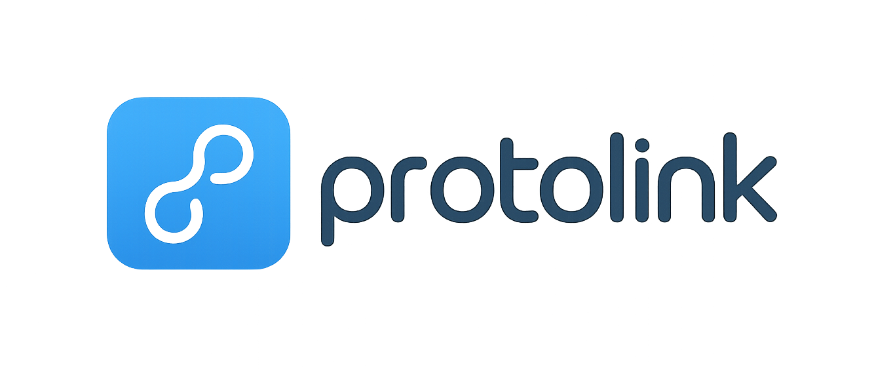

# Protolink

[](https://www.python.org/downloads/)
[](https://pypi.org/project/protolink/)
[](https://github.com/astral-sh/ruff)
[](https://deepwiki.com/nmaroulis/protolink)
[](https://opensource.org/licenses/MIT)

<div align="center">
  
</div>


A lightweight, production-ready framework for **agent-to-agent communication**, implementing from scratch and extending Google's [Agent-to-Agent Communication (A2A) protocol](https://a2a-protocol.org/v0.3.0/specification/?utm_source=chatgpt.com). Designed to be the go-to Python library for building **interoperable agent systems** with minimal boilerplate, supporting **native integration** with **LLMs** and **Tools** (native & [MCP](https://modelcontextprotocol.io/docs/getting-started/intro)).

## Features

- **A2A Protocol Implementation**: Fully compatible with **Google's A2A specification**
- **Extended Capabilities**:
  - **Unified Client/Server Agent Model**: Single agent instance handles both client and server responsibilities, reducing complexity.
  - **Transport Layer Flexibility**: Swap between HTTP, WebSocket, JSON-RPC or in-memory transports with minimal code changes.
  - **Simplified Agent Creation and Registration**: Create and register agents with just a few lines of code.
  - **LLM-Ready** Architecture: Native support for integrating LLMs to agents (APIs & local) directly as agent modules, allowing agents to expose LLM calls, reasoning functions, and chain-of-thought utilities with zero friction.
  - **Tooling**: **Native support** for integrating tools to agents (APIs & local) directly as agent modules. Native Adapter for **MCP tooling**.
  - **Runtime Transport Layer**: In-process agent communication using a shared memory space. Agents can easily communicate with each other within the same process, making it easier to build and test agent systems.
  - **Enhanced Security**: **OAuth 2.0** and **API key support**.
  - Built-in support for streaming and async operations.
- **Planned Integrations**:
  - **Advanced Orchestration Patterns**
    - Multi-step workflows, supervisory agents, role routing, and hierarchical control systems.

## Architecture

### Centralized Agent & Transport Layer Design

Protolink takes a **centralized agent** approach compared to Google's A2A protocol, which separates client and server concerns. Here's how it differs:

| Feature | Google's A2A | Protolink |
|---------|-------------|-----------|
| **Architecture** | Decoupled client/server | Unified agent with built-in client/server |
| **Transport** | Factory-based with provider pattern | Direct interface implementation |
| **Deployment** | Requires managing separate services | Single process by default, scales to distributed |
| **Complexity** | Higher (needs orchestration) | Lower (simpler to reason about) |
| **Flexibility** | Runtime configuration via providers | Code-based implementation |
| **Use Case** | Large-scale, distributed systems | Both simple and complex agent systems |

#### Key Benefits

1. **Simplified Development**: No need to manage separate client/server codebases
2. **Reduced Boilerplate**: Common functionality is handled by the base [Agent]() class
3. **Flexible Deployment**: Start with a single process, scale to distributed when needed
4. **Unified State Management**: Shared context between client and server operations
5. **Maintainability**: 
   - Direct code paths for easier debugging
   - Clear control flow with fewer abstraction layers
   - Type-safe interfaces for better IDE support
6. **Extensibility**:
   - Easily add new transport implementations
   - Simple interface-based design
   - No complex configuration needed for common use cases


## Why Protolink? 🚀

- **Simple API**: Built from the ground-up for **minimal boilerplate**, letting you focus on agent logic rather than infrastructure.
- **Developer Friendly**: Clean abstractions and direct code paths make debugging and maintenance a breeze.
- **Production Ready**: Built from the ground up with performance and reliability in mind.
- **Extensible**: Easily add new transport layers and protocols.
- **Community Focused**: Designed for the open-source community with clear contribution guidelines.


## Installation

### Basic Installation
This will install the base package without any optional dependencies.
```bash
# Using uv (recommended)
uv add protolink

# Using pip
pip install protolink
```

### Optional Dependencies
Protolink supports optional features through extras. Install them using square brackets:
Note: `uv add` can be replace with `pip install` if preferred.
```bash
# Install with all optional dependencies
uv add "protolink[all]"

# Install with HTTP support (for web-based agents)
uv add "protolink[http]"

# Install all the supported LLM libraries
uv add "protolink[llms]"

# For development (includes all optional dependencies and testing tools)
uv add "protolink[dev]"
```


### Development Installation
To install from source and all optional dependencies:

```bash
git clone https://github.com/nmaroulis/protolink.git
cd protolink
uv pip install -e ".[dev]"
```

## Quick Start

```python
from protolink.agents import Agent
from protolink.models import AgentCard
from protolink.transport import HTTPTransport
from protolink.tools import MCPToolAdapter
from protolink.llms.api import OpenAILLM

# Define the agent card
agent_card = AgentCard(
    name="example_agent",
    description="A dummy agent",
)

# Initialize the transport
transport = HTTPTransport()

# OpenAI API LLM
llm = OpenAILLM(model="gpt-5.1")

# Initialize the agent
agent = Agent(agent_card, transport, llm)

# Add Native tool
@agent.tool(name="add", description="Add two numbers")
async def add_numbers(a: int, b: int):
    return a + b

# Add MCP tool
mcp_tool = MCPToolAdapter(mcp_client, "multiply")
agent.add_tool(mcp_tool)


# Start the agent
agent.start()
```

## Documentation

### API Documentation

TBD

## License

MIT

## Contributing

TBD
