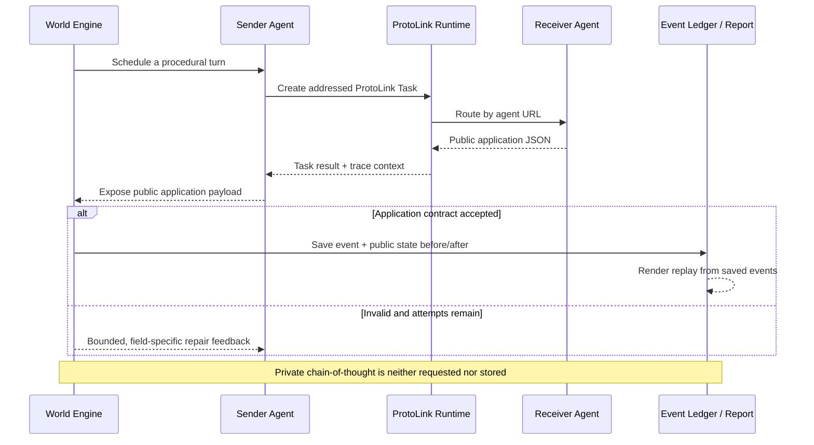

<!--import courtroomHero from '@site/assets/ai_courtroom_article_hero.png';
import courtroomConditions from '@site/assets/ai_courtroom_conditions.png';
import courtroomResults from '@site/assets/ai_courtroom_results.png';-->

# AI Courtroom Experiment

:::tip[Communication is the experiment]

The courtroom is a memorable setting, but it is not the main result. This
example asks a broader engineering question: **what changes when autonomous
agents with different roles and perspectives are allowed to communicate
directly?**

:::

:::info[Original Level Up Coding article]

**Status: Pending.** The original Medium article link will be added here after
publication on Level Up Coding.

:::

:::info[Source code]

The complete example lives in
[`examples/ai_courtroom`](https://github.com/nMaroulis/protolink/tree/main/examples/ai_courtroom).
It includes the deterministic fixture, live-provider adapters, experiment
runner, tests, comparison utility, public transcripts, traces, and standalone
HTML reports.

:::

<!--<figure className="doc-media-frame">
  
  <figcaption>
    The case gives the agents something consequential to disagree about.
    ProtoLink makes the communication paths and observable revisions
    inspectable.
  </figcaption>
</figure>-->

The AI Courtroom is a flagship ProtoLink showcase built as an experiment rather
than a scripted roleplay. Lawyers, witnesses, a judge, and jurors are separate,
addressable agents with their own model, role prompt, context, incentives, and
task history. Jurors do not merely answer a coordinator in sequence: under the
communication conditions, they select another juror, author a message, cite
evidence, and send a direct ProtoLink task.

The example then records what happened:

- who addressed whom;
- what question, challenge, clarification, persuasion attempt, or concession
  was authored;
- which evidence was cited;
- how the receiver replied publicly;
- which public guilt registers and categorical votes changed afterward;
- how communication topology affected the final group decision.

Everything and everyone in the case is fictional. The example is a software
and A2A-systems experiment, not legal advice, a model of a real judicial
process, or a safety assessment of any real company.

## The Research Question

The experiment begins with one controlled question:

> If the same five specialist AI jurors hear the same evidence, does allowing
> them to communicate produce a different decision than asking them to vote
> independently?

That question is more useful than simply asking whether several agents can
produce an answer. A monolithic orchestrator can call five models, concatenate
their responses, and summarize them. It is much harder to tell whether those
agents influenced one another, which interaction mattered, or whether
"multi-agent" meant little more than parallel prompting.

The courtroom makes those differences visible because every agent has a clear
role, every message has a sender and receiver, and every juror must publish an
observable decision state.

## The C-91 Incident

At 21:47 on a rain-soaked evening, a fictional Aster Vale autonomous vehicle
struck and killed cyclist Lina Ortega inside a temporary crossing. The vehicle
began emergency braking only 0.35 seconds before impact. Thirty-six hours
earlier, it had received the company's Orchid 4.8 software release.

The tribunal asks:

> **Is Aster Vale Mobility guilty of criminally negligent deployment of an
> autonomous vehicle system that caused Lina Ortega's death?**

Aster Vale Mobility is the defendant. Rowan Hale is the company's safety
executive and designated tribunal representative; he argues for a not-guilty
verdict, but he is not personally the defendant or a defence lawyer.

Seven admitted exhibits describe an interacting-failures problem:

| Evidence | Question introduced |
| --- | --- |
| `E1` | Why did camera classification suppress radar-triggered emergency braking? |
| `E2` | Was a pre-release warning genuinely resolved by the later retest? |
| `E3` | Why did the crashed vehicle run C-91 when the safety report validated C-90? |
| `E4` | How much responsibility belongs to the contractor and incorrect road map? |
| `E5` | Does regulatory approval excuse the camera-veto braking policy? |
| `E6` | Was the failed remote-operator fallback reasonably foreseeable? |
| `E7` | What do the interaction tests show about calibration and road layout together? |

There is no single clean cause. The victim's family argues that Aster Vale
controlled the release, knew about warning signs, and deployed with inadequate
safeguards. Aster Vale argues that an unforeseeable combination of road,
mapping, network, and contractor failures caused the collision.

The charge is deliberately narrower than the causal story. A juror can believe
the company made serious mistakes and still vote not guilty because one legal
element remains unresolved. Another can accept that third parties contributed
and still find Aster Vale guilty.

## Four Communication Conditions

Each run follows the same public hearing:

```text
orientation → 2 openings → 8 witness examinations → 2 closings
            → optional peer deliberation → frozen ballots → judgment
```

Only the permitted peer communication changes:

| Condition | Decision-makers | Peer communication | Experimental purpose |
| --- | --- | --- | --- |
| `solo` | Casey Morgan, one civic generalist | None | Descriptive product baseline; panel size and persona also change |
| `independent` | Five specialist jurors | None | Diverse panel without peer influence |
| `star` | The same five specialists | Four jurors address foreperson Sofia; Sofia chooses one reply target | Communication concentrated through a hub |
| `mesh` | The same five specialists | Every juror chooses another juror and authors one direct message per round | Decentralized, agent-selected communication |

<!--<figure className="doc-media-frame">
  
  <figcaption>
    Independent versus Star or Mesh is the clean communication comparison.
    Solo is useful context, but it also changes panel size, persona composition,
    and inference budget.
  </figcaption>
</figure>-->

Star is not an automatic broadcast. Sofia receives four independently authored
messages, then chooses one juror and one issue to address. This makes her an
information hub and a possible bottleneck.

Mesh is not a group chat. Each juror receives an explicit turn, selects an
eligible recipient, chooses a human communication move, cites public evidence,
and sends one addressed task. Only the selected receiver updates from that peer
message.

The juror's public application response names that choice `move`:

```json
{
  "move": "attempt_persuasion",
  "target_id": "juror_ruben",
  "message": "How does E3 change your view of who controlled the deployment?",
  "evidence_ids": ["E3"],
  "public_intent": "Test whether deployment control changes the responsibility assessment."
}
```

The name is deliberate. `action` already belongs to ProtoLink's outer runtime
protocol: `final`, `tool_call`, and `agent_call` describe what the runtime
should do, while an `agent_call` also uses its own `action` field for `infer` or
`tool_call`. Calling the courtroom-level choice a `move` keeps application
meaning separate from runtime intent and helps smaller JSON models avoid
combining the two schemas. Internally, the report may still group these values
as authored action types; the model-facing application contract uses `move`.

For a valid controlled comparison, the saved public-record hashes and control
fingerprints must also match. The deterministic reference fixture guarantees
that match. Live-model hearings may vary, so the generated metadata makes the
assumption checkable rather than implicit.

## Human Roles, Not Seeded Opinions

The five specialist jurors use recognizable professional perspectives:

| Juror | Perspective |
| --- | --- |
| Evelyn Brooks | Former collision detective who reconstructs physical sequences |
| Malik Thompson | Civil-rights lawyer attentive to burden of proof and institutional power |
| Dr. Anika Rao | Human-factors psychologist watching for automation and hindsight bias |
| Ruben Park | Site-reliability engineer focused on deployment controls and incident ownership |
| Sofia Bell | Investigative journalist and foreperson connecting documents, incentives, and timelines |

Their prompts do not say "begin 61/100 convinced" or expose mechanical
strategies such as `reinforce_ally`. They describe a role, professional habits,
personality, knowledge boundary, and decision rule in natural language. The
agent authors its initial public position.

The deterministic provider uses private fixture coefficients so the offline
golden path is reproducible, but those coefficients never appear in the
human-facing prompts. With a live provider, the model receives the character,
case, admitted record, and output contract—not a prewritten opinion.

## Explicit Agents and Direct Calls

The example keeps every participant visible in
[`run.py`](https://github.com/nMaroulis/protolink/blob/main/examples/ai_courtroom/run.py).
There is intentionally no large factory hiding the composition. An agent is a
normal ProtoLink `Agent` with a card, transport, model, and prompt:

```python
software_engineer_agent = Agent(
    card=AgentCard(
        name="software_engineer",
        description="Perception engineer who filed the pre-release warning.",
        url=f"runtime://ai-liability/{namespace}/software-engineer",
    ),
    transport="runtime",
    llm=model_for_role(
        args.provider,
        role="software_engineer",
        seed=args.seed,
        model=args.model,
        base_url=args.base_url,
        temperature=args.temperature,
    ),
    system_prompt=ROLE_PROMPTS["software_engineer"],
)
```

Once two agents exist, the essential communication path is equally direct:

```python
task = Task.create_infer(prompt=prompt)
result = await sender.call_agent(receiver.card.url, task)
```

The full example adds run/session/trace metadata, application validation, and
bounded repair feedback around those calls. It does not replace the exchange
with a hidden workflow graph pretending to be a conversation.

The world engine acts as a procedural referee. It schedules the hearing,
enforces evidence identifiers and the selected topology, validates observable
application responses, freezes ballots, and writes artifacts. Agents author
the arguments, testimony, juror decisions, recipients, and peer messages.



ProtoLink carries addressed tasks, public application responses, and transport
telemetry. The application stores observable public state; it neither requests
nor stores private chain-of-thought.

## What the Deterministic Replay Shows

The default `reference` provider is offline, deterministic, and intentionally
designed to make the communication treatment visible in one quick run:

| Condition | Verdict | Ballots (guilty–not guilty) | Mean final guilt | A2A events | Deliberation flips |
| --- | --- | ---: | ---: | ---: | ---: |
| `solo` | Guilty | 1–0 | 78.59 | 27 | 0 |
| `independent` | Not guilty | 2–3 | 77.56 | 83 | 0 |
| `star` | Not guilty | 2–3 | 80.21 | 93 | 0 |
| `mesh` | Guilty | 3–2 | 80.54 | 93 | 1 |

<!--<figure className="doc-media-frame">
  
  <figcaption>
    These are deterministic fixture results, not evidence that one topology is
    generally superior.
  </figcaption>
</figure>-->

The independent and mesh juries receive the same public record. In the mesh
run, Sofia challenges Anika with the interaction between the unvalidated C-91
calibration in `E3` and the interaction tests in `E7`. Anika's public guilt
register moves from `77.90` to `81.41`, and her separately authored categorical
vote changes from not guilty to guilty.

That exchange precedes the only deliberation vote flip in the fixture. The
report deliberately says "observed after message," not "caused by message."
Establishing causality would require matched message-removal or replacement
ablations.

The star condition also raises the mean guilt register but does not change the
2–3 verdict. More communication, more confidence, and more consensus are not
the same thing. The point of the experiment is that **who can address whom
changes which assumptions can be challenged**.

The fixture contains a private synthetic answer so the tooling can distinguish
agreement from correctness against a known fictional outcome. No tribunal
agent receives that hidden fact. The golden path is useful for testing the A2A
protocol and replay UI; one designed case and one seed cannot establish that
mesh communication makes agents smarter.

## The HTML Replay Is Generated Automatically

Running the simulation produces more than a terminal verdict. When `run.py`
finishes, it automatically generates a standalone interactive `report.html`
for each condition and prints the exact path to open. No web server or frontend
setup is required.

The report lets a developer:

- play or step through every A2A exchange;
- see the active sender, receiver, communication move, and public intent;
- read the authored message and receiver's public reply;
- inspect evidence citations and ProtoLink task metadata;
- watch synchronized before/after guilt registers and votes;
- compare juror trajectories and the pre/post-deliberation verdict;
- explore the influence graph and full accessible event ledger.

An all-condition run also creates an `index.html` comparison page for the
Solo → Independent → Star → Mesh ladder. The models can stop running while the
saved interaction remains replayable and shareable.

## Run the Example

From the repository root:

```bash
python examples/ai_courtroom/run.py
```

The default command runs all four conditions through the deterministic
`reference` provider. It requires no network connection, provider account, or
API key.

Run one condition:

```bash
python examples/ai_courtroom/run.py \
  --provider reference \
  --condition mesh \
  --seed 17 \
  --verbose
```

The terminal prints the generated report path when the run finishes.

### Run with Ollama

Install the ProtoLink LLM extras, start Ollama, and name the exact local model
tag:

```bash
python -m pip install -e '.[llms]'

python examples/ai_courtroom/run.py \
  --provider ollama \
  --model "<exact-ollama-model-tag>" \
  --base-url "http://localhost:11434" \
  --condition star \
  --verbose
```

Use the juror-specific flags when the jury should use a different model or
endpoint from the tribunal actors:

```bash
python examples/ai_courtroom/run.py \
  --provider ollama \
  --model "<tribunal-model-tag>" \
  --base-url "http://localhost:11434" \
  --juror-provider ollama \
  --juror-model "<jury-model-tag>" \
  --juror-base-url "http://localhost:11434" \
  --condition mesh \
  --verbose
```

Running every condition against a live provider requires an explicit
acknowledgement because it creates many model calls:

```bash
python examples/ai_courtroom/run.py \
  --provider ollama \
  --model "<exact-ollama-model-tag>" \
  --base-url "http://localhost:11434" \
  --condition all \
  --allow-multi-condition-live \
  --verbose
```

## Generated Artifacts

Each condition writes:

| File | Purpose |
| --- | --- |
| `result.json` | Full public record, configuration, decision histories, messages, metrics, and verdict |
| `summary.json` | Compact outcome and comparison data |
| `transcript.md` | Escaped public hearing and deliberation transcript |
| `report.html` | Standalone interactive replay and analysis |
| `traces.jsonl` | ProtoLink task, inference, and A2A telemetry |

An all-condition run also writes the comparison `index.html`.

Saved metadata includes the resolved provider and model for every agent,
evidence order, round count, retry limits, public-record hash, comparison
control fingerprint, latency, estimated tokens, grounding, routing, and repair
information.

## Why This Is an Important ProtoLink Example

The AI Courtroom demonstrates several A2A properties that disappear inside a
monolithic orchestrator:

| ProtoLink property | What the experiment makes visible |
| --- | --- |
| Operational identity | Every participant has an address, role, model, prompt, and task history |
| Direct communication | Messages travel from one named agent to another through a ProtoLink task |
| Configurable topology | The same agents can be isolated, hub-connected, or directly connected |
| Agent-authored routing | Mesh jurors choose recipients and communication moves themselves |
| Interaction as data | Messages, citations, responses, state changes, and traces become replayable artifacts |
| Independent models | Tribunal actors and jurors can use different providers behind one protocol |
| Visible failure | Invalid targets, malformed outputs, repairs, and routing fallbacks are measured |
| Preserved disagreement | The runtime does not force every view into one synthetic consensus |

The result is not merely an AI courtroom. It is a small laboratory for studying
communicating AI societies with inspectable protocol boundaries.

## Experiments to Build Next

The included fixture makes several stronger studies possible:

- **Provider comparison:** keep the tribunal record fixed and change only the
  juror provider.
- **Defence persuasion:** add a dedicated defence-counsel agent, keep the jury
  fixed, and compare how often different models move jurors toward not guilty.
- **Message ablation:** remove or replace one peer message to test whether an
  observed after-message change survives.
- **Topology replication:** repeat Independent, Star, and Mesh across seeds,
  model versions, evidence orders, and multiple cases.
- **Influence concentration:** measure whether a model depends too heavily on a
  foreperson or repeatedly targets aligned jurors.
- **Protocol reliability:** compare grounding, invalid citations, repair rate,
  routing fallbacks, latency, tokens, and cost—not only verdicts.

A persuasive model is not necessarily a truthful or correct model. In the
default fixture, stronger defence advocacy can move the jury away from the
hidden synthetic answer. Persuasion, grounding, calibration, protocol
reliability, and correctness therefore belong on separate axes.

## Create a Different Scenario

The C-91 Incident is one configuration of the communication scaffold. The
least-work extension keeps the binary tribunal and current cast shape:

1. Replace `CASE`, admitted evidence, and the synthetic evaluator fixture in
   `courtroom/case_data.py`.
2. Rewrite `ACTOR_PROFILES`, `ROLE_PROMPTS`, and `JUROR_PROFILES`.
3. Update the explicit `AgentCard` names, descriptions, and tags in `run.py`.
4. Keep evidence IDs in the `E1`, `E2`, … convention, or update the associated
   prompt and validation contracts.
5. Update `courtroom/reference_llm.py` and the tests when the new case also
   needs a deterministic golden path.

The reusable structure remains: addressable agents, a controlled public
record, explicit communication topology, observable state, frozen decisions,
an event ledger, comparisons, traces, and replayable HTML.

The same pattern can support an incident review, scientific peer-review panel,
product-risk council, policy committee, negotiation, or other multi-agent
decision environment. A non-courtroom domain also needs new decision schemas,
procedure, metrics, and report language; this is a reference architecture, not
a generic one-file scenario loader.

## Limitations

- The case, prompts, fixture coefficients, and synthetic truth are authored.
- Solo changes more than communication and is not a topology-only control.
- One case and one seed cannot establish that a topology or provider is better.
- A public reason may be incomplete, simplified, or post-hoc.
- An after-message change is temporal association, not causal attribution.
- Agreement may represent correction, conformity, anchoring, or shared error.
- Model personas are prompt-induced behaviours, not human identities.
- The simplified fictional charge must not be applied to real people,
  products, or legal cases.

The next serious experiment should preregister cases, providers, topologies,
replicates, and message ablations, then publish failures and reversals as well
as successful outcomes.

## See Also

- [Examples](examples.md) - All runnable examples and learning paths
- [Agents](agent.md) - Agent identity, lifecycle, tools, and delegation
- [A2A](a2a.md) - ProtoLink's A2A model and compatibility boundary
- [LLMs](llm.md) - Providers, inference, parsing, and bounded correction
- [Telemetry](telemetry.md) - Task and inference observability
- [Runtime](runtime.md) - Run context, events, reports, replay, and policies
