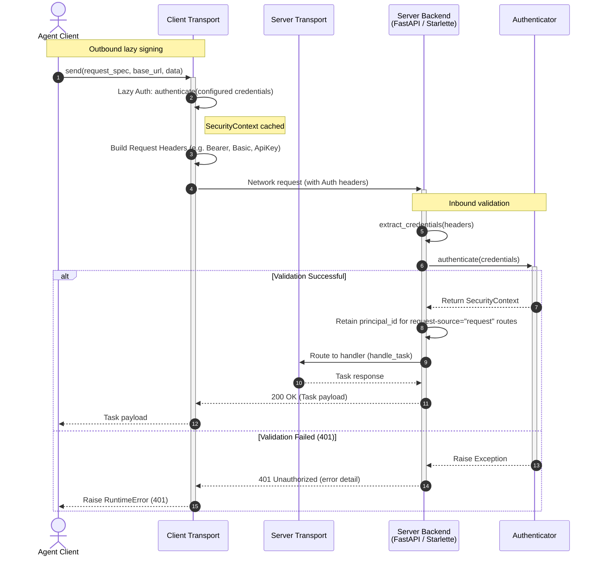

import Tabs from '@theme/Tabs';
import TabItem from '@theme/TabItem';
import ApiSurface from '@site/src/components/ApiSurface';
import ApiReference, {
  ApiCallout,
  ApiField,
  ApiFields,
  ApiSection,
} from '@site/src/components/ApiReference';

# Authentication & Security

Protolink provides a pluggable, robust **Authentication & Security framework** designed to secure agent-to-agent and client-to-agent communication. This framework spans both the client side (lazily injecting credentials into outgoing requests) and the server side (extracting and validating credentials before route handlers are invoked).

Whether you are communicating over stateless HTTP or establishing persistent
WebSocket connections, ProtoLink can authenticate peers before endpoint
handlers run. Built-in authenticators verify credentials; application policy
remains responsible for interpreting scopes and deciding authorization.

---

## Overview

The authentication workflow decouples credentials management from both your core cognitive agent code and the low-level network libraries.

:::info[A2A requests]

The same HTTP `Authenticator` protects ProtoLink's native task routes and the A2A JSON-RPC endpoint. The A2A Agent Card remains publicly discoverable and translates the configured card schemes into canonical A2A 1.0 `securitySchemes` and `securityRequirements`. Within the A2A adapter, task lookup and mutation are scoped to the authenticated principal and request tenant.

:::

Below is a sequence diagram representing a typical authenticated request cycle:



---

## Core Concepts

The authentication module revolves around three primary data models and abstractions.

### `SecurityContext`
The `SecurityContext` represents an active, authenticated session. It encapsulates details about the authenticated principal, tokens, and expiration times.

```python
from dataclasses import dataclass, field
from typing import Any

from protolink.utils import utc_now

@dataclass
class SecurityContext:
    principal_id: str
    token: str
    expires_at: str | None = None
    issued_at: str = field(default_factory=utc_now)
    metadata: dict[str, Any] = field(default_factory=dict)

    def is_expired(self) -> bool:
        """Check if the context token is past its expiration time."""
        ...
```

### `SecurityScheme`
The `SecurityScheme` outlines the metadata of the authentication mechanism used. It directly corresponds to OpenAPI security schemes, allowing agents to advertise their security protocols in their dynamic agent card metadata.

```python
from dataclasses import dataclass, field
from typing import Any

@dataclass
class SecurityScheme:
    auth_type: str  # e.g., "apiKey", "http", "oauth2"
    auth_scheme: str | None  # e.g., "bearer", "basic" (required if type is "http")
    description: str
    metadata: dict[str, Any] = field(default_factory=dict)
```

### `Authenticator` (Base Class)
All security providers inherit from the `Authenticator` abstract base class. It specifies the API that security handlers must implement to validate credentials.

```python
from abc import ABC, abstractmethod

class Authenticator(ABC):
    @property
    @abstractmethod
    def security_scheme(self) -> SecurityScheme:
        """Expose metadata describing the security scheme."""
        pass

    @abstractmethod
    async def authenticate(self, credentials: str) -> SecurityContext:
        """Authenticate raw credentials and return a SecurityContext."""
        pass

    @abstractmethod
    async def refresh_token(self, context: SecurityContext) -> SecurityContext:
        """Refresh a token, or explicitly return the unchanged context."""
        ...
```

---

## Built-in Providers

Protolink includes several security providers out of the box. The local API-key,
Basic, and HMAC JWT providers validate credentials in-process. The OAuth
delegation provider calls an external token-exchange endpoint and is intentionally
a small integration primitive rather than a complete OAuth client.

<Tabs groupId="doc-tabs-1">
<TabItem value="api-key-authentication" label="API Key Authentication" default>

`APIKeyAuth` validates simple API keys against a dictionary of known keys. Each
value is currently accepted as scope metadata for configuration compatibility,
but the authenticator only checks membership; it does not add those scopes to
the returned `SecurityContext`.

```python
from protolink.security.auth import APIKeyAuth

auth = APIKeyAuth(
    valid_keys={
        "sk-12345": ["read", "write"],
        "sk-abcde": ["read"]
    }
)
```

</TabItem>
<TabItem value="bearer-token-authentication" label="Bearer Token Authentication">

`BearerTokenAuth` validates compact JSON Web Tokens (JWTs) signed with a shared HMAC secret. It checks the declared algorithm, signature, `exp`, `nbf`, `iat`, and optional issuer/audience claims before returning a `SecurityContext`.

```python
from protolink.security.auth import BearerTokenAuth

auth = BearerTokenAuth(
    secret="your-jwt-shared-signing-secret",
    algorithm="HS256",
    issuer="https://auth.example.com",
    audience="protolink-agent",
)
```

Supported algorithms are `HS256`, `HS384`, and `HS512`. Use `APIKeyAuth` for static opaque service tokens.

</TabItem>
<TabItem value="basic-authentication" label="Basic Authentication">

`BasicAuth` implements standard HTTP Basic access authentication. It validates `username:password` values, automatically decoding Base64 strings sent via standard `Authorization: Basic <base64>` headers.

```python
from protolink.security.auth import BasicAuth

auth = BasicAuth(
    valid_credentials={
        "admin": "super-secret-password-123",
        "developer": "dev-pass"
    }
)
```

</TabItem>
<TabItem value="oauth2-delegation-authentication" label="OAuth2 Delegation Authentication">

`OAuth2DelegationAuth` performs token exchanges with an external identity
provider endpoint to obtain delegated access tokens. The returned provider
metadata is retained on the `SecurityContext`; ProtoLink does not interpret or
enforce response scopes.

```python
from protolink.security.auth import OAuth2DelegationAuth

auth = OAuth2DelegationAuth(
    exchange_endpoint="https://auth.myorganization.com/oauth/token",
    client_id="my-agent-client-id",
    client_secret="my-agent-client-secret"
)
```

</TabItem>
</Tabs>
---

## Server-Side Authentication

When hosting an agent server, endpoints can be protected by configuring an `authenticator` on the transport. The transport backend (FastAPI or Starlette) will intercept incoming HTTP requests, extract headers, and invoke the validator.

:::note[Authentication and TLS are different layers]

An `Authenticator` decides whether an application request may access the agent. `TLSConfig` encrypts the network connection and verifies certificate identities before that request arrives. Configure `tls=` on an HTTP, SSE JSON-RPC, WebSocket, or gRPC transport with its secure URL scheme, then pass that transport to the Agent. Combine TLS with an authenticator when you need both protected traffic and application authorization. See [TLS and mutual TLS](transport.md#tls-and-mutual-tls).

:::

### Request Interception Flow

1. **Public-route check**: The A2A Agent Card at
   `/.well-known/agent-card.json` plus `/healthz` and `/readyz` bypass
   application authentication. The native `/.well-known/agent.json` card does
   not bypass it.
2. **Extraction**: For every other route, the server calls the
   `extract_credentials()` utility, searching the request in order:
    - `Authorization` header with `Bearer`, `Basic`, or `ApiKey` prefix.
    - `X-API-Key` header.
    - Query parameters: `api_key`, `apikey`, or `token`.
3. **Verification**: If credentials are found, they are sent to the transport's `Authenticator.authenticate(credentials)` method.
4. **Rejection**: If credentials are missing, or verification raises an exception, the request is terminated immediately, returning an HTTP `401 Unauthorized` status code with a JSON error message payload.

### Setup Route Protection

To secure your server-side endpoints, provide the `authenticator` argument to your `HTTPTransport`:

```python
from protolink.transport import HTTPTransport
from protolink.security.auth import APIKeyAuth

# Secure HTTP transport using FastAPI backend
transport = HTTPTransport(
    url="http://127.0.0.1:8000",
    backend="fastapi",
    authenticator=APIKeyAuth(valid_keys={"my-secret": ["write"]})
)
```

### WebSocket Handshake Authentication

WebSocket connections are authenticated during the HTTP connection upgrade handshake phase. The `WebSocketTransport` intercepts the request headers using a `process_request` hook before the socket upgrades, ensuring unauthenticated clients are denied connection with a `401 Unauthorized` HTTP response immediately.

```python
from protolink.transport import WebSocketTransport
from protolink.security.auth import APIKeyAuth

ws_transport = WebSocketTransport(
    url="ws://127.0.0.1:8080",
    authenticator=APIKeyAuth(valid_keys={"ws-key": ["connect"]})
)
```

### SSE JSON-RPC Authentication

`SSEJSONRPCTransport` inherits the HTTP transport's authentication behavior.
Unary calls and the long-lived `POST /tasks/stream` request use the same lazy
outbound context and generated headers. On the server, the Starlette or FastAPI
backend validates credentials before it opens the event stream, so a rejected
request never reaches the streaming handler.

```python
from protolink.security import BearerTokenAuth
from protolink.transport import SSEJSONRPCTransport

sse_transport = SSEJSONRPCTransport(
    url="https://agent.example.com",
    authenticator=BearerTokenAuth(secret="shared-signing-secret"),
    credentials="signed.jwt",
)
```

### gRPC Metadata Authentication

`GRPCTransport` applies the same lazy outbound authentication before unary or
stream calls, then translates the generated headers into lowercase gRPC
metadata. The receiving transport extracts credentials from invocation metadata
and aborts the ProtoLink `Invoke` or `Stream` RPC with
`UNAUTHENTICATED` when credentials are absent or invalid.

```python
from protolink.security import APIKeyAuth
from protolink.transport import GRPCTransport

grpc_transport = GRPCTransport(
    url="grpcs://agent.example.com:50051",
    authenticator=APIKeyAuth(valid_keys={"service-key": []}),
    credentials="service-key",
)
```

The optional standard gRPC health and reflection services are registered by
gRPC itself and are not passed through ProtoLink's generic invocation
authenticator.

---

## Client-Side Authentication

On the client side, ProtoLink supports **Lazy Authentication**. When
instantiating an HTTP, SSE JSON-RPC, WebSocket, or gRPC transport, provide both
an authenticator and its raw credentials string.

```python
from protolink.transport import HTTPTransport
from protolink.security.auth import APIKeyAuth

client_transport = HTTPTransport(
    url="http://127.0.0.1:8000",
    authenticator=APIKeyAuth(valid_keys={"key123": ["read"]}),
    credentials="key123"
)
```

### Automatic Header Injection

- **Lazy Evaluation**: On the first outbound `.send()` or `.subscribe()` call
  supported by the configured HTTP, SSE JSON-RPC, WebSocket, or gRPC transport,
  it automatically invokes `await authenticator.authenticate(credentials)`.
- **Caching**: The resulting `SecurityContext` is stored in the transport instance for subsequent calls.
- **Signing**: Based on the `SecurityScheme` defined by the authenticator, the transport overrides headers in `_build_headers()` for outgoing requests:
    - **Bearer**: Adds `Authorization: Bearer <token>`
    - **Basic**: Adds `Authorization: Basic <token>` without transforming the token. Supply a Base64 payload for standards-compliant HTTP Basic wire format; raw `username:password` remains useful only when both ProtoLink peers intentionally accept it.
    - **ApiKey**: Adds `X-API-Key: <key>` and `Authorization: ApiKey <key>`

---

## Agent Integration

The `Agent` class encapsulates transport management and automatically maps security metadata to the `AgentCard`.

```python
from protolink.agents import Agent
from protolink.security.auth import BasicAuth

agent = Agent(
    card={"name": "secure-agent", "description": "Needs login", "url": "http://127.0.0.1:8000"},
    transport="http",
    authenticator=BasicAuth(valid_credentials={"admin": "secret"}),
    credentials="admin:secret"
)
```

### Card Security Schemes

When an agent is initialized with an `authenticator`, its native metadata card
includes the advertised security schemes. With authentication enabled, callers
need credentials to read `GET /.well-known/agent.json`. When the HTTP Agent also
uses `a2a=True`, the public A2A card at
`GET /.well-known/agent-card.json` advertises the translated standard security
requirements without requiring credentials.

Example payload for an agent card:

```json
{
  "name": "secure-agent",
  "description": "Needs login",
  "url": "http://127.0.0.1:8000",
  "securitySchemes": {
    "http": {
      "type": "http",
      "scheme": "basic",
      "description": "HTTP Basic authentication (username:password)",
      "metadata": {}
    }
  }
}
```

---

## Credential Extraction Helper

You can use the built-in credential extraction logic for custom route middleware or custom transport backends:

```python
from protolink.security.auth import extract_credentials

headers = {"Authorization": "Bearer my-jwt-token"}
query_params = {"api_key": "some-api-key"}

# Returns "my-jwt-token" (headers have precedence)
credentials = extract_credentials(headers, query_params)
```

---

## Custom Authenticators

To integrate custom enterprise identity management (e.g. LDAP, active directory, Auth0), subclass `Authenticator`:

```python
from protolink.security.auth import Authenticator, SecurityScheme, SecurityContext

class LDAPAuthenticator(Authenticator):
    
    @property
    def security_scheme(self) -> SecurityScheme:
        return SecurityScheme(
            auth_type="http",
            auth_scheme="basic",
            description="Active Directory / LDAP validation"
        )

    async def authenticate(self, credentials: str) -> SecurityContext:
        username, password = credentials.split(":")
        # Implement custom LDAP check logic here
        success = my_ldap_library.verify(username, password)
        
        if not success:
            raise ValueError("Invalid LDAP credentials")
            
        return SecurityContext(
            principal_id=username,
            token=credentials
        )

    async def refresh_token(self, context: SecurityContext) -> SecurityContext:
        # LDAP credentials have no token refresh protocol in this example.
        return context
```

---

## API Reference

<ApiSurface
  eyebrow="Security module"
  title="Authentication"
  path="protolink.security"
  description="The credential verification layer for incoming agent requests, advertised security schemes, outgoing credentials, bearer tokens, and custom authenticators."
  pills={[
    "SecurityContext",
    "SecurityScheme",
    "Bearer tokens",
    "Custom authenticators",
    "HTTP integration",
  ]}
  cards={[
    {
      title: "Context",
      text: "Carries the verified principal, token, timestamps, and provider metadata after authentication succeeds.",
      code: "SecurityContext",
    },
    {
      title: "Scheme",
      text: "Describes the authentication mechanism advertised on agent cards.",
      code: "SecurityScheme",
    },
    {
      title: "Authenticator",
      text: "Defines authenticate and refresh methods for built-in or application-specific credentials.",
      code: "Authenticator",
    },
    {
      title: "Bearer JWT",
      text: "Verifies signed bearer tokens with issuer, audience, algorithm, and leeway controls.",
      code: "BearerTokenAuth",
    },
  ]}
/>

## Core authentication types

The data objects in this section are intentionally small. They can be attached
to transport requests, request state, policy context, or an `AgentCard` without
bringing a provider SDK into the rest of the application.

### SecurityContext

<ApiReference
  kind="dataclass"
  path="protolink.security.SecurityContext"
  signature={`class SecurityContext(
    principal_id: str,
    token: str,
    expires_at: str | None = None,
    issued_at: str = field(default_factory=utc_now),
    metadata: dict[str, Any] = field(default_factory=dict),
)`}
  source="https://github.com/nMaroulis/protolink/blob/main/protolink/security/auth.py#L65"
>

Represent the authenticated identity produced by an `Authenticator`. The
context carries the credential that was accepted, provider timestamps, and
application-specific metadata so later policy and transport layers do not need
to authenticate the request again.

<ApiSection title="Parameters">
  <ApiFields ariaLabel="SecurityContext constructor parameters">
    <ApiField name="principal_id" type="str" required>
      Stable identifier for the authenticated user, service, client, or agent.
      ProtoLink does not interpret its format; use a value that your policy and
      persistence layers can consistently recognize.
    </ApiField>
    <ApiField name="token" type="str" required>
      The accepted credential or delegated access token. This value is retained
      verbatim and is included by <code>to_dict()</code>, so do not log or
      serialize the context into an untrusted destination.
    </ApiField>
    <ApiField name="expires_at" type="str | None" defaultValue="None">
      Optional absolute expiration timestamp in ISO 8601 format. Use a
      timezone-aware value such as <code>2026-07-20T12:30:00+00:00</code> so it
      can be compared with ProtoLink's UTC clock.
    </ApiField>
    <ApiField name="issued_at" type="str" defaultValue="utc_now()">
      ISO timestamp describing when the token was issued. When omitted, each
      new instance receives the current UTC time from <code>utc_now()</code>.
    </ApiField>
    <ApiField name="metadata" type="dict[str, Any]" defaultValue="{}">
      Provider- or application-specific details, such as verified custom JWT
      claims. A new dictionary is created for every context.
    </ApiField>
  </ApiFields>
</ApiSection>

<ApiCallout label="Security boundary">
  A <code>SecurityContext</code> records the result of authentication; creating
  one directly does not verify a token. Only trust contexts returned by an
  authenticator or another trusted boundary.
</ApiCallout>

</ApiReference>

### SecurityContext.is_expired

<ApiReference
  kind="method"
  path="protolink.security.SecurityContext.is_expired"
  signature={`is_expired() -> bool`}
  source="https://github.com/nMaroulis/protolink/blob/main/protolink/security/auth.py#L84"
>

Compare the context's absolute expiration timestamp with the current UTC time.
This is a local timestamp check; it does not contact the issuing provider,
inspect revocation state, or refresh the credential.

<ApiSection title="Returns">
  <ApiFields ariaLabel="SecurityContext.is_expired return value">
    <ApiField name="expired" type="bool">
      <code>True</code> when the current UTC time is later than
      <code>expires_at</code>. Returns <code>False</code> when no expiration was
      supplied.
    </ApiField>
  </ApiFields>
</ApiSection>

<ApiSection title="Raises">
  <ApiFields ariaLabel="SecurityContext.is_expired errors">
    <ApiField name="ValueError">
      Raised by <code>datetime.fromisoformat()</code> when
      <code>expires_at</code> is not a valid ISO timestamp.
    </ApiField>
    <ApiField name="TypeError">
      Raised when a timezone-naive timestamp is compared with ProtoLink's
      timezone-aware UTC clock.
    </ApiField>
  </ApiFields>
</ApiSection>

</ApiReference>

### SecurityContext.to_dict

<ApiReference
  kind="method"
  path="protolink.security.SecurityContext.to_dict"
  signature={`to_dict() -> dict`}
  source="https://github.com/nMaroulis/protolink/blob/main/protolink/security/auth.py#L96"
>

Create the dictionary representation used by serializers and integration code.
All five context fields are included, including the raw token.

<ApiSection title="Returns">
  <ApiFields ariaLabel="SecurityContext.to_dict return value">
    <ApiField name="context" type="dict[str, Any]">
      Mapping with <code>principal_id</code>, <code>token</code>,
      <code>expires_at</code>, <code>issued_at</code>, and
      <code>metadata</code> keys. The outer mapping is new, but the metadata
      dictionary is not deep-copied.
    </ApiField>
  </ApiFields>
</ApiSection>

</ApiReference>

### SecurityScheme

<ApiReference
  kind="dataclass"
  path="protolink.security.auth.SecurityScheme"
  signature={`class SecurityScheme(
    auth_type: SecuritySchemeType,
    auth_scheme: HttpAuthScheme | None,
    description: str,
    metadata: dict[str, Any] = field(default_factory=dict),
)`}
  source="https://github.com/nMaroulis/protolink/blob/main/protolink/security/auth.py#L108"
>

Describe the authentication mechanism advertised by an authenticator. Agent
metadata and transport code use this provider-neutral value to decide how a
credential should be represented on the wire.

<ApiSection title="Parameters">
  <ApiFields ariaLabel="SecurityScheme constructor parameters">
    <ApiField name="auth_type" type={'"apiKey" | "http" | "oauth2" | "mutualTLS" | "openIdConnect"'} required>
      Broad OpenAPI-style category for the authentication mechanism.
    </ApiField>
    <ApiField name="auth_scheme" type="HttpAuthScheme | None" required>
      HTTP authentication scheme such as <code>"bearer"</code> or
      <code>"basic"</code>. Pass <code>None</code> for non-HTTP scheme types.
      The annotation also accepts <code>digest</code>, <code>hmac</code>,
      <code>negotiate</code>, <code>ntlm</code>, <code>aws4auth</code>,
      <code>hawk</code>, and <code>edgegrid</code>.
    </ApiField>
    <ApiField name="description" type="str" required>
      Human-readable explanation suitable for discovery metadata.
    </ApiField>
    <ApiField name="metadata" type="dict[str, Any]" defaultValue="{}">
      Scheme-specific extensions. Built-in bearer schemes report supported
      algorithms plus configured issuer and audience; OAuth delegation reports
      its exchange endpoint.
    </ApiField>
  </ApiFields>
</ApiSection>

<ApiCallout label="Import path">
  <code>SecurityScheme</code> is defined in
  <code>protolink.security.auth</code> but is not currently re-exported from
  <code>protolink.security</code>. Custom authenticators should import it from
  the defining module.
</ApiCallout>

</ApiReference>

### SecurityScheme.to_dict

<ApiReference
  kind="method"
  path="protolink.security.auth.SecurityScheme.to_dict"
  signature={`to_dict() -> dict`}
  source="https://github.com/nMaroulis/protolink/blob/main/protolink/security/auth.py#L129"
>

Convert the scheme into the wire-oriented field names used in discovery
metadata.

<ApiSection title="Returns">
  <ApiFields ariaLabel="SecurityScheme.to_dict return value">
    <ApiField name="scheme" type="dict[str, Any]">
      Mapping with <code>type</code>, <code>scheme</code>,
      <code>description</code>, and <code>metadata</code> keys. The
      <code>metadata</code> value is shared with the dataclass rather than
      deep-copied.
    </ApiField>
  </ApiFields>
</ApiSection>

</ApiReference>

## Authenticator contract

All built-in and application-defined authenticators implement the same
asynchronous validation boundary. The transport owns when the methods are
called; the authenticator owns how a raw credential becomes a trusted context.

### Authenticator

<ApiReference
  kind="abstract class"
  path="protolink.security.Authenticator"
  signature={`class Authenticator`}
  source="https://github.com/nMaroulis/protolink/blob/main/protolink/security/auth.py#L139"
>

Abstract base class for credential providers. Implementations must advertise a
`SecurityScheme`, validate raw credentials asynchronously, and provide an
explicit refresh behavior even when refresh is a no-op.

<ApiSection title="Abstract members">
  <ApiFields ariaLabel="Authenticator abstract members">
    <ApiField name="security_scheme" type="SecurityScheme">
      Read-only property describing how the provider is advertised and how a
      client transport should present its credential.
    </ApiField>
    <ApiField name="authenticate" type="async (str) -> SecurityContext">
      Required credential-validation method.
    </ApiField>
    <ApiField name="refresh_token" type="async (SecurityContext) -> SecurityContext">
      Required refresh hook. Providers that cannot refresh return the original
      context unchanged.
    </ApiField>
  </ApiFields>
</ApiSection>

<ApiCallout label="Subclass requirement">
  All three members are abstract. A custom subclass remains non-instantiable
  until it implements <code>security_scheme</code>,
  <code>authenticate()</code>, and <code>refresh_token()</code>.
</ApiCallout>

</ApiReference>

### Authenticator.security_scheme

<ApiReference
  kind="abstract property"
  path="protolink.security.Authenticator.security_scheme"
  signature={`security_scheme -> SecurityScheme`}
  source="https://github.com/nMaroulis/protolink/blob/main/protolink/security/auth.py#L147"
>

Return a declarative description of the provider. Transports inspect this value
to construct outbound headers, while agents expose it through discovery
metadata.

<ApiSection title="Returns">
  <ApiFields ariaLabel="Authenticator.security_scheme return value">
    <ApiField name="scheme" type="SecurityScheme">
      Provider category, optional HTTP scheme, human-readable description, and
      any provider metadata.
    </ApiField>
  </ApiFields>
</ApiSection>

</ApiReference>

### Authenticator.authenticate

<ApiReference
  kind="abstract async method"
  path="protolink.security.Authenticator.authenticate"
  signature={`await authenticate(
    credentials: str,
) -> SecurityContext`}
  source="https://github.com/nMaroulis/protolink/blob/main/protolink/security/auth.py#L152"
>

Validate raw credentials and translate them into the common authenticated
principal context. Implementations may perform local cryptographic or
dictionary checks, or await an external identity provider.

<ApiSection title="Parameters">
  <ApiFields ariaLabel="Authenticator.authenticate parameters">
    <ApiField name="credentials" type="str" required>
      Credential payload after transport-level prefix removal. Its expected
      syntax depends on the concrete provider.
    </ApiField>
  </ApiFields>
</ApiSection>

<ApiSection title="Returns">
  <ApiFields ariaLabel="Authenticator.authenticate return value">
    <ApiField name="context" type="SecurityContext">
      Verified principal, accepted token, timestamps, and optional metadata.
    </ApiField>
  </ApiFields>
</ApiSection>

<ApiSection title="Raises">
  <ApiFields ariaLabel="Authenticator.authenticate errors">
    <ApiField name="authentication error">
      Concrete providers raise when credentials are missing, malformed,
      unverifiable, expired, or rejected by an external identity provider.
      The base interface does not define a specialized exception type.
    </ApiField>
  </ApiFields>
</ApiSection>

</ApiReference>

### Authenticator.refresh_token

<ApiReference
  kind="abstract async method"
  path="protolink.security.Authenticator.refresh_token"
  signature={`await refresh_token(
    context: SecurityContext,
) -> SecurityContext`}
  source="https://github.com/nMaroulis/protolink/blob/main/protolink/security/auth.py#L167"
>

Refresh an authenticated context when the provider supports renewable
credentials. This hook is part of the provider contract, but ProtoLink does not
schedule refresh automatically.

<ApiSection title="Parameters">
  <ApiFields ariaLabel="Authenticator.refresh_token parameters">
    <ApiField name="context" type="SecurityContext" required>
      Existing authenticated context whose token should be renewed or retained.
    </ApiField>
  </ApiFields>
</ApiSection>

<ApiSection title="Returns">
  <ApiFields ariaLabel="Authenticator.refresh_token return value">
    <ApiField name="context" type="SecurityContext">
      Refreshed context, or the original object for providers whose refresh
      implementation is a no-op.
    </ApiField>
  </ApiFields>
</ApiSection>

</ApiReference>

## Built-in provider reference

### BearerTokenAuth

<ApiReference
  kind="class"
  path="protolink.security.BearerTokenAuth"
  signature={`class BearerTokenAuth(
    secret: str,
    algorithm: str = "HS256",
    *,
    issuer: str | None = None,
    audience: str | None = None,
    leeway_seconds: int = 0,
)`}
  source="https://github.com/nMaroulis/protolink/blob/main/protolink/security/auth.py#L182"
>

Validate compact JWTs signed with a shared HMAC secret. The implementation is
dependency-free and deliberately restricted to symmetric `HS256`, `HS384`, and
`HS512` signatures; it does not fetch JWK sets or accept asymmetric algorithms.

<ApiSection title="Parameters">
  <ApiFields ariaLabel="BearerTokenAuth constructor parameters">
    <ApiField name="secret" type="str" required>
      Non-empty shared signing secret used to recompute and constant-time
      compare the JWT signature.
    </ApiField>
    <ApiField name="algorithm" type={'"HS256" | "HS384" | "HS512"'} defaultValue={'"HS256"'}>
      Exact algorithm required in the JWT header and used for HMAC
      verification. Algorithm substitution is rejected.
    </ApiField>
    <ApiField name="issuer" type="str | None" defaultValue="None">
      When set, require the payload's <code>iss</code> claim to equal this value.
    </ApiField>
    <ApiField name="audience" type="str | None" defaultValue="None">
      When set, require this value in the payload's string or string-list
      <code>aud</code> claim.
    </ApiField>
    <ApiField name="leeway_seconds" type="int" defaultValue="0">
      Non-negative clock-skew allowance applied to <code>exp</code>,
      <code>nbf</code>, and <code>iat</code> validation.
    </ApiField>
  </ApiFields>
</ApiSection>

<ApiSection title="Raises">
  <ApiFields ariaLabel="BearerTokenAuth constructor errors">
    <ApiField name="ValueError">
      Raised immediately for an empty secret, unsupported algorithm, or
      negative leeway.
    </ApiField>
  </ApiFields>
</ApiSection>

<ApiSection title="Advertised scheme">
  <ApiFields ariaLabel="BearerTokenAuth security scheme">
    <ApiField name="security_scheme" type="SecurityScheme">
      HTTP bearer scheme whose metadata lists all three supported HMAC
      algorithms and the configured issuer and audience.
    </ApiField>
  </ApiFields>
</ApiSection>

</ApiReference>

### BearerTokenAuth.authenticate

<ApiReference
  kind="async method"
  path="protolink.security.BearerTokenAuth.authenticate"
  signature={`await authenticate(
    credentials: str,
) -> SecurityContext`}
  source="https://github.com/nMaroulis/protolink/blob/main/protolink/security/auth.py#L251"
>

Decode and verify one compact JWT, validate its registered claims, and build the
corresponding principal context.

<ApiSection title="Parameters">
  <ApiFields ariaLabel="BearerTokenAuth.authenticate parameters">
    <ApiField name="credentials" type="str" required>
      Three-segment compact JWT without the <code>Bearer </code> prefix. Header
      and payload segments must be base64url-encoded JSON objects.
    </ApiField>
  </ApiFields>
</ApiSection>

<ApiSection title="Returns">
  <ApiFields ariaLabel="BearerTokenAuth.authenticate return value">
    <ApiField name="context" type="SecurityContext">
      Context whose principal is <code>sub</code>, then
      <code>client_id</code>, then <code>"unknown"</code>. Verified
      <code>exp</code> and <code>iat</code> NumericDate claims become UTC ISO
      timestamps. A dictionary-valued <code>metadata</code> claim is retained;
      other non-registered claims are nested under
      <code>metadata["claims"]</code>.
    </ApiField>
  </ApiFields>
</ApiSection>

<ApiSection title="Raises">
  <ApiFields ariaLabel="BearerTokenAuth.authenticate errors">
    <ApiField name="Exception">
      Any malformed segment, invalid JSON, algorithm mismatch, signature
      mismatch, invalid time claim, expiry, premature validity, future issue
      time, issuer mismatch, or audience mismatch is wrapped as
      <code>Exception("Token authentication failed: …")</code>.
    </ApiField>
  </ApiFields>
</ApiSection>

<ApiCallout label="Claim validation">
  The provider validates <code>exp</code>, <code>nbf</code>,
  <code>iat</code>, and optionally <code>iss</code> and <code>aud</code>. It
  does not require a subject, consult a revocation list, or enforce
  application-specific authorization claims.
</ApiCallout>

</ApiReference>

### BearerTokenAuth.refresh_token

<ApiReference
  kind="async method"
  path="protolink.security.BearerTokenAuth.refresh_token"
  signature={`await refresh_token(
    context: SecurityContext,
) -> SecurityContext`}
  source="https://github.com/nMaroulis/protolink/blob/main/protolink/security/auth.py#L344"
>

Return the existing bearer context unchanged. A signed access token cannot be
renewed without a separate issuer or refresh-token protocol, which this local
validator does not implement.

<ApiSection title="Parameters">
  <ApiFields ariaLabel="BearerTokenAuth.refresh_token parameters">
    <ApiField name="context" type="SecurityContext" required>
      Existing bearer context.
    </ApiField>
  </ApiFields>
</ApiSection>

<ApiSection title="Returns">
  <ApiFields ariaLabel="BearerTokenAuth.refresh_token return value">
    <ApiField name="context" type="SecurityContext">
      The exact same object passed by the caller.
    </ApiField>
  </ApiFields>
</ApiSection>

</ApiReference>

### OAuth2DelegationAuth

<ApiReference
  kind="class"
  path="protolink.security.OAuth2DelegationAuth"
  signature={`class OAuth2DelegationAuth(
    exchange_endpoint: str,
    client_id: str,
    client_secret: str,
)`}
  source="https://github.com/nMaroulis/protolink/blob/main/protolink/security/auth.py#L356"
>

Exchange an incoming subject token for a narrower access token at an external
HTTP endpoint. The provider uses `httpx.AsyncClient` and sends a compact JSON
token-exchange request.

<ApiSection title="Parameters">
  <ApiFields ariaLabel="OAuth2DelegationAuth constructor parameters">
    <ApiField name="exchange_endpoint" type="str" required>
      URL receiving the token-exchange POST request.
    </ApiField>
    <ApiField name="client_id" type="str" required>
      OAuth client identifier included in the JSON request body.
    </ApiField>
    <ApiField name="client_secret" type="str" required>
      OAuth client secret included in the JSON request body. Constructor values
      are stored without validation.
    </ApiField>
  </ApiFields>
</ApiSection>

<ApiSection title="Advertised scheme">
  <ApiFields ariaLabel="OAuth2DelegationAuth security scheme">
    <ApiField name="security_scheme" type="SecurityScheme">
      OAuth 2 scheme whose metadata exposes the configured exchange endpoint.
    </ApiField>
  </ApiFields>
</ApiSection>

</ApiReference>

### OAuth2DelegationAuth.authenticate

<ApiReference
  kind="async method"
  path="protolink.security.OAuth2DelegationAuth.authenticate"
  signature={`await authenticate(
    credentials: str,
) -> SecurityContext`}
  source="https://github.com/nMaroulis/protolink/blob/main/protolink/security/auth.py#L395"
>

POST a subject-token exchange request and translate a successful JSON response
into a `SecurityContext`.

<ApiSection title="Parameters">
  <ApiFields ariaLabel="OAuth2DelegationAuth.authenticate parameters">
    <ApiField name="credentials" type="str" required>
      Broad-scoped subject token sent as <code>subject_token</code>. The
      provider also sends the standard token-exchange grant type plus its client
      ID and secret.
    </ApiField>
  </ApiFields>
</ApiSection>

<ApiSection title="Returns">
  <ApiFields ariaLabel="OAuth2DelegationAuth.authenticate return value">
    <ApiField name="context" type="SecurityContext">
      Context populated from response fields: <code>sub</code> defaults to
      <code>"unknown"</code>, <code>access_token</code> defaults to an empty
      string, and <code>metadata</code> defaults to an empty dictionary.
    </ApiField>
  </ApiFields>
</ApiSection>

<ApiSection title="Raises">
  <ApiFields ariaLabel="OAuth2DelegationAuth.authenticate errors">
    <ApiField name="Exception">
      Non-200 responses, network failures, JSON decoding errors, and response
      conversion failures are wrapped as
      <code>Exception("OAuth delegation failed: …")</code>.
    </ApiField>
    <ApiField name="dependency error">
      A missing <code>httpx</code> installation is also caught and wrapped in
      the same generic OAuth-delegation <code>Exception</code>.
    </ApiField>
  </ApiFields>
</ApiSection>

<ApiCallout label="Current expiration behavior">
  The current implementation copies the response's <code>expires_in</code>
  value directly into <code>SecurityContext.expires_at</code>. OAuth servers
  usually return a relative number of seconds there, while
  <code>SecurityContext.is_expired()</code> expects an absolute ISO timestamp.
  Normalize that field in an application-specific provider before calling
  <code>is_expired()</code>.
</ApiCallout>

</ApiReference>

### OAuth2DelegationAuth.refresh_token

<ApiReference
  kind="async method"
  path="protolink.security.OAuth2DelegationAuth.refresh_token"
  signature={`await refresh_token(
    context: SecurityContext,
) -> SecurityContext`}
  source="https://github.com/nMaroulis/protolink/blob/main/protolink/security/auth.py#L433"
>

Return the delegated context unchanged. Despite the method name, the current
provider does not call a refresh endpoint or retain an OAuth refresh token.

<ApiSection title="Parameters">
  <ApiFields ariaLabel="OAuth2DelegationAuth.refresh_token parameters">
    <ApiField name="context" type="SecurityContext" required>
      Existing delegated context.
    </ApiField>
  </ApiFields>
</ApiSection>

<ApiSection title="Returns">
  <ApiFields ariaLabel="OAuth2DelegationAuth.refresh_token return value">
    <ApiField name="context" type="SecurityContext">
      The exact same object passed by the caller.
    </ApiField>
  </ApiFields>
</ApiSection>

</ApiReference>

### APIKeyAuth

<ApiReference
  kind="class"
  path="protolink.security.APIKeyAuth"
  signature={`class APIKeyAuth(
    valid_keys: dict[str, list[str]],
)`}
  source="https://github.com/nMaroulis/protolink/blob/main/protolink/security/auth.py#L447"
>

Perform an in-memory membership check for static service credentials. This
provider is useful for small service-to-service deployments where keys are
loaded and rotated by the application.

<ApiSection title="Parameters">
  <ApiFields ariaLabel="APIKeyAuth constructor parameters">
    <ApiField name="valid_keys" type="dict[str, list[str]]" required>
      Mapping from accepted credential strings to scope lists. The mapping is
      stored by reference. The current implementation checks only whether the
      key exists; it does not inspect or propagate the associated list.
    </ApiField>
  </ApiFields>
</ApiSection>

<ApiSection title="Advertised scheme">
  <ApiFields ariaLabel="APIKeyAuth security scheme">
    <ApiField name="security_scheme" type="SecurityScheme">
      API-key scheme with no HTTP sub-scheme and no provider metadata.
    </ApiField>
  </ApiFields>
</ApiSection>

<ApiCallout label="Credential storage">
  Keys and dictionary lookups are plain Python strings. Hash keys at the
  application boundary or use a constant-time external verifier when your
  threat model requires protection against memory disclosure or timing
  analysis.
</ApiCallout>

</ApiReference>

### APIKeyAuth.authenticate

<ApiReference
  kind="async method"
  path="protolink.security.APIKeyAuth.authenticate"
  signature={`await authenticate(
    credentials: str,
) -> SecurityContext`}
  source="https://github.com/nMaroulis/protolink/blob/main/protolink/security/auth.py#L471"
>

Check whether the credential is a key in the configured mapping.

<ApiSection title="Parameters">
  <ApiFields ariaLabel="APIKeyAuth.authenticate parameters">
    <ApiField name="credentials" type="str" required>
      Raw API key after transport-level prefix extraction.
    </ApiField>
  </ApiFields>
</ApiSection>

<ApiSection title="Returns">
  <ApiFields ariaLabel="APIKeyAuth.authenticate return value">
    <ApiField name="context" type="SecurityContext">
      Non-expiring context whose principal ID is
      <code>"api-key-"</code> followed by the first eight key characters and
      whose token is the complete key. The configured scope list is not copied
      into metadata.
    </ApiField>
  </ApiFields>
</ApiSection>

<ApiSection title="Raises">
  <ApiFields ariaLabel="APIKeyAuth.authenticate errors">
    <ApiField name="Exception">
      Raised with <code>"Invalid API key"</code> when the credential is absent
      from <code>valid_keys</code>.
    </ApiField>
  </ApiFields>
</ApiSection>

</ApiReference>

### APIKeyAuth.refresh_token

<ApiReference
  kind="async method"
  path="protolink.security.APIKeyAuth.refresh_token"
  signature={`await refresh_token(
    context: SecurityContext,
) -> SecurityContext`}
  source="https://github.com/nMaroulis/protolink/blob/main/protolink/security/auth.py#L485"
>

Return the static-key context unchanged. API keys do not have a refresh
protocol; rotate the configured key mapping instead.

<ApiSection title="Parameters">
  <ApiFields ariaLabel="APIKeyAuth.refresh_token parameters">
    <ApiField name="context" type="SecurityContext" required>
      Existing API-key context.
    </ApiField>
  </ApiFields>
</ApiSection>

<ApiSection title="Returns">
  <ApiFields ariaLabel="APIKeyAuth.refresh_token return value">
    <ApiField name="context" type="SecurityContext">
      The exact same object passed by the caller.
    </ApiField>
  </ApiFields>
</ApiSection>

</ApiReference>

### BasicAuth

<ApiReference
  kind="class"
  path="protolink.security.BasicAuth"
  signature={`class BasicAuth(
    valid_credentials: dict[str, str],
)`}
  source="https://github.com/nMaroulis/protolink/blob/main/protolink/security/auth.py#L497"
>

Validate HTTP Basic-style username and password pairs against an in-memory
mapping. The authenticator accepts either the decoded `username:password` text
or the Base64 payload normally carried after an `Authorization: Basic` prefix.

<ApiSection title="Parameters">
  <ApiFields ariaLabel="BasicAuth constructor parameters">
    <ApiField name="valid_credentials" type="dict[str, str]" required>
      Mapping from usernames to expected plaintext passwords. The mapping is
      stored by reference and constructor values are not validated.
    </ApiField>
  </ApiFields>
</ApiSection>

<ApiSection title="Advertised scheme">
  <ApiFields ariaLabel="BasicAuth security scheme">
    <ApiField name="security_scheme" type="SecurityScheme">
      HTTP Basic scheme used by transport header construction and discovery.
    </ApiField>
  </ApiFields>
</ApiSection>

<ApiCallout label="Use with TLS">
  Basic authentication only encodes credentials; it does not encrypt them.
  Always use HTTPS or another confidential transport outside local development.
</ApiCallout>

</ApiReference>

### BasicAuth.authenticate

<ApiReference
  kind="async method"
  path="protolink.security.BasicAuth.authenticate"
  signature={`await authenticate(
    credentials: str,
) -> SecurityContext`}
  source="https://github.com/nMaroulis/protolink/blob/main/protolink/security/auth.py#L515"
>

Decode the credential when it is valid Base64, split the resulting text at the
first colon, and compare the username/password pair with the configured
mapping.

<ApiSection title="Parameters">
  <ApiFields ariaLabel="BasicAuth.authenticate parameters">
    <ApiField name="credentials" type="str" required>
      Base64-encoded or raw <code>username:password</code> string. Passwords may
      contain additional colons because splitting occurs only once.
    </ApiField>
  </ApiFields>
</ApiSection>

<ApiSection title="Returns">
  <ApiFields ariaLabel="BasicAuth.authenticate return value">
    <ApiField name="context" type="SecurityContext">
      Non-expiring context whose principal ID is the decoded username and whose
      token remains the original encoded or raw credential string.
    </ApiField>
  </ApiFields>
</ApiSection>

<ApiSection title="Raises">
  <ApiFields ariaLabel="BasicAuth.authenticate errors">
    <ApiField name="Exception">
      Raised for a decoded value without a colon or for a username/password pair
      that does not exactly match the mapping.
    </ApiField>
  </ApiFields>
</ApiSection>

<ApiCallout label="Decoding order">
  The method attempts strict Base64 decoding first and treats the original value
  as raw text only when decoding fails. A raw value that also happens to be
  valid Base64 is therefore interpreted as encoded credentials.
</ApiCallout>

</ApiReference>

### BasicAuth.refresh_token

<ApiReference
  kind="async method"
  path="protolink.security.BasicAuth.refresh_token"
  signature={`await refresh_token(
    context: SecurityContext,
) -> SecurityContext`}
  source="https://github.com/nMaroulis/protolink/blob/main/protolink/security/auth.py#L542"
>

Return the Basic-authentication context unchanged. Rotate passwords in the
application's credential store rather than through this hook.

<ApiSection title="Parameters">
  <ApiFields ariaLabel="BasicAuth.refresh_token parameters">
    <ApiField name="context" type="SecurityContext" required>
      Existing Basic-authentication context.
    </ApiField>
  </ApiFields>
</ApiSection>

<ApiSection title="Returns">
  <ApiFields ariaLabel="BasicAuth.refresh_token return value">
    <ApiField name="context" type="SecurityContext">
      The exact same object passed by the caller.
    </ApiField>
  </ApiFields>
</ApiSection>

</ApiReference>

## Credential helper reference

### extract_credentials

<ApiReference
  kind="function"
  path="protolink.security.extract_credentials"
  signature={`extract_credentials(
    headers: Any,
    query_params: dict[str, str] | None = None,
) -> str | None`}
  source="https://github.com/nMaroulis/protolink/blob/main/protolink/security/auth.py#L547"
>

Extract one raw credential from HTTP-style headers or query parameters using a
fixed precedence order. The helper removes known authorization prefixes but
does not authenticate or decode the returned value.

<ApiSection title="Parameters">
  <ApiFields ariaLabel="extract_credentials parameters">
    <ApiField name="headers" type="Any" required>
      Header collection. Mapping-like objects are read with
      <code>.get()</code>; other values are expected to iterate as
      <code>(name, value)</code> pairs. Header name handling covers canonical
      and lowercase names for mappings and is case-insensitive for pair
      iterables.
    </ApiField>
    <ApiField name="query_params" type="dict[str, str] | None" defaultValue="None">
      Optional query mapping checked only when no usable authorization or API
      key header was found.
    </ApiField>
  </ApiFields>
</ApiSection>

<ApiSection title="Returns">
  <ApiFields ariaLabel="extract_credentials return value">
    <ApiField name="credentials" type="str | None">
      First credential selected by precedence after surrounding whitespace and
      a recognized authorization prefix are removed, or <code>None</code> when
      no supported location is present. A prefix-only or whitespace-only value
      can produce the empty string.
    </ApiField>
  </ApiFields>
</ApiSection>

<ApiSection title="Precedence">
  <ApiFields ariaLabel="extract_credentials precedence">
    <ApiField name="1" type="Authorization header">
      Removes a case-insensitive <code>Bearer </code>, <code>Basic </code>,
      <code>ApiKey </code>, or <code>apikey </code> prefix. Unknown schemes are
      returned as raw stripped header text.
    </ApiField>
    <ApiField name="2" type="X-API-Key header">
      Uses the stripped header value when no authorization credential won.
    </ApiField>
    <ApiField name="3" type="query parameter">
      Checks <code>api_key</code>, then <code>apikey</code>, then
      <code>token</code>.
    </ApiField>
  </ApiFields>
</ApiSection>

<ApiSection title="Raises">
  <ApiFields ariaLabel="extract_credentials errors">
    <ApiField name="collection error">
      The helper does not normalize arbitrary header objects. Invalid iterable
      shapes, non-string names or values, and custom <code>.get()</code>
      failures may propagate their native exceptions.
    </ApiField>
  </ApiFields>
</ApiSection>

<ApiSection title="Examples">

```python
from protolink.security import extract_credentials

extract_credentials({"Authorization": "Bearer signed.jwt"})
# "signed.jwt"

extract_credentials({}, {"token": "query-token"})
# "query-token"
```

</ApiSection>

</ApiReference>
