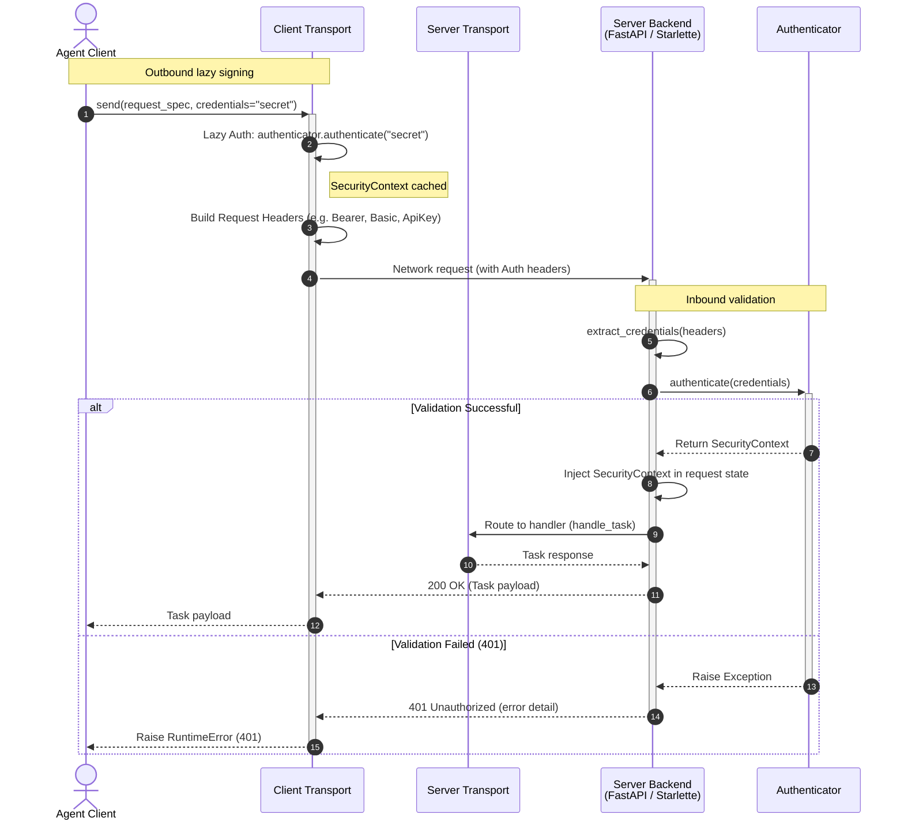

import Tabs from '@theme/Tabs';
import TabItem from '@theme/TabItem';
import ApiSurface from '@site/src/components/ApiSurface';

# Authentication & Security

Protolink provides a pluggable, robust **Authentication & Security framework** designed to secure agent-to-agent and client-to-agent communication. This framework spans both the client side (lazily injecting credentials into outgoing requests) and the server side (extracting and validating credentials before route handlers are invoked).

Whether you are communicating over stateless HTTP or establishing persistent WebSocket connections, Protolink ensures your agents are authenticated and authorization scopes are validated.

---

## Overview

The authentication workflow decouples credentials management from both your core cognitive agent code and the low-level network libraries.

Below is a sequence diagram representing a typical authenticated request cycle:



---

## Core Concepts

The authentication module revolves around three primary data models and abstractions.

### `SecurityContext`
The `SecurityContext` represents an active, authenticated session. It encapsulates details about the authenticated principal, tokens, and expiration times.

```python
from dataclasses import dataclass, field
from typing import Any

from protolink.utils import utc_now

@dataclass
class SecurityContext:
    principal_id: str
    token: str
    expires_at: str | None = None
    issued_at: str = field(default_factory=utc_now)
    metadata: dict[str, Any] = field(default_factory=dict)

    def is_expired(self) -> bool:
        """Check if the context token is past its expiration time."""
        ...
```

### `SecurityScheme`
The `SecurityScheme` outlines the metadata of the authentication mechanism used. It directly corresponds to OpenAPI security schemes, allowing agents to advertise their security protocols in their dynamic agent card metadata.

```python
from dataclasses import dataclass, field
from typing import Any

@dataclass
class SecurityScheme:
    auth_type: str  # e.g., "apiKey", "http", "oauth2"
    auth_scheme: str | None  # e.g., "bearer", "basic" (required if type is "http")
    description: str
    metadata: dict[str, Any] = field(default_factory=dict)
```

### `Authenticator` (Base Class)
All security providers inherit from the `Authenticator` abstract base class. It specifies the API that security handlers must implement to validate credentials.

```python
from abc import ABC, abstractmethod

class Authenticator(ABC):
    @property
    @abstractmethod
    def security_scheme(self) -> SecurityScheme:
        """Expose metadata describing the security scheme."""
        pass

    @abstractmethod
    async def authenticate(self, credentials: str) -> SecurityContext:
        """Authenticate raw credentials and return a SecurityContext."""
        pass

    async def refresh_token(self, context: SecurityContext) -> SecurityContext:
        """Refresh an expired or expiring security token."""
        return context
```

---

## Built-in Providers

Protolink includes several production-ready security providers out of the box.

<Tabs groupId="doc-tabs-1">
<TabItem value="api-key-authentication" label="API Key Authentication" default>

`APIKeyAuth` validates simple api keys against a dictionary of valid keys mapping to scopes. It generates headers using the standard `X-API-Key` or custom key configurations.

```python
from protolink.security.auth import APIKeyAuth

auth = APIKeyAuth(
    valid_keys={
        "sk-12345": ["read", "write"],
        "sk-abcde": ["read"]
    }
)
```

</TabItem>
<TabItem value="bearer-token-authentication" label="Bearer Token Authentication">

`BearerTokenAuth` validates compact JSON Web Tokens (JWTs) signed with a shared HMAC secret. It checks the declared algorithm, signature, `exp`, `nbf`, `iat`, and optional issuer/audience claims before returning a `SecurityContext`.

```python
from protolink.security.auth import BearerTokenAuth

auth = BearerTokenAuth(
    secret="your-jwt-shared-signing-secret",
    algorithm="HS256",
    issuer="https://auth.example.com",
    audience="protolink-agent",
)
```

Supported algorithms are `HS256`, `HS384`, and `HS512`. Use `APIKeyAuth` for static opaque service tokens.

</TabItem>
<TabItem value="basic-authentication" label="Basic Authentication">

`BasicAuth` implements standard HTTP Basic access authentication. It validates `username:password` values, automatically decoding Base64 strings sent via standard `Authorization: Basic <base64>` headers.

```python
from protolink.security.auth import BasicAuth

auth = BasicAuth(
    valid_credentials={
        "admin": "super-secret-password-123",
        "developer": "dev-pass"
    }
)
```

</TabItem>
<TabItem value="oauth2-delegation-authentication" label="OAuth2 Delegation Authentication">

`OAuth2DelegationAuth` performs token exchanges with an external identity provider endpoint to obtain delegated access tokens. It is useful for verifying scopes from trusted authentication servers.

```python
from protolink.security.auth import OAuth2DelegationAuth

auth = OAuth2DelegationAuth(
    exchange_endpoint="https://auth.myorganization.com/oauth/token",
    client_id="my-agent-client-id",
    client_secret="my-agent-client-secret"
)
```

</TabItem>
</Tabs>
---

## Server-Side Authentication

When hosting an agent server, endpoints can be protected by configuring an `authenticator` on the transport. The transport backend (FastAPI or Starlette) will intercept incoming HTTP requests, extract headers, and invoke the validator.

:::note[Authentication and TLS are different layers]

An `Authenticator` decides whether an application request may access the agent. `TLSConfig` encrypts the network connection and verifies certificate identities before that request arrives. Configure `tls=` on an HTTP, SSE JSON-RPC, WebSocket, or gRPC transport with its secure URL scheme, then pass that transport to the Agent. Combine TLS with an authenticator when you need both protected traffic and application authorization. See [TLS and mutual TLS](transport.md#tls-and-mutual-tls).

:::

### Request Interception Flow

1. **Extraction**: The server calls the `extract_credentials()` utility, searching the request in order:
    - `Authorization` header with `Bearer`, `Basic`, or `ApiKey` prefix.
    - `X-API-Key` header.
    - Query parameters: `api_key`, `apikey`, or `token`.
2. **Verification**: If credentials are found, they are sent to the transport's `Authenticator.authenticate(credentials)` method.
3. **Rejection**: If credentials are missing, or verification raises an exception, the request is terminated immediately, returning an HTTP `401 Unauthorized` status code with a JSON error message payload.

### Setup Route Protection

To secure your server-side endpoints, provide the `authenticator` argument to your `HTTPTransport`:

```python
from protolink.transport import HTTPTransport
from protolink.security.auth import APIKeyAuth

# Secure HTTP transport using FastAPI backend
transport = HTTPTransport(
    url="http://127.0.0.1:8000",
    backend="fastapi",
    authenticator=APIKeyAuth(valid_keys={"my-secret": ["write"]})
)
```

### WebSocket Handshake Authentication

WebSocket connections are authenticated during the HTTP connection upgrade handshake phase. The `WebSocketTransport` intercepts the request headers using a `process_request` hook before the socket upgrades, ensuring unauthenticated clients are denied connection with a `401 Unauthorized` HTTP response immediately.

```python
from protolink.transport import WebSocketTransport
from protolink.security.auth import APIKeyAuth

ws_transport = WebSocketTransport(
    url="ws://127.0.0.1:8080",
    authenticator=APIKeyAuth(valid_keys={"ws-key": ["connect"]})
)
```

---

## Client-Side Authentication

On the client side, Protolink supports **Lazy Authentication**. When instantiating a client-side transport (such as `HTTPTransport` or `WebSocketTransport`), you provide a credentials string.

```python
from protolink.transport import HTTPTransport
from protolink.security.auth import APIKeyAuth

client_transport = HTTPTransport(
    url="http://127.0.0.1:8000",
    authenticator=APIKeyAuth(valid_keys={"key123": ["read"]}),
    credentials="key123"
)
```

### Automatic Header Injection

- **Lazy Evaluation**: On the first `.send()` (HTTP) or `.subscribe()` (WebSocket) call, the transport automatically invokes `await authenticator.authenticate(credentials)`.
- **Caching**: The resulting `SecurityContext` is stored in the transport instance for subsequent calls.
- **Signing**: Based on the `SecurityScheme` defined by the authenticator, the transport overrides headers in `_build_headers()` for outgoing requests:
    - **Bearer**: Adds `Authorization: Bearer <token>`
    - **Basic**: Adds `Authorization: Basic <base64(credentials)>`
    - **ApiKey**: Adds `X-API-Key: <key>` and `Authorization: ApiKey <key>`

---

## Agent Integration

The `Agent` class encapsulates transport management and automatically maps security metadata to the `AgentCard`.

```python
from protolink.agents import Agent
from protolink.security.auth import BasicAuth

agent = Agent(
    card={"name": "secure-agent", "description": "Needs login", "url": "http://127.0.0.1:8000"},
    transport="http",
    authenticator=BasicAuth(valid_credentials={"admin": "secret"}),
    credentials="admin:secret"
)
```

### Card Security Schemes

When an agent is initialized with an `authenticator`, its public metadata card (`GET /.well-known/agent.json`) is automatically updated to include the advertised security schemes. This allows other agents to discover security requirements dynamically.

Example payload for an agent card:

```json
{
  "name": "secure-agent",
  "description": "Needs login",
  "url": "http://127.0.0.1:8000",
  "security_schemes": {
    "http": {
      "type": "http",
      "scheme": "basic",
      "description": "HTTP Basic authentication (username:password)",
      "metadata": {}
    }
  }
}
```

---

## Credential Extraction Helper

You can use the built-in credential extraction logic for custom route middleware or custom transport backends:

```python
from protolink.security.auth import extract_credentials

headers = {"Authorization": "Bearer my-jwt-token"}
query_params = {"api_key": "some-api-key"}

# Returns "my-jwt-token" (headers have precedence)
credentials = extract_credentials(headers, query_params)
```

---

## Custom Authenticators

To integrate custom enterprise identity management (e.g. LDAP, active directory, Auth0), subclass `Authenticator`:

```python
from protolink.security.auth import Authenticator, SecurityScheme, SecurityContext

class LDAPAuthenticator(Authenticator):
    
    @property
    def security_scheme(self) -> SecurityScheme:
        return SecurityScheme(
            auth_type="http",
            auth_scheme="basic",
            description="Active Directory / LDAP validation"
        )

    async def authenticate(self, credentials: str) -> SecurityContext:
        username, password = credentials.split(":")
        # Implement custom LDAP check logic here
        success = my_ldap_library.verify(username, password)
        
        if not success:
            raise ValueError("Invalid LDAP credentials")
            
        return SecurityContext(
            principal_id=username,
            token=credentials
        )
```

---

## API Reference

<ApiSurface
  eyebrow="Security module"
  title="Authentication"
  path="protolink.security"
  description="The credential verification layer for incoming agent requests, advertised security schemes, outgoing credentials, bearer tokens, and custom authenticators."
  pills={[
    "SecurityContext",
    "SecurityScheme",
    "Bearer tokens",
    "Custom authenticators",
    "HTTP integration",
  ]}
  cards={[
    {
      title: "Context",
      text: "Carries the verified principal, token, timestamps, and provider metadata after authentication succeeds.",
      code: "SecurityContext",
    },
    {
      title: "Scheme",
      text: "Describes the authentication mechanism advertised on agent cards.",
      code: "SecurityScheme",
    },
    {
      title: "Authenticator",
      text: "Defines authenticate and refresh methods for built-in or application-specific credentials.",
      code: "Authenticator",
    },
    {
      title: "Bearer JWT",
      text: "Verifies signed bearer tokens with issuer, audience, algorithm, and leeway controls.",
      code: "BearerTokenAuth",
    },
  ]}
/>

### Data Structures

#### SecurityContext

| Field | Type | Description |
| :--- | :--- | :--- |
| `principal_id` | `str` | The verified identity identifier of the client. |
| `token` | `str` | The session or signature token. |
| `expires_at` | `str ⎪ None` | Optional ISO timestamp for token expiration. |
| `issued_at` | `str` | ISO timestamp for token creation. |
| `metadata` | `dict` | Key-value pairs containing provider-specific information. |

#### SecurityScheme

| Field | Type | Description |
| :--- | :--- | :--- |
| `auth_type` | `SecuritySchemeType` | General classification: `"apiKey"`, `"http"`, `"oauth2"`, `"openIdConnect"`. |
| `auth_scheme` | `HttpAuthScheme ⎪ None` | Required if type is `"http"`. Example: `"bearer"`, `"basic"`. |
| `description` | `str` | Human-readable explanation of the scheme. |
| `metadata` | `dict` | Scheme extensions or provider settings. |

### Authenticator Interface Methods

- `authenticate(credentials: str) -> SecurityContext`
- `refresh_token(context: SecurityContext) -> SecurityContext`

### BearerTokenAuth Options

| Parameter | Type | Default | Description |
| :--- | :--- | :--- | :--- |
| `secret` | `str` | - | Required HMAC signing secret. Empty secrets are rejected. |
| `algorithm` | `str` | `"HS256"` | JWT signing algorithm. Supported values: `HS256`, `HS384`, `HS512`. |
| `issuer` | `str ⎪ None` | `None` | Optional required `iss` claim. |
| `audience` | `str ⎪ None` | `None` | Optional required `aud` claim. Token audiences may be a string or list. |
| `leeway_seconds` | `int` | `0` | Optional clock-skew allowance for registered time claims. |
