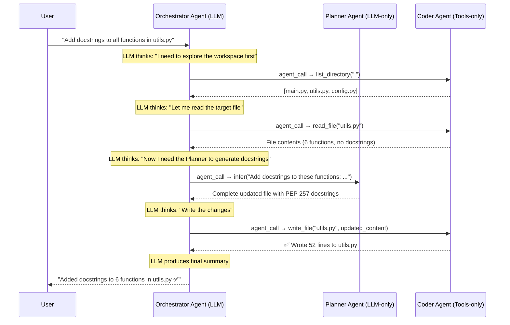

# Code Assistant Example

:::info[Article]

The article on [Level Up Coding](https://levelup.gitconnected.com/build-easily-your-own-claude-code-with-three-agents-brain-hands-and-coordinator-5236b392ddf0) gives an overview of this example.

:::
The directory containing the example files can be found [here](https://github.com/nMaroulis/protolink/tree/main/examples/code_assistant).

This example builds a simplified **"Claude Code"** - a terminal coding assistant powered by a mesh of three autonomous agents. It demonstrates how to compose specialized agents into a system where a **brain reasons**, **hands execute**, and a **coordinator orchestrates** - just like a real AI coding assistant.

It highlights:

- How an **orchestrator agent** coordinates both LLM and tool agents
- How **LLM-to-LLM delegation** works via `agent_call` with `infer`
- How **tool delegation** works via `agent_call` with `tool_call`
- How **separation of concerns** (brain vs hands) enables safer, more reliable systems
- How agents **discover each other dynamically** through the Registry

---

## 💬 High-Level User Request

<div className="doc-quote-card">
  <div className="quote-mark">&quot;</div>
  <div className="quote-body">Add docstrings to all functions in utils.py</div>
  <div className="quote-source">User Request</div>
</div>

From this single input, the system:

- **Explores** the workspace to understand the project structure
- **Reads** the target file to get the current code
- **Reasons** about what docstrings are needed (using the Planner's LLM)
- **Generates** the complete updated file with proper PEP 257 docstrings
- **Writes** the changes to disk
- **Summarizes** what was changed for the user

---

## 🧩 Agent Overview

### 1. Orchestrator Agent (Coordinator | LLM + Agent Calls)

**Role:** User-facing coordinator and workflow manager.  
- Receives the user's coding request  
- Decides **which agent to call, when, and with what context**  
- Delegates reasoning to the Planner and file operations to the Coder  
- Aggregates results and presents a summary to the user  
> Uses an **LLM for decision-making**, but **never touches files or generates code** directly. It coordinates.

### 2. Planner Agent (Brain | LLM-Only)
**Role:** Code analysis, planning, and code generation.
- Analyzes coding tasks and creates step-by-step implementation plans  
- Reviews existing source code for issues and improvements  
- Generates precise, complete file contents ready to be written  
- Responds with structured output following PEP 8 / PEP 257 conventions
> **No filesystem access.** The Planner is a pure reasoning engine, it thinks, but cannot act. This is the `infer` delegation in action.

### 3. Coder Agent (Hands | Tools-Only)
**Role:** Deterministic filesystem operations.  
- `read_file(path)` - Read file contents with line numbers  
- `write_file(path, content)` - Create or overwrite files  
- `list_directory(path)` - List directory contents  
- `search_in_files(pattern, path, file_filter)` - Grep-like search  
> **No LLM.** The Coder executes file operations reliably and deterministically. All operations are **sandboxed** to a configurable workspace directory for safety.

### 🧠 Design Note: Why Three Agents?

This architecture mirrors how production coding assistants (Claude Code, Cursor, etc.) work internally:

| Concern | Agent | Why Separate? |
|---------|-------|---------------|
| **Reasoning** | Planner | Can use a powerful (expensive) model; no side effects |
| **Execution** | Coder | Deterministic; can run on a secure file server |
| **Coordination** | Orchestrator | Can use a lighter (cheaper) model; just routes work |

The key insight: **the brain that generates code should not be the same component that writes files.** Separation makes the system safer, more testable, and independently scalable.

---

## 🔁 Sequence Diagram



### Two Types of `agent_call`

The Orchestrator uses **both** delegation modes available in Protolink:

| Delegation | Target | Action | What Happens |
|------------|--------|--------|-------------|
| **LLM-to-LLM** | Planner | `infer` | Orchestrator's LLM sends a prompt → Planner's LLM reasons → response returned |
| **LLM-to-Tool** | Coder | `tool_call` | Orchestrator's LLM specifies tool + args → Coder executes → result returned |

This is the **core of Protolink's agent mesh**: agents delegating to each other over the network using a standardized protocol. The Orchestrator doesn't know (or care) whether the Planner and Coder are on the same machine or across the globe.

---

### 🧠 Agent Classification Summary

| Agent | Uses LLM | Has Tools | Purpose |
|-------|----------|-----------|---------|
| Orchestrator Agent | ✅ | ❌ | Coordination, routing, decision-making |
| Planner Agent | ✅ | ❌ | Code analysis, planning, code generation |
| Coder Agent | ❌ | ✅ | File read/write/list/search |

---

### 🎯 Why This Example Matters

- **Relatable use case**: Every developer understands what a coding assistant does
- **Both delegation modes**: Demonstrates `infer` (LLM-to-LLM) and `tool_call` (LLM-to-Tool) in one system
- **Separation of concerns**: Brain, Hands, and Coordinator are cleanly separated
- **LLM-agnostic**: Switch between OpenAI, Anthropic, Ollama with a single environment variable
- **Safety by design**: Workspace sandboxing prevents agents from accessing arbitrary files
- **Autonomous multi-step**: The entire workflow runs without human intervention after the initial request

---

## 🧠 The Inference Loop - How the Orchestrator Works

When the Orchestrator receives a user request, Protolink runs an **inference loop**:

1. The Orchestrator's **LLM reads the system prompt** + discovered agent cards (from the Registry)
2. The LLM decides which agent to call and outputs a structured **`agent_call`**
3. **Protolink intercepts** the agent_call, resolves the agent URL via the Registry, and sends an HTTP request
4. The target agent processes the request and returns a result
5. The result is injected back into the LLM's conversation as an **observation**
6. The LLM decides the next step (another agent_call, or a final response)
7. Steps 2–6 repeat until the LLM produces a **`final`** response

```
┌─────────────────────────────────────────────────────────┐
│                   INFERENCE LOOP                        │
│                                                         │
│  ┌──────────┐    ┌─────────┐    ┌──────────────────┐   │
│  │ LLM      │───→│ Protolink│───→│ Remote Agent      │   │
│  │ thinks   │    │ routes   │    │ executes          │   │
│  └──────────┘    └─────────┘    └──────────────────┘   │
│       ▲                                    │            │
│       │              observation           │            │
│       └────────────────────────────────────┘            │
│                                                         │
│  Loop continues until LLM produces "final" response     │
└─────────────────────────────────────────────────────────┘
```

This is how a single `Task.create_infer(prompt=...)` can trigger an autonomous, multi-step workflow spanning multiple agents.

---

## 📁 Files and Structure

```
examples/code_assistant/
├── run.py                  # ⭐ Entry point, starts all agents & demo
├── orchestrator_agent.py   # LLM coordinator (delegates to Planner & Coder)
├── planner_agent.py        # LLM-only reasoning (code analysis & generation)
├── coder_agent.py          # Tools-only (read, write, list, search files)
├── .env.example            # Environment template
├── README.md               # Detailed README with setup instructions
└── workspace/              # Demo Python project (auto-created by run.py)
    ├── main.py             # Simple calculator app
    ├── utils.py            # Utility functions (without docstrings)
    └── config.py           # App configuration
```

---

## 🚀 Running the Example

1. **Install Protolink**
   ```bash
   pip install "protolink[http,llms]"
   ```

2. **Configure your LLM provider**

    === "OpenAI"

        ```bash
        export OPENAI_API_KEY=sk-...
        ```

    === "Anthropic"

        ```bash
        export ANTHROPIC_API_KEY=sk-ant-...
        ```

    === "Ollama (Free, Local)"

        ```bash
        # Install from https://ollama.ai
        ollama pull gemma4:e4b
        ollama serve
        ```

3. **Run the demo**

    === "OpenAI"

        ```bash
        cd examples/code_assistant
        LLM_PROVIDER=openai python run.py
        ```

    === "Anthropic"

        ```bash
        cd examples/code_assistant
        LLM_PROVIDER=anthropic python run.py
        ```

    === "Ollama"

        ```bash
        cd examples/code_assistant
        LLM_PROVIDER=ollama python run.py
        ```

4. **Try different queries**
   ```bash
   python run.py "Add type hints to all functions in utils.py"
   python run.py "Create a test file for utils.py"
   python run.py "Refactor utils.py to use a Calculator class"
   ```

---

## 📋 Expected Output

```
🤖 CODE ASSISTANT - Protolink Multi-Agent Coding System
======================================================================

📂 Setting up demo workspace...
   Created main.py
   Created utils.py
   Created config.py

📡 Starting Registry...
   Registry running at http://localhost:9000

🔧 Starting Coder Agent (tools-only, no LLM)...
   Coder running at http://localhost:8030
   Tools: ['read_file', 'write_file', 'list_directory', 'search_in_files']

🧠 Starting Planner Agent (LLM: openai)...
   Planner running at http://localhost:8020

🎯 Starting Orchestrator Agent (LLM: openai)...
   Orchestrator running at http://localhost:8010

🔍 Verifying agent discovery...
   Discovered 3 agents:
   • orchestrator (LLM): reasoning
   • planner (LLM): reasoning
   • coder (Tools): ['read_file', 'write_file', 'list_directory', 'search_in_files']

📝 Processing: "Add docstrings to all functions in utils.py"
======================================================================

⏳ Orchestrator is working...

   📁 [coder] list_directory: .
   📖 [coder] read_file: utils.py
   🧠 [planner] infer called: Add docstrings to these functions...
   ✍️  [coder] write_file: utils.py

======================================================================
✅ RESULT:
----------------------------------------------------------------------
Added comprehensive docstrings to all 6 functions in utils.py:
• add(a, b) - Addition operation
• subtract(a, b) - Subtraction operation
• multiply(a, b) - Multiplication operation
• divide(a, b) - Division with zero-check
• power(base, exponent) - Exponentiation
• factorial(n) - Recursive factorial

All docstrings follow PEP 257 conventions.
----------------------------------------------------------------------
```

---

## 🎯 Protolink Features Showcased

| # | Feature | Where |
|---|---------|-------|
| 1 | **`agent_call` with `infer`** | Orchestrator → Planner (LLM-to-LLM reasoning) |
| 2 | **`agent_call` with `tool_call`** | Orchestrator → Coder (file operations) |
| 3 | **Registry Discovery** | Agents find each other dynamically at runtime |
| 4 | **LLM-Agnostic** | One-line switch: `create_llm("openai")` → `create_llm("anthropic")` |
| 5 | **Transport-Agnostic** | All agents use HTTP; switchable to SSE, WebSocket, or runtime transports |
| 6 | **Tool-Only Agents** | Coder has tools but no LLM - pure determinism |
| 7 | **LLM-Only Agents** | Planner has LLM but no tools - pure reasoning |
| 8 | **Custom `handle_task`** | Planner subclasses Agent for observability |
| 9 | **Autonomous Orchestration** | Multi-step workflow without human intervention |
| 10 | **Workspace Sandboxing** | File operations constrained to safe directory |

---

## 🧩 Extending the Example

- **Add a Reviewer agent** (LLM-only) that reviews code changes before they're written
- **Add a Test Runner agent** (tool-only) that runs pytest after edits
- **Switch transports** - use WebSocket for real-time streaming of edit progress
- **Add MCP tools** - import tools from external MCP servers (e.g., GitHub, Jira)
- **Use different LLMs per agent** - cheap model for Orchestrator, powerful model for Planner

---

## 📚 See Also

- [Getting Started](getting-started.md) – Core concepts and setup
- [Agents](agent.md) – Agent lifecycle and tools
- [Transports](transport.md) – Switching between HTTP, WebSocket, and runtime transports
- [Tools](tool.md) – Native and MCP tool integration
- [LLMs](llm.md) – LLM backends and usage
- [Ticket Booking Example](ticket_booking_example.md) – Another multi-agent example
