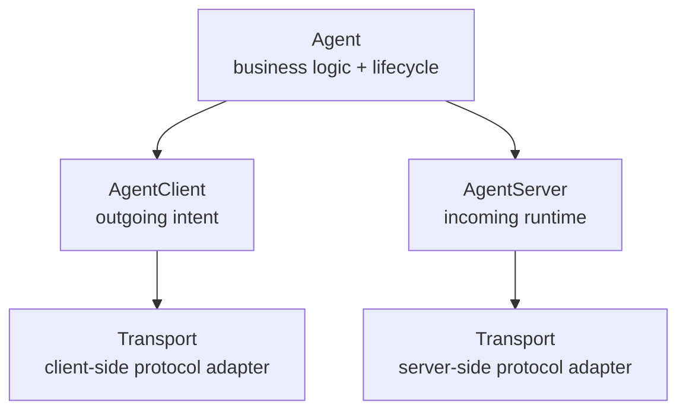
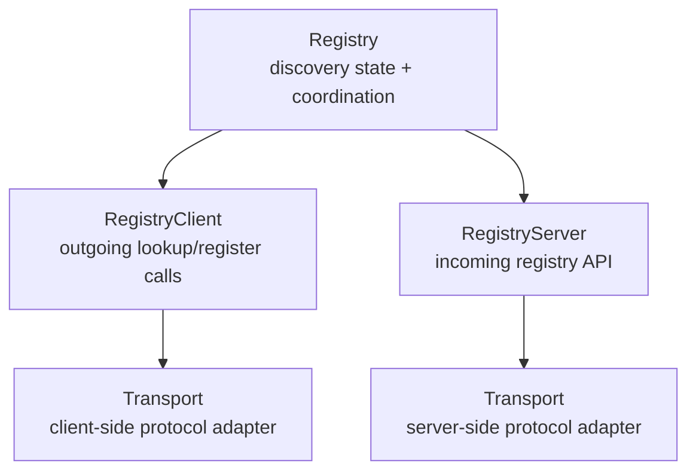

# Concept

After reading this page you should have a good understanding of the core concepts and architecture of Protolink.

## Architecture Overview

Protolink is designed around **explicit separation of concerns**, **protocol agnosticism**, and **low boilerplate** for agent authors.  
At a high level, Protolink models an agent as a **logical actor** that communicates with other agents via well-defined client/server interfaces, backed by pluggable transports.

The core idea is simple:  

> Agents express intent. Clients and servers handle communication. Transports handle protocols.  

This separation keeps agent logic **clean, testable, and future-proof**.

---

## Core Concepts

Protolink is built from the following **core components**:

- **Agent** - business logic and orchestration  
- **Client** - outgoing communication  
- **Server** - incoming communication  
- **Transport** - protocol + runtime implementation  
- **Registry** - discovery and coordination  

Each layer has a **single responsibility** and a clear **dependency direction**.

---

## API Design: Progressive Control

ProtoLink's API is designed to be **simple at the beginning without becoming restrictive later**. A user should be able to prototype an Agent without first learning transport internals, but production users should still be able to configure every network and runtime boundary explicitly.

This creates two levels of control through one consistent rule. `Agent`, `AgentClient`, and `Registry` all accept either a registered transport name or a concrete `Transport` instance.

### Simple path: choose a transport

Pass a registered transport name when the defaults are sufficient:

```python
from protolink import Agent, AgentCard

card = AgentCard(
    name="assistant",
    description="General-purpose assistant",
    url="http://127.0.0.1:8000",
)

agent = Agent(card=card, transport="http")
```

ProtoLink resolves the string through its transport factory, creates an `HTTPTransport` from `card.url`, applies bounded default limits, enables local metrics, and leaves retries disabled. The shortcut removes setup code; it does not select a reduced or separate runtime.

This path is intended for prototypes, examples, tests, and deployments that accept the built-in operational defaults.

### Advanced path: configure the boundary

When the transport needs TLS, mutual TLS, custom resource limits, retries, keepalive settings, or protocol-specific options, construct it directly:

```python
from protolink import Agent, AgentCard, RetryPolicy, TLSConfig, TransportConfig, TransportLimits
from protolink.transport import HTTPTransport

card = AgentCard(
    name="assistant",
    description="Production assistant",
    url="https://agent.internal:8443",
)
transport = HTTPTransport(
    url=card.url,
    tls=TLSConfig(
        certfile="certs/agent.pem",
        keyfile="certs/agent-key.pem",
        cafile="certs/ca.pem",
    ),
    config=TransportConfig(
        limits=TransportLimits(max_concurrent_requests=200),
        retry=RetryPolicy(max_attempts=3),
    ),
)

agent = Agent(card=card, transport=transport)
```

The Agent receives the same `Transport` abstraction in both examples. The only difference is who constructs it: ProtoLink owns construction in the simple path; the application owns construction in the advanced path.

AgentClient and Registry follow the same progression:

```python
from protolink import TLSConfig
from protolink.client import AgentClient
from protolink.discovery import Registry
from protolink.transport import HTTPTransport

# Simple facades create default transports.
client = AgentClient("http", url="http://127.0.0.1:8001")
registry = Registry("http", url="http://127.0.0.1:9000")

# Advanced facades receive independently configured transport objects.
client_tls = TLSConfig(cafile="certs/ca.pem")
registry_tls = TLSConfig(
    certfile="certs/registry.pem",
    keyfile="certs/registry-key.pem",
    cafile="certs/ca.pem",
)
client = AgentClient(HTTPTransport("https://agent.internal:8443", tls=client_tls))
registry = Registry(HTTPTransport("https://registry.internal:9000", tls=registry_tls))
```

Each service boundary should receive its own transport instance. Sharing configuration values is safe, but sharing a live transport object between unrelated Agent, client, and Registry lifecycles would also share pools, metrics, idempotency caches, and shutdown ownership.

### Why advanced settings live on Transport

Putting every infrastructure option on `Agent` would make the common constructor grow whenever HTTP, WebSocket, gRPC, TLS, or resilience gained a feature. It would also blur ownership: TLS certificates, connection pools, message limits, retry timing, and keepalive behavior are properties of the communication boundary, not of Agent reasoning or task execution.

Keeping these settings on Transport provides several concrete benefits:

- **Clear ownership**: the object opening sockets also owns certificates, pools, limits, retries, and shutdown behavior.
- **Independent boundaries**: an Agent transport and its Registry transport can use different trust roots, identities, capacities, and retry policies.
- **Stable facade APIs**: adding a gRPC channel option or HTTP backend option does not expand Agent, AgentClient, or Registry constructors.
- **Protocol substitution**: application logic continues to depend on `Transport`, not on protocol-specific settings promoted into Agent.
- **Reliable serialization**: `Agent.to_dict()` and YAML preserve advanced settings inside each serialized transport block.

| Concern | Owning API | Reason |
|---------|------------|--------|
| Identity, tools, LLM, state, policy, task lifecycle | `Agent` | Describes what the autonomous runtime is and does. |
| Application authentication and authorization | `Agent` / `Authenticator` | Describes who may invoke Agent capabilities. |
| TLS certificates and trust | Concrete `Transport` | Protects and identifies the network connection. |
| Payload limits, retries, keepalive, connection pools | `TransportConfig` on a concrete `Transport` | Controls communication resources and failure behavior. |
| Registry TLS and capacity policy | Registry transport / `RegistryClient` | The Registry is a separate service boundary with independent deployment requirements. |

This is **progressive control**, not a beginner API and an unrelated expert API. Users can begin with a string, move to a configured object when requirements grow, and keep the surrounding Agent, client, and Registry code unchanged.

See [Agents](agent.md#simple-and-advanced-transports) for the constructor-level API and [Transport](transport.md#production-configuration) for every production setting.

---

## Agent

The **Agent** is the central abstraction in Protolink.  

It represents:

- Identity (via `AgentCard`)  
- Capabilities and skills  
- Task handling logic  
- Lifecycle orchestration  

The agent **does not perform networking** and **does not implement protocols**.

### Responsibilities

- Define how tasks are handled (`handle_task`)  
- Manage tools, skills, and optional LLMs  
- Coordinate startup and shutdown  
- Orchestrate client/server components  
- Register and discover peers via the registry  

### What the Agent Does Not Do

- Open sockets  
- Handle HTTP requests  
- Serialize messages  
- Implement protocol behavior or own protocol-specific configuration

This is **intentional and enforced by design**.

---

## Client / Server Layer

Between the agent and the transport, Protolink introduces an **explicit client/server layer**.  
This layer removes boilerplate from agent implementations while keeping responsibilities clear.

### AgentClient (Outgoing)

The `AgentClient` handles **agent-to-agent outgoing communication**.

#### Responsibilities

- Sending tasks to other agents  
- Sending messages to other agents  
- Delegating all transport details  

The client exposes **intent-level methods only**.

Example interface (simplified):

```python
send_task(agent_url, task)
send_message(agent_url, message)
```

Key point: The client knows what it wants to send but does not know how it is sent.


### AgentServer (Incoming)

The `AgentServer` handles **incoming requests** for an agent.

#### Responsibilities

- Wiring the agent’s task handler into the transport  
- Starting and stopping the server runtime  
- Enforcing lifecycle rules  

The server:

- Receives tasks via the transport  
- Delegates task execution to the agent  
- Never contains business logic  

---

## Transport Layer

The `Transport` is the **lowest layer** in the system.  

It encapsulates:

- Network protocol (HTTP, WS, local, etc.)  
- Runtime concerns (ASGI, threads, event loops)  
- Serialization and deserialization  
- Request routing  

### Key Properties

- Protocol-agnostic  
- Swappable without touching agent logic  
- Reusable across agents  
- Shared by client and server  

> Agent business logic never calls protocol primitives directly. The Agent facade composes its client and server around the selected transport.

---

## Dependency Direction (Important)

The dependency graph is strictly **one-way**:



Both branches use the same transport abstraction, but the agent only talks to the
client/server layer. Protocol details stay below that boundary.

**Key points:**

- The Agent composes its client and server
- The client and server use the same configured transport abstraction
- Agent business logic never calls protocol methods directly

This guarantees:

- Clean abstractions  
- Easy testing  
- No protocol leakage into business logic  

---

## Registry

The registry enables **agent discovery and coordination**.  
Architecturally, it **mirrors the agent model**.

### Registry Components

- **Registry** - logical registry service  
- **RegistryClient** - outgoing discovery requests  
- **RegistryServer** - incoming registry API  
- **Transport** - protocol implementation  

### Registry Dependency Graph



This symmetry is intentional and keeps the **mental model consistent** across the system.

### Registry Responsibilities

- Agent registration  
- Agent discovery  
- Registration metadata and status visibility
- Filtering and metadata queries  

> Agents interact with the registry **only via the `RegistryClient`**.

---

## Agent Lifecycle

A typical agent lifecycle looks like this:

1. **Instantiation** with:  
   - `AgentCard`  
   - Transport  
   - Optional registry reference  

2. **Creation** of:  
   - `AgentClient`  
   - `AgentServer`  

3. **Startup**:  
   - Server runtime  
   - Registry registration  

4. **Runtime**: Agent runs autonomously  

5. **Shutdown**:  
   - Server stopped  
   - Registry unregistration  

> All of this happens with **minimal boilerplate** for the user.

---

## Autonomous Agents

Protolink supports **autonomous behavior** without external orchestration.

Agents can:

- Discover peers dynamically via the Registry
- Schedule and delegate tasks to specialized agents
- Call another agent's LLM for reasoning
- Invoke another agent's tools directly
- React to incoming tasks autonomously

This is done **inside the agent**, without manual wiring between agents.  
Agents behave like **independent actors**, not manually invoked functions.

> **Agents are entities, not functions.** They are autonomous, centralized objects that serve as the core unit of your system.

This creates a **flexible mesh** where specialized agents leverage each other's native capabilities without rigid orchestration bottlenecks. The programmer can be as invasive or hands-off as they want in the agent flow, Protolink gives you the freedom to choose.

---

## Why This Architecture

This design is intentionally:

- **Protocol-agnostic**: swap transports without touching agent logic
- **Low boilerplate**: focus on what matters, not infrastructure
- **Explicit**: no hidden magic, you always know what's running
- **Composable**: mix and match LLMs, tools, transports, storage
- **Testable**: clean separation makes testing straightforward

It draws inspiration from:

- Actor models  
- Ports & adapters (hexagonal architecture)  
- Distributed systems design  
- A2A concepts (agent cards, tasks, discovery)

Most importantly:

> **Care only about the logic.** Leave the communication, agent lifecycle, inference, tooling, authentication, memory, and logging to Protolink.

---

## Philosophy: Breaking Free from Lock-In

Traditional AI frameworks often trap you in a walled garden:

| Lock-In Type | The Problem | Protolink Solution |
|--------------|-------------|--------------------|
| **LLM Lock-In** | Tied to one provider (OpenAI, Anthropic) | Plug in any LLM, API, local, or self-hosted |
| **Transport Lock-In** | Hardcoded HTTP or specific runtime | Swap transports with one line of code |
| **Tooling Lock-In** | Proprietary tool schemas | Native tools + MCP adapter for universal tooling |
| **Runtime Lock-In** | Only works in specific environments | Protocol-agnostic, runs anywhere Python runs |

### Transport Independence

Protolink agents can communicate over HTTP, SSE JSON-RPC, WebSocket, gRPC, or in-process runtime transports without changing agent logic. Change the transport at construction time:

```python
# Switch from HTTP to WebSocket with one line
agent = Agent(card, transport="websocket")  # That's it!
```

The `grpc` transport uses the same `AgentClient` and `AgentServer` contracts as the other transports while carrying request/response and streaming envelopes over `grpc.aio`.

### Universal Tooling

Protolink supports the **Model Context Protocol (MCP)** via a built-in adapter. Import tools from thousands of existing MCP servers (Google Drive, Slack, Postgres) instantly.

### Resilience by Design

By decoupling the **Brain** (LLM) from the **Body** (Agent), you are immune to provider outages or pricing changes. Swap providers without rewriting your core logic.

### Developer Freedom

The pluggable architecture means **you own your stack**. No vendor lock-in, no framework constraints, just clean, composable components.

---

## Summary

- Agents **express intent**  
- Clients and servers **handle directionality**  
- Transports **handle protocols**  
- Registries **handle coordination**  
- Dependencies flow **one way**  
- Boilerplate is **minimized by design**  

This architecture makes it easy to:

- Add new transports  
- Scale from local to distributed  
- Swap protocols  
- Keep agent logic clean and focused

---

## LLM Inference Runtime

When an agent includes an LLM, Protolink provides a **deterministic inference runtime** that transforms stateless language models into reliable autonomous actors.

### The Core Idea

> The LLM **declares intent**. The runtime **executes actions**. The LLM **observes results**.

This separation ensures:

- **Reproducible behavior** across different LLM providers
- **Full control** over side effects (tool execution, agent delegation)
- **Robust error handling** with self-correction capabilities

---

### ReAct-Style Execution Loop

The inference runtime implements a **ReAct-style** (Reasoning + Acting) pattern:

```
┌─────────────────────────────────────────────────────────┐
│                    Inference Loop                        │
├─────────────────────────────────────────────────────────┤
│  1. User query added to conversation history            │
│                         ↓                               │
│  2. LLM generates a typed action                        │
│                         ↓                               │
│  3. Runtime parses and validates action                 │
│                         ↓                               │
│  4. Action dispatched:                                  │
│     • final → Return response                           │
│     • tool_call → Execute tool, inject result           │
│     • agent_call → Delegate to agent, inject result     │
│                         ↓                               │
│  5. Loop continues until 'final' or limit exceeded      │
└─────────────────────────────────────────────────────────┘
```

The LLM operates in a **thought → action → observation** cycle:

- **Thought**: Internal reasoning (not exposed)
- **Action**: JSON declaration of what to do
- **Observation**: Runtime executes, result injected into history

---

### Action Protocol

The LLM communicates through one of two acquisition modes:

- **JSON action mode**: portable fallback used by local/small models and providers without reliable native tools.
- **Native action mode**: provider-specific tool/function calls normalized into the same Protolink action models.

Both modes converge on three action types:

#### Final Response
```json
{"type": "final", "content": "The weather in Tokyo is 28°C and sunny."}
```

### Tool Call
```json
{"type": "tool_call", "tool": "get_weather", "args": {"location": "Tokyo"}}
```

### Agent Delegation
```json
{
  "type": "agent_call",
  "action": "tool_call",
  "agent": "weather_agent",
  "tool": "get_weather",
  "args": {"location": "Tokyo"}
}
```

The runtime **never trusts** the LLM to execute actions directly. All actions are:

1. Parsed and validated
2. Executed by the runtime
3. Results serialized and injected back

---

### Safety Guardrails

The inference runtime implements multiple safety mechanisms:

#### Deduplication Detection

Tracks recent actions in a sliding window. If the LLM repeats an identical action:

- Action is **not re-executed**
- Corrective guidance is **injected** into history
- LLM is prompted to proceed or take different action

#### Parse Failure Circuit Breaker

After 3 consecutive JSON parse failures:

- **Raises immediately** rather than consuming step budget
- Each failure **injects corrective feedback**
- Helps LLM self-correct its output format

#### Self-Correcting Error Recovery

Instead of failing on validation errors, helpful context is injected:

| Error | Response |
|-------|----------|
| Unknown tool | Lists available tools |
| Missing fields | Shows expected format |
| Type errors | Prompts to check schema |
| Agent not found | Provides error details |

#### Bounded Execution

Hard limit of `MAX_INFER_STEPS` (default: 10) prevents runaway loops.

---

### Why This Matters

This design enables:

- **Provider-agnostic execution**: Same loop works with OpenAI, Anthropic, Ollama, etc.
- **Observable behavior**: Every action is logged and traceable
- **Graceful degradation**: Self-correction reduces failures
- **Predictable resource usage**: Bounded steps prevent infinite loops

The runtime transforms chaotic LLM outputs into **reliable, deterministic agent behavior**.


---

## Design Principles

Protolink’s architecture is guided by a small number of **explicit design principles**.  
These principles explain *why* the system looks the way it does and help contributors extend it coherently.

---

### 1. Intent Over Mechanism

Agents express **what they want to do**, never **how it is done**.

- Agents send tasks  
- Agents receive tasks  
- Agents discover peers  

They do **not**:
- Open sockets  
- Serialize payloads  
- Know transport details  

This allows:
- Clean agent logic  
- Easier testing  
- Transport substitution without rewrites  

---

### 2. Directional Communication Is Explicit

Outgoing and incoming communication are **separate concerns**.

That is why Protolink has:
- `AgentClient` for outgoing requests  
- `AgentServer` for incoming requests  

This avoids:
- Bidirectional “god objects”  
- Hidden side effects  
- Transport leakage into agents  

---

### 3. Transport Is a Boundary, Not a Feature

Transports are infrastructure.

They are:
- Swappable  
- Replaceable  
- Reusable  
- Shared between client and server  

Agents should never depend on:
- HTTP  
- ASGI  
- WebSockets  
- Threads  
- Event loops  

This keeps the system future-proof.

---

### 4. Registry Mirrors Agent Architecture

The registry is not “special”.

It follows the **same architectural rules** as agents:

- Logical registry object  
- Client for outgoing calls  
- Server for incoming calls  
- Transport underneath  

This symmetry:
- Reduces cognitive load  
- Improves maintainability  
- Makes distributed registries natural  

---

### 5. Minimal Boilerplate, Explicit Control

Protolink aims to reduce boilerplate **without hiding control**.

- Defaults are sensible  
- Explicit overrides are possible  
- No magic global state  
- No hidden background threads  

You always know:
- What is running  
- What is registered  
- What is communicating  

---

## Agent ↔ Agent Sequence Diagram

This section describes the **runtime flow** when one agent sends a task to another.

---

### Scenario

Agent A wants to send a task to Agent B.

Both agents are already running and registered.

---

### Sequence

1. Agent A creates a `Task`  
2. Agent A calls `call_agent(agent_b_url, task)`  
3. `AgentClient` forwards the task to its transport  
4. Transport sends the request to Agent B’s server endpoint  
5. Agent B’s transport receives the request  
6. `AgentServer` invokes Agent B’s `handle_task`  
7. Agent B processes the task  
8. The result task is returned through the same path  
9. Agent A receives the completed task  

---

### Responsibility Breakdown

- Agent: defines *what* to do  
- Client: defines *direction*  
- Server: defines *entry point*  
- Transport: defines *mechanism*  

No layer violates its responsibility.

---

## Registry Interaction Sequence

This section explains how discovery works at runtime.

---

### Agent Startup

1. Agent starts its server  
2. Agent creates a `RegistryClient`  
3. Agent registers its `AgentCard`  
4. Registry stores the agent metadata  
5. Agent remains discoverable until it unregisters or the registry is cleared

---

### Discovery

1. Agent requests discovery via `RegistryClient`  
2. Registry applies filters  
3. Registry returns matching `AgentCard`s  
4. Agent decides what to do next  

The registry **never pushes behavior** to agents.

---

## Native Runtime and A2A Boundary

ProtoLink's internal runtime and its A2A wire interface are deliberately
separate. The runtime uses familiar card, task, message, part, artifact, and
lifecycle concepts, but native transports are not presented as the canonical
A2A wire format.

For HTTP agents, a versioned adapter owns that boundary:

- `/.well-known/agent-card.json` exposes the A2A 1.0 Agent Card.
- `POST /` accepts the A2A 1.0 JSON-RPC operations implemented by the adapter.
- Serialization, version negotiation, standard errors, and TCK verification
  stay outside agent business logic.

This separation lets the Python runtime evolve without quietly changing a
public protocol, while protocol work remains narrow enough to test against the
official TCK. See [A2A compatibility](a2a.md) for the exact implemented scope,
pinned commands, and current result.

## Mental Model Summary

If you remember only one thing:

> **Agents think. Clients talk. Servers listen. Transports move bytes. Registries coordinate.**

Each layer is small, focused, and replaceable. The same progressive-control
rule applies throughout: pass a compact alias for the normal path, or pass the
concrete object when the boundary needs explicit configuration.
