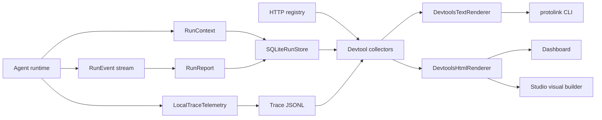
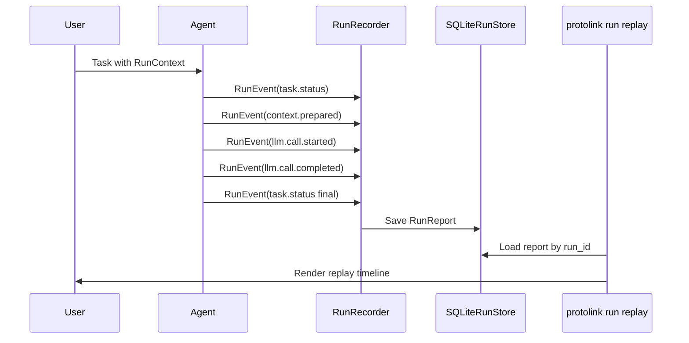

import ApiSurface from '@site/src/components/ApiSurface';

# Developer Tools

Protolink includes local devtools for the same runtime contracts that power agents in production: `RunContext`, `RunEvent`, `RunReport`, local `TraceRecord` JSONL, registry discovery, and the SQLite `RunStore`. The tools are intentionally dependency-light and application-neutral. They inspect what your agents already emit instead of inventing a separate tracing format.

The important idea is that devtools are not a separate observability product bolted onto the framework. They are a small projection layer over Protolink's core design: an agent is an autonomous runtime entity, and its execution can be described through typed context, events, reports, registry cards, and stored task state.

The current surface has four command groups, including the dashboard and its Studio builder:

- `protolink doctor` checks local installation, optional extras, run-store readability, and optional agent/registry endpoints.
- `protolink registry list` and `protolink registry inspect` inspect a running HTTP registry.
- `protolink run list`, `protolink run replay`, and `protolink run diff` inspect durable task snapshots and run reports.
- `protolink dashboard` serves or writes a local HTML dashboard for runs, local telemetry, registry state, and visual Studio blueprints.

## When To Use Each Tool

| Tool | Use it when | Reads from | Executes agent code? |
| --- | --- | --- | --- |
| `doctor` | You want to confirm installation, optional extras, store readability, or live endpoints. | Python environment, optional HTTP endpoints, optional SQLite file. | No |
| `registry list` | You want to see what agents a registry currently advertises. | Registry `/agents/` endpoint. | No |
| `registry inspect` | You want one full agent card by name or URL. | Registry `/agents/` endpoint. | No |
| `run list` | You need recent task snapshots and run-report IDs. | `SQLiteRunStore`. | No |
| `run replay` | You need a readable timeline for a stored run. | `SQLiteRunStore`. | No |
| `run diff` | You need a normalized regression comparison between two stored reports. | `SQLiteRunStore`. | No |
| `dashboard` | You want a local visual summary of registry, run-store, and local telemetry state. | Registry, `SQLiteRunStore`, and/or local trace JSONL. | No |
| Dashboard Studio | You want to compose agents, LLMs, tools, registries, flows, and modules visually, then export code. | Declarative Studio blueprint. | Only when you click **Run** in a served dashboard. |

The inspection commands do not execute stored runs, so replay and comparison never re-call tools, prompts, or model providers. Studio execution is a separate, explicit action: **Run** starts the generated project and can therefore contact the transports, providers, tools, and modules you configured.

## Why This Exists

Agents are autonomous runtime entities in Protolink. You plug in an LLM, tools, telemetry, storage, policy, transport, and registry participation. Once those modules are attached, the runtime emits enough structured data for command-line inspection and UI projection:



This keeps devtools modular: a CLI can render text, a notebook can call the collectors directly, and a web surface can reuse the same HTML renderer without coupling to private agent internals.

## The Runtime Data Model

The devtools become useful because Protolink separates runtime facts into stable layers:

- `AgentCard` describes identity and capability: name, URL, transport, skills, tags, role, auth, and metadata.
- `RunContext` describes one logical execution boundary: run ID, session ID, trace ID, workspace URI, parent run, agent chain, permissions, budgets, and cancellation state.
- `RunEvent` describes one point in execution: task status, context preparation, LLM call start/completion, tool action, policy decision, approval, artifact, delegation, budget warning, or final result.
- `RunReport` turns a sequence of `RunEvent` objects into a durable summary suitable for replay, tests, dashboards, and support bundles.
- `TraceRecord`, `TraceSpan`, and `TraceEvent` describe the detailed local telemetry hierarchy for completed Agent tasks. `LocalTraceTelemetry` can append one task record per line to JSONL.
- `SQLiteRunStore` persists task snapshots and run reports in a local database with searchable indexes.

The CLI and dashboard sit above these layers. They do not need to know whether the agent used OpenAI, Anthropic, Ollama, a mock model, runtime transport, HTTP, WebSocket, or a custom tool implementation. As long as the runtime emits and stores the public contracts, devtools can inspect the result.



This is also why the tooling scales from simple scripts to larger systems. A local script can write one `runs.db`; a hosted application can implement the same `RunStore` protocol against another backend later; a separate dashboard can reuse the collector and renderer patterns.

## Doctor

Run the local readiness checks:

```bash
protolink doctor
```

The default report checks:

- The installed Protolink version.
- Optional HTTP modules used by HTTP, SSE, and WebSocket development.
- Optional LLM provider SDKs.
- Optional metrics dependencies such as token estimators.
- Optional telemetry integrations.

Emit JSON for scripts or CI:

```bash
protolink doctor --json
```

Use JSON when the output will be read by a script. For example, a project-specific CI check can treat `error` as a failure while allowing `warn` if the project does not require every optional extra.

Probe an agent, registry, and run store:

```bash
protolink doctor \
  --agent-url http://127.0.0.1:8010 \
  --registry-url http://127.0.0.1:9010 \
  --store runs.db
```

Doctor reports missing optional extras as warnings, because core Protolink remains usable without every LLM, telemetry, metrics, or HTTP dependency installed. Endpoint probe failures are errors, since the user explicitly asked to verify those endpoints.

Interpreting the result:

- Missing `http extra` means local HTTP/WebSocket registry or agent serving may not work, but runtime/in-process agents can still work.
- Missing `llm api extras` means provider SDK clients are unavailable, but mock models, local server clients, or tool-only agents may still work depending on your install.
- Missing `metrics extra` means token estimates are more approximate.
- Missing `telemetry extras` means external telemetry sinks are unavailable, but local tracing and run reports can still be used.
- A run-store warning usually means no run database has been created yet, or the file is not a Protolink `SQLiteRunStore`.

## Registry Inspection

List agents from a running registry:

```bash
protolink registry list --url http://127.0.0.1:9010
```

This returns the registry's current advertised agent cards. It is the quickest way to verify that registration worked and that the registry is exposing the URL/capability data other agents will use for discovery.

Filter by discovery fields:

```bash
protolink registry list --url http://127.0.0.1:9010 --role orchestrator --tag research
```

Inspect one agent by name or URL:

```bash
protolink registry inspect planner --url http://127.0.0.1:9010
```

The registry commands currently target HTTP(S) registry URLs, which matches the standard local development and dashboard workflow.

Registry inspection is especially useful before delegation. If an agent is expected to call a peer, the caller needs a usable peer card: URL, transport, skills, capabilities, and any auth metadata. Looking at that card from the CLI catches many integration mistakes before the model or agent logic is involved.

Use `--json` when you need the full card. The table output is intentionally concise; it is for scanning, not for preserving every field.

## Run Store Replay

Persisted runs come from `SQLiteRunStore`, `RunRecorder`, and `RunReport`. List recent records:

```bash
protolink run list --store runs.db
```

The output has two sections:

- **Recent task snapshots**: final or intermediate serialized `Task` records.
- **Recent run reports**: durable summaries built from normalized runtime events.

Task snapshots are useful for "what state did this task end in?" Run reports are useful for "how did the task get there?"

Replay a run report or task snapshot:

```bash
protolink run replay run_devtools_demo --store runs.db
```

`run replay` prefers a full `RunReport` when one exists. If only a task snapshot is available, it falls back to a one-item task timeline. This makes the command useful both for rich recorded runs and for simpler applications that only persist final task state.

A good replay should answer questions such as:

- Did the task move through the expected lifecycle states?
- Was a `RunContext` attached with the expected run/session/trace IDs?
- Did the runtime prepare the expected amount of context before the LLM call?
- Which LLM provider/model was called?
- Did a budget warning or policy decision happen before an action?
- Did the agent produce artifacts or a final task state?

Replay is not deterministic re-execution. It is a read-only reconstruction of recorded facts. That distinction is important for debugging: you can inspect a run without causing side effects, making provider calls, or repeating tool actions.

## Run Regression Diffing

After executing and recording a candidate separately against the same controlled inputs and dependencies as a baseline, compare the two stored reports offline:

```bash
protolink run diff baseline_run candidate_run --store runs.db
```

The comparison canonicalizes known ProtoLink runtime-envelope identifiers, timestamps, sequence counters, and runtime-derived timing fields before reporting path-level differences. Application-owned tool payloads and report metadata remain exact. It does not execute an agent, contact a provider, or repeat a tool action. With live models or external services, the result shows what changed; it does not make those dependencies deterministic. Regression suites normally compare final reports, but report lookup does not enforce a task lifecycle state.

`run diff` requires two `RunReport` records in the same `SQLiteRunStore`. It deliberately does not compare task-snapshot fallbacks because a snapshot does not contain the full event, action, approval, artifact, and metric record.

The command exits `0` when the normalized reports match, `1` when they changed, and `2` when either report is missing. Add `--json` in CI or custom tooling to receive `status`, `missing_run_ids`, `changed_sections`, and structured differences in addition to the baseline and candidate selectors. Both terminal and JSON output mask sensitive baseline/candidate values with the default redaction policy while retaining their JSON Pointer paths.

## Dashboard

Serve the local dashboard:

```bash
protolink dashboard \
  --store runs.db \
  --traces traces.jsonl \
  --registry-url http://127.0.0.1:9010 \
  --open
```

`--telemetry traces.jsonl` is an alias for `--traces traces.jsonl`.

Write a static HTML snapshot instead:

```bash
protolink dashboard --store runs.db --output dashboard.html
```

<figure className="doc-media-frame">
  
</figure>

The dashboard is deliberately small: no build step and no frontend dependencies. It serves a local page with branded navigation, top-level runtime cards, registry agents, agent health probes, a chat panel for HTTP LLM agents, run replay, a Telemetry trace explorer, and the Studio visual builder. The sidebar shows the active Protolink version. The JSON endpoint at `/api/snapshot` uses the same collector as static rendering, and `/studio` opens the same page with Studio selected.

Use the served dashboard when you want live refresh against a local registry or run store, or bounded access to the trace file supplied with `--traces`. Use `--output` when you want a portable snapshot for a demo, issue, notebook, or support handoff. The Telemetry view also has an **Open JSONL** control, so either served or static HTML can inspect a file selected in the browser without first configuring a CLI path.

The distinction between served and static mode matters:

- Served mode can refresh `/api/snapshot`, connect a registry URL or existing SQLite run store for the current process, replay runs through `/api/runs/{run_id}`, page through the configured telemetry file, load selected trace details lazily, ping HTTP agents through `/api/agents/ping`, proxy chat messages through `/api/agents/chat`, and validate, generate, run, stop, and monitor Studio projects.
- Static mode embeds the current snapshot in the HTML file. It is excellent for demos and handoffs: Studio canvas editing and blueprint import/export stay in the browser, and the Telemetry file picker can inspect local JSONL. Python generation, live Studio execution, server-backed refresh, ping, chat, run replay, and CLI-configured telemetry paging need the local dashboard server.

The dashboard currently focuses on:

- High-level counts for agents, task snapshots, reports, loaded telemetry records, and store availability.
- A registry-first dashboard body and second-position Registry tab, because discovery and live agent health are usually the most important development questions.
- A searchable Runs workspace with compact report/task cards, loaded-window metrics, correlation details, and a vertical replay timeline.
- Registry card summaries with selected-agent details, transport badges, capability badges, schemas, and security metadata.
- Ping controls for HTTP agents with latency/status feedback.
- A chat panel for agents that advertise `capabilities.has_llm=true` and expose the standard `POST /chat` endpoint.
- Chat-side diagnostics for served dashboards: last response latency, average latency, message count, active session ID, and last proxy/agent error.
- A chat reset control that clears the visible conversation, starts a fresh dashboard session ID, and resets the local latency/debug counters.
- Run replay buttons that load the same replay projection used by `protolink run replay`.
- A Telemetry view for filtering completed task records, inspecting nested task/LLM/tool/agent-call spans, replaying chronological events, and opening redacted inputs, outputs, metadata, and raw JSON only when selected.
- An active Studio canvas for composing, configuring, exporting, and locally testing a supported topology.

It intentionally avoids provider-specific visualizations. Provider details belong in the structured run events and reports; the dashboard should remain generic enough for any Protolink agent system.

### Connecting dashboard sources

The served Registry and Runs pages include source controls when a source was not supplied on the command line, and they can also change an existing source. Without `--store`, the CLI uses an existing `./runs.db` but does not create one when it is absent. Registry input accepts an HTTP(S) base URL. Runs input accepts the path to an existing Protolink SQLite database on the dashboard machine; inspection is read-only and a typo does not create a new database. These selections live only for the dashboard process.

Source-changing requests retain the dashboard's Host, same-origin JSON, and request-size checks and are additionally limited to loopback clients. A dashboard exposed with `--host 0.0.0.0` can display CLI-configured data to allowed clients, but remote clients cannot make the server connect to another registry or local file. Static HTML keeps the controls disabled because it has no local server process.

### Telemetry JSONL

Start the dashboard with a local telemetry file:

```bash
protolink dashboard --traces traces.jsonl --open
```

The Telemetry view reads recent records first and keeps its working set bounded. Summary pages contain compact task and span counts; the full record and potentially large payload fields are loaded only when you select a record. Moving to older pages therefore does not require embedding the entire file in the initial dashboard snapshot or creating one DOM row for every trace ever recorded. Once the 500-summary browser window is full, loading older pages rolls newer summaries out of that window; **Latest** returns to the head of the file. The browser file picker follows the same bounded, lazy-detail model for a locally selected file.

One JSONL line represents one completed Agent task record. A `trace_id` is a correlation key, not a unique line ID: nested or delegated tasks can share it, and an application can deliberately assign the same trace ID to several related tasks. The dashboard groups those task records under the shared trace ID while retaining task ID and record position as the distinct record identity.

Trace files can be observed while another process is appending to them. Blank or malformed lines are reported and skipped instead of making the whole source unreadable. An incomplete final line is treated as a partial write; it is ignored for the current page and can become visible after the writer completes it and the dashboard refreshes.

Each server page has a byte and line scan budget, each detail record has a 16 MB safety limit, and span/event/JSON rendering is separately capped. If one physical line is larger than a scan page, the reader returns an opaque continuation cursor and skips across that line over bounded requests, so an unusually large payload cannot make every older record unreachable. The source diagnostics show malformed lines, oversized records, partial tails, and pages that reached a scan budget.

:::caution[Local traces can contain application data]

Default redaction masks common secret-bearing fields, but captured prompts, tool arguments, outputs, and custom metadata can still be sensitive. A file chosen with **Open JSONL** is read locally by the page and is not uploaded to a hosted service. The served dashboard binds to `127.0.0.1` by default, rejects unexpected HTTP `Host` names, and limits browser action POSTs to same-origin JSON requests. Changing `--host` to a non-loopback interface can still expose trace details, registry data, and dashboard proxy actions to other network clients. With a wildcard bind, open the dashboard through an IP address; arbitrary DNS hostnames are rejected. Only broaden the binding on a trusted network with controls appropriate for the data.

:::

The chat panel is meant for fast local probing, not for becoming a production chat product. Select an HTTP LLM agent from the registry, keep or edit the session ID, and send a message through the dashboard proxy. Pressing Enter submits the message, while Shift+Enter keeps editing a multi-line prompt. The Debug toggle opens a small live diagnostics strip so you can see whether a slow response is coming from the dashboard proxy, the agent endpoint, or the model/tool path behind that agent.

Agent health indicators follow the same idea as the terminal renderers: runtime-only agents are clearly marked as local/runtime, unprobed HTTP agents stay unknown, active probes show a pending state, successful probes show online latency, and failed probes show the last error. Transport and capability fields are rendered as badges so the registry can be scanned quickly without reading a dense JSON card. When an HTTP agent's status page exposes a start timestamp, the dashboard can also show uptime after the agent is pinged.

The selected-agent panel is intentionally more than a name/URL preview. It shows role, version, protocol, transport, input/output formats, security schemes, capability flags, tags, skills, and advertised input/output schemas for each skill. The dashboard overview points users to this Registry tab instead of duplicating a Details button in the landing table. Empty schema sections are explicit so users can tell the difference between "not advertised" and a dashboard loading issue.

## Protolink Studio

Studio is the dashboard's active visual builder. It ships with the standard Protolink package and has no separate CLI command: run `protolink dashboard`, select **Studio**, or open `http://127.0.0.1:8765/studio` when using the default host and port.

The palette separates runtime topology from operational modules:

- **Agent**, **LLM**, **Tool**, **Registry**, and **Flow** are the core nodes. The inspector exposes the relevant card, model, transport, schema, flow, state, and lifecycle settings for each kind.
- **Module** covers storage (`memory`, `sqlite`), telemetry (`local`, `langsmith`, `langfuse`), logging (`console`, `file`, `quiet`), SQLite run storage, capability policy, knowledge (`memory`, `sqlite`), and bearer authentication.
- LLM choices are mock, OpenAI, Anthropic, Gemini, Grok, DeepSeek, Hugging Face, Ollama, LM Studio, OpenAI-compatible, vLLM, and llama.cpp local/server adapters. Tool choices include calculator, current date/time, URL fetch, web search, and a custom placeholder.
- Agent and Registry transports can use HTTP, WebSocket, gRPC, runtime, SSE, JSON-RPC, or SSE JSON-RPC. Flow nodes support pipeline, parallel, router, and graph construction.

Add nodes from the palette, drag them on the canvas, and select a node to edit it. Connections are typed-ish: Studio accepts only node-kind pairs the generator understands, including Agent–LLM, Agent–Tool, Agent–Registry, Agent–Flow, Agent–Agent, Flow–Flow, Flow–Registry, Agent–Module, and Registry–Storage. Each edge retains a relation, label, and order; ordered flow connections affect generated flow wiring. Validation rejects missing endpoints, duplicate/self connections, unsupported pairs, and cyclic nested flows.

**Generate Python** validates the blueprint and returns a readable module built from Protolink's public APIs. The code view shows warnings for incomplete topology, and the result can be copied or downloaded under its generated filename. Generating does not execute anything. In a served dashboard, **Run** starts the generated module as the dashboard's single active Studio subprocess; the status panel shows lifecycle data and bounded combined output, and **Stop** terminates it. Closing the dashboard also stops the child process and removes its temporary script.

Static and served Studio intentionally have different boundaries:

- A static `--output` page can edit the canvas, keep the draft in browser local storage, and import or export the declarative blueprint as JSON. It has no Python process behind it, so **Generate Python**, **Copy Python**, **Download Python**, runtime status, **Run**, and **Stop** require a served dashboard.
- A served page uses the local validation and generation endpoints. Starting and stopping projects is additionally restricted to loopback clients. The normal dashboard Host, same-origin JSON, and request-size checks apply to every action endpoint.

Studio v1 stores bounded JSON, not arbitrary Python. It never evaluates snippets from the blueprint. Public built-in tools are generated directly; a custom Tool node becomes a safe placeholder handler for you to replace in the downloaded file. Only the provider, flow, transport, and module implementations exposed by the Studio catalog are constructed automatically, and selected optional integrations still require their normal Protolink extras. Advanced settings must remain JSON data.

Do not put credentials in a blueprint. Secret-bearing keys are rejected; enter an environment-variable name in fields such as `api_key_env`, `secret_env`, or `credentials_env`, then define that variable in the environment that launches the dashboard. A running Studio project inherits that environment. Review downloaded code before running providers, tools, transports, or modules that can make network requests or write local data.

The served routes are:

- `GET /studio` opens the dashboard with Studio selected.
- `GET /api/studio/catalog` returns the supported node and implementation choices.
- `POST /api/studio/generate` validates a blueprint and returns Python, filename, normalized blueprint, warnings, and a digest.
- `GET /api/studio/status` returns the active run state and recent output.
- `POST /api/studio/run` starts one generated project; `POST /api/studio/stop` stops it by run ID.

## Collector And Renderer APIs

The UI pieces live in `protolink.utils.renderers.devtools`:

<ApiSurface
  eyebrow="Developer tooling module"
  title="Devtools Collectors And Renderers"
  path="protolink.devtools"
  description="The collector, renderer, and Studio blueprint API for local dashboards, telemetry exploration, run replay and comparison, registry inspection, chat probes, code generation, terminal summaries, and application-specific debug panels."
  pills={[
    "Dashboard snapshots",
    "HTML renderer",
    "Text renderer",
    "Run replay",
    "Run diff",
    "Telemetry JSONL",
    "Agent probes",
    "Studio blueprints",
  ]}
  cards={[
    {
      title: "Collect",
      text: "Build plain dashboard, replay, and report-diff data structures from local run stores and registry state.",
      code: "build_dashboard_snapshot()",
    },
    {
      title: "Render HTML",
      text: "Produce standalone dashboard pages for notebooks, local tools, or embedded developer portals.",
      code: "DevtoolsHtmlRenderer",
    },
    {
      title: "Render text",
      text: "Format terminal-friendly run lists, replay output, normalized report diffs, and inspection summaries.",
      code: "DevtoolsTextRenderer",
    },
    {
      title: "Probe agents",
      text: "Ping and chat with public HTTP agent endpoints without coupling the renderer to network behavior.",
      code: "ping_agent()",
    },
    {
      title: "Generate Studio code",
      text: "Validate a declarative topology and produce an editable Python module through public Protolink APIs.",
      code: "generate_studio_code()",
    },
  ]}
/>

```python
from pathlib import Path

from protolink.devtools import (
    chat_with_agent,
    default_studio_blueprint,
    generate_studio_code,
    ping_agent,
)
from protolink.devtools.server import build_dashboard_snapshot
from protolink.utils.renderers.devtools import DevtoolsHtmlRenderer, DevtoolsTextRenderer

snapshot = build_dashboard_snapshot(store_path="runs.db")
html = DevtoolsHtmlRenderer().render_dashboard(snapshot)
text = DevtoolsTextRenderer().render_run_list(snapshot["runs"])

generated = generate_studio_code(default_studio_blueprint())
Path(generated.filename).write_text(generated.source, encoding="utf-8")

probe = ping_agent("http://127.0.0.1:8010")
reply = chat_with_agent("http://127.0.0.1:8010", "hello", session_id="docs")
```

Use `DevtoolsTextRenderer` for terminals and logs. Use `DevtoolsHtmlRenderer` for static pages, local dashboards, notebooks, or application-specific developer portals.

The collectors and renderers are separate on purpose:

- Collectors such as `build_dashboard_snapshot()`, `list_run_store_records()`, `build_run_replay_view()`, and `build_run_diff_view()` return plain dictionaries or small dataclasses.
- Agent actions such as `ping_agent()` and `chat_with_agent()` call public HTTP agent endpoints. They are deliberately separate from the renderer so applications can reuse them in their own debug panels.
- Text renderers turn those structures into terminal-friendly tables.
- HTML renderers turn those structures into standalone dashboard pages with registry health, chat, run replay, local telemetry inspection, and Studio blueprint editing included. Server-backed Studio code generation and execution remain responsibilities of the local dashboard server.

This separation keeps the public API simple. You can replace the renderer without replacing the collectors, or use the collectors inside your own app while keeping Protolink's CLI behavior unchanged.

For example, a custom app can reuse the same run replay projection:

```python
from protolink.devtools import build_run_replay_view

view = build_run_replay_view("runs.db", "dashboard_demo_1")
for item in view.items:
    print(item.event_type, item.summary)
```

The stored-report comparison collector returns a `RunDiffView`:

```python
from protolink.devtools import build_run_diff_view

view = build_run_diff_view("runs.db", "baseline_run", "candidate_run")
print(view.status)  # "match", "changed", or "missing"
safe_payload = view.to_dict()  # diff values are redacted by default
```

`build_run_diff_view()` requires two report records and never falls back to task snapshots. `RunDiffView.diff` is the core `RunReportDiff` when both reports exist; otherwise `missing_run_ids` identifies the failed lookups. Passing `redaction_policy=None` to `RunDiffView.to_dict()` returns raw values, so keep the default or supply a policy when the payload can leave the process.

## Provider-Free Example

The example script creates several mock-LLM agents, registers their cards in an in-process registry, runs a small task loop, saves reports to SQLite, and writes dashboard HTML:

```bash
python examples/devtools_dashboard.py --output-dir .protolink-devtools
protolink run list --store .protolink-devtools/runs.db
protolink run replay dashboard_demo_1 --store .protolink-devtools/runs.db
protolink dashboard --store .protolink-devtools/runs.db --open
```

Because it uses `create_llm("mock")`, it does not need provider credentials. The static dashboard HTML generated by the example includes the demo registry snapshot plus the same offline-safe Studio starter blueprint and catalog used by the served dashboard. The default demo agents use `RuntimeTransport`, so the dashboard shows them as runtime agents.

To click the dashboard ping and chat controls, run the same example in live HTTP mode:

```bash
python examples/devtools_dashboard.py --output-dir .protolink-devtools --serve-live
```

Live mode starts provider-free HTTP agents, an HTTP registry, and the local dashboard. It still records the same task loop to `SQLiteRunStore`, but now the registry advertises HTTP agent URLs that the dashboard can probe and chat with. Studio's Python generation, copy/download, and local **Run**/**Stop** controls are available in this served mode.
