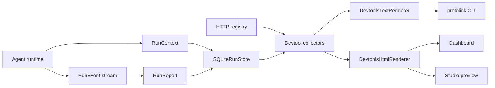
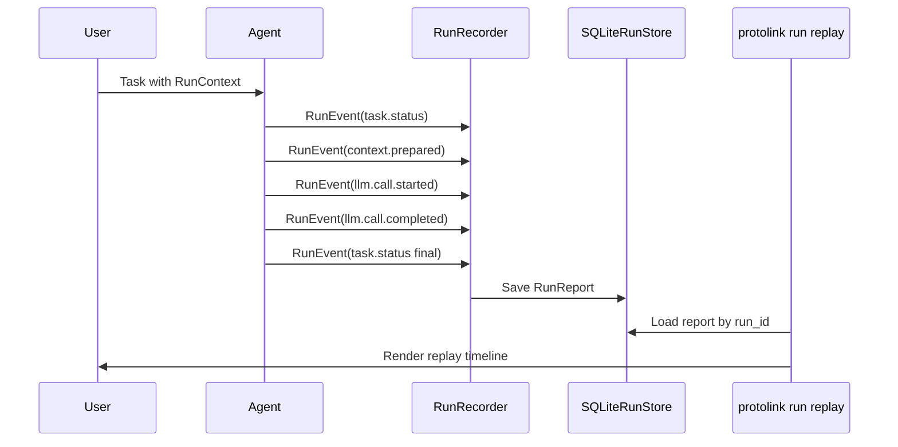

import ApiSurface from '@site/src/components/ApiSurface';

# Developer Tools

Protolink includes local devtools for the same runtime contracts that power agents in production: `RunContext`, `RunEvent`, `RunReport`, registry discovery, and the SQLite `RunStore`. The tools are intentionally dependency-light and application-neutral. They inspect what your agents already emit instead of inventing a separate tracing format.

The important idea is that devtools are not a separate observability product bolted onto the framework. They are a small projection layer over Protolink's core design: an agent is an autonomous runtime entity, and its execution can be described through typed context, events, reports, registry cards, and stored task state.

The current surface has four command groups plus one disabled dashboard preview:

- `protolink doctor` checks local installation, optional extras, run-store readability, and optional agent/registry endpoints.
- `protolink registry list` and `protolink registry inspect` inspect a running HTTP registry.
- `protolink run list` and `protolink run replay` read durable task snapshots and run reports.
- `protolink dashboard` serves or writes a local HTML dashboard for runs and registry state, with a disabled Studio preview tab.

## When To Use Each Tool

| Tool | Use it when | Reads from | Executes agent code? |
| --- | --- | --- | --- |
| `doctor` | You want to confirm installation, optional extras, store readability, or live endpoints. | Python environment, optional HTTP endpoints, optional SQLite file. | No |
| `registry list` | You want to see what agents a registry currently advertises. | Registry `/agents/` endpoint. | No |
| `registry inspect` | You want one full agent card by name or URL. | Registry `/agents/` endpoint. | No |
| `run list` | You need recent task snapshots and run-report IDs. | `SQLiteRunStore`. | No |
| `run replay` | You need a readable timeline for a stored run. | `SQLiteRunStore`. | No |
| `dashboard` | You want a local visual summary of registry and run-store state. | Registry and/or `SQLiteRunStore`. | No |
| Dashboard Studio preview | You want to see where the future topology canvas will live. | Starter blueprint preview. | No |

Because these commands do not execute stored runs, they are safe to use while debugging production-like traces, copied SQLite files, or CI artifacts. They inspect runtime records; they do not re-call tools, re-run prompts, or contact model providers.

## Why This Exists

Agents are autonomous runtime entities in Protolink. You plug in an LLM, tools, telemetry, storage, policy, transport, and registry participation. Once those modules are attached, the runtime emits enough structured data for command-line inspection and UI projection:



This keeps devtools modular: a CLI can render text, a notebook can call the collectors directly, and a web surface can reuse the same HTML renderer without coupling to private agent internals.

## The Runtime Data Model

The devtools become useful because Protolink separates runtime facts into stable layers:

- `AgentCard` describes identity and capability: name, URL, transport, skills, tags, role, auth, and metadata.
- `RunContext` describes one logical execution boundary: run ID, session ID, trace ID, workspace URI, parent run, agent chain, permissions, budgets, and cancellation state.
- `RunEvent` describes one point in execution: task status, context preparation, LLM call start/completion, tool action, policy decision, approval, artifact, delegation, budget warning, or final result.
- `RunReport` turns a sequence of `RunEvent` objects into a durable summary suitable for replay, tests, dashboards, and support bundles.
- `SQLiteRunStore` persists task snapshots and run reports in a local database with searchable indexes.

The CLI and dashboard sit above these layers. They do not need to know whether the agent used OpenAI, Anthropic, Ollama, a mock model, runtime transport, HTTP, WebSocket, or a custom tool implementation. As long as the runtime emits and stores the public contracts, devtools can inspect the result.



This is also why the tooling scales from simple scripts to larger systems. A local script can write one `runs.db`; a hosted application can implement the same `RunStore` protocol against another backend later; a separate dashboard can reuse the collector and renderer patterns.

## Doctor

Run the local readiness checks:

```bash
protolink doctor
```

The default report checks:

- The installed Protolink version.
- Optional HTTP modules used by HTTP, SSE, and WebSocket development.
- Optional LLM provider SDKs.
- Optional metrics dependencies such as token estimators.
- Optional telemetry integrations.

Emit JSON for scripts or CI:

```bash
protolink doctor --json
```

Use JSON when the output will be read by a script. For example, a project-specific CI check can treat `error` as a failure while allowing `warn` if the project does not require every optional extra.

Probe an agent, registry, and run store:

```bash
protolink doctor \
  --agent-url http://127.0.0.1:8010 \
  --registry-url http://127.0.0.1:9010 \
  --store runs.db
```

Doctor reports missing optional extras as warnings, because core Protolink remains usable without every LLM, telemetry, metrics, or HTTP dependency installed. Endpoint probe failures are errors, since the user explicitly asked to verify those endpoints.

Interpreting the result:

- Missing `http extra` means local HTTP/WebSocket registry or agent serving may not work, but runtime/in-process agents can still work.
- Missing `llm api extras` means provider SDK clients are unavailable, but mock models, local server clients, or tool-only agents may still work depending on your install.
- Missing `metrics extra` means token estimates are more approximate.
- Missing `telemetry extras` means external telemetry sinks are unavailable, but local tracing and run reports can still be used.
- A run-store warning usually means no run database has been created yet, or the file is not a Protolink `SQLiteRunStore`.

## Registry Inspection

List agents from a running registry:

```bash
protolink registry list --url http://127.0.0.1:9010
```

This returns the registry's current advertised agent cards. It is the quickest way to verify that registration worked and that the registry is exposing the URL/capability data other agents will use for discovery.

Filter by discovery fields:

```bash
protolink registry list --url http://127.0.0.1:9010 --role orchestrator --tag research
```

Inspect one agent by name or URL:

```bash
protolink registry inspect planner --url http://127.0.0.1:9010
```

The registry commands currently target HTTP(S) registry URLs, which matches the standard local development and dashboard workflow.

Registry inspection is especially useful before delegation. If an agent is expected to call a peer, the caller needs a usable peer card: URL, transport, skills, capabilities, and any auth metadata. Looking at that card from the CLI catches many integration mistakes before the model or agent logic is involved.

Use `--json` when you need the full card. The table output is intentionally concise; it is for scanning, not for preserving every field.

## Run Store Replay

Persisted runs come from `SQLiteRunStore`, `RunRecorder`, and `RunReport`. List recent records:

```bash
protolink run list --store runs.db
```

The output has two sections:

- **Recent task snapshots**: final or intermediate serialized `Task` records.
- **Recent run reports**: durable summaries built from normalized runtime events.

Task snapshots are useful for "what state did this task end in?" Run reports are useful for "how did the task get there?"

Replay a run report or task snapshot:

```bash
protolink run replay run_devtools_demo --store runs.db
```

`run replay` prefers a full `RunReport` when one exists. If only a task snapshot is available, it falls back to a one-item task timeline. This makes the command useful both for rich recorded runs and for simpler applications that only persist final task state.

A good replay should answer questions such as:

- Did the task move through the expected lifecycle states?
- Was a `RunContext` attached with the expected run/session/trace IDs?
- Did the runtime prepare the expected amount of context before the LLM call?
- Which LLM provider/model was called?
- Did a budget warning or policy decision happen before an action?
- Did the agent produce artifacts or a final task state?

Replay is not deterministic re-execution. It is a read-only reconstruction of recorded facts. That distinction is important for debugging: you can inspect a run without causing side effects, making provider calls, or repeating tool actions.

## Dashboard

Serve the local dashboard:

```bash
protolink dashboard --store runs.db --registry-url http://127.0.0.1:9010 --open
```

Write a static HTML snapshot instead:

```bash
protolink dashboard --store runs.db --output dashboard.html
```

<figure className="doc-media-frame">
  
</figure>

The dashboard is deliberately small: no build step, no frontend dependencies, and no telemetry upload. It serves a local page with branded navigation, top-level cards for agents/tasks/reports/store state, registry agents, agent health probes, a chat panel for HTTP LLM agents, run replay, and a disabled Studio preview tab. The JSON endpoint at `/api/snapshot` uses the same collector as static rendering.

Use the served dashboard when you want live refresh against a local registry or run store. Use `--output` when you want a portable snapshot for a demo, issue, notebook, or support handoff.

The distinction between served and static mode matters:

- Served mode can refresh `/api/snapshot`, replay runs through `/api/runs/{run_id}`, ping HTTP agents through `/api/agents/ping`, and proxy chat messages through `/api/agents/chat`.
- Static mode embeds the current snapshot in the HTML file. It is excellent for demos and handoffs, but live actions such as ping, chat, and replay need the local dashboard server.

The dashboard currently focuses on:

- High-level counts for agents, task snapshots, reports, and store availability.
- A registry-first dashboard body and second-position Registry tab, because discovery and live agent health are usually the most important development questions.
- Task/report tables in the Runs tab, where they sit next to replay controls instead of competing with registry health.
- Registry card summaries with selected-agent details, transport badges, capability badges, schemas, and security metadata.
- Ping controls for HTTP agents with latency/status feedback.
- A chat panel for agents that advertise `capabilities.has_llm=true` and expose the standard `POST /chat` endpoint.
- Chat-side diagnostics for served dashboards: last response latency, average latency, message count, active session ID, and last proxy/agent error.
- A chat reset control that clears the visible conversation, starts a fresh dashboard session ID, and resets the local latency/debug counters.
- Run replay buttons that load the same replay projection used by `protolink run replay`.
- A disabled Studio preview for the future topology canvas.

It intentionally avoids provider-specific visualizations. Provider details belong in the structured run events and reports; the dashboard should remain generic enough for any Protolink agent system.

The chat panel is meant for fast local probing, not for becoming a production chat product. Select an HTTP LLM agent from the registry, keep or edit the session ID, and send a message through the dashboard proxy. Pressing Enter submits the message, while Shift+Enter keeps editing a multi-line prompt. The Debug toggle opens a small live diagnostics strip so you can see whether a slow response is coming from the dashboard proxy, the agent endpoint, or the model/tool path behind that agent.

Agent health indicators follow the same idea as the terminal renderers: runtime-only agents are clearly marked as local/runtime, unprobed HTTP agents stay unknown, active probes show a pending state, successful probes show online latency, and failed probes show the last error. Transport and capability fields are rendered as badges so the registry can be scanned quickly without reading a dense JSON card. When an HTTP agent's status page exposes a start timestamp, the dashboard can also show uptime after the agent is pinged.

The selected-agent panel is intentionally more than a name/URL preview. It shows role, version, protocol, transport, input/output formats, security schemes, capability flags, tags, skills, and advertised input/output schemas for each skill. The dashboard overview points users to this Registry tab instead of duplicating a Details button in the landing table. Empty schema sections are explicit so users can tell the difference between "not advertised" and a dashboard loading issue.

## Protolink Studio Preview

Studio is currently disabled. It remains visible as a locked dashboard tab so users can see the direction without mistaking it for a supported public API.

There is no standalone `protolink studio` command. The future Studio should return only when the blueprint format, scaffold generation, and execution boundaries are stable enough to document as a real user-facing workflow.

The Studio model is intentionally simple:

- **Agent nodes** represent autonomous runtime entities.
- **LLM nodes** represent model backends or model configuration.
- **Tool nodes** represent native tools, MCP adapters, or external actions.
- **Registry nodes** represent discovery boundaries.
- **Edges** represent ownership, dependency, discovery, or intended call paths depending on how you use the blueprint.

That simplicity is useful as a preview. It lets Protolink present the design philosophy visually without forcing users into a heavy project format. A future generator can interpret the same blueprint more strictly when Studio is promoted from preview to tool.

Typical uses:

- Show where the topology canvas will live inside the dashboard.
- Explain how an agent plugs into LLMs, tools, telemetry, registry, and storage.
- Keep the future structured-flow or scaffold-generator direction visible.

## Renderer APIs

The UI pieces live in `protolink.utils.renderers.devtools`:

<ApiSurface
  eyebrow="Developer tooling module"
  title="Devtools Renderers"
  path="protolink.devtools"
  description="The collector and renderer API for local dashboards, run replay, registry inspection, chat probes, terminal summaries, and application-specific debug panels."
  pills={[
    "Dashboard snapshots",
    "HTML renderer",
    "Text renderer",
    "Run replay",
    "Agent probes",
  ]}
  cards={[
    {
      title: "Collect",
      text: "Build plain dashboard and run-replay data structures from local run stores and registry state.",
      code: "build_dashboard_snapshot()",
    },
    {
      title: "Render HTML",
      text: "Produce standalone dashboard pages for notebooks, local tools, or embedded developer portals.",
      code: "DevtoolsHtmlRenderer",
    },
    {
      title: "Render text",
      text: "Format terminal-friendly run lists, replay output, and inspection summaries.",
      code: "DevtoolsTextRenderer",
    },
    {
      title: "Probe agents",
      text: "Ping and chat with public HTTP agent endpoints without coupling the renderer to network behavior.",
      code: "ping_agent()",
    },
  ]}
/>

```python
from protolink.devtools.server import build_dashboard_snapshot
from protolink.devtools import chat_with_agent, ping_agent
from protolink.utils.renderers.devtools import DevtoolsHtmlRenderer, DevtoolsTextRenderer

snapshot = build_dashboard_snapshot(store_path="runs.db")
html = DevtoolsHtmlRenderer().render_dashboard(snapshot)
text = DevtoolsTextRenderer().render_run_list(snapshot["runs"])

probe = ping_agent("http://127.0.0.1:8010")
reply = chat_with_agent("http://127.0.0.1:8010", "hello", session_id="docs")
```

Use `DevtoolsTextRenderer` for terminals and logs. Use `DevtoolsHtmlRenderer` for static pages, local dashboards, notebooks, or application-specific developer portals.

The collectors and renderers are separate on purpose:

- Collectors such as `build_dashboard_snapshot()`, `list_run_store_records()`, and `build_run_replay_view()` return plain dictionaries or small dataclasses.
- Agent actions such as `ping_agent()` and `chat_with_agent()` call public HTTP agent endpoints. They are deliberately separate from the renderer so applications can reuse them in their own debug panels.
- Text renderers turn those structures into terminal-friendly tables.
- HTML renderers turn those structures into standalone dashboard pages with registry health, chat, run replay, and the disabled Studio preview included.

This separation keeps the public API simple. You can replace the renderer without replacing the collectors, or use the collectors inside your own app while keeping Protolink's CLI behavior unchanged.

For example, a custom app can reuse the same run replay projection:

```python
from protolink.devtools import build_run_replay_view

view = build_run_replay_view("runs.db", "dashboard_demo_1")
for item in view.items:
    print(item.event_type, item.summary)
```

## Provider-Free Example

The example script creates several mock-LLM agents, registers their cards in an in-process registry, runs a small task loop, saves reports to SQLite, and writes dashboard HTML:

```bash
python examples/devtools_dashboard.py --output-dir .protolink-devtools
protolink run list --store .protolink-devtools/runs.db
protolink run replay dashboard_demo_1 --store .protolink-devtools/runs.db
protolink dashboard --store .protolink-devtools/runs.db --open
```

Because it uses `create_llm("mock")`, it does not need provider credentials. The static dashboard HTML generated by the example also includes the demo registry snapshot. The default demo agents use `RuntimeTransport`, so the dashboard shows them as runtime agents.

To click the dashboard ping and chat controls, run the same example in live HTTP mode:

```bash
python examples/devtools_dashboard.py --output-dir .protolink-devtools --serve-live
```

Live mode starts provider-free HTTP agents, an HTTP registry, and the local dashboard. It still records the same task loop to `SQLiteRunStore`, but now the registry advertises HTTP agent URLs that the dashboard can probe and chat with.
