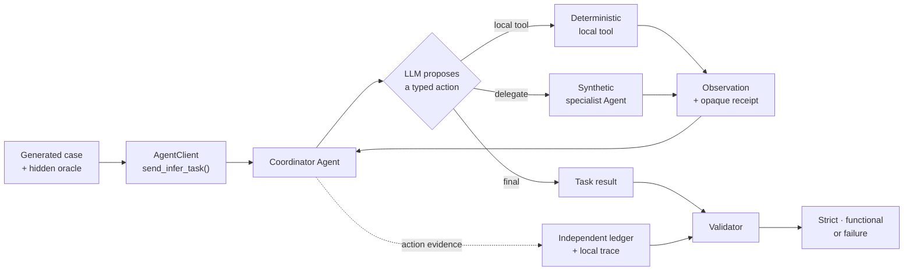

import ApiSurface from '@site/src/components/ApiSurface';

# Infer-loop benchmark

This benchmark is a repeatable health check for ProtoLink's infer loop. Run the
same task suite before and after a prompt or code change to see whether Agents
complete more tasks correctly—and whether they do it faster.

The infer loop turns each model response into one validated next action: **finish
with an answer**, **call a local tool**, or **delegate work to another Agent**.
This repository benchmark lets you change that loop or its prompts and answer a
practical question with comparable evidence:

> Did the model complete more tasks correctly, recover less often, and finish
> faster than it did before?

<ApiSurface
  eyebrow="Project regression harness"
  title="Turn infer-loop changes into comparable evidence"
  ariaLabel="Infer-loop benchmark overview"
  path="benchmarks/infer_loop"
  description="Run generated tasks through the real AgentClient → Agent → LLM path, validate every action against deterministic evidence, and export correctness and timing results."
  pills={[
    "12-case smoke",
    "40-case core",
    "200-case full",
    "Ollama-first",
    "JSON + CSV evidence",
  ]}
  cards={[
    {
      title: "Execute",
      text: "Send real infer tasks through an in-process multi-agent mesh.",
      code: "AgentClient.send_infer_task()",
    },
    {
      title: "Prove",
      text: "Check the final answer, independent execution ledger, runtime trace, and protocol path.",
      code: "oracle + ledger + trace",
    },
    {
      title: "Measure",
      text: "Keep correctness separate from first-try reliability, latency, and cache-sensitive repeats.",
      code: "STRICT · FIRST TRY · timing",
    },
    {
      title: "Compare",
      text: "Match a candidate run to a saved baseline and identify fixed or regressed cases.",
      code: "--baseline summary.json",
    },
  ]}
  note="The harness lives outside the installable protolink package on purpose: it is source-checkout development tooling, not public runtime API or a dependency shipped to users."
/>

<div className="doc-button-row">
  <a className="doc-button primary" href="#quick-start">Run a smoke check</a>
  <a className="doc-button" href="#compare-before-and-after">Compare a baseline</a>
  <a className="doc-button" href="#how-one-case-works">See how validation works</a>
</div>

:::tip[The short version]

Use `smoke` while editing, `core` for routine before/after comparisons, and
`full` for a fixed 200-case baseline. Treat `STRICT` as the headline
correctness score and compare timing only between controlled runs on the same
machine.

:::

## How one case works

The task catalog, synthetic specialist data, receipts, and validation oracle
are deterministic for a given seed. The provider and model are not guaranteed
to be deterministic, even with temperature zero. The benchmark controls the
world around the model so that its decisions can be judged exactly.



The real ProtoLink path and the controlled benchmark world have different
jobs:

| Part | What happens in the benchmark |
| --- | --- |
| **Real runtime path** | `AgentClient`, `Task`, coordinator `Agent`, provider adapter, LLM infer loop, tool registry, delegation, runtime events, and telemetry execute normally. |
| **Controlled specialists** | `workspace_agent`, `travel_agent`, and `oracle_agent` return deterministic closed-world values. |
| **Controlled tools** | Coordinator and specialist tools do no external work; they return repeatable results and opaque `BENCH-...` receipts. |
| **In-process transport** | `RuntimeTransport` exercises task serialization, registry discovery, Agents, and tools without adding network variability. |
| **Independent judge** | A hidden oracle knows the exact final text and expected action sequence. The execution ledger and local trace prove what actually ran. |

### A concrete multi-step case

<div className="doc-quote-card">
  <div className="quote-mark">↳</div>
  <div className="quote-body">
    First delegate <code>travel_agent.get_weather</code>. Then call
    <code>travel_agent.quote_hotel</code> and pass the exact weather receipt
    from step one. Return both values and both receipts in the requested format.
  </div>
  <div className="quote-source">Representative generated benchmark instruction</div>
</div>

The model sees the instruction and typed capabilities, but it does **not** see
the receipt that the specialist will generate.

1. The coordinator must select the correct Agent, tool, and typed arguments.
2. The specialist returns an authoritative observation such as a temperature
   and an opaque `BENCH-WX-...` receipt.
3. The coordinator must copy that exact receipt into the dependent hotel call.
4. The final answer must exactly match the hidden oracle.
5. The ledger and trace must show those two successful actions in the correct
   order.

Inventing a plausible answer, fabricating a receipt, or merely claiming that an
Agent was called cannot pass these checks.

## Quick start

### 1. Prepare the checkout and model

Run the benchmark from the repository root. Install ProtoLink in editable
development mode, start Ollama, and make sure the requested model is present:

```bash
uv pip install -e ".[dev]"
ollama pull gemma4:e4b
```

The benchmark imports the source and prompt files in this checkout. It is not
installed as part of the published `protolink` package.

### 2. Run the smoke suite

```bash
python -m benchmarks.infer_loop \
  --provider ollama \
  --model gemma4:e4b \
  --suite smoke
```

For Ollama, the base URL resolves from `--base-url`, then `OLLAMA_URL`, then
`http://localhost:11434`. Defaults are chosen for repeatable local comparison:
temperature `0`, model seed `1337`, context size `8192`, generation limit
`2048`, JSON-prompt action mode, and one unscored warm-up.

:::note[JSON-prompt mode is part of the experiment]

Ollama uses ProtoLink's portable JSON action protocol by default. Use
`--supports-tool-calling` only for a model with compatible native tool support.
Native-tool and JSON-prompt runs are different configurations and should not be
mixed in one before/after comparison.

:::

### 3. Read the terminal summary

The final block follows this shape; the numbers below are illustrative:

```text
STRICT     10/12 (83.3%)
FUNCTIONAL 11/12 (91.7%)
FIRST TRY  9/12 (75.0%)
RESCUED ON LATER ATTEMPT 1
ATTEMPT DIAGNOSTICS parse-recovery=1 hallucinated-action=1 crashed=0 timed-out=0
LLM STEPS avg=2.25 p95=4; STRICT FIRST-TRY LATENCY median=1.84s p95=3.71s
WALL TIME  scored=29.40s warmup=1.20s; LLM CALLS median=0.78s
RESULTS    benchmark_results/20260728-143000
```

- `STRICT` is the headline score: correct task, exact actions, and a clean
  protocol path.
- `FUNCTIONAL` includes cases that reached the correct result after infer-loop
  self-correction.
- `FIRST TRY` counts logical cases whose first fresh attempt passed strictly.
- `WALL TIME` is elapsed time for the scored suite; warm-up is reported
  separately.
- `REPEAT PROBE` appears when eligible adjacent repetitions exist.
- `RESULTS` points to the directory containing the detailed evidence.

### Choose a suite

| Suite | Default cases | Best use |
| --- | ---: | --- |
| `smoke` | 12 | Fast feedback while editing a prompt or the infer loop |
| `core` | 40 | Routine before/after development comparison |
| `full` | 200 | Slower release check or long-lived regression baseline |

`full` produces a denominator of 200 only with one repetition and without
filters, `--limit`, or a `--count` override. The catalog and order are generated
deterministically from `--seed`.

## What the catalog tests

Each case asks the coordinator to demonstrate one or more infer-loop skills.

| Category | Skill under test | A failure usually means |
| --- | --- | --- |
| `direct_final` | Finish without unnecessary actions and match exact output | The model called a tool, delegated, or changed the requested answer |
| `local_tool` | Select a coordinator-owned tool and provide typed arguments | Wrong tool, invalid arguments, or invented output |
| `delegated_tool` | Select the correct Agent, remote tool, and arguments | Hallucinated Agent/tool, bad routing, or mismatched arguments |
| `delegated_infer` | Delegate inference with all required prompt evidence | Missing evidence, wrong specialist, or fabricated result |
| `multi_step` | Use one action's receipt in a later dependent action | Wrong order or failure to carry authoritative evidence forward |
| `grounding_trap` | Reject stale/untrusted prompt values in favor of an observation | The model repeated the trap instead of using the tool or Agent result |

Here, a **hallucinated action** has a narrow, testable meaning: an invalid or
unexpected tool/Agent attempt, an action absent from the expected ledger, a
fabricated receipt, or a grounding-trap mismatch. The benchmark does not judge
the truth or writing quality of arbitrary open-domain prose.

## Read the score correctly

<div className="benchmark-score-grid">
  <div className="benchmark-score-card benchmark-score-card--strict">
    <span className="benchmark-score-kicker">Headline regression signal</span>
    <strong>STRICT</strong>
    <span className="benchmark-score-example">180 / 200</span>
    <p>Exact final output, exact action evidence, and no protocol recovery or invalid action.</p>
  </div>
  <div className="benchmark-score-card benchmark-score-card--functional">
    <span className="benchmark-score-kicker">Eventual task success</span>
    <strong>FUNCTIONAL</strong>
    <span className="benchmark-score-example">≥ strict</span>
    <p>The answer and executed actions are correct, even if the infer loop had to self-correct.</p>
  </div>
  <div className="benchmark-score-card benchmark-score-card--first">
    <span className="benchmark-score-kicker">Fresh-attempt reliability</span>
    <strong>FIRST TRY</strong>
    <span className="benchmark-score-example">attempt 1</span>
    <p>The first fresh attempt passed strictly, so extra attempts cannot hide instability.</p>
  </div>
</div>

The denominator is:

```text
selected cases × repetitions
```

Therefore, `180/200` means 180 logical case repetitions achieved a strict pass.
It does **not** mean 180 provider calls succeeded. One logical case may require
multiple LLM calls, and `--attempts` may execute the task again.

### The four proof gates

A strict pass requires all four gates:

| Gate | What must be true |
| --- | --- |
| **Task result** | The task completed without a crash or timeout and `infer_output` exactly matched the deterministic oracle. |
| **Execution ledger** | Exactly the expected tools and Agents ran, with the expected arguments and action order. |
| **Runtime trace** | The local trace independently contains the same successful actions and targets. |
| **Clean protocol** | There was no parse recovery, duplicate action, invalid tool, or invalid Agent attempt. |

:::info[Worked recovery example]

Suppose the model first delegates to an Agent that does not exist. The infer
loop reports the error, the model retries with the correct Agent, and the task
finishes with the exact expected answer and action evidence.

- `FUNCTIONAL`: **pass**
- `STRICT`: **fail**, because the protocol path included an invalid Agent
  attempt
- `FIRST TRY`: depends on whether this was the first *fresh task attempt* and
  whether that attempt passed strictly; infer-loop correction inside it does
  not create another fresh attempt

:::

## Choose what you are measuring

Attempts, repetitions, parse corrections, and provider retries answer different
questions:

| Control or metric | What it changes | What it tells you |
| --- | --- | --- |
| `--attempts N` | Allows up to `N` fresh tasks per logical case, stopping after its first strict pass | How often a later clean run rescues a case |
| `--repetitions N` | Runs each selected case `N` times adjacently and scores every repetition | Reliability and a cache-sensitive repeat signal |
| `--max-parse-failures N` | Sets the action-envelope correction budget inside one fresh attempt | Whether the infer loop can recover from malformed model output |
| Provider retries | Repeats one physical provider request after a transient error | Infrastructure reliability; reported separately |
| `llm_steps` | Counts action proposals inside an attempt | How much infer-loop work the model needed |

For example, `40 cases × 3 repetitions = 120` scored logical results.
`--attempts 2` does not change that denominator; it only permits a second fresh
task when the first one did not pass strictly, so the number of executed
attempts and provider calls can be higher.

Use one attempt when measuring pure pass-at-one reliability. Use multiple
attempts when you also want to know whether failures are recoverable. Use at
least two repetitions for the repeat/cache probe.

## Timing and prompt-cache signals

Correctness and speed are separate outputs. A faster wrong answer never
improves `STRICT`.

| Metric | Interpretation |
| --- | --- |
| `scored_wall_ms` | Elapsed wall time for scored tasks only; preflight, mesh startup, warm-up, and teardown are separate |
| Attempt end-to-end | Complete task latency, including infer-loop and deterministic Agent/tool work |
| LLM latency | Sum of completed logical model-call latency inside an attempt |
| `non_llm_latency_ms` | End-to-end minus LLM latency, only when every started provider call completed |
| Strict first-try median / p95 | Typical and tail latency among clean first attempts |
| Ollama prompt-eval / eval / load | Provider-reported phase durations in nanoseconds, converted to milliseconds |
| Repeat speedup | Positive means the later adjacent repetition was faster; negative means it was slower |
| Baseline `median-delta` | Current minus baseline in milliseconds; positive is slower and negative is faster |

Runner-side wall, attempt, and logical-call durations use Python's monotonic
`time.perf_counter` clock. Ollama's load, prompt-evaluation, generation, and
total durations come from Ollama. All exported timing fields are normalized to
milliseconds.

If a call times out or fails while in flight, `non_llm_latency_ms` is left
unavailable. This prevents provider wait time from being mislabeled as
non-model runtime overhead.

### Measure the repeat signal

```bash
python -m benchmarks.infer_loop \
  --provider ollama \
  --model gemma4:e4b \
  --suite core \
  --repetitions 3 \
  --warmup 1 \
  --run-name prompt-before
```

Identical case repetitions run next to each other. The repeat probe pairs only
retry-free strict first attempts with the same number of model calls. It
reports median end-to-end, model, first-call, and prompt-evaluation speedups
when the required data exists.

The first-call comparison is the cleanest controlled prompt signal because
equivalent repetitions begin with equivalent provider inputs. Whole-attempt
timing also contains the model-generated action history from later infer-loop
calls.

:::caution[Cache-sensitive does not mean cache-confirmed]

Ollama exposes prompt-evaluation and load timing, but not an unambiguous cache
hit flag. A faster repeated prompt is useful evidence, not proof that a
particular request hit a cache. Small suites are noisy: use `core` or `full`,
repeat controlled runs, and compare on the same machine under similar load.

The default unscored Ollama warm-up is one direct-final task. Its outcome and
timing are recorded. `--warmup 0` is only a cold-ish measurement because the
runner cannot unload an Ollama model or clear the server cache.

:::

## Compare before and after

Treat the comparison as a controlled experiment. Keep the machine, model
build, provider URL, generation settings, suite, seed, filters, ordering,
attempts, repetitions, action mode, timeout, and warm-up constant. Change only
the prompt or infer-loop behavior you intend to evaluate.

### 1. Record the baseline

```bash
python -m benchmarks.infer_loop \
  --provider ollama \
  --model gemma4:e4b \
  --suite core \
  --seed 1337 \
  --attempts 2 \
  --repetitions 2 \
  --run-name infer-before
```

### 2. Run the candidate against it

```bash
python -m benchmarks.infer_loop \
  --provider ollama \
  --model gemma4:e4b \
  --suite core \
  --seed 1337 \
  --attempts 2 \
  --repetitions 2 \
  --run-name infer-after \
  --baseline benchmark_results/infer-before/summary.json
```

The report shows strict-score delta, fixed and regressed logical cases, and
paired timing deltas for retry-free strict first attempts that exist in both
runs. Model and prompt-evaluation pairs also require the same infer-loop call
count.

A **performance-fingerprint warning** means a timing-relevant setting or
warm-up outcome differs, so timing deltas are not directly comparable. Prompt
hashes may differ—that is expected when the prompt is the variable under test.
Case identity may not differ: the suite hash and logical case keys must match.

### Test a prompt file without editing benchmark source

```bash
python -m benchmarks.infer_loop \
  --provider ollama \
  --model gemma4:e4b \
  --suite core \
  --system-prompt-file ./candidate-infer-instructions.txt
```

`--system-prompt-file` replaces the benchmark's complementary coordinator
instructions. ProtoLink's internal action-format prompts are still constructed
by the infer loop. The report records separate prompt hashes so you can tell
which layer changed.

## Find the right artifact

Each run creates a child directory under `benchmark_results/`.
`--output-dir` changes the parent; `--run-name` gives the child a stable name
instead of the timestamped default.

```text
benchmark_results/<run-name>/
├── summary.json
├── results.csv
├── failures.csv
├── llm_calls.csv
└── traces.jsonl
```

| Open this file when you want to… | File |
| --- | --- |
| Read the headline, configuration, hashes, score distributions, repeat signal, or baseline comparison | `summary.json` |
| Triage cases that never achieved a strict pass | `failures.csv` |
| Analyze every executed fresh attempt, including later rescue attempts | `results.csv` |
| Inspect per-call latency, physical attempts, tokens, and provider timing/cache fields | `llm_calls.csv` |
| Audit the redacted runtime evidence used for validation | `traces.jsonl` |

The default `benchmark_results/` directory is ignored by Git so local model
runs do not pollute commits.

## Filtering and CI

List cases without contacting a provider:

```bash
python -m benchmarks.infer_loop \
  --suite core \
  --list-cases
```

Select categories or case-ID patterns with repeatable flags:

```bash
python -m benchmarks.infer_loop \
  --suite full \
  --category delegated_tool \
  --category multi_step \
  --case 'multi-step-*' \
  --limit 20
```

`--shuffle` changes the selected order deterministically with `--seed`. Record
the full command because seed, generated count, filters, and ordering define
suite identity.

For automation, `--fail-under 90` exits with status `2` when the strict
percentage is below the threshold, after artifacts are written. Infrastructure
failures exit `1`; interruption exits `130`.

For every provider option, output field, schema detail, and advanced example,
see the repository's
[detailed benchmark guide](https://github.com/nMaroulis/protolink/blob/main/benchmarks/infer_loop/README.md).

## Scope and limitations

- The benchmark validates closed-world action correctness, not open-domain
  factuality or prose quality.
- Runtime `output_schema` metadata is carried through the task but is not
  currently enforced by the infer loop; the benchmark therefore uses its own
  exact deterministic oracle.
- `RuntimeTransport` includes ProtoLink task serialization, registry,
  delegation, tools, telemetry, and infer-loop work, but excludes HTTP,
  WebSocket, gRPC, and real-network performance.
- Per-task timeouts are cooperative and best-effort. A blocking provider
  request or action already in progress may not stop exactly at the boundary.
- Model execution can vary even at temperature zero. Repetitions and controlled
  settings improve comparison quality but do not provide a statistical
  guarantee.
- The full suite may require many generations because delegated and multi-step
  cases use several infer-loop steps.

:::note[Use the score as a regression signal]

The benchmark is strongest when comparing two controlled runs of the same
catalog and model configuration. It is not a universal ranking of models,
providers, machines, or prompt quality.

:::
