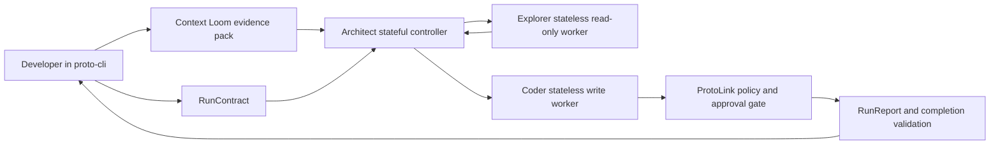

import ExampleArticle from '@site/src/components/ExampleArticle';

# ProtoAgent Case Study


<ExampleArticle
  source="Level Up Coding"
  title="Building My Own Local “Claude Code”: What I Learned Demystifying Agentic Coding under the Hood"
  description="When tools like Claude Code, Aider, Codex, Antigravity, Devin and more started popping up, my initial reaction as an AI engineer wasn’t just “Wow, this is cool” (which it is), it was “How does this actually work under the hood, and where does it fall apart?” especially for small models."
  href="https://levelup.gitconnected.com/building-my-own-local-claude-code-what-i-learned-demystifying-agentic-coding-under-the-hood-8772874b91b8"
  image="https://github.com/nMaroulis/protoagent/raw/main/misc/assets/banner.jpeg"
  imageAlt="Building My Own Local “Claude Code”"
/>

:::tip[ProtoLink in production]

ProtoAgent is a downstream application, not a competing runtime. ProtoLink is the engine underneath its agent deck: it owns delegation, capability policy, runtime events, approval-gated actions, history control, cancellation, reports, and replayable traces.

:::

:::info[Repository]

Source code: [nMaroulis/protoagent](https://github.com/nMaroulis/protoagent)

:::

:::info[Related article]

The Level Up Coding article [Building My Own Local "Claude Code": What I Learned Demystifying Agentic Coding under the Hood](https://levelup.gitconnected.com/building-my-own-local-claude-code-what-i-learned-demystifying-agentic-coding-under-the-hood-8772874b91b8) explains the practical lessons behind ProtoAgent: local model constraints, deterministic context retrieval, Rust-to-Python runtime boundaries, human approval before writes, and persistent conversation state.

:::

ProtoAgent is a full local-first coding assistant built on top of ProtoLink. It turns the ideas behind the [Code Assistant Example](code_assistant_example.md) into a complete developer tool with a Rust CLI/TUI, a Python core, local context indexing, policy-gated writes, completion validation, and runtime reports.

This page explains why ProtoAgent belongs in the ProtoLink examples: it is not a separate framework competing with ProtoLink. It is a downstream application that uses ProtoLink as the runtime engine for multi-agent coding workflows.

## CLI Demo

<figure className="doc-media-frame">
  
  <figcaption>
    The animation shows ProtoAgent handling a simple task. It starts with `/model`, where the CLI can switch freely between supported local and API-backed models. In this run, an already loaded Ollama Gemma e4b model is changed to `gpt-4o` to show API model support. The user then sends a task to add docstrings to a tagged file referenced with `@`. Context Loom builds a focused evidence pack from the repository, then passes the task and context to Architect. Architect knows the available agents through ProtoLink's A2A Registry, can ask Explorer for additional evidence, and delegates file modifications to Coder. Coder does not write immediately: its tools construct a typed write action with a unified-diff preview. ProtoLink's capability policy pauses the action, and the Rust CLI asks the user to approve or deny the change before anything touches the filesystem.
  </figcaption>
</figure>

## From Article Lessons To Runtime Shape

The article frames ProtoAgent as a lab for understanding what local agentic coding systems need around the model. The central lesson is that small local models do not become reliable because they receive more tools and a larger prompt. They become reliable when the surrounding runtime removes unnecessary choices and makes each step inspectable.

| Article lesson | ProtoAgent design | ProtoLink takeaway |
| --- | --- | --- |
| Avoid the "God Prompt" | Architect, Explorer, and Coder have separate roles and tool surfaces | Use multiple narrow agents instead of one overloaded agent |
| Deterministic context beats LLM search | Context Loom builds the first source-cited evidence pack | Let data structures do predictable retrieval before model reasoning |
| Decouple the brain from the face | Rust owns the terminal UX while Python owns ProtoLink orchestration | ProtoLink can be embedded behind any application interface |
| Human approval before side effects | Coder writes through diff-preview `RunAction` objects | Protect mutations with policy and approval contracts |
| Context size is a runtime budget | Context windows, prompt packs, and model profiles are explicit | Treat context as a resource, not an infinite scratchpad |
| Be lenient about formatting, strict about meaning | Structured output is parsed, repaired only when safe, then validated | Keep model responses behind typed runtime contracts |
| UI history is not model memory | `sessions.json` is the CLI timeline; ProtoLink SQLite stores model-facing history | Separate presentation state from agent conversation state |

The important design lesson is that a coding assistant should not be one giant script with one model and every tool. The model that reasons about changes should not automatically have the authority to write files. The worker that writes files does not need broad repository navigation. The coordinator should route work, preserve context, and keep the user-facing conversation coherent.

ProtoAgent applies those lessons with the runtime pieces a real CLI needs:

| Concern | Minimal code assistant | ProtoAgent |
| --- | --- | --- |
| User interface | Example script | Rust `proto-cli` with shell and TUI modes |
| Context discovery | Coder reads and searches files directly | Context Loom builds source-cited evidence packs |
| Coordinator | Orchestrator | Architect |
| Read worker | Coder read tools | Explorer, a stateless read-only worker |
| Write worker | Coder write tools | Coder, a stateless diff-producing worker |
| Safety | Workspace sandboxing | ProtoLink `CapabilityPolicy`, `RunAction`, approval requests, and diff preview artifacts |
| Completion | Model produces final text | RunContract validates whether required workers and artifacts appeared |
| Runtime state | Task history | ProtoLink `RunContext`, `RunEvent`, cancellation, budgets, reports, and replayable traces |
| Model memory | Ad hoc prompt history | ProtoLink per-agent conversation storage and compaction |

## ProtoAgent Runtime Topology

ProtoAgent exposes one assistant to the developer, but internally it runs a small agent deck:



### Architect

Architect is the stateful controller. It receives the user request, sees the current Context Loom evidence, maintains durable conversation memory, and delegates to workers through ProtoLink. It does not receive direct workspace read or write tools.

That boundary matters. Architect can coordinate and explain, but it cannot silently mutate the repository. When it needs ground truth, it asks Explorer. When it needs a patch, it asks Coder.

### Explorer

Explorer is the stateless read-only worker. It can list files, read files with line numbers, search with regex, inspect git status, and build a focused Context Loom pack. It returns compact, source-cited evidence for the current run.

Explorer does not keep durable conversation memory. Every call must be understandable from the current task, the workspace boundary, and the evidence it receives. This makes it easier to run with smaller local models because the worker prompt stays narrow.

### Coder

Coder is the stateless write worker. It prepares file changes as unified diffs or new-file artifacts. Its write tools declare a workspace write capability, so ProtoLink can turn the operation into a `RunAction`, attach a `text/x-diff` preview, request approval from the application, and only execute after an approving `ApprovalDecision`.

Coder is not the broad search agent. It should receive a localized objective, relevant evidence, and acceptance criteria from Architect and Explorer. That keeps write behavior focused and auditable.

## Why This Is A ProtoLink Example

ProtoAgent is useful for the ProtoLink docs because it shows the runtime primitives working together in a familiar, high-pressure domain: code modification.

| ProtoLink feature | How ProtoAgent uses it |
| --- | --- |
| `Agent` | Builds the Architect, Explorer, and Coder roles as separate runtimes |
| Agent delegation | Architect calls Explorer and Coder instead of embedding every tool |
| LLM integration | Each LLM-capable role can use the selected local or API model |
| Tool capabilities | Read and write tools declare capabilities such as `workspace.read` and `workspace.write` |
| `CapabilityPolicy` | Read operations can be allowed while writes require approval |
| `RunAction` | File writes become concrete, inspectable action intents before execution |
| `Artifact` | Diff previews are attached as `text/x-diff` artifacts |
| `RunContext` | Session, trace, workspace, permission, budget, and metadata travel with the task |
| `RunEvent` | The CLI can render progress, policy checks, approvals, and runtime status |
| `RunReport` | Completed runs can be inspected, tested, replayed, and redacted |
| State APIs | Architect conversation history can be described, compacted, or reset |

The article's core lesson is that the model is only one component. ProtoAgent shows that lesson under production pressure: a real terminal tool needs approval gates, cancellation, state compaction, context budgets, structured output validation, and a way to prove that a write task did more than produce confident prose.

## The Completion Guard

The most important difference between a demo and a tool is that the runtime must be allowed to say "not complete."

Before a ProtoAgent run starts, the core infers a small RunContract from the original request. For a workspace-change task, completion requires one of these terminal conditions:

1. Coder delegation happened.
2. A write approval request or diff preview artifact exists.
3. The model reported an explicit blocker.

If the model answers a write request with prose but never reaches Coder, approval, a diff preview, or a blocker, ProtoAgent returns the run as incomplete. This is intentionally outside the prompt. The model proposes actions; the ProtoLink-powered runtime validates whether the trace satisfied the contract.

That pattern is broadly reusable. Any ProtoLink application can define domain-specific completion contracts: a support agent must cite a ticket, a data agent must attach a query result, a browser agent must produce a screenshot, or a deployment agent must emit a policy-reviewed change plan.

## Context Loom And Smaller Models

ProtoAgent is designed for local-first coding, so it cannot assume a frontier model with a massive context window. Context Loom gives the agent deck a deterministic context layer before the model starts wandering through tools.

A Context Loom pack contains source-cited evidence such as relevant files, snippets, symbols, import hints, headings, git status, and inclusion reasons. Architect can use the pack directly, Explorer can refine it, and Coder can receive only the evidence needed for a patch.

This keeps the architecture compatible with smaller local models:

- The coordinator sees a compact map instead of the whole repository.
- Read and write workers get narrow tasks instead of a giant universal prompt.
- Prompt profiles can scale from local 7B or 8B models to stronger API models without changing the safety boundary.
- The runtime, not the model, owns policy, approval, cancellation, budgets, and completion validation.

## Rust Face, Python Brain

The article also highlights an application architecture lesson: the user interface and the agent runtime can evolve independently.

In ProtoAgent, Rust owns the terminal face: rendering, keyboard input, project selection, progress indicators, context meters, and approval dialogs. Python owns the brain: model configuration, prompts, repository context, conversation state, agent routing, and tool policies. PyO3 connects them so the Rust binary can call the Python core directly.

Long-running local model calls can take seconds or minutes, so ProtoAgent uses a small file-based control surface between the Rust UI loop and the embedded Python runtime. Python appends normalized run events to a temporary JSONL progress file. Rust polls it while keeping the TUI responsive, renders approval requests, writes correlated approval decisions, and can signal cancellation.

This local IPC layer is deliberately boring. ProtoLink still owns the agent runtime, task flow, policies, and events; the files are only the application bridge that lets one embedded CLI stay interactive while Python is busy.

## Memory And State

The article makes a useful distinction that applies to many ProtoLink applications:

| State surface | ProtoAgent location | Purpose |
| --- | --- | --- |
| CLI timeline | `~/.protoagent/sessions.json` | Human-facing project history, answer previews, approvals, timings, and run events |
| Model-facing memory | `~/.protoagent/conversations.sqlite` | ProtoLink conversation state for agent continuity |
| Runtime trace | ProtoLink `RunEvent` and `RunReport` records | Inspectable execution evidence for UIs, tests, replay, and debugging |

This distinction prevents a common bug in agent applications: assuming that anything displayed in the UI is automatically available to the model. ProtoAgent keeps the user timeline and the agent conversation state separate, then uses ProtoLink state APIs to describe, compact, or reset model-facing history when needed.

## How To Explore The Layers

Start with the smallest example, then move toward the full application.

### 1. Read the ProtoAgent article

The article [Building My Own Local "Claude Code": What I Learned Demystifying Agentic Coding under the Hood](https://levelup.gitconnected.com/building-my-own-local-claude-code-what-i-learned-demystifying-agentic-coding-under-the-hood-8772874b91b8) explains the real engineering lessons behind ProtoAgent. It covers why the "God Prompt" fails for small models, why Context Loom exists, why Rust and Python are split, how approval-gated diffs work, and why UI session history is not the same thing as model memory.

### 2. Run the ProtoLink code assistant example

Use the [Code Assistant Example](code_assistant_example.md) for the minimal hands-on version.

```bash
cd examples/code_assistant
LLM_PROVIDER=openai python run.py
```

That example demonstrates a Planner, Coder, and Orchestrator communicating through ProtoLink.

### 3. Run the policy-mesh sketch

Use `examples/v063_protoagent_policy_mesh.py` to see the ProtoAgent safety model without needing a live provider. It focuses on read and write capabilities, `CapabilityPolicy`, diff previews, and approval handling.

```bash
python examples/v063_protoagent_policy_mesh.py
```

This is the bridge between the article's conceptual architecture and the full ProtoAgent product.

### 4. Try ProtoAgent

ProtoAgent lives as a separate application repository:

```bash
git clone https://github.com/nMaroulis/protoagent
cd protoagent
python3 -m venv .venv
source .venv/bin/activate
pip install "protolink[http,llms]"
pip install -e core
cargo run --manifest-path cli/Cargo.toml
```

From there, the Rust CLI embeds the Python core and uses ProtoLink for the agent deck, runtime context, policy actions, history, cancellation, and reports.

## Design Takeaways

ProtoAgent is a concrete example of what ProtoLink is meant to enable:

- Agents are independent runtimes, not just functions in a chain.
- LLM reasoning and deterministic tools can be separated without losing coordination.
- Delegation can happen through a protocol instead of hard-coded Python calls.
- Runtime policy can protect side effects before they happen.
- Application UIs can render stable events and reports instead of scraping model text.
- Small local models can remain useful when the system narrows their roles and gives them source-cited context.

The article shows the engineering thesis: local coding agents work best when the model is surrounded by narrow roles, deterministic context, typed validation, and human approval before side effects. ProtoAgent is that thesis made concrete with Architect, Explorer, Coder, Context Loom, approval-gated diffs, and a ProtoLink runtime that can prove what happened.
