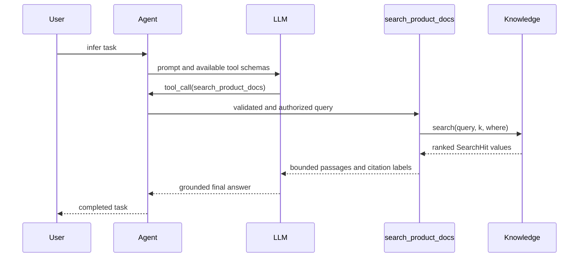

import ApiSurface from '@site/src/components/ApiSurface';
import ApiReference, {
  ApiCallout,
  ApiField,
  ApiFields,
  ApiSection,
} from '@site/src/components/ApiReference';

# Retrieval-Augmented Generation

Retrieval-Augmented Generation (RAG) lets an Agent consult application-owned
knowledge while answering a question. The model does not need to memorize your
handbook, product documentation, support articles, or database records. It can
retrieve the passages that matter for the current request and use them as
evidence.

ProtoLink keeps that workflow behind one `Knowledge` object:

```python
from protolink import Agent, AgentCard, create_knowledge

knowledge = create_knowledge(
    "memory",
    name="product_docs",
    description="the product manual and troubleshooting guides",
    sources=["docs/"],
)

agent = Agent(
    card=AgentCard(
        name="support",
        description="Answers product questions",
        url="runtime://support",
    ),
    transport="runtime",
    llm=my_llm,
    knowledge=knowledge,
)

answer = agent.sync.ask("How do I reset a device?")
print(answer.text)
print([citation.source for citation in answer.citations])
```

`my_llm` can be any configured [ProtoLink LLM](llm.md). The local knowledge
stack itself needs no model provider, vector-database service, or additional
Python dependency.

:::tip[Complete runnable example]

[`examples/rag_agent.py`](https://github.com/nMaroulis/protolink/blob/main/examples/rag_agent.py)
runs without an API key or network access. Its `MockLLM` chooses the generated
knowledge tool, reads the real search result, and answers with a citation.

:::

## The Mental Model

RAG has two separate workflows.

### Indexing prepares knowledge

```text
files, URLs, or text
        ↓
      Loader
        ↓
     Documents
        ↓
      Splitter
        ↓
       Chunks
        ↓
      Embedder
        ↓
    VectorStore
```

ProtoLink can manage this workflow for local memory, SQLite, or a custom
`VectorStore`.

### Retrieval answers one request



An existing Chroma, Pinecone, Qdrant, or application search service only needs
the retrieval half. ProtoLink does not require you to re-index data that
already exists.

## How the LLM Knows Knowledge Exists

Passing `knowledge=` to `Agent` automatically performs four integrations:

1. The source is stored in `agent.knowledge`.
2. ProtoLink creates a read-only tool named `search_<knowledge-name>`.
3. The tool description and JSON schema are exposed to the LLM with every
   other registered tool.
4. `card.capabilities.rag` and `card.capabilities.tool_calling` become `True`.

For this object:

```python
knowledge = create_knowledge(
    "memory",
    name="company_policies",
    description="HR, travel, expense, and security policies",
)
```

the generated tool is `search_company_policies(query, k=5, where=None)`. Its
description explains when the source is useful. Its bounded result contains
normalized passages, display sources, scores, and source-qualified labels such
as `[company_policies:1]`. Direct `SearchHit` and `RAGAnswer` values retain
application metadata; the model-facing tool observation deliberately omits
arbitrary metadata.

The tool follows ProtoLink's normal inference path. Providers with native tool
calling receive a native tool declaration; smaller and self-hosted models see
the same capability through ProtoLink's JSON action fallback. Argument
validation, policy, approval, cancellation, budgets, telemetry, and result
injection work exactly as they do for another [Agent tool](tool.md).

## Choose Retrieval Behavior

The `retrieval` argument controls when pre-retrieval is mandatory:

| Mode | Behavior | Good fit |
| --- | --- | --- |
| `"auto"` | The default. Knowledge tools are available, and the model decides whether and how often to call them. | General assistants that mix private knowledge with ordinary reasoning and other tools. |
| `"always"` | ProtoLink searches the selected knowledge sources before the first model call and adds the passages to the request. Empty retrieval is allowed. | Support, documentation, and policy assistants where every answer should begin with retrieval. |
| `"required"` | Works like `"always"`, but raises `KnowledgeNotFoundError` when no usable passage fits the filters and bounded model context. | Workflows that must not continue without model-visible supporting evidence. |

```python
agent = Agent(
    card=card,
    transport="runtime",
    llm=my_llm,
    knowledge=knowledge,
    retrieval="required",
)
```

`Agent.invoke()` uses the Agent's configured mode:

```python
text = await agent.invoke("What is our travel policy?")
```

`Agent.ask()` is the explicit retrieve-then-answer API. It always performs
pre-retrieval for that call and returns a structured `RAGAnswer`, regardless of
the Agent's default mode:

```python
answer = await agent.ask(
    "What is our travel policy?",
    knowledge="company_policies",
    k=4,
    where={"region": "CH"},
    citations=True,
)
```

The blocking equivalents are `agent.sync.invoke()` and `agent.sync.ask()`.
Do not use a `.sync` facade inside an active event loop; await the asynchronous
method instead.

### Per-task control

Advanced callers can select the same behavior through infer-part metadata:

```python
from protolink import Task

task = Task.create_infer(
    prompt="What changed in the current policy?",
    metadata={
        "retrieval": "required",
        "knowledge": ["company_policies"],
        "k": 4,
        "where": {"status": "current"},
        "citations": True,
    },
)
result = await agent.handle_task(task)
```

The `knowledge` selection accepts one name or a sequence of names. `k` is the
maximum result count **per selected source**, and the same `where` filter is
passed to each source. Names must exactly match attached knowledge. Task
metadata may strengthen an Agent's mode (`"auto"` → `"always"` →
`"required"`), but it cannot weaken the configured default.

## Create Managed Knowledge

Managed knowledge gives ProtoLink responsibility for loading, splitting,
embedding, storing, searching, and synchronizing a corpus.

### In-memory knowledge

The dependency-free `"memory"` backend is suitable for examples, tests,
notebooks, and small transient indexes:

```python
from protolink import Document, create_knowledge

knowledge = create_knowledge(
    "memory",
    name="handbook",
    description="the employee handbook",
    sources=[
        Document(
            text="Expense receipts must be submitted within 30 days.",
            source="expense-policy.md",
            metadata={"department": "finance"},
        ),
        "Security incidents must be reported immediately.",
    ],
)
```

Sources supplied to `create_knowledge()` are staged, not indexed during
construction. They are indexed lazily before the first search or explicitly
with `await knowledge.ready()` / `knowledge.sync.ready()`.

### Persistent SQLite knowledge

The `"sqlite"` backend uses only Python's standard-library SQLite support. It
stores text, metadata, and vectors durably, then performs exact ranking in
Python:

```python
knowledge = create_knowledge(
    "sqlite",
    path="support-knowledge.db",
    namespace="production",
    name="support_docs",
    sources=["docs/"],
)
knowledge.sync.ready()
```

Namespaces isolate multiple logical indexes in the same database. SQLite is a
good fit for local and moderate corpora. Use a dedicated vector database for a
large production corpus or approximate-nearest-neighbor search.

### Bring a managed VectorStore

Use `"vector"` when ProtoLink should own ingestion but your application
provides the vector store and embedding implementation:

```python
knowledge = create_knowledge(
    "vector",
    name="catalog",
    store=my_vector_store,
    embedder=my_embedder,
    sources=["catalog/"],
)
```

`my_vector_store` must implement the structural `VectorStore` protocol. No
inheritance from a ProtoLink base class is required.

## Supported Sources

The default `AutoLoader` accepts:

| Source | Behavior |
| --- | --- |
| `Document` | Preserves its text, source, ID, media type, and metadata. |
| `Path` or an existing path string | Loads one supported file or recursively traverses a directory. |
| HTTP or HTTPS URL | Downloads text, HTML, or JSON with a bounded request timeout. |
| `bytes` | Decodes UTF-8 with replacement for malformed bytes. |
| Any other string | Treats the value as inline text. |

Text-like file support includes Markdown, HTML, JSON, JSONL, CSV, TSV, RST,
Python, TOML, YAML, configuration files, logs, and plain text. HTML is reduced
to visible text, and JSON is formatted when it parses successfully. Directory
loading ignores common VCS, cache, and `node_modules` directories.

Local PDFs use the optional `pypdf` package and preserve the one-based page
number in metadata:

```bash
uv add "protolink[rag-pdf]"
# or: pip install "protolink[rag-pdf]"
```

Remote PDFs are not loaded by the built-in URL path. Download one locally or
provide a custom `Loader`.

:::caution[Validate application-provided sources]

An HTTP source performs a network request, and a local path reads from the
filesystem. The default URL loader permits public HTTP(S) targets only,
re-validates redirects, pins the resolved address, enforces a byte limit and
timeout, and rejects private or loopback destinations. Still validate which
remote domains and local paths your application permits. Also note that a
misspelled, non-existent path string is treated as inline text; use a `Path`
when a missing path should be an error.

:::

## Chunking and Embeddings

Managed backends use these defaults:

- `RecursiveCharacterSplitter(chunk_size=1000, chunk_overlap=150)` prefers
  paragraphs, lines, sentences, and words before hard character boundaries.
- `HashEmbedder(dimensions=384)` creates deterministic lexical vectors from
  normalized word and adjacent-word features.
- `mode="hybrid"` combines vector similarity and keyword relevance.

The hash embedder is intentionally small and dependency-free. It is useful for
local development and modest corpora, but it is not a neural semantic model.
Replace it for multilingual, conceptual, or production-scale semantic search:

```python
from protolink.rag import CallableEmbedder, RecursiveCharacterSplitter

embedder = CallableEmbedder(
    embed_documents=my_embedding_batch,
    embed_query=my_query_embedding,
)

knowledge = create_knowledge(
    "sqlite",
    path="knowledge.db",
    embedder=embedder,
    splitter=RecursiveCharacterSplitter(
        chunk_size=700,
        chunk_overlap=100,
    ),
)
```

`OpenAIEmbedder` adapts an already configured synchronous or asynchronous
OpenAI-compatible client:

```python
from protolink.rag import OpenAIEmbedder

embedder = OpenAIEmbedder(
    embedding_client,
    model="your-embedding-model",
)
```

The document and query embedding functions must use the same vector space and
dimension. Local stores reject dimension mismatches explicitly. An external
index must be queried with the same embedding model and dimensions used when
that index was built.

## Search and Ranking

Search a knowledge source directly when you need passages without an Agent:

```python
hits = await knowledge.search(
    "expense submission deadline",
    k=5,
    where={"department": "finance"},
)

for hit in hits:
    print(hit.score, hit.source, hit.text)
```

`retrieve()` is an alias that lets `Knowledge` itself satisfy the `Retriever`
protocol. Blocking code can use `knowledge.sync.search()` or
`knowledge.sync.retrieve()`.

### Local search modes

`create_knowledge()` configures managed local stores with:

- `mode="vector"` for exact cosine similarity.
- `mode="keyword"` for BM25-style lexical relevance.
- `mode="hybrid"` for a weighted combination of vector and keyword scores.

```python
knowledge = create_knowledge(
    "memory",
    mode="hybrid",
    score_threshold=0.15,
    fetch_k=24,
    mmr_lambda=0.7,
)
```

`score_threshold` removes weak matches. `mmr_lambda` enables maximal marginal
relevance (MMR): values nearer `1.0` favor relevance, while lower values favor
diversity. `fetch_k` optionally controls the MMR candidate pool and therefore
requires `mmr_lambda`; without it, ProtoLink uses an automatic candidate size.

An optional `Reranker` runs after retrieval:

```python
class MyReranker:
    async def rerank(self, query, hits, *, k):
        reranked = await my_service.rank(query, hits)
        return reranked[:k]


knowledge = create_knowledge("memory", reranker=MyReranker())
```

### Metadata filters

The in-memory and SQLite stores support exact values, dotted metadata keys, and
these operators:

| Operator | Meaning |
| --- | --- |
| `$eq`, `$ne` | Equal or not equal |
| `$in`, `$nin` | Membership or non-membership |
| `$gt`, `$gte`, `$lt`, `$lte` | Ordered comparisons |
| `$contains` | Container or substring containment |

```python
where = {
    "department": {"$in": ["finance", "legal"]},
    "revision.year": {"$gte": 2026},
}
hits = knowledge.sync.search("retention policy", where=where)
```

External adapters pass filters to their database's native query surface.
Use that database's filter syntax when querying Chroma, Pinecone, or Qdrant.

A `where=` supplied when constructing `Knowledge` or calling
`create_knowledge()` is an application-owned scope, such as a tenant boundary.
Per-search filters can refine it but cannot override the configured keys.

## Index Lifecycle

Managed `Knowledge` exposes explicit lifecycle operations:

```python
# Load, split, embed, and index supported sources.
report = await knowledge.add(["docs/", "faq.md"])

# Add one inline document.
report = await knowledge.add_text(
    "Premium support is available around the clock.",
    source="support-tiers.md",
    metadata={"tier": "premium"},
)

# Insert or replace normalized Documents.
report = await knowledge.upsert(
    Document(
        text="Updated policy text",
        source="policy.md",
        metadata={"revision": 3},
    )
)

# Delete matching chunks.
deleted = await knowledge.delete(
    sources=["retired-policy.md"],
)

# Re-index a complete desired source set and remove omitted sources.
report = await knowledge.refresh(
    ["docs/current/"],
    delete_missing=True,
)
```

`sync_sources()` is an explicit alias for `refresh()`. Every method is also
available on `knowledge.sync`.

`IndexReport` reports document and chunk counts, additions, deletions, skipped
sources, and normalized source identifiers. Re-indexing a document with a
non-empty `source` first removes the old chunks from that source. Stable
document and chunk identifiers make repeated upserts deterministic.

:::warning[Complete-corpus synchronization]

Use `delete_missing=True` only when the supplied sources represent the complete
desired corpus for that store or namespace. Previously indexed sources omitted
from the call are deleted.

:::

Knowledge backed only by an existing retriever is **retrieval-only**.
`add()`, `upsert()`, `delete()`, and synchronization methods raise
`UnsupportedKnowledgeOperationError` because ProtoLink does not own that
external index.

## Connect an Existing Vector Database

ProtoLink adapters receive clients and indexes that your application already created. ProtoLink does not create vendor resources, own their credentials, or ingest into them.


<div className="provider-strip-label">[ ChromaDB ]   [ Pinecone ]   [ Qdrant ]</div>

<div className="provider-strip">
  
  
  
</div>

### Chroma

```python
knowledge = create_knowledge(
    "chroma",
    name="product_docs",
    description="the existing product-document collection",
    collection=chroma_collection,
)
```

When the collection has its own embedding function, the adapter sends
`query_texts`. Otherwise pass a compatible `embedder=` and it sends
`query_embeddings`.

### Pinecone

```python
knowledge = create_knowledge(
    "pinecone",
    name="company_docs",
    description="the existing company-document index",
    index=pinecone_index,
    namespace="production",
    embedder=query_embedder,
    text_key="text",
    source_key="source",
)
```

The adapter requests metadata and expects passage text and source information
under the configured keys.

### Qdrant

```python
knowledge = create_knowledge(
    "qdrant",
    name="support_docs",
    description="the existing support collection",
    client=qdrant_client,
    collection_name="support",
    embedder=query_embedder,
    vector_name="content",
    text_key="text",
    source_key="source",
)
```

The adapter supports clients exposing current `query_points()` or legacy
`search()` methods. `filter_converter` is optional: omit it for simple mapping
filters that ProtoLink can convert with an installed `qdrant-client`, or
provide it when your application owns a different filter representation. The
client and matching query embedder remain application-owned.

## Use Your Own Retriever

The smallest extension boundary is the `Retriever` protocol:

```python
from collections.abc import Mapping
from typing import Any

from protolink import Knowledge, SearchHit


class CompanySearch:
    async def retrieve(
        self,
        query: str,
        *,
        k: int = 5,
        where: Mapping[str, Any] | None = None,
    ) -> list[SearchHit]:
        rows = await company_vector_service.search(
            query=query,
            limit=k,
            filters=dict(where or {}),
        )
        return [
            SearchHit(
                text=row.text,
                score=row.score,
                source=row.url,
                metadata=row.metadata,
                chunk_id=row.id,
            )
            for row in rows
        ]


knowledge = Knowledge(
    CompanySearch(),
    name="company_docs",
    description="private product and company documentation",
)
```

This implementation does not need a ProtoLink loader, splitter, embedder, or
vector store. `Knowledge` normalizes ranking and citations and provides the
Agent tool.

### Adapt a function

`Knowledge.from_callable()` accepts a synchronous or asynchronous function:

```python
async def search_company_docs(query: str, *, k: int = 5, where=None):
    return await company_vector_service.search(query, limit=k, filters=where)


knowledge = Knowledge.from_callable(
    search_company_docs,
    name="company_docs",
    description="private company documentation",
)
```

Callable results may contain `SearchHit`, `Document`, `Chunk`, mapping, or
string values. A mapping must contain `text`, `content`, or `page_content`;
other fields are retained as metadata.

The Agent decorator is the shortest form:

```python
agent = Agent(card=card, transport="runtime", llm=my_llm)


@agent.retriever(
    name="company_docs",
    description="private company documentation",
)
async def search_company_docs(query: str, *, k: int = 5, where=None):
    return await company_vector_service.search(query, limit=k, filters=where)
```

## Use Multiple Knowledge Sources

Give every source a clear name and description:

```python
agent = Agent(
    card=card,
    transport="runtime",
    llm=my_llm,
    knowledge=[
        create_knowledge(
            "sqlite",
            path="product.db",
            name="product_docs",
            description="product manuals and release notes",
        ),
        Knowledge(
            policy_retriever,
            name="company_policies",
            description="HR, expense, travel, and security policies",
        ),
    ],
)
```

The model sees `search_product_docs` and `search_company_policies` as separate
tools. In `"always"` or `"required"` mode, ProtoLink searches every attached
source unless infer metadata or `Agent.ask(knowledge=...)` selects specific
names:

```python
answer = await agent.ask(
    "When can a customer request a refund?",
    knowledge=["product_docs", "company_policies"],
)
```

Knowledge names must be unique. Generated tool names must not collide with
existing Agent tools; choose another name if `add_knowledge()` reports a
collision.

## Citations and Grounding

Every `SearchHit` can retain:

- source path, URL, or application identifier;
- relevance score and rank;
- document and chunk identifiers;
- arbitrary metadata such as a PDF page, tenant, revision, or category.

Deterministic retrieval converts the bounded hits into numbered `Citation`
objects. Labels are global across all sources selected for that answer:

```python
answer = agent.sync.ask("When are receipts due?")

print(answer.text)
for citation in answer.citations:
    print(citation.label, citation.source, citation.metadata.get("page"))
```

`RAGAnswer.hits` always retains the retrieved passages. Setting
`citations=False` returns an empty citation list and tells the model that
bracketed labels are unnecessary:

```python
answer = agent.sync.ask("Summarize the policy", citations=False)
```

Each `Knowledge` object limits the passage text placed in model context with
`context_max_chars` (12,000 by default). This bound applies to tool results and
deterministic pre-retrieval. When deterministic retrieval selects multiple
sources, ProtoLink fairly shares one total retrieved-context allowance based on
the largest selected source limit.

:::info[What grounding guarantees]

ProtoLink preserves evidence and asks the model to cite it. It does not claim
that a retrieved passage is correct, verify that every generated statement is
entailed, or automatically validate every citation label in model output. Keep
source data current and evaluate grounded-answer quality for your domain.

:::

## Safety and Operations

Knowledge search is a runtime action, not hidden prompt behavior:

- The generated tool declares both `knowledge.read` and
  `knowledge.<source>.read`.
- A staged source adds `knowledge.index` and
  `knowledge.<source>.index` to the first lazy-indexing action.
- Auto retrieval follows normal Agent tool authorization.
- `"always"` and `"required"` retrieval use the same policy and approval
  boundary before searching.
- Each deterministic source search consumes one tool-call budget step.
- Cancellation is checked before retrieval.
- Telemetry receives normal tool events plus `retrieval_start`,
  `retrieval_result`, and `retrieval_error` inference events. Knowledge results
  are represented by counts, scores, latency, and opaque source IDs rather than
  raw passages or source strings.

Retrieved content is wrapped as untrusted reference data. The tool description,
tool result, and deterministic prompt all tell the model not to follow
instructions found inside passages. This reduces prompt-injection risk but does
not replace access control or content review.

Retrieved passages are ephemeral to the authorized model loop. Persistent
conversation history keeps the original question and an omission receipt, not
the raw evidence; task streams, task artifacts, and telemetry also omit the raw
knowledge observation. Application code can still request structured hits with
`Knowledge.search()` or receive hits and citations in the `RAGAnswer` returned
by `Agent.ask()`.

For multi-tenant indexes, enforce tenant scope in the retriever or mandatory
metadata filters. A model-proposed `where` value is untrusted input. Policy and
the retriever must remain authoritative about which records the current run may
read.

Agent dictionary and YAML exports record knowledge descriptions and whether a
source is managed, but they do not serialize executable retrievers, database
clients, credentials, loaders, embedders, stores, or rerankers. Supply
`knowledge=` again as an override when restoring an Agent that needs live RAG
dependencies; the supplied knowledge names must exactly match the serialized
descriptors.

---

## API Reference

<ApiSurface
  eyebrow="Knowledge module"
  title="Retrieval-Augmented Generation"
  path="protolink.rag"
  description="Provider-neutral ingestion, retrieval, vector storage, citations, existing-index adapters, and automatic Agent tool integration behind one Knowledge facade."
  pills={[
    "Managed or retrieval-only",
    "Dependency-free local stack",
    "Async and sync facades",
    "Bring your own retriever",
    "Citations and metadata",
    "Policy-aware Agent tools",
  ]}
  cards={[
    {
      title: "Simple factory",
      text: "Create memory, SQLite, custom-vector, Chroma, Pinecone, or Qdrant knowledge through one entry point.",
      code: "create_knowledge(...)",
    },
    {
      title: "Stable facade",
      text: "Search directly, manage an owned index, expose a tool, or attach the same object to an Agent.",
      code: "Knowledge",
    },
    {
      title: "Small extension point",
      text: "Connect an existing application search service by implementing one asynchronous retrieve method.",
      code: "Retriever",
    },
    {
      title: "Grounded result",
      text: "Return answer text together with the exact hits and structured citations used for pre-retrieval.",
      code: "RAGAnswer",
    },
  ]}
/>

The common imports are available at the package root:

```python
from protolink import (
    Citation,
    Document,
    Knowledge,
    RAGAnswer,
    SearchHit,
    create_knowledge,
)
```

Advanced components and protocols live in `protolink.rag`:

```python
from protolink.rag import (
    AutoLoader,
    AtomicVectorStore,
    CallableEmbedder,
    CallableRetriever,
    Chunk,
    Embedder,
    HashEmbedder,
    InMemoryVectorStore,
    IndexReport,
    Loader,
    OpenAIEmbedder,
    RecursiveCharacterSplitter,
    Reranker,
    Retriever,
    SQLiteVectorStore,
    Splitter,
    VectorStore,
)
```

### create_knowledge

<ApiReference
  kind="function"
  path="protolink.rag.create_knowledge"
  signature={`create_knowledge(
    backend: str | Any = "memory",
    *,
    name: str = "knowledge",
    description: str | None = None,
    sources: Any | Sequence[Any] | None = None,
    default_k: int = 5,
    context_max_chars: int = 12_000,
    loader: Loader | None = None,
    splitter: Splitter | None = None,
    embedder: Embedder | None = None,
    store: VectorStore | None = None,
    reranker: Reranker | None = None,
    mode: SearchMode | None = None,
    score_threshold: float | None = None,
    fetch_k: int | None = None,
    mmr_lambda: float | None = None,
    where: Mapping[str, Any] | None = None,
    **kwargs: Any,
) -> Knowledge`}
  source="https://github.com/nMaroulis/protolink/blob/main/protolink/rag/factory.py"
>

Create managed local knowledge, adapt an existing external index, or wrap a
custom retriever.

<ApiSection title="Backend-specific arguments">
  <ApiFields ariaLabel="create knowledge backend arguments">
    <ApiField name="memory" type="no required arguments">
      Creates a managed <code>InMemoryVectorStore</code>.
    </ApiField>
    <ApiField name="sqlite" type="path, namespace">
      Requires <code>path</code>; <code>namespace</code> defaults to the
      knowledge name.
    </ApiField>
    <ApiField name="vector" type="store, embedder">
      Requires a caller-supplied managed vector store. The factory uses
      <code>HashEmbedder</code> when <code>embedder</code> is omitted.
    </ApiField>
    <ApiField name="chroma" type="collection, embedder?, source_key?">
      Adapts an existing collection.
    </ApiField>
    <ApiField name="pinecone" type="index, embedder, namespace?, text_key?, source_key?">
      Adapts an existing index and requires its compatible query embedder.
    </ApiField>
    <ApiField name="qdrant" type="client, collection_name, embedder, vector_name?, filter_converter?, text_key?, source_key?">
      Adapts an existing collection and requires its compatible query embedder.
    </ApiField>
  </ApiFields>
</ApiSection>

<ApiCallout label="Lazy sources">
  The factory stores <code>sources</code> without performing I/O. Call
  <code>ready()</code> explicitly or let the first search index them.
</ApiCallout>

<ApiCallout label="Search defaults">
  Local managed backends default to hybrid search. Existing external indexes
  use vector retrieval and reject unsupported local controls instead of
  silently ignoring them.
</ApiCallout>

</ApiReference>

### Knowledge

<ApiReference
  kind="class"
  path="protolink.rag.Knowledge"
  signature={`Knowledge(
    retriever: Retriever | Callable | None = None,
    *,
    name: str = "knowledge",
    description: str | None = None,
    default_k: int = 5,
    reranker: Reranker | None = None,
    where: Mapping[str, Any] | None = None,
    score_threshold: float | None = None,
    loader: Loader | None = None,
    splitter: Splitter | None = None,
    embedder: Embedder | None = None,
    store: VectorStore | None = None,
    context_max_chars: int = 12_000,
    pending_sources: Any | Sequence[Any] | None = None,
)`}
  source="https://github.com/nMaroulis/protolink/blob/main/protolink/rag/knowledge.py"
>

Unify one managed or retrieval-only knowledge source.

<ApiSection title="Attributes">
  <ApiFields ariaLabel="Knowledge attributes">
    <ApiField name="name" type="str">
      Stable Agent-facing source name.
    </ApiField>
    <ApiField name="description" type="str">
      Plain-language scope used in the generated tool description.
    </ApiField>
    <ApiField name="managed" type="bool">
      Whether loader, splitter, embedder, and store components are all present.
    </ApiField>
    <ApiField name="tool_name" type="str">
      Sanitized deterministic name in the form <code>search_&lt;name&gt;</code>.
    </ApiField>
    <ApiField name="sync" type="SyncKnowledge">
      Blocking facade for search and managed lifecycle operations.
    </ApiField>
  </ApiFields>
</ApiSection>

<ApiSection title="Core methods">
  <ApiFields ariaLabel="Knowledge methods">
    <ApiField name="ready" type="async () -> IndexReport">
      Index staged factory sources once.
    </ApiField>
    <ApiField name="search / retrieve" type="async (query, *, k=None, where=None) -> list[SearchHit]">
      Return normalized ranked passages.
    </ApiField>
    <ApiField name="add" type="async (source, *, metadata=None) -> IndexReport">
      Load and index one source or a sequence of sources.
    </ApiField>
    <ApiField name="add_text" type="async (text, *, source=None, metadata=None) -> IndexReport">
      Index one inline text document.
    </ApiField>
    <ApiField name="upsert" type="async (Document | Sequence[Document]) -> IndexReport">
      Chunk, embed, and replace normalized documents.
    </ApiField>
    <ApiField name="delete" type="async (*, ids=None, document_ids=None, where=None, sources=None) -> int">
      Delete matching managed chunks.
    </ApiField>
    <ApiField name="refresh / sync_sources" type="async (sources, *, metadata=None, delete_missing=False) -> IndexReport">
      Re-index a desired source set and optionally delete omitted sources.
    </ApiField>
    <ApiField name="as_tool" type="() -> Tool">
      Build the typed read-only tool used by Agent integration.
    </ApiField>
    <ApiField name="from_callable" type="class method">
      Construct retrieval-only knowledge from a sync or async search function.
    </ApiField>
  </ApiFields>
</ApiSection>

</ApiReference>

### Core value types

| Type | Purpose and principal fields |
| --- | --- |
| `Document` | Source text before chunking: `text`, `source`, `metadata`, stable `id`, and `media_type`. |
| `Chunk` | Bounded passage: `text`, parent `document_id`, zero-based `index`, `source`, metadata, and stable `id`. |
| `SearchHit` | Normalized retrieval result: `text`, optional `score`, `source`, metadata, IDs, and rank. |
| `Citation` | Numbered reference with `label`, source, excerpt, score, IDs, and metadata. |
| `RAGAnswer` | `text`, `citations`, `hits`, and original `query`; `str(answer)` returns the text. |
| `IndexReport` | Counts for documents, chunks, additions, deletions, skips, and source identifiers. |

Every value provides `to_dict()`. `Document`, `Chunk`, `SearchHit`, `Citation`,
and `RAGAnswer` also provide `from_dict()`.

### Extension protocols

All RAG extension points are runtime-checkable structural protocols:

| Protocol | Required operation |
| --- | --- |
| `Loader` | `async load(source, *, metadata=None) -> list[Document]` |
| `Splitter` | `split(documents) -> list[Chunk]` |
| `Embedder` | `async embed_documents(texts)` and `async embed_query(text)` |
| `VectorStore` | `async upsert`, `delete`, `search`, and `list_sources` |
| `AtomicVectorStore` | Optional `async replace(...)` extension for one-step source replacement |
| `Retriever` | `async retrieve(query, *, k=5, where=None) -> list[SearchHit]` |
| `Reranker` | `async rerank(query, hits, *, k) -> list[SearchHit]` |

Implement the smallest protocol your application needs. Existing indexed data
usually needs only `Retriever`; ProtoLink-managed ingestion needs the four
managed components. Implement `AtomicVectorStore` when your database can
replace a source transactionally; otherwise `Knowledge` uses the portable
delete-then-upsert fallback.

### Built-in implementations

| Component | Purpose |
| --- | --- |
| `AutoLoader` | Documents, paths, directories, URLs, bytes, inline text, and optional local PDFs. |
| `RecursiveCharacterSplitter` | Structure-preferring character chunks with configurable overlap. |
| `HashEmbedder` | Dependency-free deterministic lexical embeddings. |
| `CallableEmbedder` | Sync or async application embedding functions. |
| `OpenAIEmbedder` | User-owned OpenAI-compatible embeddings client. |
| `InMemoryVectorStore` | Process-local exact vector, keyword, and hybrid search. |
| `SQLiteVectorStore` | Persistent namespaced exact search without a vector extension. |
| `CallableRetriever` | Normalizes a sync or async search function. |
| `VectorStoreRetriever` | Combines a `VectorStore`, embedder, ranking mode, filters, threshold, and MMR settings. |
| `ChromaRetriever` | Existing Chroma collection adapter. |
| `PineconeRetriever` | Existing Pinecone index adapter. |
| `QdrantRetriever` | Existing Qdrant collection adapter. |

## Troubleshooting

### The model does not search in `"auto"` mode

Give the knowledge source a concrete description explaining what it contains
and when it is authoritative. Confirm that its generated tool appears in
`agent.tools`. Use `retrieval="always"` or `Agent.ask()` when retrieval must be
deterministic rather than model-selected.

### Search returns no passages

Call `knowledge.sync.ready()` and inspect its `IndexReport`, then call
`knowledge.sync.search()` directly. Check metadata filters, score thresholds,
source paths, and whether the query shares usable language with the default
lexical embedder.

### An external index returns empty text

Configure `text_key` and `source_key` to match the metadata or payload fields in
the existing index. Pinecone and Qdrant adapters skip results whose configured
text field is empty.

### Embedding dimensions do not match

Use the exact embedding model and dimensions that built the index. Re-index a
managed store when changing its embedder.

### A lifecycle method raises `UnsupportedKnowledgeOperationError`

The source is retrieval-only. Manage documents through the external database,
or create managed knowledge with `"memory"`, `"sqlite"`, or `"vector"`.

### A blocking call fails inside async code

`knowledge.sync` and `agent.sync` intentionally reject active event loops. Use
`await knowledge.search(...)`, `await knowledge.add(...)`, or
`await agent.ask(...)`.
