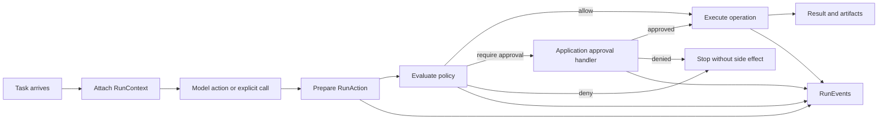
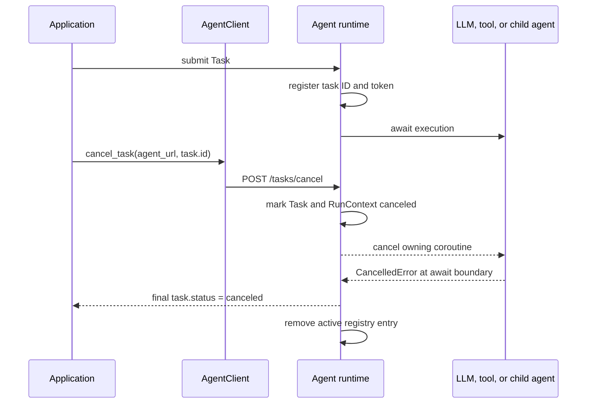

import ApiSurface from '@site/src/components/ApiSurface';
import ApiReference, {
  ApiCallout,
  ApiField,
  ApiFields,
  ApiSection,
} from '@site/src/components/ApiReference';

# Runtime

Protolink's runtime primitives provide a stable execution layer above the core A2A-derived `Task`, `Message`, `Part`, and `Artifact` models. They are intentionally generic: the same contracts work for local CLIs, workflow engines, support assistants, research systems, browser agents, data tools, and any other agent application.

The runtime layer does not replace transports, telemetry, storage, or structured flows. It gives them shared execution metadata, concrete action intents, policy and approval boundaries, and a normalized event stream.

<ApiSurface
  eyebrow="Runtime control layer"
  title="Runtime Primitives"
  path="protolink.runtime"
  description="The application-facing contracts for run context, cancellation, budgets, policies, approvals, actions, normalized events, reports, replay, regression comparison, and redaction."
  pills={[
    "RunContext",
    "RunBudget",
    "PolicyDecision",
    "ApprovalRequest",
    "RunEvent",
    "RunReport",
    "RunReportDiffConfig",
  ]}
  cards={[
    {
      title: "Context",
      text: "Attach run, session, trace, workspace, permission, and budget metadata to tasks without ad hoc keys.",
      code: "RunContext",
    },
    {
      title: "Control",
      text: "Cancel active work and enforce model, tool, token, step, and runtime limits before side effects occur.",
      code: "CancellationToken",
    },
    {
      title: "Policy",
      text: "Evaluate actions as allow, deny, or require approval with preview artifacts before execution.",
      code: "CapabilityPolicy",
    },
    {
      title: "Reports and regression",
      text: "Replay recorded facts safely and compare normalized reports without repeating model or tool calls.",
      code: "diff_run_reports",
    },
  ]}
/>

## Why A Runtime Layer Exists

The protocol models describe **what travels through the system**: a `Task` contains messages, parts, state, and artifacts that agents and clients can exchange. An application runtime must additionally decide **how that work executes**: which run it belongs to, what operation is about to happen, whether that operation is permitted, how approval is obtained, and what progress the user sees.

Without shared runtime primitives, each application tends to invent metadata keys, approval dictionaries, event names, and side-effect checks. Those private conventions work initially, but become difficult to propagate across agents, serialize through transports, test deterministically, or reuse in another interface. Protolink's runtime layer gives those concerns stable contracts while leaving application meaning and presentation outside the framework.

The central lifecycle is:



This lifecycle is not limited to LLM-selected tool calls. The same `RunAction` and policy contracts can protect deterministic flows and direct application calls.

### Runtime Primitives At A Glance

| Primitive | Question it answers |
|------|-------------|
| `Task` | What work and results are exchanged between participants? |
| `RunContext` | Which run is this, and what constraints travel with it? |
| `CancellationToken` | Has live cancellation been requested for active work? |
| `ContextManifest` | What estimated prompt context is about to enter a model? |
| `BudgetPolicy` / `BudgetEnforcer` | Is the run still under its configured execution limits? |
| `RunAction` | What concrete operation is about to execute? |
| `Artifact` | What output or pre-execution preview can be inspected? |
| `PolicyDecision` | Is this action allowed, denied, or approval-gated? |
| `ApprovalRequest` / `ApprovalDecision` | What must an application approve, and what did it decide? |
| `RunEvent` | What is happening now in a stable application-facing format? |
| `EventSink` | Where should normalized runtime events be delivered? |

### What Protolink Does Not Decide

Protolink does not define a universal permission taxonomy, approval screen, or domain-specific action type. Applications choose capability names, build meaningful preview artifacts, and decide whether approval appears in a terminal, desktop UI, web application, editor, or external service. The runtime only guarantees that the decision occurs before execution and that the result is represented consistently.

`RunBudget` is enforced by the default LLM inference loop through `BudgetEnforcer`. The built-in policy allows work under budget, emits warning events near limits, and raises before model or tool execution when a hard limit would be exceeded. Applications can still provide their own policy when they want compaction, truncation, approval, or domain-specific accounting.

## Runtime Context

`RunContext` is the typed execution envelope for a task run. It replaces ad hoc metadata keys such as `task.metadata["session_id"]`, `trace_id`, `workspace`, or `parent_agent` with one serializable object stored under `task.metadata["run_context"]`.

Think of the context as information that belongs to the execution but is not the task's business payload. A prompt or record ID belongs in a `Message`, `Part`, or action payload; correlation IDs, permissions, cancellation state, and limits belong in `RunContext`.

```python
from protolink import RunBudget, RunContext, Task

task = Task.create_infer(prompt="Summarize the latest report")

context = RunContext(
    run_id="run_123",
    session_id="session_abc",
    trace_id="trace_abc",
    workspace_uri="file:///workspace",
    agent_chain=["gateway"],
    permissions={"fs.read": {"paths": ["file:///workspace"]}},
    budget=RunBudget(max_steps=8, max_llm_calls=4),
)

context.attach_to_task(task)
```

The default `Agent` runtime calls `RunContext.ensure_task_context()` before normal execution, streaming execution, and outbound agent calls. Existing callers can keep setting `task.metadata["session_id"]`; Protolink upgrades that legacy metadata into a typed context and mirrors common keys back for compatibility.

Three IDs serve different purposes:

- `run_id` identifies one execution attempt and correlates its actions and events.
- `session_id` groups related runs, commonly for conversation or application continuity.
- `trace_id` correlates observability data and may span several runs or agents.

When work is delegated, `RunContext.child()` creates a new run identity while preserving the session, trace, workspace, permissions, budget, and application metadata. `parent_run_id` and `agent_chain` then describe how execution reached that child.

### RunContext API

<ApiReference
  kind="dataclass"
  path="protolink.RunContext"
  signature={`RunContext(
    run_id: str = <generated "run_" ID>,
    session_id: str | None = None,
    trace_id: str | None = None,
    workspace_uri: str | None = None,
    parent_run_id: str | None = None,
    agent_chain: list[str] = [],
    permissions: dict[str, Any] = {},
    budget: RunBudget = RunBudget(),
    canceled: bool = False,
    cancel_reason: str | None = None,
    metadata: dict[str, Any] = {},
    created_at: str = <UTC timestamp>,
)`}
  source="https://github.com/nMaroulis/protolink/blob/main/protolink/core/run_context.py#L93"
>

Mutable, serializable execution metadata for one logical run. Dataclass factory defaults create independent lists, mappings, budgets, IDs, and timestamps for every instance.

<ApiSection title="Parameters">
  <ApiFields ariaLabel="RunContext constructor parameters">
    <ApiField name="run_id" type="str" defaultValue={'generated "run_" ID'}>
      Stable logical-run identifier. `from_task()` uses an existing task ID when no typed context or explicit run ID exists.
    </ApiField>
    <ApiField name="session_id" type="str | None" defaultValue="None">
      Conversation or application session shared across related runs.
    </ApiField>
    <ApiField name="trace_id" type="str | None" defaultValue="None">
      Observability correlation ID that may span several runs or agents.
    </ApiField>
    <ApiField name="workspace_uri" type="str | None" defaultValue="None">
      Generic execution boundary such as a folder, dataset, browser profile, account, or ticket collection.
    </ApiField>
    <ApiField name="parent_run_id" type="str | None" defaultValue="None">
      Parent logical run for delegated or nested execution.
    </ApiField>
    <ApiField name="agent_chain" type="list[str]" defaultValue="[]">
      Ordered agents that handled the run.
    </ApiField>
    <ApiField name="permissions" type="dict[str, Any]" defaultValue="{}">
      Domain-neutral capability rules or scoped policy metadata. Context rules can narrow, but cannot weaken, the configured runtime policy.
    </ApiField>
    <ApiField name="budget" type="RunBudget" defaultValue="RunBudget()">
      Execution limits. The field is always a `RunBudget`; an unconstrained default has every limit set to `None`.
    </ApiField>
    <ApiField name="canceled" type="bool" defaultValue="False">
      Serializable cancellation state, separate from the process-local `CancellationToken`.
    </ApiField>
    <ApiField name="cancel_reason" type="str | None" defaultValue="None">
      Optional explanation retained with a canceled context.
    </ApiField>
    <ApiField name="metadata" type="dict[str, Any]" defaultValue="{}">
      Application-owned data that should travel with the run.
    </ApiField>
    <ApiField name="created_at" type="str" defaultValue="current UTC timestamp">
      ISO timestamp captured at construction.
    </ApiField>
  </ApiFields>
</ApiSection>

<ApiSection title="Serialization and task binding">
  <ApiFields ariaLabel="RunContext serialization methods">
    <ApiField name="to_dict()" type="dict[str, Any]">
      Serializes all fields, including the nested budget.
    </ApiField>
    <ApiField name="from_dict(data)" type="RunContext">
      Accepts a mapping or `None`, understands legacy `workspace`, `budgets`, `cancelled`, and `cancellation_reason` spellings, and generates missing identity/time values.
    </ApiField>
    <ApiField name="from_task(task, *, default_session_id=None)" type="RunContext">
      Reads `task.metadata["run_context"]`, merges compatible top-level legacy metadata, and returns a detached mutable context. It does not write back to the task.
    </ApiField>
    <ApiField name="ensure_task_context(task, *, default_session_id=None, agent_name=None)" type="RunContext">
      Normalizes a task context, optionally appends an agent, persists it back to task metadata, and returns it.
    </ApiField>
    <ApiField name="attach_to_task(task)" type="None">
      Mutates `task.metadata`: stores the complete context under `run_context` and mirrors populated correlation and cancellation keys at the top level. Existing mirrored keys are not deleted when a field later becomes `None`.
    </ApiField>
  </ApiFields>
</ApiSection>

<ApiSection title="Copy helpers">
  <ApiFields ariaLabel="RunContext copy methods">
    <ApiField name="with_agent(agent_name)" type="RunContext">
      Returns a copy with the agent appended unless it is already the final chain entry.
    </ApiField>
    <ApiField name="child(*, run_id=None, agent_name=None)" type="RunContext">
      Returns a new run with `parent_run_id=self.run_id`, preserving session, trace, workspace, permission, budget, chain, and metadata values.
    </ApiField>
    <ApiField name="cancel(reason=None)" type="RunContext">
      Returns a canceled copy; it does not mutate this context or signal live execution.
    </ApiField>
    <ApiField name="copy(**overrides)" type="RunContext">
      Round-trips through serialization and returns a top-level defensive copy with selected replacements. Nested application values remain ordinary caller-owned objects.
    </ApiField>
  </ApiFields>
</ApiSection>

<ApiCallout label="Mutation boundary">
  `RunContext` itself is mutable. The `with_agent()`, `child()`, `cancel()`, and `copy()` helpers return new contexts, while `attach_to_task()` and `ensure_task_context()` intentionally mutate task metadata.
</ApiCallout>

</ApiReference>

`RunContext.permissions` accepts capability rules using `allow`, `deny`, or `require_approval`. Boolean values are also supported: `True` allows and `False` denies. Runtime-owned policy and context rules are combined using the most restrictive result, so task metadata can narrow but cannot weaken the agent's configured policy. `RunContext.budget` is enforced by the built-in LLM loop for steps, LLM calls, tool calls, runtime seconds, input tokens, and output tokens.

This most-restrictive rule is important at trust boundaries. An incoming task may request fewer privileges for a run, but it cannot grant itself more authority than the receiving agent's policy allows.

### RunBudget

<ApiReference
  kind="dataclass"
  path="protolink.RunBudget"
  signature={`RunBudget(
    max_steps: int | None = None,
    max_llm_calls: int | None = None,
    max_tool_calls: int | None = None,
    max_runtime_seconds: float | None = None,
    max_input_tokens: int | None = None,
    max_output_tokens: int | None = None,
    metadata: dict[str, Any] = {},
)`}
  source="https://github.com/nMaroulis/protolink/blob/main/protolink/core/run_context.py#L22"
>

Mutable limit container carried by `RunContext`. It records policy input; `BudgetEnforcer` performs the actual checks.

<ApiSection title="Parameters">
  <ApiFields ariaLabel="RunBudget parameters">
    <ApiField name="max_steps" type="int | None" defaultValue="None">
      Maximum logical inference/runtime step.
    </ApiField>
    <ApiField name="max_llm_calls" type="int | None" defaultValue="None">
      Maximum model calls admitted by one enforcer.
    </ApiField>
    <ApiField name="max_tool_calls" type="int | None" defaultValue="None">
      Maximum model-selected tool calls admitted by one enforcer.
    </ApiField>
    <ApiField name="max_runtime_seconds" type="float | None" defaultValue="None">
      Maximum wall-clock seconds measured from enforcer construction.
    </ApiField>
    <ApiField name="max_input_tokens" type="int | None" defaultValue="None">
      Aggregate pre-call input-token limit.
    </ApiField>
    <ApiField name="max_output_tokens" type="int | None" defaultValue="None">
      Aggregate output-token limit checked after model usage is known or estimated.
    </ApiField>
    <ApiField name="metadata" type="dict[str, Any]" defaultValue="{}">
      Application-specific limits or annotations not interpreted by the default policy.
    </ApiField>
  </ApiFields>
</ApiSection>

<ApiSection title="Methods">
  <ApiFields ariaLabel="RunBudget methods">
    <ApiField name="to_dict()" type="dict[str, Any]">
      Returns the complete JSON-compatible budget shape.
    </ApiField>
    <ApiField name="from_dict(data)" type="RunBudget">
      Accepts a mapping or `None`, coerces known numeric fields with `int()`/`float()`, and preserves unknown keys inside `metadata`.
    </ApiField>
  </ApiFields>
</ApiSection>

<ApiSection title="Raises">
  <ApiFields ariaLabel="RunBudget errors">
    <ApiField name="TypeError | ValueError">
      Numeric coercion errors from malformed serialized values propagate from `from_dict()`.
    </ApiField>
  </ApiFields>
</ApiSection>

<ApiCallout label="Validation">
  The dataclass does not reject negative or internally inconsistent limits. The default policy compares observed values literally, so applications should construct non-negative budgets.
</ApiCallout>

</ApiReference>

## Context Manifests And Budgets

Before every LLM call, Protolink prepares a `ContextManifest`. It is provider-neutral and estimates the context that is about to enter the model: compiled system instructions, runtime affordances such as tools and delegation targets, prior conversation history, and the current user query.

```python
from protolink import ContextManifest, LLMModelProfile, RunBudget, RunContext, create_llm

llm = create_llm("mock")
llm.configure_metrics(LLMModelProfile(context_window=8192))

context = RunContext(
    run_id="run_budgeted",
    budget=RunBudget(max_steps=4, max_llm_calls=2, max_input_tokens=6000),
)

events = []

async def capture(event):
    events.append(event)

await llm.infer(
    query="Summarize this context",
    tools={},
    run_context=context,
    event_callback=capture,
)

manifest = ContextManifest.from_dict(events[1]["manifest"])
```

### ContextItem

<ApiReference
  kind="dataclass"
  path="protolink.ContextItem"
  signature={`ContextItem(
    kind: str,
    name: str,
    tokens: int,
    metadata: dict[str, Any] = {},
)`}
  source="https://github.com/nMaroulis/protolink/blob/main/protolink/llms/context.py#L20"
>

Immutable token estimate for one logical context section.

<ApiSection title="Parameters">
  <ApiFields ariaLabel="ContextItem parameters">
    <ApiField name="kind" type="str" required>
      Extensible category such as `"system"`, `"tool_prompt"`, `"history"`, or `"user"`.
    </ApiField>
    <ApiField name="name" type="str" required>
      Stable display/test name for the section.
    </ApiField>
    <ApiField name="tokens" type="int" required>
      Estimated section token count.
    </ApiField>
    <ApiField name="metadata" type="dict[str, Any]" defaultValue="{}">
      Section-specific details such as message, tool, or delegated-agent counts.
    </ApiField>
  </ApiFields>
</ApiSection>

<ApiSection title="Methods">
  <ApiFields ariaLabel="ContextItem methods">
    <ApiField name="to_dict()" type="dict[str, Any]">
      Serializes all fields.
    </ApiField>
    <ApiField name="from_dict(data)" type="ContextItem">
      Supplies fallback names, coerces `tokens` to an integer when possible, and clamps restored token counts to zero or greater.
    </ApiField>
  </ApiFields>
</ApiSection>

</ApiReference>

### ContextManifest

<ApiReference
  kind="dataclass"
  path="protolink.ContextManifest"
  signature={`ContextManifest(
    run_id: str | None = None,
    session_id: str | None = None,
    agent_name: str | None = None,
    provider: str | None = None,
    model: str | None = None,
    system_tokens: int = 0,
    history_tokens: int = 0,
    tool_prompt_tokens: int = 0,
    user_tokens: int = 0,
    context_items: tuple[ContextItem, ...] = (),
    total_estimated_tokens: int = 0,
    context_window: int | None = None,
    estimated: bool = True,
    metadata: dict[str, Any] = {},
    created_at: str = <UTC timestamp>,
)`}
  source="https://github.com/nMaroulis/protolink/blob/main/protolink/llms/context.py#L46"
>

Immutable provider-neutral preflight summary for one model input.

<ApiSection title="Correlation and model">
  <ApiFields ariaLabel="ContextManifest correlation fields">
    <ApiField name="run_id" type="str | None" defaultValue="None">
      Logical run ID copied from `RunContext`.
    </ApiField>
    <ApiField name="session_id" type="str | None" defaultValue="None">
      Optional session correlation ID.
    </ApiField>
    <ApiField name="agent_name" type="str | None" defaultValue="None">
      Current agent, explicitly supplied or inferred from the final context-chain entry.
    </ApiField>
    <ApiField name="provider" type="str | None" defaultValue="None">
      Provider identifier supplied by the LLM wrapper.
    </ApiField>
    <ApiField name="model" type="str | None" defaultValue="None">
      Model identifier used by estimation.
    </ApiField>
  </ApiFields>
</ApiSection>

<ApiSection title="Token estimates">
  <ApiFields ariaLabel="ContextManifest token fields">
    <ApiField name="system_tokens" type="int" defaultValue="0">
      Estimated non-tool system instructions.
    </ApiField>
    <ApiField name="history_tokens" type="int" defaultValue="0">
      Estimated prior conversation, excluding the newest matching current query.
    </ApiField>
    <ApiField name="tool_prompt_tokens" type="int" defaultValue="0">
      Estimated tool and delegation declarations included in runtime affordances.
    </ApiField>
    <ApiField name="user_tokens" type="int" defaultValue="0">
      Estimated current query.
    </ApiField>
    <ApiField name="context_items" type="tuple[ContextItem, ...]" defaultValue="()">
      Per-section records for interfaces and assertions.
    </ApiField>
    <ApiField name="total_estimated_tokens" type="int" defaultValue="0">
      Additive estimate used for pre-call input-budget checks.
    </ApiField>
    <ApiField name="context_window" type="int | None" defaultValue="None">
      Optional window copied from `LLMModelProfile`; no overflow decision is made by this dataclass.
    </ApiField>
    <ApiField name="estimated" type="bool" defaultValue="True">
      Indicates that the counts are estimates rather than provider-reported usage.
    </ApiField>
  </ApiFields>
</ApiSection>

<ApiSection title="Metadata and serialization">
  <ApiFields ariaLabel="ContextManifest metadata and methods">
    <ApiField name="metadata" type="dict[str, Any]" defaultValue="{}">
      Extensible manifest details.
    </ApiField>
    <ApiField name="created_at" type="str" defaultValue="current UTC timestamp">
      ISO construction time.
    </ApiField>
    <ApiField name="to_dict(*, redaction_policy=None)" type="dict[str, Any]">
      Serializes the manifest and optionally applies recursive `RedactionPolicy` masking.
    </ApiField>
    <ApiField name="from_dict(data)" type="ContextManifest">
      Restores items, coerces numeric fields when possible, clamps token counts to non-negative values, and regenerates a missing timestamp.
    </ApiField>
  </ApiFields>
</ApiSection>

</ApiReference>

### build_context_manifest

<ApiReference
  kind="function"
  path="protolink.build_context_manifest"
  signature={`build_context_manifest(
    *,
    history: ConversationHistory,
    query: str,
    run_context: RunContext | None = None,
    agent_name: str | None = None,
    provider: str | None = None,
    model: str | None = None,
    profile: LLMModelProfile | None = None,
    tools: dict[str, Any] | None = None,
    agent_cards: list[Any] | None = None,
) -> ContextManifest`}
  source="https://github.com/nMaroulis/protolink/blob/main/protolink/llms/context.py#L122"
>

Builds the manifest used immediately before an LLM call without changing conversation history.

<ApiSection title="Parameters">
  <ApiFields ariaLabel="build_context_manifest parameters">
    <ApiField name="history" type="ConversationHistory" required>
      Prepared conversation history, including the compiled system prompt.
    </ApiField>
    <ApiField name="query" type="str" required>
      Current user query. The newest equal user message is excluded from history and counted here instead.
    </ApiField>
    <ApiField name="run_context" type="RunContext | None" defaultValue="None">
      Supplies run/session IDs and a fallback agent name.
    </ApiField>
    <ApiField name="agent_name" type="str | None" defaultValue="None">
      Explicit current agent, taking precedence over the context chain.
    </ApiField>
    <ApiField name="provider" type="str | None" defaultValue="None">
      Optional provider label.
    </ApiField>
    <ApiField name="model" type="str | None" defaultValue="None">
      Optional model identifier passed to token estimation.
    </ApiField>
    <ApiField name="profile" type="LLMModelProfile | None" defaultValue="None">
      Supplies only `context_window` to the returned manifest.
    </ApiField>
    <ApiField name="tools" type="dict[str, Any] | None" defaultValue="None">
      Exposed tools summarized by name, description, input schema, and capabilities.
    </ApiField>
    <ApiField name="agent_cards" type="list[Any] | None" defaultValue="None">
      Delegation targets included in runtime-affordance estimation.
    </ApiField>
  </ApiFields>
</ApiSection>

<ApiSection title="Returns">
  <ApiFields ariaLabel="build_context_manifest return value">
    <ApiField name="manifest" type="ContextManifest">
      A new immutable estimate with system, tool/delegation, history, user, total, and per-section counts.
    </ApiField>
  </ApiFields>
</ApiSection>

<ApiCallout label="Estimation">
  Tool declarations are estimated as a separate descriptor payload and then subtracted from raw system tokens, clamped at zero. Counts are useful for consistent budgeting but are not provider billing records.
</ApiCallout>

</ApiReference>

`BudgetEnforcer` applies `RunBudget` during inference:

| Limit | Enforcement point |
|------|-------------|
| `max_steps` | Before each inference step begins. |
| `max_llm_calls` | Before a model call starts. |
| `max_tool_calls` | Before a model-selected tool executes. |
| `max_input_tokens` | Before a model call, using the current `ContextManifest`. |
| `max_output_tokens` | After provider usage or local output estimates are available. |
| `max_runtime_seconds` | On every budget check. |

Warnings are emitted as `budget.warning`; hard denials are emitted as `budget.exceeded` and raise `BudgetExceededError` before the protected operation proceeds.

### BudgetUsage

<ApiReference
  kind="dataclass"
  path="protolink.BudgetUsage"
  signature={`BudgetUsage(
    steps: int = 0,
    llm_calls: int = 0,
    tool_calls: int = 0,
    input_tokens: int = 0,
    output_tokens: int = 0,
    runtime_seconds: float = 0.0,
    metadata: dict[str, Any] = {},
)`}
  source="https://github.com/nMaroulis/protolink/blob/main/protolink/core/budget.py#L34"
>

Immutable usage snapshot evaluated against a `RunBudget`.

<ApiSection title="Fields">
  <ApiFields ariaLabel="BudgetUsage fields">
    <ApiField name="steps" type="int" defaultValue="0">Current logical step.</ApiField>
    <ApiField name="llm_calls" type="int" defaultValue="0">Model calls admitted by this enforcer.</ApiField>
    <ApiField name="tool_calls" type="int" defaultValue="0">Tool calls admitted by this enforcer.</ApiField>
    <ApiField name="input_tokens" type="int" defaultValue="0">Aggregate pre-call input tokens.</ApiField>
    <ApiField name="output_tokens" type="int" defaultValue="0">Aggregate observed output tokens.</ApiField>
    <ApiField name="runtime_seconds" type="float" defaultValue="0.0">Elapsed wall-clock time.</ApiField>
    <ApiField name="metadata" type="dict[str, Any]" defaultValue="{}">Application-owned counters.</ApiField>
  </ApiFields>
</ApiSection>

<ApiSection title="Methods">
  <ApiFields ariaLabel="BudgetUsage methods">
    <ApiField name="to_dict()" type="dict[str, Any]">Serializes every field.</ApiField>
    <ApiField name="from_dict(data)" type="BudgetUsage">
      Accepts a mapping or `None`; malformed known numeric values become zero rather than raising.
    </ApiField>
  </ApiFields>
</ApiSection>

</ApiReference>

### BudgetDecision

<ApiReference
  kind="dataclass"
  path="protolink.BudgetDecision"
  signature={`BudgetDecision(
    effect: BudgetDecisionEffect = "allow",
    limit_name: str | None = None,
    observed: int | float | None = None,
    limit: int | float | None = None,
    message: str | None = None,
    usage: BudgetUsage | None = None,
    metadata: dict[str, Any] = {},
    timestamp: str = <UTC timestamp>,
)`}
  source="https://github.com/nMaroulis/protolink/blob/main/protolink/core/budget.py#L76"
>

Immutable policy result. `BudgetDecisionEffect` accepts `"allow"`, `"warn"`, `"deny"`, `"compact"`, `"truncate"`, or `"require_approval"`; the built-in policy emits only the first three.

<ApiSection title="Fields">
  <ApiFields ariaLabel="BudgetDecision fields">
    <ApiField name="effect" type="BudgetDecisionEffect" defaultValue={'"allow"'}>
      Requested control outcome.
    </ApiField>
    <ApiField name="limit_name" type="str | None" defaultValue="None">
      `RunBudget` field responsible for the decision.
    </ApiField>
    <ApiField name="observed" type="int | float | None" defaultValue="None">
      Current or projected usage.
    </ApiField>
    <ApiField name="limit" type="int | float | None" defaultValue="None">
      Configured hard limit.
    </ApiField>
    <ApiField name="message" type="str | None" defaultValue="None">
      Human-readable event/error text.
    </ApiField>
    <ApiField name="usage" type="BudgetUsage | None" defaultValue="None">
      Full evaluated snapshot.
    </ApiField>
    <ApiField name="metadata" type="dict[str, Any]" defaultValue="{}">
      Application policy details.
    </ApiField>
    <ApiField name="timestamp" type="str" defaultValue="current UTC timestamp">
      Decision creation time.
    </ApiField>
  </ApiFields>
</ApiSection>

<ApiSection title="Properties and methods">
  <ApiFields ariaLabel="BudgetDecision properties and methods">
    <ApiField name="allowed" type="bool">
      `True` only for `"allow"` and `"warn"`; custom compact/truncate/approval effects require application handling.
    </ApiField>
    <ApiField name="to_dict()" type="dict[str, Any]">
      Serializes the decision and nested usage.
    </ApiField>
    <ApiField name="allow(usage)" type="BudgetDecision">
      Class method returning a standard allow decision.
    </ApiField>
  </ApiFields>
</ApiSection>

</ApiReference>

### BudgetPolicy

<ApiReference
  kind="class"
  path="protolink.BudgetPolicy"
  signature={`BudgetPolicy(
    *,
    warning_ratio: float = 0.8,
)`}
  source="https://github.com/nMaroulis/protolink/blob/main/protolink/core/budget.py#L132"
>

Deterministic comparison policy for configured hard limits.

<ApiSection title="Parameters">
  <ApiFields ariaLabel="BudgetPolicy parameters">
    <ApiField name="warning_ratio" type="float" defaultValue="0.8">
      Fraction at or above which a configured positive limit warns. `0` disables warnings.
    </ApiField>
  </ApiFields>
</ApiSection>

<ApiSection title="Methods">
  <ApiFields ariaLabel="BudgetPolicy methods">
    <ApiField name="evaluate(budget, usage)" type="BudgetDecision">
      Returns the first hard denial where `observed > limit`; otherwise returns the first warning where `observed >= limit * warning_ratio`; otherwise allows. Equality with a hard limit is permitted.
    </ApiField>
  </ApiFields>
</ApiSection>

<ApiSection title="Raises">
  <ApiFields ariaLabel="BudgetPolicy errors">
    <ApiField name="ValueError">
      Construction rejects a negative `warning_ratio`.
    </ApiField>
  </ApiFields>
</ApiSection>

</ApiReference>

### BudgetEnforcer

<ApiReference
  kind="class"
  path="protolink.BudgetEnforcer"
  signature={`BudgetEnforcer(
    context_or_budget: RunContext | RunBudget | None = None,
    *,
    policy: BudgetPolicy | None = None,
)`}
  source="https://github.com/nMaroulis/protolink/blob/main/protolink/core/budget.py#L181"
>

Stateful per-run counter and wall-clock tracker used by the inference loop.

<ApiSection title="Parameters">
  <ApiFields ariaLabel="BudgetEnforcer parameters">
    <ApiField name="context_or_budget" type="RunContext | RunBudget | None" defaultValue="None">
      Supplies limits directly or through a context. `None` uses an unconstrained budget.
    </ApiField>
    <ApiField name="policy" type="BudgetPolicy | None" defaultValue="None">
      Evaluation policy; `None` creates the default `BudgetPolicy`.
    </ApiField>
  </ApiFields>
</ApiSection>

<ApiSection title="Attributes">
  <ApiFields ariaLabel="BudgetEnforcer attributes">
    <ApiField name="budget" type="RunBudget">Effective limit object.</ApiField>
    <ApiField name="policy" type="BudgetPolicy">Effective policy.</ApiField>
    <ApiField name="usage" type="BudgetUsage">Latest committed allowed/warned usage.</ApiField>
    <ApiField name="has_output_token_limit" type="bool">
      Whether a post-call output-token check is needed.
    </ApiField>
  </ApiFields>
</ApiSection>

<ApiSection title="Checks">
  <ApiFields ariaLabel="BudgetEnforcer methods">
    <ApiField name="check_step(step)" type="BudgetDecision">
      Projects `steps=step`, measures elapsed runtime, and commits the snapshot only when the decision is allowed.
    </ApiField>
    <ApiField name="check_llm_call(*, input_tokens=0)" type="BudgetDecision">
      Projects one additional model call and non-negative input tokens before execution.
    </ApiField>
    <ApiField name="check_tool_call()" type="BudgetDecision">
      Projects one additional tool call before execution.
    </ApiField>
    <ApiField name="record_output_tokens(output_tokens)" type="BudgetDecision">
      Adds non-negative tokens after a model call. `None` returns an allow decision without invoking the policy.
    </ApiField>
    <ApiField name="evaluate()" type="BudgetDecision">
      Evaluates current counters with refreshed elapsed runtime without committing a new snapshot.
    </ApiField>
  </ApiFields>
</ApiSection>

<ApiCallout label="Denials and warnings">
  These methods return decisions; they do not raise `BudgetExceededError` themselves. The default inference integration emits events and raises from a deny decision. Denied projections are not committed, and each warning limit is surfaced only once per enforcer.
</ApiCallout>

</ApiReference>

### BudgetExceededError

<ApiReference
  kind="exception"
  path="protolink.BudgetExceededError"
  signature={`BudgetExceededError(
    decision: BudgetDecision,
)`}
  source="https://github.com/nMaroulis/protolink/blob/main/protolink/core/budget.py#L123"
>

Runtime error carrying the denying `BudgetDecision` on its `decision` attribute. Its message is `decision.message` or `"Run budget exceeded"`.

<ApiSection title="Parameters">
  <ApiFields ariaLabel="BudgetExceededError parameters">
    <ApiField name="decision" type="BudgetDecision" required>
      Denying decision retained on the exception and used to construct its message.
    </ApiField>
  </ApiFields>
</ApiSection>

</ApiReference>

## Canceling Running Tasks

Protolink distinguishes **cancellation state** from **live cancellation control**:

- `Task.cancel()` changes the serializable protocol state to `canceled`.
- `RunContext.cancel()` creates a serializable canceled context snapshot.
- `CancellationToken` signals process-local code that active execution must stop.
- The Agent's active-task registry connects a task ID to its token and owning `asyncio.Task` while that task is running.

This separation keeps `Task` and `RunContext` safe to send through transports while allowing the runtime to interrupt an actual coroutine. A Python synchronization object is never placed in task metadata or sent to another agent.

### Cancellation Lifecycle



The task ID is available before submission because Protolink tasks are created by the caller. A CLI or UI can therefore keep the ID associated with a running operation and issue cancellation from another coroutine or control request.

### Direct Agent Cancellation

```python
import asyncio

from protolink import Agent, AgentCard, Task

agent = Agent(AgentCard(name="worker", description="Worker", url="runtime://worker"))
task = Task.create_infer(prompt="Perform long-running work")

running = asyncio.create_task(agent.run_task(task))
# Cancellation targets active execution, so wait until registration completes.
while task.id not in agent.active_task_ids:
    await asyncio.sleep(0)
canceled = await agent.cancel_task(task.id, reason="Stopped by user")
result = await running

assert canceled.state.value == "canceled"
assert result.state.value == "canceled"
```

The default `handle_task()` path also registers direct calls through `execute_task()`. `run_task()` is the server-facing wrapper and should be used by direct callers that override `handle_task()` completely, because it guarantees active-task registration around custom logic.

### Remote Cancellation

```python
task = Task.create_infer(prompt="Perform long-running work")
running = asyncio.create_task(client.send_task(agent_url, task))

# In a real application, enable the cancel control after the first status or
# progress event confirms that the remote agent accepted the task.
await task_started.wait()

canceled = await client.cancel_task(
    agent_url,
    task.id,
    reason="Stopped from the application",
)
result = await running
```

`AgentClient.cancel_task()` uses ProtoLink's native `POST /tasks/cancel` operation and returns the updated task. The HTTP adapter exposes the canonical A2A 1.0 `CancelTask` operation separately. The native client call works over HTTP, SSE JSON-RPC, WebSocket, gRPC, and RuntimeTransport; WebSocket uses a separate control connection so cancellation cannot wait behind the request or stream it needs to stop.

The synchronous client exposes the same operation as `client.sync.cancel_task(...)`. A synchronous call can only cancel work running on another thread, process, or event loop; it cannot interrupt itself while blocked in the same call stack.

### Cooperative Checkpoints

The default runtime checks the token:

- before each task part;
- before inference starts and at every inference step;
- before and after model-selected tools and delegated agent calls;
- before authorization and after an awaited tool returns;
- before outputs are attached or the task is completed.

The registry also calls `asyncio.Task.cancel()`, so an async model request, async tool, retry sleep, or delegated call normally stops immediately at its current `await` point. Custom handlers can retrieve the live token with `agent.get_cancellation_token(task.id)` and call `token.raise_if_cancelled()` inside CPU loops or between application-defined stages.

Cancellation of a parent model-driven delegation schedules a best-effort cancellation request for the child task. The child receives its own `RunContext` with `parent_run_id`, preserving trace and run relationships.

### Final State And Events

Successful cancellation synchronizes all application-visible surfaces:

- `Task.state` becomes `canceled` and `task.metadata["cancel_reason"]` is set.
- `RunContext.canceled` becomes `True` and carries the same reason.
- Streaming finishes with one final `task.status` / `TaskStatusUpdateEvent` whose state is `canceled`.
- Cancellation is not emitted as `task.error` and is not converted to `failed`.
- The active registry entry is removed in `finally`, including after errors and cancellation.

Requests for unknown active IDs raise `TaskNotFoundError`. This includes a cancellation request that arrives before task registration or after cleanup, so applications should wait for task acceptance or the first streamed status before enabling a cancel control. A task still registered but already terminal raises `TaskNotCancelableError`. The registry contains active execution only; durable lookup of completed tasks belongs in application storage.

### Best-Effort Guarantees

Cancellation cannot safely promise that every external operation has stopped:

- Async Python work is interruptible when it reaches an `await` or explicit token checkpoint.
- A synchronous function running on the event-loop thread cannot process cancellation until it returns.
- Moving synchronous work to a thread keeps the event loop responsive, but Python cannot forcibly terminate that thread.
- A model provider, database, subprocess, or remote API may continue work after the local request is abandoned.
- Destructive operations should place their commit as late as possible, check cancellation beforehand, or use a subprocess/service that supports its own cancellation or rollback protocol.

For this reason, Protolink follows A2A's best-effort model: it attempts cancellation and reports the resulting task state, while tools and external systems remain responsible for stronger transactional guarantees.

### TaskCancellationRequest

<ApiReference
  kind="dataclass"
  path="protolink.TaskCancellationRequest"
  signature={`TaskCancellationRequest(
    id: str,
    reason: str | None = None,
    metadata: dict[str, Any] = {},
)`}
  source="https://github.com/nMaroulis/protolink/blob/main/protolink/core/cancellation.py#L45"
>

Immutable A2A-compatible task-ID control payload.

<ApiSection title="Parameters">
  <ApiFields ariaLabel="TaskCancellationRequest parameters">
    <ApiField name="id" type="str" required>
      Active task ID. Whitespace-only values are rejected.
    </ApiField>
    <ApiField name="reason" type="str | None" defaultValue="None">
      Optional human-readable cancellation reason.
    </ApiField>
    <ApiField name="metadata" type="dict[str, Any]" defaultValue="{}">
      Additional control-plane data. Construction defensively copies the mapping and inserts `reason` only when that key is absent.
    </ApiField>
  </ApiFields>
</ApiSection>

<ApiSection title="Methods">
  <ApiFields ariaLabel="TaskCancellationRequest methods">
    <ApiField name="to_dict()" type="dict[str, Any]">
      Returns `{"id": ..., "metadata": ...}`; the reason lives inside metadata to match task-ID parameter wire shapes.
    </ApiField>
    <ApiField name="from_dict(data)" type="TaskCancellationRequest">
      Accepts `id` or legacy `task_id`; a top-level reason takes precedence over `metadata["reason"]`.
    </ApiField>
  </ApiFields>
</ApiSection>

<ApiSection title="Raises">
  <ApiFields ariaLabel="TaskCancellationRequest errors">
    <ApiField name="ValueError">
      Raised when the resolved task ID is empty or whitespace-only.
    </ApiField>
  </ApiFields>
</ApiSection>

</ApiReference>

### CancellationToken

<ApiReference
  kind="class"
  path="protolink.CancellationToken"
  signature={`CancellationToken()`}
  source="https://github.com/nMaroulis/protolink/blob/main/protolink/core/cancellation.py#L90"
>

Thread-safe, process-local cooperative signal backed by `threading.Event`, allowing cancellation to cross event-loop threads without entering serialized task metadata.

<ApiSection title="Properties">
  <ApiFields ariaLabel="CancellationToken properties">
    <ApiField name="is_cancelled" type="bool">
      Whether the first cancellation request has been recorded.
    </ApiField>
    <ApiField name="reason" type="str | None">
      First supplied reason, protected by the token lock.
    </ApiField>
    <ApiField name="canceled_at" type="str | None">
      UTC timestamp of the first request.
    </ApiField>
  </ApiFields>
</ApiSection>

<ApiSection title="Methods">
  <ApiFields ariaLabel="CancellationToken methods">
    <ApiField name="cancel(reason=None)" type="bool">
      Mutates the token exactly once. Returns `True` for the first request and `False` thereafter, preserving the first reason and timestamp.
    </ApiField>
    <ApiField name="raise_if_cancelled()" type="None">
      Returns normally while active; after cancellation raises `asyncio.CancelledError` with the reason or a default message.
    </ApiField>
  </ApiFields>
</ApiSection>

<ApiSection title="Raises">
  <ApiFields ariaLabel="CancellationToken errors">
    <ApiField name="asyncio.CancelledError">
      Raised by `raise_if_cancelled()` after signaling. It is a cancellation control exception, so broad `except Exception` blocks may not catch it.
    </ApiField>
  </ApiFields>
</ApiSection>

</ApiReference>

### Cancellation errors

<ApiReference
  kind="exception family"
  path="protolink.TaskCancellationError"
  signature={`TaskCancellationError(message: str)`}
  source="https://github.com/nMaroulis/protolink/blob/main/protolink/core/cancellation.py#L28"
>

Control-plane failures share a `RuntimeError` base and contain no additional structured attributes.

<ApiSection title="Parameters">
  <ApiFields ariaLabel="TaskCancellationError parameters">
    <ApiField name="message" type="str" required>
      Human-readable failure message passed to `RuntimeError`.
    </ApiField>
  </ApiFields>
</ApiSection>

<ApiSection title="Subclasses">
  <ApiFields ariaLabel="Task cancellation errors">
    <ApiField name="TaskNotFoundError" type="TaskCancellationError">
      The requested ID is not in the active execution registry, including requests before registration or after cleanup.
    </ApiField>
    <ApiField name="TaskNotCancelableError" type="TaskCancellationError">
      A known active record already contains a terminal task.
    </ApiField>
    <ApiField name="TaskAlreadyRunningError" type="TaskCancellationError">
      Another coroutine attempts to register the same task ID concurrently; nested registration by the owning coroutine is allowed.
    </ApiField>
  </ApiFields>
</ApiSection>

</ApiReference>

## Runtime Actions And Artifacts

`RunAction` is the concrete operation that Protolink evaluates immediately before a side effect. It is separate from provider or LLM action formats, so deterministic flows and direct callers use the same contract.

An LLM action is a planning output: it says that a model wants to call a tool or delegate work. A `RunAction` is the runtime's prepared execution record after the target is known and arguments have been validated. Policy evaluates the latter because it is the closest reliable description of what will actually happen.

```python
from protolink import Artifact, Part, RunAction

preview = Artifact(
    kind="preview",
    name="record update",
    media_type="application/json",
    parts=[Part.json({"record_id": "42", "status": "published"})],
)

action = RunAction(
    kind="resource.update",
    name="publish_record",
    payload={"arguments": {"record_id": "42"}},
    capabilities=frozenset({"records.write"}),
).with_artifacts([preview])
```

Every action has a stable `action_id`, an extensible `kind`, structured `payload`, required `capabilities`, and optional preview or result artifacts. `Artifact` descriptors now include `kind`, `name`, `uri`, `media_type`, and `action_id` while retaining their existing `parts` and `metadata` fields.

Applications can use preview artifacts for any operation that benefits from inspection before execution: a resource update, outbound message, database mutation, browser action, generated file, or domain-specific command.

Artifacts attached before execution are descriptive; they do not perform the operation. This makes them safe to render in an approval interface. The actual side effect remains inside the tool or application executor and only runs after authorization succeeds.

### RunAction

<ApiReference
  kind="dataclass"
  path="protolink.RunAction"
  signature={`RunAction(
    kind: str,
    name: str,
    payload: dict[str, Any] = {},
    capabilities: frozenset[str] = frozenset(),
    artifacts: tuple[Artifact, ...] = (),
    description: str | None = None,
    metadata: dict[str, Any] = {},
    action_id: str = <generated "action_" ID>,
    created_at: str = <UTC timestamp>,
)`}
  source="https://github.com/nMaroulis/protolink/blob/main/protolink/core/actions.py#L21"
>

Immutable prepared side-effect intent evaluated immediately before execution. The dataclass is frozen, although caller-supplied payload and metadata can themselves contain mutable values.

<ApiSection title="Parameters">
  <ApiFields ariaLabel="RunAction parameters">
    <ApiField name="kind" type="str" required>
      Non-empty extensible category such as `"tool.call"`, `"agent.call"`, or an application-defined operation.
    </ApiField>
    <ApiField name="name" type="str" required>
      Non-empty operation or target name.
    </ApiField>
    <ApiField name="payload" type="dict[str, Any]" defaultValue="{}">
      Validated structured input; tool actions conventionally use an `"arguments"` member.
    </ApiField>
    <ApiField name="capabilities" type="frozenset[str]" defaultValue="frozenset()">
      Required application-defined authorities. Construction normalizes any supplied iterable into non-empty strings and a `frozenset`.
    </ApiField>
    <ApiField name="artifacts" type="tuple[Artifact, ...]" defaultValue="()">
      Preview or result descriptors normalized to a tuple.
    </ApiField>
    <ApiField name="description" type="str | None" defaultValue="None">
      Optional concise explanation for approval interfaces and logs.
    </ApiField>
    <ApiField name="metadata" type="dict[str, Any]" defaultValue="{}">
      Extensible runtime/application data.
    </ApiField>
    <ApiField name="action_id" type="str" defaultValue={'generated "action_" ID'}>
      Stable correlation ID for events and artifacts.
    </ApiField>
    <ApiField name="created_at" type="str" defaultValue="current UTC timestamp">
      Preparation timestamp.
    </ApiField>
  </ApiFields>
</ApiSection>

<ApiSection title="Copy helpers">
  <ApiFields ariaLabel="RunAction copy methods">
    <ApiField name="with_artifacts(artifacts)" type="RunAction">
      Returns a new action. Artifacts missing `action_id` are copied and correlated to this action; pre-existing IDs are preserved.
    </ApiField>
    <ApiField name="with_capabilities(capabilities)" type="RunAction">
      Returns a new action requiring the union of existing and supplied non-empty string capabilities.
    </ApiField>
    <ApiField name="with_payload(payload)" type="RunAction">
      Returns a new action with a top-level defensive copy of the replacement mapping.
    </ApiField>
  </ApiFields>
</ApiSection>

<ApiSection title="Serialization and errors">
  <ApiFields ariaLabel="RunAction serialization and errors">
    <ApiField name="to_dict()" type="dict[str, Any]">
      Serializes sorted capabilities and nested artifacts.
    </ApiField>
    <ApiField name="from_dict(data)" type="RunAction">
      Restores nested artifacts and supplies `"action"`/`"unnamed"` plus generated identity/time values when omitted.
    </ApiField>
    <ApiField name="ValueError">
      Direct construction rejects a blank `kind` or `name`.
    </ApiField>
  </ApiFields>
</ApiSection>

</ApiReference>

### Artifact

<ApiReference
  kind="dataclass"
  path="protolink.Artifact"
  signature={`Artifact(
    id: str = <generated artifact ID>,
    parts: list[Part] = [],
    metadata: dict[str, Any] = {},
    timestamp: str = <UTC timestamp>,
    kind: str = "result",
    name: str | None = None,
    uri: str | None = None,
    media_type: str | None = None,
    action_id: str | None = None,
)`}
  source="https://github.com/nMaroulis/protolink/blob/main/protolink/core/artifact.py#L10"
>

Mutable structured output or pre-execution preview.

<ApiSection title="Parameters">
  <ApiFields ariaLabel="Artifact parameters">
    <ApiField name="id" type="str" defaultValue="generated artifact ID">Stable artifact identity.</ApiField>
    <ApiField name="parts" type="list[Part]" defaultValue="[]">Ordered content parts.</ApiField>
    <ApiField name="metadata" type="dict[str, Any]" defaultValue="{}">Application-owned details.</ApiField>
    <ApiField name="timestamp" type="str" defaultValue="current UTC timestamp">Creation time.</ApiField>
    <ApiField name="kind" type="str" defaultValue={'"result"'}>Extensible category such as `"result"`, `"preview"`, or `"diagnostic"`.</ApiField>
    <ApiField name="name" type="str | None" defaultValue="None">Optional display/resource name.</ApiField>
    <ApiField name="uri" type="str | None" defaultValue="None">Optional represented-resource URI.</ApiField>
    <ApiField name="media_type" type="str | None" defaultValue="None">Optional artifact-level MIME type.</ApiField>
    <ApiField name="action_id" type="str | None" defaultValue="None">Related `RunAction` identity.</ApiField>
  </ApiFields>
</ApiSection>

<ApiSection title="Mutation and serialization">
  <ApiFields ariaLabel="Artifact methods">
    <ApiField name="add_part(part)" type="Artifact">
      Appends the exact `Part` to `parts`, mutates this artifact, and returns `self`.
    </ApiField>
    <ApiField name="add_text(text)" type="Artifact">
      Creates and appends `Part.text(text)`, mutates this artifact, and returns `self`.
    </ApiField>
    <ApiField name="for_action(action_id)" type="Artifact">
      Replaces `action_id`, mutates this artifact, and returns `self`.
    </ApiField>
    <ApiField name="to_dict()" type="dict[str, Any]">
      Serializes nested parts and descriptors.
    </ApiField>
    <ApiField name="from_dict(data)" type="Artifact">
      Restores nested parts and remains compatible with older payloads lacking descriptor fields.
    </ApiField>
  </ApiFields>
</ApiSection>

</ApiReference>

## Capability Policy

Tools declare the capabilities they require. `CapabilityPolicy` supports exact rules and namespace wildcards such as `records.*`. The strongest result wins across all capabilities required by an action: `deny` outranks `require_approval`, which outranks `allow`.

Capabilities describe authority, not tool implementation. A tool named `publish_record` might require `records.write`; another application could use `messages.send`, `browser.navigate`, or `inventory.adjust`. Protolink treats these as opaque names and only applies the configured rules.

```python
from protolink import Agent, ApprovalDecision, CapabilityPolicy

policy = CapabilityPolicy(
    {
        "records.read": "allow",
        "records.write": "require_approval",
        "records.delete": "deny",
    }
)

async def approve(request, context):
    # Render request.action and request.action.artifacts in any UI.
    return ApprovalDecision(
        approved=True,
        request_id=request.request_id,
        decided_by="operator",
    )

agent = Agent(card, policy=policy, approval_handler=approve)
```

The built-in policy defaults to `allow` for backward compatibility. A protected capability is enforced when a tool declares it, a policy rule targets it, or `RunContext.permissions` restricts it. Applications that need resource-level checks can implement the asynchronous `Policy.evaluate(action, context)` protocol and inspect the complete action payload.

Use the built-in policy when capability names are sufficient. Implement a custom policy when authorization depends on values such as a resource URI, account, time window, tenant, data classification, or the contents of a preview artifact.

### PolicyEffect and Policy

<ApiReference
  kind="public types"
  path="protolink.PolicyEffect · protolink.Policy"
  signature={`class PolicyEffect(str, Enum):
    ALLOW = "allow"
    DENY = "deny"
    REQUIRE_APPROVAL = "require_approval"

class Policy(Protocol):
    async def evaluate(
        self,
        action: RunAction,
        context: RunContext,
    ) -> PolicyDecision: ...`}
  source="https://github.com/nMaroulis/protolink/blob/main/protolink/core/policy.py#L25"
>

`PolicyEffect` is the serialized decision vocabulary. `Policy` is the structural async contract accepted by `ActionAuthorizer`; custom implementations need not subclass it.

<ApiSection title="Policy.evaluate parameters">
  <ApiFields ariaLabel="Policy evaluate parameters">
    <ApiField name="action" type="RunAction" required>
      Fully prepared operation; evaluation must not execute it.
    </ApiField>
    <ApiField name="context" type="RunContext" required>
      Cancellation, permission, identity, and application metadata for the run.
    </ApiField>
  </ApiFields>
</ApiSection>

<ApiSection title="Returns">
  <ApiFields ariaLabel="Policy evaluate return value">
    <ApiField name="decision" type="PolicyDecision">
      Typed allow, deny, or approval requirement.
    </ApiField>
  </ApiFields>
</ApiSection>

</ApiReference>

### PolicyDecision

<ApiReference
  kind="dataclass"
  path="protolink.PolicyDecision"
  signature={`PolicyDecision(
    effect: PolicyEffect,
    reason: str,
    policy_name: str,
    matched_capabilities: tuple[str, ...] = (),
    metadata: dict[str, Any] = {},
)`}
  source="https://github.com/nMaroulis/protolink/blob/main/protolink/core/policy.py#L34"
>

Immutable serializable result from a runtime policy.

<ApiSection title="Parameters">
  <ApiFields ariaLabel="PolicyDecision parameters">
    <ApiField name="effect" type="PolicyEffect" required>
      Direct construction also accepts supported strings, booleans, and effect mappings through the same coercion used for capability rules.
    </ApiField>
    <ApiField name="reason" type="str" required>
      Concise explanation.
    </ApiField>
    <ApiField name="policy_name" type="str" required>
      Stable producer name for traces and interfaces.
    </ApiField>
    <ApiField name="matched_capabilities" type="tuple[str, ...]" defaultValue="()">
      Capabilities responsible for the strongest effect; iterable input is normalized to a tuple.
    </ApiField>
    <ApiField name="metadata" type="dict[str, Any]" defaultValue="{}">
      Policy-specific details, including per-capability decisions in the built-in policy.
    </ApiField>
  </ApiFields>
</ApiSection>

<ApiSection title="Methods and errors">
  <ApiFields ariaLabel="PolicyDecision methods and errors">
    <ApiField name="to_dict()" type="dict[str, Any]">
      Serializes the enum to its string value and capabilities to a list.
    </ApiField>
    <ApiField name="from_dict(data)" type="PolicyDecision">
      Restores a decision and defaults missing serialized decisions to deny.
    </ApiField>
    <ApiField name="ValueError">
      Raised when an effect cannot be coerced to allow, deny, or require approval.
    </ApiField>
  </ApiFields>
</ApiSection>

</ApiReference>

### CapabilityPolicy

<ApiReference
  kind="class"
  path="protolink.CapabilityPolicy"
  signature={`CapabilityPolicy(
    rules: Mapping[str, PolicyEffect | str | bool | Mapping[str, Any]] | None = None,
    *,
    default_effect: PolicyEffect | str = PolicyEffect.ALLOW,
    name: str = "capability_policy",
)`}
  source="https://github.com/nMaroulis/protolink/blob/main/protolink/core/policy.py#L277"
>

First-party capability matcher. Runtime and context rules are combined per required capability, then the most restrictive combined result wins.

<ApiSection title="Parameters">
  <ApiFields ariaLabel="CapabilityPolicy parameters">
    <ApiField name="rules" type="Mapping[str, PolicyEffect | str | bool | Mapping[str, Any]] | None" defaultValue="None">
      Exact rules, `"*"` fallback, and namespace wildcards such as `"records.*"`. The longest matching wildcard wins after exact lookup.
    </ApiField>
    <ApiField name="default_effect" type="PolicyEffect | str" defaultValue="PolicyEffect.ALLOW">
      Runtime result for a capability unmatched by `rules`.
    </ApiField>
    <ApiField name="name" type="str" defaultValue={'"capability_policy"'}>
      Name embedded in decisions and serialized configuration.
    </ApiField>
  </ApiFields>
</ApiSection>

<ApiSection title="Rule values">
  <ApiFields ariaLabel="CapabilityPolicy rule forms">
    <ApiField name="effect string or PolicyEffect" type="rule">
      Accepts allow/allowed, deny/denied, and approval aliases including `approval`, `approve`, `ask`, and `require_approval`.
    </ApiField>
    <ApiField name="bool" type="rule">
      `True` means allow and `False` means deny.
    </ApiField>
    <ApiField name="mapping" type="rule">
      Reads `effect`, `decision`, or `mode`; a mapping with none of those keys is treated as an allowed scoped grant.
    </ApiField>
  </ApiFields>
</ApiSection>

<ApiSection title="Methods">
  <ApiFields ariaLabel="CapabilityPolicy methods">
    <ApiField name="evaluate(action, context)" type="Awaitable[PolicyDecision]">
      Denies a canceled context first. An action with no capabilities is allowed. Otherwise combines policy and context values using deny &gt; approval &gt; allow and reports the capabilities producing the strongest result.
    </ApiField>
    <ApiField name="to_dict()" type="dict[str, Any]">
      Serializes first-party declarative configuration only, validating nested values and finite numbers.
    </ApiField>
    <ApiField name="from_dict(data)" type="CapabilityPolicy">
      Restores only `"type": "capability"` data and rejects executable or malformed values.
    </ApiField>
  </ApiFields>
</ApiSection>

<ApiSection title="Raises">
  <ApiFields ariaLabel="CapabilityPolicy errors">
    <ApiField name="ValueError">
      Unsupported effects, serialized policy types, rule shapes, or invalid names.
    </ApiField>
    <ApiField name="TypeError">
      Non-string capability keys or non-declarative nested configuration.
    </ApiField>
  </ApiFields>
</ApiSection>

<ApiCallout label="Mutation">
  Construction copies the top-level rules mapping, but `rules`, `default_effect`, and `name` remain public mutable attributes. Treat a configured policy as stable while actions are executing.
</ApiCallout>

</ApiReference>

## Approval Checkpoints

When policy returns `require_approval`, `ActionAuthorizer` creates an `ApprovalRequest` and calls the application-owned approval handler. Protolink controls whether execution may continue; the application controls terminal, desktop, web, service, or editor presentation.

The handler returns an `ApprovalDecision` correlated by `request_id`. A denied decision raises `ActionDeniedError`. If no handler is configured, Protolink fails closed with `ApprovalRequiredError`, which carries the serializable request.

The handler receives the complete `RunAction`, including validated arguments, required capabilities, description, metadata, and preview artifacts. It can therefore present useful context without rediscovering the intended operation from raw model output or tool arguments. Returning a decision is the only way an approval-gated action proceeds.

Native tools can attach action previews through `action_builder`:

```python
from protolink import Artifact, Part, RunAction

def build_preview(arguments, context):
    return RunAction(
        kind="tool.call",
        name="publish_record",
        payload={"arguments": arguments},
        artifacts=(
            Artifact(
                kind="preview",
                name="publication preview",
                parts=[Part.json(arguments)],
            ),
        ),
    )

@agent.tool(
    name="publish_record",
    description="Publish a record",
    capabilities=["records.write"],
    action_builder=build_preview,
)
async def publish_record(record_id: str) -> dict:
    return {"record_id": record_id, "status": "published"}
```

Tool arguments are validated before the action is prepared and again before execution. Tool-declared capabilities are always merged into a custom action, so an `action_builder` cannot accidentally omit a required policy check.

For deterministic code that invokes a tool without a `Task`, use `agent.call_tool_in_context(tool_name, context, **arguments)`. It applies the same argument preparation, capability policy, and approval handler as model-driven execution.

### ApprovalRequest

<ApiReference
  kind="dataclass"
  path="protolink.ApprovalRequest"
  signature={`ApprovalRequest(
    action: RunAction,
    policy_decision: PolicyDecision,
    run_id: str,
    request_id: str = <generated "approval_" ID>,
    created_at: str = <UTC timestamp>,
    metadata: dict[str, Any] = {},
)`}
  source="https://github.com/nMaroulis/protolink/blob/main/protolink/core/policy.py#L87"
>

Immutable checkpoint passed to an application approval handler.

<ApiSection title="Parameters">
  <ApiFields ariaLabel="ApprovalRequest parameters">
    <ApiField name="action" type="RunAction" required>
      Fully prepared operation, including validated arguments, capabilities, and preview artifacts.
    </ApiField>
    <ApiField name="policy_decision" type="PolicyDecision" required>
      Approval-requiring policy result.
    </ApiField>
    <ApiField name="run_id" type="str" required>
      Logical run correlated with the checkpoint.
    </ApiField>
    <ApiField name="request_id" type="str" defaultValue={'generated "approval_" ID'}>
      Correlation key that the returned decision must reproduce.
    </ApiField>
    <ApiField name="created_at" type="str" defaultValue="current UTC timestamp">
      Checkpoint creation time.
    </ApiField>
    <ApiField name="metadata" type="dict[str, Any]" defaultValue="{}">
      Application-owned presentation/service data.
    </ApiField>
  </ApiFields>
</ApiSection>

<ApiSection title="Methods">
  <ApiFields ariaLabel="ApprovalRequest methods">
    <ApiField name="to_dict(*, redaction_policy=None)" type="dict[str, Any]">
      Serializes the nested action and decision, optionally masking secret-bearing keys recursively.
    </ApiField>
    <ApiField name="from_dict(data)" type="ApprovalRequest">
      Restores nested typed records and generates missing request/time values.
    </ApiField>
  </ApiFields>
</ApiSection>

</ApiReference>

### ApprovalDecision

<ApiReference
  kind="dataclass"
  path="protolink.ApprovalDecision"
  signature={`ApprovalDecision(
    approved: bool,
    request_id: str,
    reason: str | None = None,
    decided_by: str | None = None,
    metadata: dict[str, Any] = {},
    decided_at: str = <UTC timestamp>,
)`}
  source="https://github.com/nMaroulis/protolink/blob/main/protolink/core/policy.py#L139"
>

Immutable application response to exactly one checkpoint.

<ApiSection title="Parameters">
  <ApiFields ariaLabel="ApprovalDecision parameters">
    <ApiField name="approved" type="bool" required>
      Whether execution may continue.
    </ApiField>
    <ApiField name="request_id" type="str" required>
      Must equal the corresponding request ID when returned to `ActionAuthorizer`.
    </ApiField>
    <ApiField name="reason" type="str | None" defaultValue="None">
      Optional explanation; a denied reason becomes part of `ActionDeniedError`.
    </ApiField>
    <ApiField name="decided_by" type="str | None" defaultValue="None">
      Optional user, service, or policy actor.
    </ApiField>
    <ApiField name="metadata" type="dict[str, Any]" defaultValue="{}">
      Additional decision data.
    </ApiField>
    <ApiField name="decided_at" type="str" defaultValue="current UTC timestamp">
      Decision time.
    </ApiField>
  </ApiFields>
</ApiSection>

<ApiSection title="Methods">
  <ApiFields ariaLabel="ApprovalDecision methods">
    <ApiField name="to_dict()" type="dict[str, Any]">Serializes every field.</ApiField>
    <ApiField name="from_dict(data)" type="ApprovalDecision">
      Restores the decision; missing `approved` fails closed to `False`, and a missing request ID becomes an empty string.
    </ApiField>
  </ApiFields>
</ApiSection>

</ApiReference>

### ApprovalHandler

<ApiReference
  kind="protocol"
  path="protolink.ApprovalHandler"
  signature={`await handler(
    request: ApprovalRequest,
    context: RunContext,
) -> ApprovalDecision | bool`}
  source="https://github.com/nMaroulis/protolink/blob/main/protolink/core/policy.py#L182"
>

Structural protocol for application-owned approval interfaces. `ActionAuthorizer` also accepts ordinary synchronous callables with the same parameters.

<ApiSection title="Parameters">
  <ApiFields ariaLabel="ApprovalHandler parameters">
    <ApiField name="request" type="ApprovalRequest" required>
      Complete serializable checkpoint.
    </ApiField>
    <ApiField name="context" type="RunContext" required>
      Active run metadata.
    </ApiField>
  </ApiFields>
</ApiSection>

<ApiSection title="Returns">
  <ApiFields ariaLabel="ApprovalHandler return value">
    <ApiField name="decision" type="ApprovalDecision | bool">
      A boolean is converted into a correlated `ApprovalDecision`; an explicit decision must already carry the matching request ID.
    </ApiField>
  </ApiFields>
</ApiSection>

</ApiReference>

### ActionAuthorization

<ApiReference
  kind="dataclass"
  path="protolink.ActionAuthorization"
  signature={`ActionAuthorization(
    action: RunAction,
    policy_decision: PolicyDecision,
    approval_request: ApprovalRequest | None = None,
    approval_decision: ApprovalDecision | None = None,
    authorized_at: str = <UTC timestamp>,
)`}
  source="https://github.com/nMaroulis/protolink/blob/main/protolink/core/policy.py#L191"
>

Immutable proof returned only after policy allows an action or an approver grants its checkpoint.

<ApiSection title="Fields and methods">
  <ApiFields ariaLabel="ActionAuthorization fields and methods">
    <ApiField name="action" type="RunAction" required>Authorized operation.</ApiField>
    <ApiField name="policy_decision" type="PolicyDecision" required>Original policy result.</ApiField>
    <ApiField name="approval_request" type="ApprovalRequest | None" defaultValue="None">Checkpoint when approval was required.</ApiField>
    <ApiField name="approval_decision" type="ApprovalDecision | None" defaultValue="None">Granted application response.</ApiField>
    <ApiField name="authorized_at" type="str" defaultValue="current UTC timestamp">Authorization completion time.</ApiField>
    <ApiField name="to_dict()" type="dict[str, Any]">Serializes nested records.</ApiField>
    <ApiField name="from_dict(data)" type="ActionAuthorization">Restores nested records and a missing timestamp.</ApiField>
  </ApiFields>
</ApiSection>

</ApiReference>

### ActionAuthorizer

<ApiReference
  kind="class"
  path="protolink.ActionAuthorizer"
  signature={`ActionAuthorizer(
    policy: Policy | None = None,
    approval_handler: ApprovalHandlerLike | None = None,
)`}
  source="https://github.com/nMaroulis/protolink/blob/main/protolink/core/policy.py#L477"
>

Coordinates the final policy/approval gate; it never executes the action itself.

<ApiSection title="Parameters">
  <ApiFields ariaLabel="ActionAuthorizer parameters">
    <ApiField name="policy" type="Policy | None" defaultValue="None">
      Async policy; `None` creates an allow-by-default `CapabilityPolicy`.
    </ApiField>
    <ApiField name="approval_handler" type="ApprovalHandlerLike | None" defaultValue="None">
      Synchronous or asynchronous callable returning `ApprovalDecision` or `bool`.
    </ApiField>
  </ApiFields>
</ApiSection>

<ApiSection title="authorize">
  <ApiFields ariaLabel="ActionAuthorizer authorize contract">
    <ApiField name="action" type="RunAction" required>
      Prepared operation passed to policy and, if needed, approval.
    </ApiField>
    <ApiField name="context" type="RunContext" required>
      Run metadata passed unchanged to both boundaries.
    </ApiField>
    <ApiField name="return" type="ActionAuthorization">
      Successful typed authorization. Approval records are absent for direct allows and present for approved checkpoints.
    </ApiField>
  </ApiFields>
</ApiSection>

<ApiSection title="Raises">
  <ApiFields ariaLabel="ActionAuthorizer errors">
    <ApiField name="ActionDeniedError">
      Policy denies or the approval result is false.
    </ApiField>
    <ApiField name="ApprovalRequiredError">
      Policy requires approval but no handler is configured.
    </ApiField>
    <ApiField name="TypeError">
      The handler returns neither a boolean nor an `ApprovalDecision`.
    </ApiField>
    <ApiField name="ValueError">
      An explicit approval decision carries a different request ID.
    </ApiField>
    <ApiField name="policy or handler error">
      Other exceptions from application policy/approval code propagate unchanged.
    </ApiField>
  </ApiFields>
</ApiSection>

</ApiReference>

### Policy errors

<ApiReference
  kind="exception family"
  path="protolink.ActionPolicyError"
  signature={`ActionPolicyError(
    message: str,
    *,
    action: RunAction,
    decision: PolicyDecision,
)`}
  source="https://github.com/nMaroulis/protolink/blob/main/protolink/core/policy.py#L236"
>

Structured runtime-policy failures.

<ApiSection title="Parameters">
  <ApiFields ariaLabel="ActionPolicyError parameters">
    <ApiField name="message" type="str" required>
      Human-readable exception message passed to `RuntimeError`.
    </ApiField>
    <ApiField name="action" type="RunAction" required>
      Prepared operation that failed authorization.
    </ApiField>
    <ApiField name="decision" type="PolicyDecision" required>
      Policy result responsible for the failure.
    </ApiField>
  </ApiFields>
</ApiSection>

<ApiSection title="Attributes and subclasses">
  <ApiFields ariaLabel="Action policy errors">
    <ApiField name="action" type="RunAction">Prepared operation that did not receive authorization.</ApiField>
    <ApiField name="decision" type="PolicyDecision">Policy result responsible for the failure.</ApiField>
    <ApiField name="ApprovalRequiredError(request)" type="ActionPolicyError">
      Adds `request` and is raised when a checkpoint has no configured handler.
    </ApiField>
    <ApiField name="ActionDeniedError(*, action, decision, approval_request=None, approval_decision=None)" type="ActionPolicyError">
      Adds optional checkpoint/decision records. Its message uses the approver's reason when supplied, otherwise the policy reason.
    </ApiField>
  </ApiFields>
</ApiSection>

</ApiReference>

## Run Events

Existing stream events such as `TaskStatusUpdateEvent`, `TaskArtifactUpdateEvent`, and `TaskLLMStreamEvent` remain the transport-compatible event objects. `RunEvent` is the normalized application-facing envelope for those events.

The distinction lets transports retain backward-compatible event objects while applications consume one versioned shape. A terminal renderer, web client, test recorder, and logging adapter can all switch on the same `RunEvent.type` values instead of interpreting provider-specific chunks or nested dictionaries.

```python
from protolink import InMemoryEventSink, RunContext

sink = InMemoryEventSink()

async for task_event in agent.handle_task_streaming(task):
    await sink.emit_task_event(task_event, context=RunContext.from_task(task))

events = sink.to_list()
```

### RunEvent

<ApiReference
  kind="dataclass"
  path="protolink.RunEvent"
  signature={`RunEvent(
    type: str,
    run_id: str | None = None,
    task_id: str | None = None,
    agent_name: str | None = None,
    sequence: int | None = None,
    step: int | None = None,
    span_id: str | None = None,
    parent_span_id: str | None = None,
    action_id: str | None = None,
    parent_action_id: str | None = None,
    delegation_id: str | None = None,
    severity: str = "info",
    summary: str | None = None,
    payload: dict[str, Any] = {},
    final: bool = False,
    metadata: dict[str, Any] = {},
    event_id: str = <UUID>,
    version: str = "1.0",
    timestamp: str = <UTC timestamp>,
)`}
  source="https://github.com/nMaroulis/protolink/blob/main/protolink/core/events.py#L48"
>

Mutable versioned application-facing envelope for task and inference runtime activity.

<ApiSection title="Identity and ordering">
  <ApiFields ariaLabel="RunEvent identity fields">
    <ApiField name="type" type="str" required>
      Stable type such as `task.status`, `context.prepared`, `action.requested`, or `llm.stream`. Direct construction does not restrict custom types.
    </ApiField>
    <ApiField name="run_id" type="str | None" defaultValue="None">Logical run correlation.</ApiField>
    <ApiField name="task_id" type="str | None" defaultValue="None">Protocol task correlation.</ApiField>
    <ApiField name="agent_name" type="str | None" defaultValue="None">Emitter/handler agent.</ApiField>
    <ApiField name="sequence" type="int | None" defaultValue="None">
      Monotonic sink order. In-memory sinks assign it only when absent and otherwise preserve caller values.
    </ApiField>
    <ApiField name="step" type="int | None" defaultValue="None">Optional runtime or inference step.</ApiField>
    <ApiField name="event_id" type="str" defaultValue="generated UUID">Unique envelope identity.</ApiField>
    <ApiField name="version" type="str" defaultValue={'"1.0"'}>Stable envelope version.</ApiField>
    <ApiField name="timestamp" type="str" defaultValue="current UTC timestamp">Event creation time.</ApiField>
  </ApiFields>
</ApiSection>

<ApiSection title="Relationships">
  <ApiFields ariaLabel="RunEvent relationship fields">
    <ApiField name="span_id" type="str | None" defaultValue="None">Optional causal span.</ApiField>
    <ApiField name="parent_span_id" type="str | None" defaultValue="None">Optional parent span.</ApiField>
    <ApiField name="action_id" type="str | None" defaultValue="None">Related runtime action.</ApiField>
    <ApiField name="parent_action_id" type="str | None" defaultValue="None">Parent action for nested work.</ApiField>
    <ApiField name="delegation_id" type="str | None" defaultValue="None">Delegated-agent operation.</ApiField>
  </ApiFields>
</ApiSection>

<ApiSection title="Presentation and payload">
  <ApiFields ariaLabel="RunEvent payload fields">
    <ApiField name="severity" type="str" defaultValue={'"info"'}>
      Renderer/log hint. Normalization chooses `info`, `warning`, or `error`; direct callers may use another string.
    </ApiField>
    <ApiField name="summary" type="str | None" defaultValue="None">Short progress text.</ApiField>
    <ApiField name="payload" type="dict[str, Any]" defaultValue="{}">
      Full normalized source payload. Stable runtime metadata is promoted into additional top-level payload keys without removing its original nested representation.
    </ApiField>
    <ApiField name="final" type="bool" defaultValue="False">Whether the source marks a final boundary.</ApiField>
    <ApiField name="metadata" type="dict[str, Any]" defaultValue="{}">Envelope-only metadata, including original source type.</ApiField>
  </ApiFields>
</ApiSection>

<ApiSection title="Methods">
  <ApiFields ariaLabel="RunEvent methods">
    <ApiField name="to_dict(*, redaction_policy=None)" type="dict[str, Any]">
      Serializes the envelope and optionally masks secrets recursively.
    </ApiField>
    <ApiField name="from_dict(data)" type="RunEvent">
      Restores optional numbers with `int()`, mappings with top-level copies, and generated identity/time/version defaults.
    </ApiField>
    <ApiField name="from_task_event(event, *, context=None, sequence=None)" type="RunEvent">
      Normalizes an event object/dictionary, maps known task and LLM event types, derives severity/summary/relationships, and optionally recovers context from an embedded serialized task payload.
    </ApiField>
  </ApiFields>
</ApiSection>

<ApiCallout label="Mutation">
  `RunEvent` is mutable so sinks can assign `sequence`. Serializing or normalizing does not deep-freeze payload and metadata values.
</ApiCallout>

</ApiReference>

`RunEvent.from_task_event(event)` can also recover context from an embedded task payload when the event includes a serialized task.

LLM context, budget, and call lifecycle activity is promoted out of raw LLM metadata into stable event types:

| Event type | Meaning |
|------|-------------|
| `context.prepared` | A `ContextManifest` was prepared before an LLM call. |
| `llm.call.started` | A model call is about to start. |
| `llm.call.completed` | A model call returned and usage/latency metadata is available. |
| `budget.warning` | Usage is near a configured `RunBudget` limit. |
| `budget.exceeded` | A configured budget limit denied further execution. |

Action lifecycle activity is also promoted into stable event types:

| Event type | Meaning |
|------|-------------|
| `action.requested` | A concrete `RunAction` is ready for policy evaluation. |
| `action.policy` | Policy returned allow, deny, or require approval. |
| `approval.required` | An `ApprovalRequest` checkpoint was created. |
| `approval.decided` | The application returned an `ApprovalDecision`. |
| `action.started` | An authorized tool or agent operation started. |
| `action.completed` | The operation completed successfully. |
| `action.denied` / `action.failed` | Policy denied the operation or execution failed. |

The promoted `manifest`, `action`, `request`, `decision`, `action_id`, `parent_action_id`, `span_id`, `parent_span_id`, and `delegation_id` values are available directly in `RunEvent.payload`; the original task stream payload remains intact for compatibility.

## Event Sinks

`EventSink` is the protocol for consumers of normalized `RunEvent` objects. `InMemoryEventSink` is the built-in implementation for tests, local apps, and replay tooling. Use `RunRecorder` when you also want a durable `RunReport` after the stream completes.

```python
from protolink import InMemoryEventSink, RunEvent

sink = InMemoryEventSink()
await sink.emit(RunEvent(type="task.progress", summary="Halfway done"))

assert sink.to_list()[0]["sequence"] == 1
```

Applications can implement their own sinks for terminal rendering, WebSocket fanout, database persistence, or custom observability systems without changing agent execution code.

An event sink observes execution; it does not authorize it. Approval decisions still flow through the configured approval handler, while sinks distribute the resulting lifecycle to interested consumers.

### EventSink

<ApiReference
  kind="protocol"
  path="protolink.EventSink"
  signature={`await sink.emit(
    event: RunEvent,
) -> None`}
  source="https://github.com/nMaroulis/protolink/blob/main/protolink/core/events.py#L204"
>

Structural async consumer contract. Implementations decide storage, fanout, rendering, or observability behavior; emitting has no authorization meaning.

<ApiSection title="Parameters">
  <ApiFields ariaLabel="EventSink emit parameters">
    <ApiField name="event" type="RunEvent" required>
      One already-normalized runtime event.
    </ApiField>
  </ApiFields>
</ApiSection>

</ApiReference>

### InMemoryEventSink

<ApiReference
  kind="class"
  path="protolink.InMemoryEventSink"
  signature={`InMemoryEventSink()`}
  source="https://github.com/nMaroulis/protolink/blob/main/protolink/core/events.py#L212"
>

Dependency-free process-local event buffer for tests, local interfaces, and recorder tooling.

<ApiSection title="Attributes">
  <ApiFields ariaLabel="InMemoryEventSink attributes">
    <ApiField name="events" type="tuple[RunEvent, ...]">
      New immutable tuple view of recorded object references, in insertion order.
    </ApiField>
  </ApiFields>
</ApiSection>

<ApiSection title="Methods">
  <ApiFields ariaLabel="InMemoryEventSink methods">
    <ApiField name="emit(event)" type="Awaitable[None]">
      Appends the event. If `sequence is None`, mutates it to the next sequence; explicit sequence values are retained and advance the next counter when needed.
    </ApiField>
    <ApiField name="emit_task_event(event, *, context=None)" type="Awaitable[RunEvent]">
      Calls `RunEvent.from_task_event()`, records the result, and returns the appended normalized event.
    </ApiField>
    <ApiField name="to_list()" type="list[dict[str, Any]]">
      Serializes all events without automatic redaction.
    </ApiField>
    <ApiField name="clear()" type="None">
      Mutates the sink by removing all events and resetting sequence numbering to one.
    </ApiField>
  </ApiFields>
</ApiSection>

<ApiCallout label="Concurrency">
  The built-in buffer has no lock and is intended for one event-loop/application coordination domain. Use a synchronized sink for cross-thread emitters.
</ApiCallout>

</ApiReference>

## Run Reports, Replay, And Regression Diffing

`RunReport` is the durable app-facing summary built from normalized events. It collects context manifests, action records, approval checkpoints, artifacts, LLM metrics, and the final serialized task when the final stream event includes it.

```python
from protolink import (
    RedactionPolicy,
    RunContext,
    RunRecorder,
    RunReplay,
    assert_budget_under,
    assert_no_denied_actions,
    assert_run_events,
)

context = RunContext.from_task(task)
recorder = RunRecorder(context=context)

async for task_event in agent.handle_task_streaming(task):
    await recorder.record_task_event(task_event)

report = recorder.to_report(metadata={"source": "integration-test"})
safe_json = report.to_dict(redaction_policy=RedactionPolicy())

replay = RunReplay(safe_json)
assert_run_events(replay, ["context.prepared", "llm.call.started", "llm.call.completed"])
assert_no_denied_actions(replay)
assert_budget_under(replay, max_total_tokens=8_000)
```

`RunReplay` never re-executes tools or model calls. It is a read-only view over report events with helpers such as `event_types`, `iter_events()`, and `find_events("context.prepared")`.

### RunReport

<ApiReference
  kind="dataclass"
  path="protolink.RunReport"
  signature={`RunReport(
    context: RunContext | None = None,
    context_manifests: tuple[dict[str, Any], ...] = (),
    events: tuple[RunEvent, ...] = (),
    actions: tuple[dict[str, Any], ...] = (),
    approvals: tuple[dict[str, Any], ...] = (),
    artifacts: tuple[dict[str, Any], ...] = (),
    metrics: tuple[dict[str, Any], ...] = (),
    final_task: dict[str, Any] | None = None,
    metadata: dict[str, Any] = {},
    created_at: str = <UTC timestamp>,
)`}
  source="https://github.com/nMaroulis/protolink/blob/main/protolink/core/report.py#L22"
>

Immutable report envelope extracted from normalized events. Tuple membership cannot be reassigned, but nested context, events, and dictionaries remain ordinary objects.

<ApiSection title="Sections">
  <ApiFields ariaLabel="RunReport fields">
    <ApiField name="context" type="RunContext | None" defaultValue="None">Optional run metadata.</ApiField>
    <ApiField name="context_manifests" type="tuple[dict[str, Any], ...]" defaultValue="()">Pre-call context snapshots.</ApiField>
    <ApiField name="events" type="tuple[RunEvent, ...]" defaultValue="()">Chronological normalized events.</ApiField>
    <ApiField name="actions" type="tuple[dict[str, Any], ...]" defaultValue="()">Prepared actions extracted from action/request payloads.</ApiField>
    <ApiField name="approvals" type="tuple[dict[str, Any], ...]" defaultValue="()">Approval required/decided event projections.</ApiField>
    <ApiField name="artifacts" type="tuple[dict[str, Any], ...]" defaultValue="()">Artifacts from `task.artifact` events.</ApiField>
    <ApiField name="metrics" type="tuple[dict[str, Any], ...]" defaultValue="()">LLM call metric payloads.</ApiField>
    <ApiField name="final_task" type="dict[str, Any] | None" defaultValue="None">Serialized task recovered from a final event or supplied explicitly.</ApiField>
    <ApiField name="metadata" type="dict[str, Any]" defaultValue="{}">Application-owned report metadata.</ApiField>
    <ApiField name="created_at" type="str" defaultValue="current UTC timestamp">Report creation time.</ApiField>
  </ApiFields>
</ApiSection>

<ApiSection title="Construction">
  <ApiFields ariaLabel="RunReport construction methods">
    <ApiField name="from_events(events, *, context=None, final_task=None, metadata=None)" type="RunReport">
      Coerces event mappings, extracts stable sections, deduplicates actions with non-empty action IDs, and uses the newest final event carrying `metadata.task` when no truthy explicit final task is supplied.
    </ApiField>
    <ApiField name="from_dict(data)" type="RunReport">
      Restores typed context/events and keeps only mapping entries in tuple sections.
    </ApiField>
  </ApiFields>
</ApiSection>

<ApiSection title="Serialization">
  <ApiFields ariaLabel="RunReport serialization methods">
    <ApiField name="to_dict(*, redaction_policy=None)" type="dict[str, Any]">
      Serializes all sections and optionally applies recursive masking.
    </ApiField>
    <ApiField name="redacted(policy=None)" type="RunReport">
      Returns a reconstructed report with the supplied or default redaction policy applied. It does not mutate the source report.
    </ApiField>
  </ApiFields>
</ApiSection>

</ApiReference>

### RunRecorder

<ApiReference
  kind="class"
  path="protolink.RunRecorder"
  signature={`RunRecorder(
    *,
    context: RunContext | dict[str, Any] | None = None,
)`}
  source="https://github.com/nMaroulis/protolink/blob/main/protolink/core/report.py#L152"
>

In-memory normalized-event recorder that adds report construction to the sink contract.

<ApiSection title="Parameters and attributes">
  <ApiFields ariaLabel="RunRecorder parameters and attributes">
    <ApiField name="context" type="RunContext | dict[str, Any] | None" defaultValue="None">
      Default report/normalization context; serialized mappings are converted at construction.
    </ApiField>
    <ApiField name="events" type="tuple[RunEvent, ...]">
      Current immutable tuple view from the internal sink.
    </ApiField>
  </ApiFields>
</ApiSection>

<ApiSection title="Recording">
  <ApiFields ariaLabel="RunRecorder recording methods">
    <ApiField name="emit(event)" type="Awaitable[None]">Records one normalized event.</ApiField>
    <ApiField name="emit_task_event(event, *, context=None)" type="Awaitable[RunEvent]">
      Normalizes and records a task event, using the call context before the recorder default.
    </ApiField>
    <ApiField name="record_event(event)" type="Awaitable[RunEvent]">Records and returns the same normalized event.</ApiField>
    <ApiField name="record_task_event(event, *, context=None)" type="Awaitable[RunEvent]">Alias-style normalize/record helper.</ApiField>
  </ApiFields>
</ApiSection>

<ApiSection title="Report and mutation">
  <ApiFields ariaLabel="RunRecorder report methods">
    <ApiField name="to_report(*, context=None, final_task=None, metadata=None, redaction_policy=None)" type="RunReport">
      Extracts a new report. An explicit context overrides the recorder default; a redaction policy returns a redacted reconstructed report.
    </ApiField>
    <ApiField name="clear()" type="None">
      Removes events and resets sequence numbering while retaining the recorder's default context.
    </ApiField>
  </ApiFields>
</ApiSection>

</ApiReference>

### RunReplay

<ApiReference
  kind="class"
  path="protolink.RunReplay"
  signature={`RunReplay(
    report: RunReport | dict[str, Any] | Iterable[RunEvent | dict[str, Any]],
)`}
  source="https://github.com/nMaroulis/protolink/blob/main/protolink/core/report.py#L222"
>

Read-only view that never calls an agent, tool, model, transport, or external service.

<ApiSection title="Parameters">
  <ApiFields ariaLabel="RunReplay parameters">
    <ApiField name="report" type="RunReport | dict[str, Any] | Iterable[RunEvent | dict[str, Any]]" required>
      Existing report, serialized full-report mapping, or event iterable. A dictionary is always interpreted as a report mapping rather than a single event.
    </ApiField>
  </ApiFields>
</ApiSection>

<ApiSection title="Properties and methods">
  <ApiFields ariaLabel="RunReplay properties and methods">
    <ApiField name="report" type="RunReport">Coerced durable report.</ApiField>
    <ApiField name="events" type="tuple[RunEvent, ...]">Recorded-order events.</ApiField>
    <ApiField name="event_types" type="tuple[str, ...]">Recorded-order types.</ApiField>
    <ApiField name="iter_events(event_type=None)" type="Iterable[RunEvent]">Lazy iteration over all or matching events.</ApiField>
    <ApiField name="find_events(event_type)" type="tuple[RunEvent, ...]">Materialized matching events.</ApiField>
    <ApiField name="assert_events(expected_types, *, ordered=True, allow_extra=True)" type="None">
      Delegates to `assert_run_events()`.
    </ApiField>
  </ApiFields>
</ApiSection>

</ApiReference>

### RedactionPolicy

<ApiReference
  kind="dataclass"
  path="protolink.RedactionPolicy"
  signature={`RedactionPolicy(
    sensitive_keys: frozenset[str] = DEFAULT_SENSITIVE_KEYS,
    replacement: str = "[REDACTED]",
    max_string_length: int | None = None,
)`}
  source="https://github.com/nMaroulis/protolink/blob/main/protolink/core/redaction.py#L32"
>

Immutable recursive masking policy shared by runtime observability objects.

<ApiSection title="Parameters">
  <ApiFields ariaLabel="RedactionPolicy parameters">
    <ApiField name="sensitive_keys" type="frozenset[str]" defaultValue="DEFAULT_SENSITIVE_KEYS">
      Case-insensitive names normalized by lowercasing and replacing hyphens with underscores. Defaults include API keys, authorization, credentials, passwords, secrets, and tokens.
    </ApiField>
    <ApiField name="replacement" type="str" defaultValue={'"[REDACTED]"'}>
      Value substituted for a sensitive field's complete value.
    </ApiField>
    <ApiField name="max_string_length" type="int | None" defaultValue="None">
      Optional maximum non-secret string prefix; truncated strings receive `"..."`.
    </ApiField>
  </ApiFields>
</ApiSection>

<ApiSection title="Methods">
  <ApiFields ariaLabel="RedactionPolicy methods">
    <ApiField name="is_sensitive_key(key)" type="bool">
      Matches configured names plus `_api_key`, `_secret`, `_token`, `_password`, and `_credentials` suffixes.
    </ApiField>
    <ApiField name="redact(value)" type="Any">
      Converts supported dataclasses/`to_dict()` objects to JSON-like values and recursively returns masked mappings and containers without mutating the input.
    </ApiField>
  </ApiFields>
</ApiSection>

<ApiSection title="Raises">
  <ApiFields ariaLabel="RedactionPolicy errors">
    <ApiField name="ValueError">
      Raised when `max_string_length` is negative.
    </ApiField>
  </ApiFields>
</ApiSection>

<ApiCallout label="Defaults">
  `DEFAULT_REDACTION_POLICY` is the shared default instance used by diff formatting and assertion failures. Raw `to_dict()` methods generally redact only when a policy is explicitly supplied.
</ApiCallout>

</ApiReference>

### Comparing Run Reports

Execute a baseline and candidate separately, then compare their recorded reports. Final reports are the usual regression input, but the comparison helpers do not inspect or enforce a task lifecycle state:

```python
from protolink import (
    RunReportDiffConfig,
    RunReportTolerance,
    assert_run_matches,
    diff_run_reports,
    normalize_run_report,
)

config = RunReportDiffConfig(
    ignore_paths=("/metadata/build_host",),
    tolerances=(
        # These application-owned scores are 0.910 and 0.915 in the reports.
        RunReportTolerance(
            "/metadata/evaluation_score",
            absolute_tolerance=0.01,
        ),
    ),
)
normalized_baseline = normalize_run_report(baseline_report, config=config)
comparison = diff_run_reports(baseline_report, candidate_report, config=config)

if not comparison.matches:
    print(comparison.format())

# Convenient in a regression test: raises with a formatted, redacted summary.
assert_run_matches(baseline_report, candidate_report, config=config)
```

The comparison canonicalizes known identifiers, timestamps, and sequence counters in ProtoLink-owned report envelopes. Recognized task-stream events also normalize runtime-derived summaries and timing values. Application-owned values inside tool payloads and report metadata remain exact unless they match an explicit ignore or tolerance rule. The result contains `matches`, `changed_sections`, and path-level `differences`.

`RunReportDiffConfig(sections=..., normalize_volatile=True, ignore_paths=(), tolerances=())` controls the comparison. Each `RunReportTolerance(path, absolute_tolerance=0.0, relative_tolerance=0.0)` allows bounded numeric variation at one selected path; rules are checked in declaration order and the first match wins. An explicit tolerance takes precedence over built-in volatile normalization for the selected numeric value, so a test can opt a timing field back into bounded comparison. Defaults remain strict for fields that are not part of the built-in volatile-field normalization.

Ignore and tolerance paths use RFC 6901 JSON Pointer syntax. `*` is ProtoLink's extension and matches exactly one path segment, so `/metrics/*/usage/total_tokens` covers every metric item's token count. `**` has no recursive meaning; it is a literal segment. Bracket notation is not interpreted either: `/events[0]/type` addresses a literal top-level key named `events[0]`, not item zero of `events`. Use `/events/0/type` for that list item.

This is comparison, not execution. Neither `diff_run_reports()` nor `assert_run_matches()` invokes an agent, model, tool, transport, or external service. For a reproducible regression test, run the candidate against the same input with mock, captured, or otherwise controlled dependencies; with live dependencies, the diff is still useful evidence of what changed but does not make the run deterministic.

### Report comparison types

<ApiReference
  kind="constants and type aliases"
  path="protolink.ALL_RUN_REPORT_SECTIONS"
  signature={`RunReportSection = Literal[
    "context", "context_manifests", "events", "actions", "approvals",
    "artifacts", "metrics", "final_task", "metadata",
]
RunReportDifferenceKind = Literal["added", "removed", "changed"]
RunReportSource = (
    RunReport
    | RunReplay
    | Mapping[str, Any]
    | Iterable[RunEvent | dict[str, Any]]
)
ALL_RUN_REPORT_SECTIONS: tuple[RunReportSection, ...]`}
  source="https://github.com/nMaroulis/protolink/blob/main/protolink/core/report_diff.py#L25"
>

Public typing vocabulary and the ordered default projection.

<ApiSection title="Definitions">
  <ApiFields ariaLabel="Run report comparison public types">
    <ApiField name="RunReportSection" type="Literal">
      Names the nine selectable report sections. Root `RunReport.created_at` is intentionally outside this projection.
    </ApiField>
    <ApiField name="RunReportDifferenceKind" type="Literal">
      Structural change category: added, removed, or changed.
    </ApiField>
    <ApiField name="RunReportSource" type="TypeAlias">
      Accepted report/replay/mapping/event-iterable input. Strings and bytes are explicitly rejected rather than treated as event iterables.
    </ApiField>
    <ApiField name="ALL_RUN_REPORT_SECTIONS" type="tuple[RunReportSection, ...]">
      Ordered default: context, context manifests, events, actions, approvals, artifacts, metrics, final task, and metadata.
    </ApiField>
  </ApiFields>
</ApiSection>

</ApiReference>

### RunReportTolerance

<ApiReference
  kind="dataclass"
  path="protolink.RunReportTolerance"
  signature={`RunReportTolerance(
    path: str,
    absolute_tolerance: float = 0.0,
    relative_tolerance: float = 0.0,
)`}
  source="https://github.com/nMaroulis/protolink/blob/main/protolink/core/report_diff.py#L62"
>

Immutable numeric tolerance for one exact JSON Pointer pattern.

<ApiSection title="Parameters">
  <ApiFields ariaLabel="RunReportTolerance parameters">
    <ApiField name="path" type="str" required>
      Non-root RFC 6901 pointer. ProtoLink's `*` segment matches exactly one key/index; rules are tried in declaration order.
    </ApiField>
    <ApiField name="absolute_tolerance" type="float" defaultValue="0.0">
      Maximum absolute difference, coerced to float.
    </ApiField>
    <ApiField name="relative_tolerance" type="float" defaultValue="0.0">
      Maximum scale-relative difference, coerced to float.
    </ApiField>
  </ApiFields>
</ApiSection>

<ApiSection title="Raises">
  <ApiFields ariaLabel="RunReportTolerance errors">
    <ApiField name="TypeError | ValueError">
      The pointer is root/malformed, an RFC 6901 escape is invalid, or either tolerance is negative/non-finite/not float-coercible.
    </ApiField>
  </ApiFields>
</ApiSection>

<ApiCallout label="Numeric semantics">
  Booleans are never treated as numbers. The comparator uses decimal string conversion so arbitrarily large integers do not lose precision.
</ApiCallout>

</ApiReference>

### RunReportDiffConfig

<ApiReference
  kind="dataclass"
  path="protolink.RunReportDiffConfig"
  signature={`RunReportDiffConfig(
    sections: tuple[RunReportSection, ...] = ALL_RUN_REPORT_SECTIONS,
    normalize_volatile: bool = True,
    ignore_paths: tuple[str, ...] = (),
    tolerances: tuple[RunReportTolerance, ...] = (),
)`}
  source="https://github.com/nMaroulis/protolink/blob/main/protolink/core/report_diff.py#L96"
>

Immutable normalization/comparison configuration; iterable constructor inputs are normalized to tuples.

<ApiSection title="Parameters">
  <ApiFields ariaLabel="RunReportDiffConfig parameters">
    <ApiField name="sections" type="tuple[RunReportSection, ...]" defaultValue="ALL_RUN_REPORT_SECTIONS">
      Ordered unique projection. Unknown and duplicate names are rejected.
    </ApiField>
    <ApiField name="normalize_volatile" type="bool" defaultValue="True">
      Canonicalizes known runtime IDs, timestamps, timing fields, and derived summaries while preserving application-owned values.
    </ApiField>
    <ApiField name="ignore_paths" type="tuple[str, ...]" defaultValue="()">
      RFC 6901 pointer patterns whose exact node and complete subtree are omitted.
    </ApiField>
    <ApiField name="tolerances" type="tuple[RunReportTolerance, ...]" defaultValue="()">
      Ordered exact-path numeric rules; the first match wins.
    </ApiField>
  </ApiFields>
</ApiSection>

<ApiSection title="Raises">
  <ApiFields ariaLabel="RunReportDiffConfig errors">
    <ApiField name="ValueError">
      Unknown/duplicate sections or malformed ignore paths.
    </ApiField>
    <ApiField name="TypeError">
      A tolerance entry is not a `RunReportTolerance`.
    </ApiField>
  </ApiFields>
</ApiSection>

</ApiReference>

### RunReportDifference

<ApiReference
  kind="dataclass"
  path="protolink.RunReportDifference"
  signature={`RunReportDifference(
    section: RunReportSection,
    path: str,
    kind: RunReportDifferenceKind,
    baseline: Any = <missing>,
    candidate: Any = <missing>,
)`}
  source="https://github.com/nMaroulis/protolink/blob/main/protolink/core/report_diff.py#L139"
>

Immutable path-level structural difference. Internal missing sentinels keep an absent value distinct from an explicit `None`.

<ApiSection title="Fields and methods">
  <ApiFields ariaLabel="RunReportDifference fields and methods">
    <ApiField name="section" type="RunReportSection" required>Owning top-level section.</ApiField>
    <ApiField name="path" type="str" required>Escaped RFC 6901 location in the projected report.</ApiField>
    <ApiField name="kind" type="RunReportDifferenceKind" required>Added, removed, or changed.</ApiField>
    <ApiField name="baseline" type="Any" defaultValue="missing">Original value when available.</ApiField>
    <ApiField name="candidate" type="Any" defaultValue="missing">Candidate value when available.</ApiField>
    <ApiField name="to_dict()" type="dict[str, Any]">
      Returns raw values and omits missing sides. It performs no redaction.
    </ApiField>
  </ApiFields>
</ApiSection>

</ApiReference>

### RunReportDiff

<ApiReference
  kind="dataclass"
  path="protolink.RunReportDiff"
  signature={`RunReportDiff(
    differences: tuple[RunReportDifference, ...] = (),
    compared_sections: tuple[RunReportSection, ...] = ALL_RUN_REPORT_SECTIONS,
    ignored_paths: tuple[str, ...] = (),
)`}
  source="https://github.com/nMaroulis/protolink/blob/main/protolink/core/report_diff.py#L163"
>

Immutable complete comparison result.

<ApiSection title="Fields and properties">
  <ApiFields ariaLabel="RunReportDiff fields and properties">
    <ApiField name="differences" type="tuple[RunReportDifference, ...]" defaultValue="()">Path-level changes.</ApiField>
    <ApiField name="compared_sections" type="tuple[RunReportSection, ...]" defaultValue="ALL_RUN_REPORT_SECTIONS">Projection order.</ApiField>
    <ApiField name="ignored_paths" type="tuple[str, ...]" defaultValue="()">Applied ignore patterns.</ApiField>
    <ApiField name="matches" type="bool">Whether `differences` is empty.</ApiField>
    <ApiField name="changed_sections" type="tuple[RunReportSection, ...]">
      Changed section names in `compared_sections` order.
    </ApiField>
  </ApiFields>
</ApiSection>

<ApiSection title="Methods">
  <ApiFields ariaLabel="RunReportDiff methods">
    <ApiField name="to_dict(*, redaction_policy=None)" type="dict[str, Any]">
      Returns summary fields and differences. Compared values stay raw unless a policy is explicitly supplied.
    </ApiField>
    <ApiField name="format(*, max_differences=20, redaction_policy=DEFAULT_REDACTION_POLICY)" type="str">
      Returns a deterministic terminal/assertion summary, redacted by default. Pass `None` deliberately to include raw values.
    </ApiField>
  </ApiFields>
</ApiSection>

<ApiSection title="Raises">
  <ApiFields ariaLabel="RunReportDiff errors">
    <ApiField name="ValueError">
      `format()` rejects a negative `max_differences`.
    </ApiField>
  </ApiFields>
</ApiSection>

</ApiReference>

### normalize_run_report

<ApiReference
  kind="function"
  path="protolink.normalize_run_report"
  signature={`normalize_run_report(
    source: RunReportSource,
    *,
    config: RunReportDiffConfig | None = None,
) -> dict[str, Any]`}
  source="https://github.com/nMaroulis/protolink/blob/main/protolink/core/report_diff.py#L230"
>

Creates a deterministic selected-section projection without mutating the source.

<ApiSection title="Parameters">
  <ApiFields ariaLabel="normalize_run_report parameters">
    <ApiField name="source" type="RunReportSource" required>
      Report, replay, serialized report mapping, or event iterable.
    </ApiField>
    <ApiField name="config" type="RunReportDiffConfig | None" defaultValue="None">
      Projection and normalization rules; `None` constructs the defaults.
    </ApiField>
  </ApiFields>
</ApiSection>

<ApiSection title="Returns">
  <ApiFields ariaLabel="normalize_run_report return value">
    <ApiField name="projection" type="dict[str, Any]">
      New JSON-compatible selected-section mapping with ignored nodes removed and recognized volatile values canonicalized.
    </ApiField>
  </ApiFields>
</ApiSection>

<ApiSection title="Raises">
  <ApiFields ariaLabel="normalize_run_report errors">
    <ApiField name="TypeError">
      A source is a string/bytes or cannot be interpreted as one supported shape.
    </ApiField>
  </ApiFields>
</ApiSection>

</ApiReference>

### diff_run_reports

<ApiReference
  kind="function"
  path="protolink.diff_run_reports"
  signature={`diff_run_reports(
    baseline: RunReportSource,
    candidate: RunReportSource,
    *,
    config: RunReportDiffConfig | None = None,
) -> RunReportDiff`}
  source="https://github.com/nMaroulis/protolink/blob/main/protolink/core/report_diff.py#L255"
>

Normalizes baseline and candidate independently, then computes the complete structured comparison.

<ApiSection title="Parameters">
  <ApiFields ariaLabel="diff_run_reports parameters">
    <ApiField name="baseline" type="RunReportSource" required>Expected report or events.</ApiField>
    <ApiField name="candidate" type="RunReportSource" required>Observed report or events.</ApiField>
    <ApiField name="config" type="RunReportDiffConfig | None" defaultValue="None">Shared projection/comparison rules.</ApiField>
  </ApiFields>
</ApiSection>

<ApiSection title="Returns">
  <ApiFields ariaLabel="diff_run_reports return value">
    <ApiField name="difference" type="RunReportDiff">
      All added, removed, and changed paths. Known sequence-like report sections use semantic alignment; ordinary lists compare positionally.
    </ApiField>
  </ApiFields>
</ApiSection>

<ApiCallout label="No execution">
  Comparison performs no agent, model, tool, transport, or external calls.
</ApiCallout>

</ApiReference>

### assert_run_matches

<ApiReference
  kind="assertion function"
  path="protolink.assert_run_matches"
  signature={`assert_run_matches(
    baseline: RunReportSource,
    candidate: RunReportSource,
    *,
    config: RunReportDiffConfig | None = None,
) -> RunReportDiff`}
  source="https://github.com/nMaroulis/protolink/blob/main/protolink/core/report_diff.py#L280"
>

<ApiSection title="Parameters">
  <ApiFields ariaLabel="assert_run_matches parameters">
    <ApiField name="baseline" type="RunReportSource" required>Expected report or events.</ApiField>
    <ApiField name="candidate" type="RunReportSource" required>Observed report or events.</ApiField>
    <ApiField name="config" type="RunReportDiffConfig | None" defaultValue="None">Normalization/comparison rules.</ApiField>
  </ApiFields>
</ApiSection>

<ApiSection title="Returns">
  <ApiFields ariaLabel="assert_run_matches return value">
    <ApiField name="difference" type="RunReportDiff">Successful matching structured result.</ApiField>
  </ApiFields>
</ApiSection>

<ApiSection title="Raises">
  <ApiFields ariaLabel="assert_run_matches errors">
    <ApiField name="AssertionError">
      Reports differ. The message comes from default-redacted `RunReportDiff.format()`.
    </ApiField>
  </ApiFields>
</ApiSection>

</ApiReference>

Core serialization is intentionally explicit about secrets. `RunReportDifference.to_dict()` always returns its raw fields, and `RunReportDiff.to_dict()` returns raw compared values unless a policy is supplied. Pass `redaction_policy=RedactionPolicy()` to `RunReportDiff.to_dict()` before exporting it. `RunReportDiff.format()` and the `assert_run_matches()` failure message apply the default redaction policy unless explicitly disabled. The `protolink run diff` text and JSON views also redact difference values by default.

The assertion helpers are intentionally small:

### assert_run_events

<ApiReference
  kind="assertion function"
  path="protolink.assert_run_events"
  signature={`assert_run_events(
    source: RunReport | RunReplay | Iterable[RunEvent | dict[str, Any]],
    expected_types: Sequence[str],
    *,
    ordered: bool = True,
    allow_extra: bool = True,
) -> None`}
  source="https://github.com/nMaroulis/protolink/blob/main/protolink/core/report.py#L270"
>

<ApiSection title="Parameters">
  <ApiFields ariaLabel="assert_run_events parameters">
    <ApiField name="source" type="RunReport | RunReplay | Iterable[RunEvent | dict[str, Any]]" required>
      Recorded report/replay or event iterable.
    </ApiField>
    <ApiField name="expected_types" type="Sequence[str]" required>
      Event types to require.
    </ApiField>
    <ApiField name="ordered" type="bool" defaultValue="True">
      Requires declaration order when true.
    </ApiField>
    <ApiField name="allow_extra" type="bool" defaultValue="True">
      Allows unlisted observed events.
    </ApiField>
  </ApiFields>
</ApiSection>

<ApiSection title="Matching modes">
  <ApiFields ariaLabel="assert_run_events matching modes">
    <ApiField name="ordered=True, allow_extra=True" type="ordered subsequence">Default additive-event-friendly mode.</ApiField>
    <ApiField name="ordered=True, allow_extra=False" type="exact tuple">Requires exact order and count.</ApiField>
    <ApiField name="ordered=False, allow_extra=True" type="membership">Requires every expected type to appear at least once; duplicate expectations do not require duplicate observations.</ApiField>
    <ApiField name="ordered=False, allow_extra=False" type="exact multiset">Requires equal per-type counts regardless of order.</ApiField>
  </ApiFields>
</ApiSection>

<ApiSection title="Raises">
  <ApiFields ariaLabel="assert_run_events errors">
    <ApiField name="AssertionError">The selected matching rule fails.</ApiField>
  </ApiFields>
</ApiSection>

</ApiReference>

### assert_no_denied_actions

<ApiReference
  kind="assertion function"
  path="protolink.assert_no_denied_actions"
  signature={`assert_no_denied_actions(
    source: RunReport | RunReplay | Iterable[RunEvent | dict[str, Any]],
) -> None`}
  source="https://github.com/nMaroulis/protolink/blob/main/protolink/core/report.py#L313"
>

Fails when it observes an `action.denied` event, an `action.policy` decision with `effect == "deny"`, or an `approval.decided` event whose decision has `approved is False`.

<ApiSection title="Parameters">
  <ApiFields ariaLabel="assert_no_denied_actions parameters">
    <ApiField name="source" type="RunReport | RunReplay | Iterable[RunEvent | dict[str, Any]]" required>
      Recorded events to inspect.
    </ApiField>
  </ApiFields>
</ApiSection>

<ApiSection title="Raises">
  <ApiFields ariaLabel="assert_no_denied_actions errors">
    <ApiField name="AssertionError">
      Includes labels built from the denied event type and action ID or event ID.
    </ApiField>
  </ApiFields>
</ApiSection>

</ApiReference>

### assert_budget_under

<ApiReference
  kind="assertion function"
  path="protolink.assert_budget_under"
  signature={`assert_budget_under(
    source: RunReport | RunReplay | Iterable[RunEvent | dict[str, Any]],
    *,
    max_input_tokens: int | None = None,
    max_output_tokens: int | None = None,
    max_total_tokens: int | None = None,
    max_runtime_seconds: float | None = None,
) -> dict[str, int | float]`}
  source="https://github.com/nMaroulis/protolink/blob/main/protolink/core/report.py#L329"
>

Aggregates recorded usage and checks caller-supplied regression limits.

<ApiSection title="Parameters">
  <ApiFields ariaLabel="assert_budget_under parameters">
    <ApiField name="source" type="RunReport | RunReplay | Iterable[RunEvent | dict[str, Any]]" required>
      Report or events from which a temporary report can be built.
    </ApiField>
    <ApiField name="max_input_tokens" type="int | None" defaultValue="None">Optional aggregate input ceiling.</ApiField>
    <ApiField name="max_output_tokens" type="int | None" defaultValue="None">Optional aggregate output ceiling.</ApiField>
    <ApiField name="max_total_tokens" type="int | None" defaultValue="None">Optional aggregate total ceiling.</ApiField>
    <ApiField name="max_runtime_seconds" type="float | None" defaultValue="None">Optional summed LLM-latency ceiling.</ApiField>
  </ApiFields>
</ApiSection>

<ApiSection title="Returns">
  <ApiFields ariaLabel="assert_budget_under return value">
    <ApiField name="usage" type="dict[str, int | float]">
      `input_tokens`, `output_tokens`, `total_tokens`, and rounded `runtime_seconds`.
    </ApiField>
  </ApiFields>
</ApiSection>

<ApiSection title="Raises">
  <ApiFields ariaLabel="assert_budget_under errors">
    <ApiField name="AssertionError">
      One or more observed values are strictly greater than their supplied limit; equality passes.
    </ApiField>
  </ApiFields>
</ApiSection>

<ApiCallout label="Aggregation">
  Provider metric usage is summed first. If aggregate input is zero, manifest `total_estimated_tokens` values are used; if aggregate total is zero, input plus output is used. Runtime is the sum of recorded `latency_ms`, not the complete wall-clock run duration.
</ApiCallout>

</ApiReference>

Use `RedactionPolicy` whenever persisting reports, approval payloads, context manifests, or telemetry data. The default policy masks common fields such as API keys, tokens, passwords, secrets, authorization headers, and credentials.

## Persistent Run Store

`RunReport` is the durable summary for normalized events. `SQLiteRunStore` adds a small built-in persistence layer for task snapshots and run reports when an application wants a searchable local record without designing a database first.

```python
from protolink import Agent, AgentCard, RunContext, SQLiteRunStore, Task

store = SQLiteRunStore("runs.db")
agent = Agent(
    AgentCard(name="worker", description="Worker", url="runtime://worker"),
    llm=llm,
    run_store=store,
)

task = Task.create_infer(prompt="produce a summary")
RunContext(run_id="run_123", session_id="session_abc").attach_to_task(task)
result = await agent.execute_task(task)

record = store.get_task_record(result.id)
recent = store.list_task_records(session_id="session_abc")
```

`SQLiteRunStore` keeps two JSON payload tables:

| Record | Indexed fields |
|------|-------------|
| Task snapshots | `task_id`, `state`, `run_id`, `session_id`, `trace_id`, `agent_name`, timestamps |
| Run reports | `run_id`, `session_id`, `trace_id`, `agent_name`, timestamp |

### TaskRecord and RunReportRecord

<ApiReference
  kind="dataclasses"
  path="protolink.TaskRecord · protolink.RunReportRecord"
  signature={`TaskRecord(
    task_id: str,
    state: str,
    run_id: str | None = None,
    session_id: str | None = None,
    trace_id: str | None = None,
    agent_name: str | None = None,
    task: dict[str, Any] = {},
    metadata: dict[str, Any] = {},
    created_at: str | None = None,
    updated_at: str = <UTC timestamp>,
)

RunReportRecord(
    run_id: str,
    session_id: str | None = None,
    trace_id: str | None = None,
    agent_name: str | None = None,
    report: dict[str, Any] = {},
    metadata: dict[str, Any] = {},
    created_at: str = <UTC timestamp>,
)`}
  source="https://github.com/nMaroulis/protolink/blob/main/protolink/storage/run_store.py#L24"
>

Immutable index records returned by `RunStore`. Payload dictionaries remain ordinary mutable values.

<ApiSection title="TaskRecord">
  <ApiFields ariaLabel="TaskRecord fields">
    <ApiField name="task_id" type="str" required>Stored task key.</ApiField>
    <ApiField name="state" type="str" required>Serialized task lifecycle state.</ApiField>
    <ApiField name="run_id" type="str | None" defaultValue="None">Optional run correlation copied from `RunContext`.</ApiField>
    <ApiField name="session_id" type="str | None" defaultValue="None">Optional application-session correlation.</ApiField>
    <ApiField name="trace_id" type="str | None" defaultValue="None">Optional observability trace correlation.</ApiField>
    <ApiField name="agent_name" type="str | None" defaultValue="None">Storing agent.</ApiField>
    <ApiField name="task" type="dict[str, Any]" defaultValue="{}">Complete serialized task snapshot.</ApiField>
    <ApiField name="metadata" type="dict[str, Any]" defaultValue="{}">Store-call metadata, separate from task metadata.</ApiField>
    <ApiField name="created_at" type="str | None" defaultValue="None">Task creation time when available.</ApiField>
    <ApiField name="updated_at" type="str" defaultValue="current UTC timestamp">Snapshot persistence time.</ApiField>
  </ApiFields>
</ApiSection>

<ApiSection title="RunReportRecord">
  <ApiFields ariaLabel="RunReportRecord fields">
    <ApiField name="run_id" type="str" required>Primary report key.</ApiField>
    <ApiField name="session_id" type="str | None" defaultValue="None">Optional report-context session correlation.</ApiField>
    <ApiField name="trace_id" type="str | None" defaultValue="None">Optional report-context trace correlation.</ApiField>
    <ApiField name="agent_name" type="str | None" defaultValue="None">Storing agent.</ApiField>
    <ApiField name="report" type="dict[str, Any]" defaultValue="{}">Complete serialized report.</ApiField>
    <ApiField name="metadata" type="dict[str, Any]" defaultValue="{}">Store-call metadata.</ApiField>
    <ApiField name="created_at" type="str" defaultValue="current UTC timestamp">Persistence time.</ApiField>
  </ApiFields>
</ApiSection>

<ApiSection title="Methods">
  <ApiFields ariaLabel="Run store record methods">
    <ApiField name="to_dict()" type="dict[str, Any]">
      Each record returns its complete raw mapping without automatic redaction.
    </ApiField>
  </ApiFields>
</ApiSection>

</ApiReference>

### RunStore

<ApiReference
  kind="protocol"
  path="protolink.RunStore"
  signature={`class RunStore(Protocol):
    def save_task(...) -> TaskRecord: ...
    def get_task(task_id: str) -> Task | None: ...
    def get_task_record(task_id: str) -> TaskRecord | None: ...
    def list_task_records(...) -> list[TaskRecord]: ...
    def save_report(...) -> RunReportRecord: ...
    def get_report(run_id: str) -> RunReport | None: ...
    def get_report_record(run_id: str) -> RunReportRecord | None: ...
    def list_report_records(...) -> list[RunReportRecord]: ...`}
  source="https://github.com/nMaroulis/protolink/blob/main/protolink/storage/run_store.py#L92"
>

Synchronous structural persistence contract for task snapshots and reports.

<ApiSection title="Task operations">
  <ApiFields ariaLabel="RunStore task operations">
    <ApiField name="save_task(task, *, context=None, agent_name=None, metadata=None)" type="TaskRecord">
      Persists one snapshot.
    </ApiField>
    <ApiField name="get_task(task_id)" type="Task | None">Loads the typed task.</ApiField>
    <ApiField name="get_task_record(task_id)" type="TaskRecord | None">Loads the indexed record.</ApiField>
    <ApiField name="list_task_records(*, limit=100, session_id=None, run_id=None, state=None, agent_name=None)" type="list[TaskRecord]">
      Lists newest snapshots with optional exact filters.
    </ApiField>
  </ApiFields>
</ApiSection>

<ApiSection title="Report operations">
  <ApiFields ariaLabel="RunStore report operations">
    <ApiField name="save_report(report, *, run_id=None, agent_name=None, metadata=None)" type="RunReportRecord">
      Persists one report.
    </ApiField>
    <ApiField name="get_report(run_id)" type="RunReport | None">Loads the typed report.</ApiField>
    <ApiField name="get_report_record(run_id)" type="RunReportRecord | None">Loads the indexed record.</ApiField>
    <ApiField name="list_report_records(*, limit=100, session_id=None, agent_name=None)" type="list[RunReportRecord]">
      Lists newest reports with optional exact filters.
    </ApiField>
  </ApiFields>
</ApiSection>

<ApiCallout label="Extension contract">
  `RunStore` is a typing protocol, so application adapters implement the methods structurally. Delete operations are not part of this protocol.
</ApiCallout>

</ApiReference>

### SQLiteRunStore

<ApiReference
  kind="class"
  path="protolink.SQLiteRunStore"
  signature={`SQLiteRunStore(
    db_path: str | pathlib.Path = "runs.db",
    *,
    table_prefix: str = "protolink",
)`}
  source="https://github.com/nMaroulis/protolink/blob/main/protolink/storage/run_store.py#L156"
>

Dependency-free SQLite implementation using a fresh synchronous connection per operation and JSON payload columns with relational lookup indexes.

<ApiSection title="Parameters">
  <ApiFields ariaLabel="SQLiteRunStore parameters">
    <ApiField name="db_path" type="str | pathlib.Path" defaultValue={'"runs.db"'}>
      SQLite database path, converted to `str`. Construction immediately creates tables and indexes when missing.
    </ApiField>
    <ApiField name="table_prefix" type="str" defaultValue={'"protolink"'}>
      Prefix for `<prefix>_tasks` and `<prefix>_run_reports`; must satisfy `str.isidentifier()`.
    </ApiField>
  </ApiFields>
</ApiSection>

<ApiSection title="Attributes">
  <ApiFields ariaLabel="SQLiteRunStore attributes">
    <ApiField name="db_path" type="str">Normalized database path.</ApiField>
    <ApiField name="table_prefix" type="str">Validated prefix.</ApiField>
    <ApiField name="tasks_table" type="str">Derived task table name.</ApiField>
    <ApiField name="reports_table" type="str">Derived report table name.</ApiField>
  </ApiFields>
</ApiSection>

<ApiSection title="Raises">
  <ApiFields ariaLabel="SQLiteRunStore constructor errors">
    <ApiField name="ValueError">The table prefix is not a Python identifier.</ApiField>
    <ApiField name="sqlite3.Error | OSError">The database cannot be opened or initialized.</ApiField>
  </ApiFields>
</ApiSection>

<ApiCallout label="Security and redaction">
  The store serializes raw task/report dictionaries. Apply `RedactionPolicy` before saving data that may contain secrets. The table prefix is validated, while record values are parameterized SQL inputs.
</ApiCallout>

</ApiReference>

### SQLiteRunStore.save_task

<ApiReference
  kind="method"
  path="SQLiteRunStore.save_task"
  signature={`store.save_task(
    task: Task,
    *,
    context: RunContext | None = None,
    agent_name: str | None = None,
    metadata: dict[str, Any] | None = None,
) -> TaskRecord`}
  source="https://github.com/nMaroulis/protolink/blob/main/protolink/storage/run_store.py#L230"
>

<ApiSection title="Parameters">
  <ApiFields ariaLabel="SQLiteRunStore save_task parameters">
    <ApiField name="task" type="Task" required>Task snapshot to serialize.</ApiField>
    <ApiField name="context" type="RunContext | None" defaultValue="None">
      Explicit correlation context; otherwise reconstructed from task metadata.
    </ApiField>
    <ApiField name="agent_name" type="str | None" defaultValue="None">Optional storing agent.</ApiField>
    <ApiField name="metadata" type="dict[str, Any] | None" defaultValue="None">Separate store-record metadata.</ApiField>
  </ApiFields>
</ApiSection>

<ApiSection title="Returns and mutation">
  <ApiFields ariaLabel="SQLiteRunStore save_task return value">
    <ApiField name="record" type="TaskRecord">
      Stored index record. `INSERT OR REPLACE` overwrites an existing row with the same task ID and updates its persistence timestamp.
    </ApiField>
  </ApiFields>
</ApiSection>

<ApiSection title="Raises">
  <ApiFields ariaLabel="SQLiteRunStore save_task errors">
    <ApiField name="TypeError | ValueError">Task or metadata cannot be JSON serialized.</ApiField>
    <ApiField name="sqlite3.Error">Database write or commit fails.</ApiField>
  </ApiFields>
</ApiSection>

</ApiReference>

### SQLiteRunStore.list_task_records

<ApiReference
  kind="method"
  path="SQLiteRunStore.list_task_records"
  signature={`store.list_task_records(
    *,
    limit: int = 100,
    session_id: str | None = None,
    run_id: str | None = None,
    state: str | TaskState | None = None,
    agent_name: str | None = None,
) -> list[TaskRecord]`}
  source="https://github.com/nMaroulis/protolink/blob/main/protolink/storage/run_store.py#L289"
>

<ApiSection title="Parameters">
  <ApiFields ariaLabel="SQLiteRunStore list_task_records parameters">
    <ApiField name="limit" type="int" defaultValue="100">
      SQL `LIMIT`; the implementation performs no positivity validation, and SQLite treats a negative value as no upper bound.
    </ApiField>
    <ApiField name="session_id" type="str | None" defaultValue="None">Exact session filter.</ApiField>
    <ApiField name="run_id" type="str | None" defaultValue="None">Exact run filter.</ApiField>
    <ApiField name="state" type="str | TaskState | None" defaultValue="None">Exact serialized-state filter.</ApiField>
    <ApiField name="agent_name" type="str | None" defaultValue="None">Exact agent filter.</ApiField>
  </ApiFields>
</ApiSection>

<ApiSection title="Returns">
  <ApiFields ariaLabel="SQLiteRunStore list_task_records return value">
    <ApiField name="records" type="list[TaskRecord]">Rows ordered by `updated_at DESC`.</ApiField>
  </ApiFields>
</ApiSection>

</ApiReference>

### SQLiteRunStore.save_report

<ApiReference
  kind="method"
  path="SQLiteRunStore.save_report"
  signature={`store.save_report(
    report: RunReport,
    *,
    run_id: str | None = None,
    agent_name: str | None = None,
    metadata: dict[str, Any] | None = None,
) -> RunReportRecord`}
  source="https://github.com/nMaroulis/protolink/blob/main/protolink/storage/run_store.py#L323"
>

<ApiSection title="Parameters">
  <ApiFields ariaLabel="SQLiteRunStore save_report parameters">
    <ApiField name="report" type="RunReport" required>Report serialized without implicit redaction.</ApiField>
    <ApiField name="run_id" type="str | None" defaultValue="None">
      Explicit primary key, taking precedence over `report.context.run_id`.
    </ApiField>
    <ApiField name="agent_name" type="str | None" defaultValue="None">Optional storing agent.</ApiField>
    <ApiField name="metadata" type="dict[str, Any] | None" defaultValue="None">Separate record metadata.</ApiField>
  </ApiFields>
</ApiSection>

<ApiSection title="Returns and mutation">
  <ApiFields ariaLabel="SQLiteRunStore save_report return value">
    <ApiField name="record" type="RunReportRecord">
      Stored record. Context session/trace IDs are indexed when present; `INSERT OR REPLACE` overwrites the same run ID.
    </ApiField>
  </ApiFields>
</ApiSection>

<ApiSection title="Raises">
  <ApiFields ariaLabel="SQLiteRunStore save_report errors">
    <ApiField name="ValueError">
      Neither the explicit argument nor report context supplies a truthy run ID.
    </ApiField>
    <ApiField name="TypeError | sqlite3.Error">
      JSON serialization or database persistence fails.
    </ApiField>
  </ApiFields>
</ApiSection>

</ApiReference>

### SQLiteRunStore queries and deletion

<ApiReference
  kind="methods"
  path="SQLiteRunStore"
  signature={`store.get_task(task_id: str) -> Task | None
store.get_task_record(task_id: str) -> TaskRecord | None
store.get_report(run_id: str) -> RunReport | None
store.get_report_record(run_id: str) -> RunReportRecord | None
store.list_report_records(
    *,
    limit: int = 100,
    session_id: str | None = None,
    agent_name: str | None = None,
) -> list[RunReportRecord]
store.delete_task(task_id: str) -> None
store.delete_report(run_id: str) -> None`}
  source="https://github.com/nMaroulis/protolink/blob/main/protolink/storage/run_store.py#L278"
>

<ApiSection title="Parameters">
  <ApiFields ariaLabel="SQLiteRunStore query and deletion parameters">
    <ApiField name="task_id" type="str" required>
      Primary key accepted by `get_task()`, `get_task_record()`, and `delete_task()`.
    </ApiField>
    <ApiField name="run_id" type="str" required>
      Primary key accepted by `get_report()`, `get_report_record()`, and `delete_report()`.
    </ApiField>
    <ApiField name="limit" type="int" defaultValue="100">
      SQL row limit for `list_report_records()`; the implementation does not validate positivity.
    </ApiField>
    <ApiField name="session_id" type="str | None" defaultValue="None">
      Optional exact session filter for `list_report_records()`.
    </ApiField>
    <ApiField name="agent_name" type="str | None" defaultValue="None">
      Optional exact agent filter for `list_report_records()`.
    </ApiField>
  </ApiFields>
</ApiSection>

<ApiSection title="Lookup">
  <ApiFields ariaLabel="SQLiteRunStore lookup methods">
    <ApiField name="get_task(task_id)" type="Task | None">Restores a typed task or returns `None`.</ApiField>
    <ApiField name="get_task_record(task_id)" type="TaskRecord | None">Returns the indexed task record or `None`.</ApiField>
    <ApiField name="get_report(run_id)" type="RunReport | None">Restores a typed report or returns `None`.</ApiField>
    <ApiField name="get_report_record(run_id)" type="RunReportRecord | None">Returns the indexed report record or `None`.</ApiField>
  </ApiFields>
</ApiSection>

<ApiSection title="Listing and deletion">
  <ApiFields ariaLabel="SQLiteRunStore list and delete methods">
    <ApiField name="list_report_records(*, limit=100, session_id=None, agent_name=None)" type="list[RunReportRecord]">
      Applies optional exact filters and returns `created_at DESC`. Like task listing, `limit` is not validated.
    </ApiField>
    <ApiField name="delete_task(task_id)" type="None">Deletes the matching task row; a missing key is a no-op.</ApiField>
    <ApiField name="delete_report(run_id)" type="None">Deletes the matching report row; a missing key is a no-op.</ApiField>
  </ApiFields>
</ApiSection>

<ApiSection title="Raises">
  <ApiFields ariaLabel="SQLiteRunStore query errors">
    <ApiField name="sqlite3.Error">
      A query, delete, or commit fails.
    </ApiField>
    <ApiField name="json.JSONDecodeError | model restoration error">
      Stored JSON is corrupt or cannot be reconstructed as a `Task`/`RunReport`.
    </ApiField>
  </ApiFields>
</ApiSection>

</ApiReference>

The store is intentionally separate from the generic `Storage` key/value interface. `Storage` backs agent state such as conversations; `RunStore` records execution facts for lookup, replay, audit, and tests. Larger deployments can implement the same `RunStore` protocol against their own persistence layer.

## Complete Runnable Examples

`examples/runtime_policy_and_approvals.py` combines the runtime primitives in one provider-free script. It uses `MockLLM` to request a tool, creates a preview artifact, obtains application approval, captures normalized events, and then proves that a stricter per-run permission prevents a second side effect.

Run it from the repository root:

```bash
.venv/bin/python examples/runtime_policy_and_approvals.py
```

The example uses an in-memory record so it is deterministic and requires no API key, service, or network port. Its approval handler automatically approves the first action for demonstration; a real application would replace that callback with its own interactive or remote decision workflow.

`examples/task_cancellation.py` demonstrates live cancellation of a streamed async tool. It proves that the final side effect is not committed and prints the final normalized canceled event:

```bash
.venv/bin/python examples/task_cancellation.py
```

## Golden Run Tests

Golden-run tests use deterministic model/tool fixtures and assert the normalized runtime contract. They are useful for application integrations because they lock down the event and artifact sequence without depending on live model providers.

```python
from protolink import Agent, AgentCard, InMemoryEventSink, RunContext, Task, create_llm

llm = create_llm("mock", default_response="done")
agent = Agent(
    AgentCard(name="tester", description="Golden test agent", url="runtime://tester"),
    llm=llm,
    verbosity=0,
)

task = Task.create_infer(prompt="Produce a result")
RunContext(run_id="run_golden", session_id="session_golden").attach_to_task(task)

sink = InMemoryEventSink()
async for event in agent.handle_task_streaming(task):
    await sink.emit_task_event(event, context=RunContext.from_task(task))

snapshot = [
    {
        "sequence": item["sequence"],
        "type": item["type"],
        "summary": item["summary"],
        "final": item["final"],
    }
    for item in sink.to_list()
]
```

Use this style for runtime compatibility tests: assert the stable event envelope, policy and approval sequence, task state, final artifacts, and context propagation. Keep volatile fields such as timestamps, UUIDs, and artifact IDs out of the golden snapshot unless the test explicitly controls them.

## Relationship To Telemetry

Runtime events and telemetry serve different layers:

- `RunEvent` is for live application progress, terminal rendering, stream snapshots, and runtime assertions.
- `LocalTraceTelemetry` is for replayable traces, spans, metrics, redacted payloads, and observability backends.

Both share the same `run_id`, `trace_id`, `task_id`, and agent metadata through `RunContext`, so a local UI can show live progress while telemetry records the detailed trace behind it.

As a practical rule, use events to drive what the user sees now and telemetry to investigate what happened across the complete run later.
