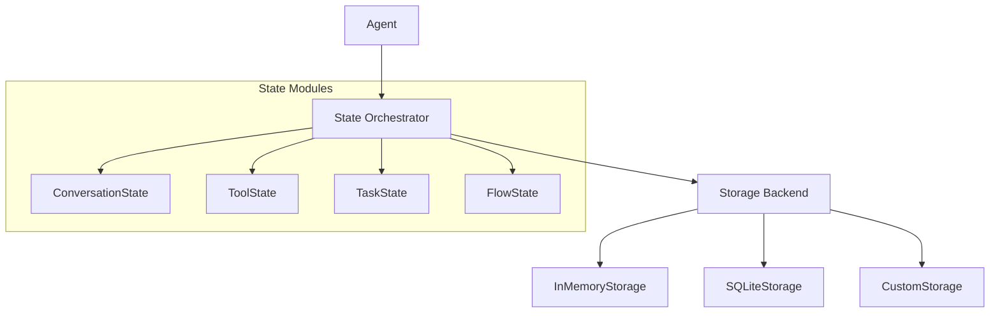

import ApiSurface from '@site/src/components/ApiSurface';

# State Management

Protolink's State system is a sophisticated, modular orchestration layer that manages the persistence of an agent's internal data. It bridges the gap between the high-level **Agent** logic and the low-level **Storage** backends, providing a unified API for session-based memory.

## Why use the State system?

In a distributed agentic system, maintaining context is critical. Without state management, every interaction is a "cold start." The State system allows agents to:

- **Resume conversations**: Remember what was said minutes or days ago.
- **Persist tool data**: Allow tools to keep track of their own history or configuration.
- **Track task progress**: Monitor long-running tasks across multiple execution cycles.
- **Coordinate flows**: Manage checkpoints and state transitions in complex workflows.

---

## Core Architecture

The `State` class acts as a central hub (orchestrator). When an agent is initialized, it creates a `State` instance which, in turn, initializes one or more **State Modules**. All these modules share the same `Storage` backend but manage different namespaces or data structures.



---

## State Modules

Protolink exposes four state module names through `StateMode`. You can enable them individually or in combination via the `state` parameter in the `Agent` constructor.

:::note[Current maturity]

`conversation` is the fully integrated automatic runtime path today: agents load LLM history before inference and save it afterward. `tools`, `task`, and `flow` are available as typed module slots for persistent extension work; they share the same storage backend, but only `flow` currently exposes a small `to_dict()` helper and tool/task modules intentionally stay minimal.

:::
### 1. Conversation State (`conversation`)
This is the most common module. It manages the `ConversationHistory` object used by LLMs.
- **Data Saved**: All messages (user, assistant, system, tool) in a session.
- **Key Factor**: Uses the `session_id` provided in task metadata to partition history.
- **Automatic Sync**: The `Agent` automatically loads history *before* inference and saves it *after* the task completes.

### 2. Tool State (`tools`)
Provides a dedicated module slot for tool-specific persistence.
- **Usage**: Useful for custom tools that need a shared storage handle for caches, counters, credentials, or external synchronization metadata.
- **Current behavior**: The module is initialized with the agent storage backend. Tool authors decide what APIs or conventions to add on top.

### 3. Task State (`task`)
Provides a dedicated module slot for task metadata persistence.
- **Usage**: Useful for applications that want to index, replay, or resume task-related metadata outside the in-memory `Task` object.
- **Current behavior**: Runtime task lifecycle transitions are managed on `Task.state` and recorded in `task.metadata["state_history"]`; the state module is a storage-backed extension point.

### 4. Flow State (`flow`)
Provides a storage-backed module for the **Structured Flows** architecture.
- **Usage**: Intended for checkpointing flow progress or storing workflow context across runs.
- **Current behavior**: `FlowState.to_dict()` returns the serialized storage contents. Flow orchestration also uses `task.flow_state` for per-task semantic context injection.

---

## Activation and Configuration

Enabling state persistence requires two steps: providing a **Storage** instance and specifying the **Enabled Modules**.

### Basic Setup (Conversation Only)
```python
from protolink.agents import Agent
from protolink.storage import SQLiteStorage

# 1. Setup persistent storage
storage = SQLiteStorage(db_path="agent.db", namespace="support_bot")

# 2. Enable conversation module
agent = Agent(
    card=card,
    storage=storage,
    state=["conversation"],
)
```

### Advanced Setup (Multi-Module)
```python
# Enable everything
agent = Agent(
    card=card,
    storage=storage,
    state=["conversation", "tools", "task", "flow"],
)
```

---

## Session Management

The State system relies on a `session_id` to know which data to load. Protolink handles this through **Task Metadata**.

### Providing a Session ID
When sending a task, include a `session_id` in the metadata:
```python
task = Task.create_infer("Hello, I'm Alice.")
task.metadata["session_id"] = "user_42_convo_A"

await agent.execute_task(task)
```

### Default Behavior
If no `session_id` is provided:

1.  **`invoke()` / `sync.invoke()`**: These methods use a default ID (`"invocation_session_id"`), ensuring that sequential calls to the same agent instance share history by default.
2.  **External Tasks**: The agent falls back to using the `task.id`. This effectively makes the task stateless across different task IDs, but persistent if the *same task* is updated and re-processed.

---

## The `State` Object API

The `State` object is accessible via the `agent.state` property. You can use it to interact with state modules directly.

<ApiSurface
  eyebrow="State module"
  title="State"
  path="protolink.state"
  description="The optional state container that gives agents durable conversation, tool, task, and flow memory while keeping persistence explicit and inspectable."
  pills={[
    "Conversation state",
    "Tool state",
    "Task state",
    "Flow state",
    "Control-plane access",
  ]}
  cards={[
    {
      title: "Modules",
      text: "Enable only the state domains an agent needs instead of turning on broad hidden memory.",
      code: "state=[...]",
    },
    {
      title: "Conversation",
      text: "Load, save, inspect, clear, and compact per-session conversation history.",
      code: "conversation",
    },
    {
      title: "Storage",
      text: "Backs state with the configured Storage implementation and namespace strategy.",
      code: "storage",
    },
    {
      title: "Remote control",
      text: "Describe, clear, export, and update state through typed Agent and AgentClient calls.",
      code: "describe_state()",
    },
  ]}
/>

| Property | Type | Description |
|----------|------|-------------|
| `conversation` | `ConversationState ⎪ None` | Access the conversation module. |
| `tools` | `ToolState ⎪ None` | Access the tool module. |
| `task` | `TaskState ⎪ None` | Access the task module. |
| `flow` | `FlowState ⎪ None` | Access the flow module. |
| `storage` | `Storage` | Access the underlying storage backend. |

### Manual State Interaction
```python
# Get history manually
if agent.state.conversation:
    history = agent.state.conversation.get_history("session_123")

# Clear a session
if agent.state.conversation:
    agent.state.conversation.clear_session("session_123")

# View everything as a dict
all_data = agent.state.to_dict()
```

## State Control Plane

Agents expose typed state inspection and mutation operations for applications
that need to prove what state exists without reading private storage directly.
These methods are available locally on `Agent` and remotely through
`AgentClient` request specs.

```python
from protolink import StateOperationRequest

report = await agent.describe_state("customer-42")
assert report.stores[0].name == "conversation"

reset = await agent.reset_state("customer-42")
assert "conversation" in reset.cleared

compacted = await agent.compact_state(
    "customer-42",
    strategy="tokens",
    max_tokens=8_000,
)
```

The result is a `StateOperationResult`:

| Field | Description |
|------|-------------|
| `operation` | `describe`, `reset`, or `compact`. |
| `session_id` | Target session when supplied. |
| `stores` | Per-store `StateStoreReport` entries. |
| `cleared` | Store names cleared by reset. |
| `compacted` | Store names compacted by compact. |
| `missing` | Requested stores that were not enabled or did not exist. |
| `errors` | Store-scoped errors that prevented part of the operation. |

Each `StateStoreReport` includes the store name, whether it is enabled, whether
state exists, item/message counts when known, and operation metadata. Passing
`include_data=True` to `describe_state()` includes the inspected payload in the
report for debugging or export workflows.

### Remote State Operations

`AgentClient` uses the same control-plane pattern as cancellation and history
compaction:

```python
report = await client.describe_state(agent_url, session_id="customer-42")
reset = await client.reset_state(agent_url, session_id="customer-42")
compacted = await client.compact_state(
    agent_url,
    session_id="customer-42",
    strategy="recent",
    max_messages=20,
)
```

The remote endpoints are:

| Operation | Endpoint | Capability |
|------|----------|------------|
| `describe_state()` | `POST /state/describe` | `state.describe` |
| `reset_state()` | `POST /state/reset` | `state.reset` |
| `compact_state()` | `POST /state/compact` | `state.compact` and `llm.history.compact` |

### Reset Semantics

Conversation state is session-keyed, so `reset_state("customer-42")` precisely
clears that conversation session. Calling `reset_state()` without a session ID
performs a full reset of the agent storage namespace for all enabled stores.
Partial full-store resets are rejected because the current storage abstraction
is namespace-based; ProtoLink reports that limitation instead of clearing more
state than requested.

`compact_state()` currently targets conversation state. It loads the persisted
session, runs the LLM-owned `HistoryCompactor`, saves the compacted history, and
returns before/after counts in the report metadata. The operation is still a
control-plane request and is never shown to the model as a tool.

---

## Comparison: Manual vs. Automated State

### Persistence Beyond A2A

A2A provides the task exchange model but does not prescribe application state storage. Without ProtoLink State, you load and save data inside `handle_task` yourself.

```python
async def handle_task(self, task):
    data = self.storage.load()
    # ... logic ...
    self.storage.save(data)
```

### Automated Persistence (Protolink State)
Protolink handles the lifecycle for you.
```python
# Just enable it in the constructor
agent = Agent(..., state=["conversation"])

# History is loaded and saved automatically in Agent.execute_task()
```

---

## Design Philosophy

The State system is built on three pillars:

1.  **Isolation**: Modules are decoupled. You can persist conversation history without persisting tool data.
2.  **Transparency**: All data is eventually serialized into the same storage backend, making it easy to backup or migrate.
3.  **Implicit Context**: By using `session_id` as a first-class citizen in metadata, Protolink creates a "sticky" context that follows the user or the workflow, regardless of which physical worker handles the request.
