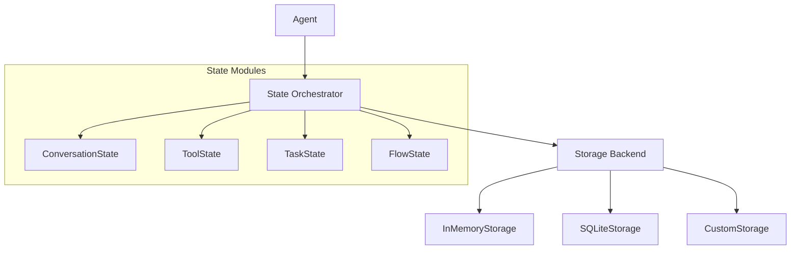

import ApiSurface from '@site/src/components/ApiSurface';
import ApiReference, {
  ApiCallout,
  ApiField,
  ApiFields,
  ApiSection,
} from '@site/src/components/ApiReference';

# State Management

Protolink's State system is a sophisticated, modular orchestration layer that manages the persistence of an agent's internal data. It bridges the gap between the high-level **Agent** logic and the low-level **Storage** backends, providing a unified API for session-based memory.

## Why use the State system?

In a distributed agentic system, maintaining context is critical. Without state management, every interaction is a "cold start." The State system allows agents to:

- **Resume conversations**: Remember what was said minutes or days ago.
- **Persist tool data**: Allow tools to keep track of their own history or configuration.
- **Track task progress**: Monitor long-running tasks across multiple execution cycles.
- **Coordinate flows**: Manage checkpoints and state transitions in complex workflows.

---

## Core Architecture

The `State` class acts as a central hub (orchestrator). When an agent is initialized, it creates a `State` instance which, in turn, initializes one or more **State Modules**. All enabled modules receive the exact same `Storage` object. The current state layer does not create a separate storage namespace per module; isolation is by module API and data convention, while the Storage instance's own namespace remains the physical persistence boundary.



---

## State Modules

Protolink exposes four state module names through `StateMode`. You can enable them individually or in combination via the `state` parameter in the `Agent` constructor.

:::note[Current maturity]

`conversation` is the fully integrated automatic runtime path today: agents load LLM history before inference and save it afterward. `tools`, `task`, and `flow` are available as typed module slots for persistent extension work; they share the same storage backend, but only `flow` currently exposes a small `to_dict()` helper and tool/task modules intentionally stay minimal.

:::
### 1. Conversation State (`conversation`)
This is the most common module. It manages the `ConversationHistory` object used by LLMs.
- **Data Saved**: All messages (user, assistant, system, tool) in a session.
- **Key Factor**: Uses the `session_id` provided in task metadata to partition history.
- **Automatic Sync**: The `Agent` automatically loads history *before* inference and saves it *after* the task completes.

### 2. Tool State (`tools`)
Provides a dedicated module slot for tool-specific persistence.
- **Usage**: Useful for custom tools that need a shared storage handle for caches, counters, credentials, or external synchronization metadata.
- **Current behavior**: The module is initialized with the agent storage backend. Tool authors decide what APIs or conventions to add on top.

### 3. Task State (`task`)
Provides a dedicated module slot for task metadata persistence.
- **Usage**: Useful for applications that want to index, replay, or resume task-related metadata outside the in-memory `Task` object.
- **Current behavior**: Runtime task lifecycle transitions are managed on `Task.state` and recorded in `task.metadata["state_history"]`; the state module is a storage-backed extension point.

### 4. Flow State (`flow`)
Provides a storage-backed module for the **Structured Flows** architecture.
- **Usage**: Intended for checkpointing flow progress or storing workflow context across runs.
- **Current behavior**: `FlowState.to_dict()` returns the serialized storage contents. Flow orchestration also uses `task.flow_state` for per-task semantic context injection.

---

## Activation and Configuration

Enabling state persistence requires two steps: providing a **Storage** instance and specifying the **Enabled Modules**.

### Basic Setup (Conversation Only)
```python
from protolink.agents import Agent
from protolink.storage import SQLiteStorage

# 1. Setup persistent storage
storage = SQLiteStorage(db_path="agent.db", namespace="support_bot")

# 2. Enable conversation module
agent = Agent(
    card=card,
    storage=storage,
    state=["conversation"],
)
```

### Advanced Setup (Multi-Module)
```python
# Enable everything
agent = Agent(
    card=card,
    storage=storage,
    state=["conversation", "tools", "task", "flow"],
)
```

---

## Session Management

The State system relies on a `session_id` to know which data to load. Protolink handles this through **Task Metadata**.

### Providing a Session ID
When sending a task, include a `session_id` in the metadata:
```python
task = Task.create_infer("Hello, I'm Alice.")
task.metadata["session_id"] = "user_42_convo_A"

await agent.execute_task(task)
```

### Default Behavior
If no `session_id` is provided:

1.  **`invoke()` / `sync.invoke()`**: These methods use a default ID (`"invocation_session_id"`), ensuring that sequential calls to the same agent instance share history by default.
2.  **External Tasks**: The agent falls back to using the `task.id`. This effectively makes the task stateless across different task IDs, but persistent if the *same task* is updated and re-processed.

---

## The `State` Object API

Construct `State` directly when application code needs manual module access, then retain that object while also passing it to `Agent(state=state)`. The current Agent implementation stores it internally and exposes state operations through `describe_state()`, `reset_state()`, and `compact_state()`; it does not define a public `agent.state` property.

<ApiSurface
  eyebrow="State module"
  title="State"
  path="protolink.state"
  description="The optional state container that gives agents durable conversation, tool, task, and flow memory while keeping persistence explicit and inspectable."
  pills={[
    "Conversation state",
    "Tool state",
    "Task state",
    "Flow state",
    "Control-plane access",
  ]}
  cards={[
    {
      title: "Modules",
      text: "Enable only the state domains an agent needs instead of turning on broad hidden memory.",
      code: "state=[...]",
    },
    {
      title: "Conversation",
      text: "Load, save, inspect, clear, and compact per-session conversation history.",
      code: "conversation",
    },
    {
      title: "Storage",
      text: "Backs state with the configured Storage implementation and namespace strategy.",
      code: "storage",
    },
    {
      title: "Remote control",
      text: "Describe, reset, and compact state through typed Agent and AgentClient calls.",
      code: "describe_state()",
    },
  ]}
/>

### State

<ApiReference kind="class" path="protolink.state.State" signature={`State(
    storage: Storage,
    enabled: list[StateMode],
)`} source="https://github.com/nMaroulis/protolink/blob/main/protolink/state/state.py">
Create the state orchestrator and instantiate the requested built-in modules in list order. Duplicate names replace the same dictionary entry rather than creating multiple stores.

<ApiSection title="Parameters"><ApiFields ariaLabel="State constructor parameters">
  <ApiField name="storage" type="Storage" required>Shared backend passed unchanged to every enabled module. State performs no runtime type validation.</ApiField>
  <ApiField name="enabled" type="list[StateMode]" required>Any combination of <code>"conversation"</code>, <code>"tools"</code>, <code>"task"</code>, and <code>"flow"</code>. An empty list creates a valid stateless orchestrator.</ApiField>
</ApiFields></ApiSection>

<ApiSection title="Raises"><ApiFields ariaLabel="State constructor errors"><ApiField name="ValueError">An enabled name is not registered in <code>STATE_REGISTRY</code>.</ApiField><ApiField name="module constructor error">Errors raised while binding a module to storage propagate.</ApiField></ApiFields></ApiSection>

<ApiCallout label="Shared persistence boundary">ConversationState and FlowState both read the complete storage payload. Enabling several modules does not create hidden per-module keys; applications extending tool/task/flow persistence must define a non-colliding data convention or separate Storage namespaces.</ApiCallout>

</ApiReference>

### State module properties

<ApiReference kind="properties" path="protolink.state.State modules" signature={`conversation: ConversationState | None
tools: ToolState | None
task: TaskState | None
flow: FlowState | None
storage: Storage
enabled_modes: tuple[StateMode, ...]`} source="https://github.com/nMaroulis/protolink/blob/main/protolink/state/state.py">
Access or replace enabled module objects and inspect their shared backend.

<ApiSection title="Properties"><ApiFields ariaLabel="State properties">
  <ApiField name="conversation" type="ConversationState | None">Enabled conversation module, or <code>None</code>. The setter accepts a replacement object without runtime validation; the getter returns it only when it is actually ConversationState.</ApiField>
  <ApiField name="tools" type="ToolState | None">Enabled tool extension slot, with the same setter/getter type behavior.</ApiField>
  <ApiField name="task" type="TaskState | None">Enabled task extension slot.</ApiField>
  <ApiField name="flow" type="FlowState | None">Enabled flow extension slot.</ApiField>
  <ApiField name="storage" type="Storage">Orchestrator backend reference.</ApiField>
  <ApiField name="enabled_modes" type="tuple[StateMode, ...]">Enabled names in fixed registry order: conversation, tools, task, then flow—not necessarily constructor-list order.</ApiField>
</ApiFields></ApiSection>

<ApiCallout label="Replacing storage">Assigning <code>state.storage</code> changes only the orchestrator's <code>_storage</code> reference. Existing ConversationState, ToolState, TaskState, and FlowState instances retain the Storage object they received at construction.</ApiCallout>

</ApiReference>

### State.describe

<ApiReference kind="method" path="protolink.state.State.describe" signature={`describe(
    request: StateOperationRequest | None = None,
) -> StateOperationResult`} source="https://github.com/nMaroulis/protolink/blob/main/protolink/state/state.py">
Inspect requested stores without mutation. Omission creates a default request and reports every enabled module in deterministic registry order.

<ApiSection title="Parameters"><ApiFields ariaLabel="State describe parameters"><ApiField name="request" type="StateOperationRequest | None" defaultValue="None">Optional store selection, session scope, data-inclusion flag, and application metadata. Request metadata is not copied into the result by the current orchestrator.</ApiField></ApiFields></ApiSection>

<ApiSection title="Returns"><ApiFields ariaLabel="State describe return"><ApiField name="result" type="StateOperationResult">One report per requested store plus disabled names in <code>missing</code>. Conversation reports become session-scoped when a session ID is supplied.</ApiField></ApiFields></ApiSection>

<ApiCallout label="Exists semantics">For whole-store reports, module <code>to_dict()</code> methods return <code>{'{}'}</code> for empty storage, so <code>exists</code> is true even when <code>item_count</code> is zero. Session-scoped conversation reports test the selected session directly.</ApiCallout>

</ApiReference>

### State.reset

<ApiReference kind="method" path="protolink.state.State.reset" signature={`reset(
    request: StateOperationRequest | None = None,
) -> StateOperationResult`} source="https://github.com/nMaroulis/protolink/blob/main/protolink/state/state.py">
Clear one conversation session or delete the entire shared storage namespace, depending on request scope.

<ApiSection title="Parameters"><ApiFields ariaLabel="State reset parameters"><ApiField name="request" type="StateOperationRequest | None" defaultValue="None">A session ID defaults selection to conversation. Without a session, an empty store selection means every enabled mode.</ApiField></ApiFields></ApiSection>

<ApiSection title="Returns"><ApiFields ariaLabel="State reset return"><ApiField name="result" type="StateOperationResult">Structured cleared, missing, and error reports. Unsupported partial resets are reported rather than raised.</ApiField></ApiFields></ApiSection>

<ApiCallout label="Namespace deletion">A full reset calls <code>storage.delete()</code> once. A non-session subset that differs from all enabled modes is rejected because deleting the shared namespace would clear more than requested.</ApiCallout>

</ApiReference>

### State.to_dict

<ApiReference kind="method" path="protolink.state.State.to_dict" signature={`to_dict() -> dict[str, Any]`} source="https://github.com/nMaroulis/protolink/blob/main/protolink/state/state.py">
Call <code>to_dict()</code> on each enabled module that implements it and return results keyed by module name. ToolState and TaskState are omitted because they currently expose no serializer. Because ConversationState and FlowState share storage and both serialize the whole payload, enabling both may duplicate the same data under two keys.

</ApiReference>

### Manual State Interaction
```python
from protolink.state import State

state = State(storage=storage, enabled=["conversation"])
agent = Agent(card=card, storage=storage, state=state)

# Get history manually
if state.conversation:
    history = state.conversation.get_history("session_123")

# Clear a session
if state.conversation:
    state.conversation.clear_session("session_123")

# View everything as a dict
all_data = state.to_dict()
```

## Enabled Store APIs

### ConversationState

<ApiReference kind="class" path="protolink.state.ConversationState" signature={`ConversationState(
    storage: Storage,
)`} source="https://github.com/nMaroulis/protolink/blob/main/protolink/state/conversation.py">
Manage a dictionary of serialized ConversationHistory lists keyed by session ID.

<ApiSection title="Parameters"><ApiFields ariaLabel="ConversationState constructor parameters"><ApiField name="storage" type="Storage" required>Backend whose entire loaded payload is expected to be a mapping from session IDs to message lists.</ApiField></ApiFields></ApiSection>

<ApiCallout label="Payload assumption">The implementation uses <code>storage.load() or {}</code> and then mapping operations. A truthy non-dictionary payload raises at runtime.</ApiCallout>

</ApiReference>

### ConversationState.get_history

<ApiReference kind="method" path="protolink.state.ConversationState.get_history" signature={`get_history(
    session_id: str,
    default_system_prompt: str | None = None,
) -> ConversationHistory`} source="https://github.com/nMaroulis/protolink/blob/main/protolink/state/conversation.py">
Load and deserialize one session, or create a fresh history when the key is missing or its stored value is empty.

<ApiSection title="Parameters"><ApiFields ariaLabel="get history parameters"><ApiField name="session_id" type="str" required>Exact dictionary key; no normalization or validation is applied.</ApiField><ApiField name="default_system_prompt" type="str | None" defaultValue="None">System prompt used only for a newly created history.</ApiField></ApiFields></ApiSection>

<ApiSection title="Returns"><ApiFields ariaLabel="get history return"><ApiField name="history" type="ConversationHistory">A reconstructed or new mutable history. Reading does not write it back.</ApiField></ApiFields></ApiSection>

<ApiSection title="Raises"><ApiFields ariaLabel="get history errors"><ApiField name="storage or history error">Backend failures, incompatible payload shapes, and malformed serialized messages propagate.</ApiField></ApiFields></ApiSection>

</ApiReference>

### ConversationState.save_history

<ApiReference kind="method" path="protolink.state.ConversationState.save_history" signature={`save_history(
    session_id: str,
    history: ConversationHistory,
)`} source="https://github.com/nMaroulis/protolink/blob/main/protolink/state/conversation.py">
Load the complete session mapping, replace one key with <code>history.to_list()</code>, and save the complete mapping.

<ApiSection title="Parameters"><ApiFields ariaLabel="save history parameters"><ApiField name="session_id" type="str" required>Session key to create or replace.</ApiField><ApiField name="history" type="ConversationHistory" required>History serialized into its provider-neutral message-list representation.</ApiField></ApiFields></ApiSection>

<ApiSection title="Returns"><ApiFields ariaLabel="save history return"><ApiField name="None" type="None">The implementation has no explicit return annotation and returns <code>None</code>.</ApiField></ApiFields></ApiSection>

<ApiCallout label="Read-modify-write">The storage abstraction is single-value. Concurrent writers outside Agent's per-session lock can overwrite one another because every save rewrites the full session dictionary.</ApiCallout>

</ApiReference>

### ConversationState.clear_session

<ApiReference kind="method" path="protolink.state.ConversationState.clear_session" signature={`clear_session(
    session_id: str,
)`} source="https://github.com/nMaroulis/protolink/blob/main/protolink/state/conversation.py">
Delete one session key and save the remaining mapping. If the key is absent, return without calling <code>storage.save()</code>.

<ApiSection title="Parameters"><ApiFields ariaLabel="clear session parameters"><ApiField name="session_id" type="str" required>Exact stored conversation-session key to remove.</ApiField></ApiFields></ApiSection>

</ApiReference>

### ConversationState.to_dict

<ApiReference kind="method" path="protolink.state.ConversationState.to_dict" signature={`to_dict() -> dict`} source="https://github.com/nMaroulis/protolink/blob/main/protolink/state/conversation.py">
Return <code>storage.load()</code> directly, falling back to a new empty dictionary for falsey values. The returned mapping is not defensively copied.

</ApiReference>

### ToolState / TaskState

<ApiReference kind="classes" path="protolink.state.ToolState / TaskState" signature={`ToolState(storage: Storage)
TaskState(storage: Storage)`} source="https://github.com/nMaroulis/protolink/blob/main/protolink/state/task.py#L8">
Bind the shared storage object as <code>_storage</code>. These are intentionally minimal extension slots: they currently expose no public persistence, retrieval, reset, or serialization methods of their own. `TaskState` is linked above; [`ToolState`](https://github.com/nMaroulis/protolink/blob/main/protolink/state/tool.py#L8) has the same constructor shape.

<ApiSection title="Parameters"><ApiFields ariaLabel="Tool and Task state parameters"><ApiField name="storage" type="Storage" required>Backend retained for application-defined extensions.</ApiField></ApiFields></ApiSection>

</ApiReference>

### FlowState

<ApiReference kind="class" path="protolink.state.FlowState" signature={`FlowState(
    storage: Storage,
)`} source="https://github.com/nMaroulis/protolink/blob/main/protolink/state/flow.py">
Bind a storage-backed flow extension slot.

<ApiSection title="Parameters"><ApiFields ariaLabel="FlowState constructor parameters"><ApiField name="storage" type="Storage" required>Shared backend.</ApiField></ApiFields></ApiSection>

</ApiReference>

### FlowState.to_dict

<ApiReference kind="method" path="protolink.state.FlowState.to_dict" signature={`to_dict() -> dict`} source="https://github.com/nMaroulis/protolink/blob/main/protolink/state/flow.py">
Return the entire loaded storage payload or an empty dictionary. This helper does not serialize the transient <code>Task.flow_state</code> prompt used by structured-flow execution unless the application explicitly wrote that data to Storage.

</ApiReference>

## State Control Plane

Agents expose typed state inspection and mutation operations for applications
that need to prove what state exists without reading private storage directly.
These methods are available locally on `Agent` and remotely through
`AgentClient` request specs.

```python
from protolink import StateOperationRequest

report = await agent.describe_state("customer-42")
assert report.stores[0].name == "conversation"

reset = await agent.reset_state("customer-42")
assert "conversation" in reset.cleared

compacted = await agent.compact_state(
    "customer-42",
    strategy="tokens",
    max_tokens=8_000,
)
```

The request and result models are immutable dataclasses designed to cross local, HTTP, WebSocket, runtime, and other transport boundaries.

### StateOperationRequest

<ApiReference kind="frozen dataclass" path="protolink.state.StateOperationRequest" signature={`StateOperationRequest(
    session_id: str | None = None,
    stores: tuple[str, ...] = (),
    include_data: bool = False,
    strategy: HistoryCompactionStrategy = "tokens",
    max_messages: int = 20,
    max_tokens: int = 4000,
    preserve_recent: int = 6,
    summary_max_tokens: int = 512,
    metadata: dict[str, Any] = field(default_factory=dict),
)`} source="https://github.com/nMaroulis/protolink/blob/main/protolink/state/operations.py">
Describe the scope and compaction settings for one state control-plane operation. The same type is reused for describe, reset, and compact; the receiving operation decides which fields apply.

<ApiSection title="Fields"><ApiFields ariaLabel="StateOperationRequest fields">
  <ApiField name="session_id" type="str | None" defaultValue="None">Optional session scope. Conversation is the only built-in session-keyed store.</ApiField>
  <ApiField name="stores" type="tuple[str, ...]" defaultValue="()">Requested stores. Empty delegates selection to the operation: enabled modes for describe/full reset and conversation for compact.</ApiField>
  <ApiField name="include_data" type="bool" defaultValue="False">Include inspected payloads in describe reports.</ApiField>
  <ApiField name="strategy" type={'Literal["recent", "tokens", "summary"]'} defaultValue={'"tokens"'}>History compaction strategy.</ApiField>
  <ApiField name="max_messages" type="int" defaultValue="20">Positive message limit.</ApiField>
  <ApiField name="max_tokens" type="int" defaultValue="4000">Positive estimated token ceiling.</ApiField>
  <ApiField name="preserve_recent" type="int" defaultValue="6">Non-negative number of newest messages protected during token/summary compaction.</ApiField>
  <ApiField name="summary_max_tokens" type="int" defaultValue="512">Positive requested summary length.</ApiField>
  <ApiField name="metadata" type="dict[str, Any]" defaultValue="{}">Application-owned request context, created with a per-instance default factory.</ApiField>
</ApiFields></ApiSection>

<ApiSection title="Raises"><ApiFields ariaLabel="StateOperationRequest errors"><ApiField name="ValueError">Invalid strategy, limits below one, or negative <code>preserve_recent</code>.</ApiField></ApiFields></ApiSection>

<ApiCallout label="Store normalization">Post-initialization converts each truthy store value to string and removes empty-string values. It does not restrict names to the four built-ins, allowing disabled or application-defined names to be reported explicitly.</ApiCallout>

</ApiReference>

### StateOperationRequest.to_dict / from_dict

<ApiReference kind="methods" path="protolink.state.StateOperationRequest serialization" signature={`to_dict() -> dict[str, Any]
StateOperationRequest.from_dict(
    data: dict[str, Any] | None,
) -> StateOperationRequest`} source="https://github.com/nMaroulis/protolink/blob/main/protolink/state/operations.py">
Serialize tuples as lists or coerce a decoded mapping back into a validated request. <code>from_dict(None)</code> creates defaults; a string <code>stores</code> value becomes a one-element tuple, numeric limits pass through <code>int()</code>, and metadata is copied.

<ApiSection title="Parameters"><ApiFields ariaLabel="StateOperationRequest serialization parameters"><ApiField name="data" type="dict[str, Any] | None" required>Decoded request mapping passed to `from_dict()`; explicit `None` selects all request defaults.</ApiField></ApiFields></ApiSection>

</ApiReference>

### StateStoreReport

<ApiReference kind="frozen dataclass" path="protolink.state.StateStoreReport" signature={`StateStoreReport(
    name: str,
    enabled: bool,
    exists: bool = False,
    item_count: int | None = None,
    message_count: int | None = None,
    cleared: bool = False,
    compacted: bool = False,
    data: Any | None = None,
    metadata: dict[str, Any] = field(default_factory=dict),
    error: str | None = None,
)`} source="https://github.com/nMaroulis/protolink/blob/main/protolink/state/operations.py">
Report the observation or mutation outcome for one store.

<ApiSection title="Fields"><ApiFields ariaLabel="StateStoreReport fields">
  <ApiField name="name" type="str" required>Requested store name.</ApiField>
  <ApiField name="enabled" type="bool" required>Whether the State orchestrator has that module.</ApiField>
  <ApiField name="exists" type="bool" defaultValue="False">Whether relevant store or session data exists under the orchestrator's reporting semantics.</ApiField>
  <ApiField name="item_count" type="int | None" defaultValue="None">Length for mapping, list, tuple, or set payloads.</ApiField>
  <ApiField name="message_count" type="int | None" defaultValue="None">Conversation-session message count when known.</ApiField>
  <ApiField name="cleared" type="bool" defaultValue="False">Reset mutation succeeded for this store.</ApiField>
  <ApiField name="compacted" type="bool" defaultValue="False">Compaction succeeded for this store.</ApiField>
  <ApiField name="data" type="Any | None" defaultValue="None">Optional inspected payload when requested.</ApiField>
  <ApiField name="metadata" type="dict[str, Any]" defaultValue="{}">Operation-specific before/after or session-scope details.</ApiField>
  <ApiField name="error" type="str | None" defaultValue="None">Store-scoped non-exception failure.</ApiField>
</ApiFields></ApiSection>

<ApiCallout label="Validation boundary">Direct construction performs no semantic validation between flags. <code>from_dict()</code> applies basic string, bool, integer, and dictionary coercion but likewise permits combinations such as <code>enabled=False</code> with <code>cleared=True</code>.</ApiCallout>

</ApiReference>

### StateStoreReport.to_dict / from_dict

<ApiReference kind="methods" path="protolink.state.StateStoreReport serialization" signature={`to_dict() -> dict[str, Any]
StateStoreReport.from_dict(
    data: dict[str, Any],
) -> StateStoreReport`} source="https://github.com/nMaroulis/protolink/blob/main/protolink/state/operations.py">
Serialize recursively with <code>dataclasses.asdict()</code> or reconstruct a report. Missing names become <code>"unknown"</code>; optional counts are converted with <code>int()</code>.

<ApiSection title="Parameters"><ApiFields ariaLabel="StateStoreReport serialization parameters"><ApiField name="data" type="dict[str, Any]" required>Decoded store-report mapping passed to `from_dict()`.</ApiField></ApiFields></ApiSection>

</ApiReference>

### StateOperationResult

<ApiReference kind="frozen dataclass" path="protolink.state.StateOperationResult" signature={`StateOperationResult(
    operation: Literal["describe", "reset", "compact"],
    session_id: str | None = None,
    stores: tuple[StateStoreReport, ...] = (),
    cleared: tuple[str, ...] = (),
    compacted: tuple[str, ...] = (),
    missing: tuple[str, ...] = (),
    errors: tuple[dict[str, str], ...] = (),
    metadata: dict[str, Any] = field(default_factory=dict),
)`} source="https://github.com/nMaroulis/protolink/blob/main/protolink/state/operations.py">
Aggregate all per-store reports and operation-level outcome lists.

<ApiSection title="Fields"><ApiFields ariaLabel="StateOperationResult fields">
  <ApiField name="operation" type={'Literal["describe", "reset", "compact"]'} required>Logical operation represented by the result.</ApiField>
  <ApiField name="session_id" type="str | None" defaultValue="None">Target session when supplied.</ApiField>
  <ApiField name="stores" type="tuple[StateStoreReport, ...]" defaultValue="()">Per-store results.</ApiField>
  <ApiField name="cleared" type="tuple[str, ...]" defaultValue="()">Stores cleared by reset.</ApiField>
  <ApiField name="compacted" type="tuple[str, ...]" defaultValue="()">Stores compacted.</ApiField>
  <ApiField name="missing" type="tuple[str, ...]" defaultValue="()">Requested stores not enabled or data not found, depending on the producing operation.</ApiField>
  <ApiField name="errors" type="tuple[dict[str, str], ...]" defaultValue="()">Structured store/message failures.</ApiField>
  <ApiField name="metadata" type="dict[str, Any]" defaultValue="{}">Application or operation metadata.</ApiField>
</ApiFields></ApiSection>

<ApiCallout label="Construction versus parsing">Direct dataclass construction trusts the annotated operation value at runtime. <code>from_dict()</code> explicitly rejects operations outside describe, reset, and compact.</ApiCallout>

</ApiReference>

### StateOperationResult.to_dict / from_dict

<ApiReference kind="methods" path="protolink.state.StateOperationResult serialization" signature={`to_dict() -> dict[str, Any]
StateOperationResult.from_dict(
    data: dict[str, Any],
) -> StateOperationResult`} source="https://github.com/nMaroulis/protolink/blob/main/protolink/state/operations.py">
Convert tuple fields into transport-friendly lists and nested report dictionaries, or reconstruct the immutable result. Parsing copies error and metadata mappings so they are not shared with the decoded payload.

<ApiSection title="Parameters"><ApiFields ariaLabel="StateOperationResult serialization parameters"><ApiField name="data" type="dict[str, Any]" required>Decoded operation-result mapping passed to `from_dict()`.</ApiField></ApiFields></ApiSection>

</ApiReference>

Each `StateStoreReport` includes the store name, whether it is enabled, whether
state exists, item/message counts when known, and operation metadata. Passing
`include_data=True` to `describe_state()` includes the inspected payload in the
report for debugging or export workflows.

### Remote State Operations

`AgentClient` uses the same control-plane pattern as cancellation and history
compaction:

```python
report = await client.describe_state(agent_url, session_id="customer-42")
reset = await client.reset_state(agent_url, session_id="customer-42")
compacted = await client.compact_state(
    agent_url,
    session_id="customer-42",
    strategy="recent",
    max_messages=20,
)
```

The remote endpoints are:

| Operation | Endpoint | Capability |
|------|----------|------------|
| `describe_state()` | `POST /state/describe` | `state.describe` |
| `reset_state()` | `POST /state/reset` | `state.reset` |
| `compact_state()` | `POST /state/compact` | `state.compact` and `llm.history.compact` |

### Reset Semantics

Conversation state is session-keyed, so `reset_state("customer-42")` precisely
clears that conversation session. Calling `reset_state()` without a session ID
performs a full reset of the agent storage namespace for all enabled stores.
Partial full-store resets are rejected because the current storage abstraction
is namespace-based; ProtoLink reports that limitation instead of clearing more
state than requested.

`compact_state()` currently targets conversation state. It loads the persisted
session, runs the LLM-owned `HistoryCompactor`, saves the compacted history, and
returns before/after counts in the report metadata. The operation is still a
control-plane request and is never shown to the model as a tool.

---

## Comparison: Manual vs. Automated State

### Persistence Beyond A2A

A2A provides the task exchange model but does not prescribe application state storage. Without ProtoLink State, you load and save data inside `handle_task` yourself.

```python
async def handle_task(self, task):
    data = self.storage.load()
    # ... logic ...
    self.storage.save(data)
```

### Automated Persistence (Protolink State)
Protolink handles the lifecycle for you.
```python
# Just enable it in the constructor
agent = Agent(..., state=["conversation"])

# History is loaded and saved automatically in Agent.execute_task()
```

---

## Design Philosophy

The State system is built on three pillars:

1.  **Selective modules**: Module APIs are decoupled and enabled independently. They currently share one Storage payload, so applications adding tool/task/flow persistence must still establish non-colliding keys or separate namespaces.
2.  **Transparency**: All data is eventually serialized into the same storage backend, making it easy to backup or migrate.
3.  **Implicit Context**: By using `session_id` as a first-class citizen in metadata, Protolink creates sticky conversation context across workers when those workers use the same durable storage namespace.
