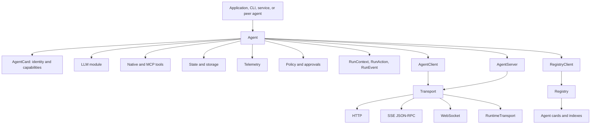
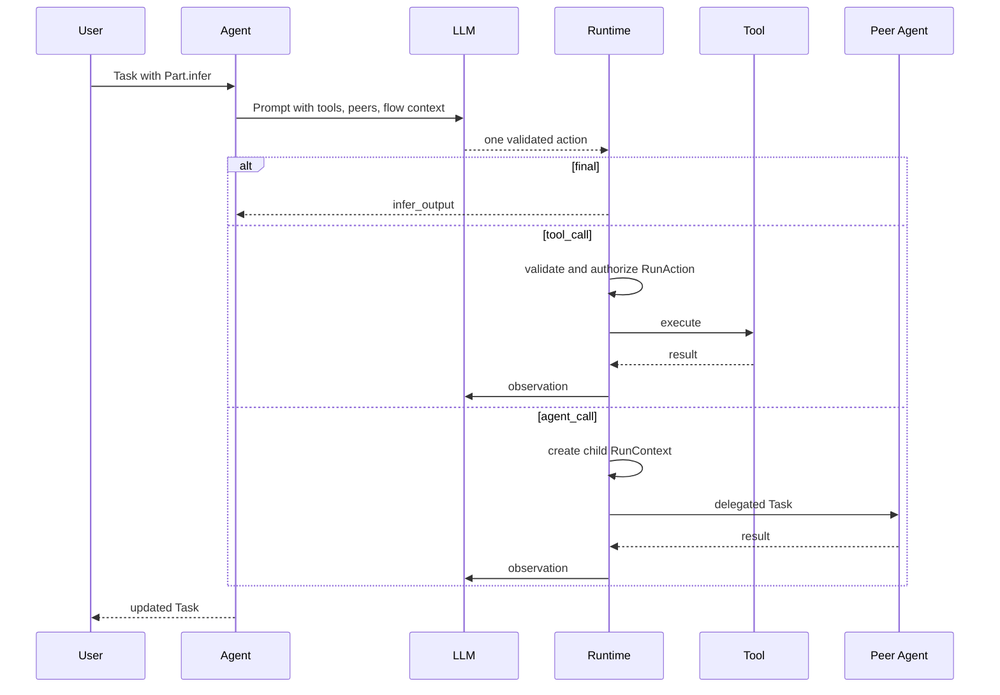
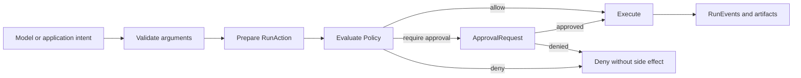
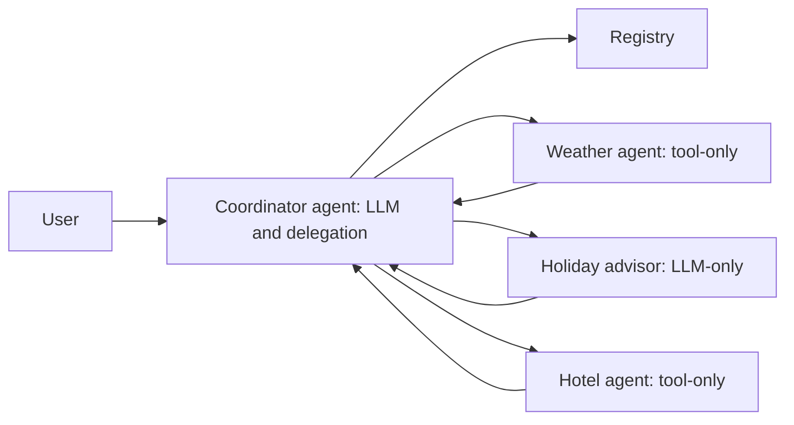

# ProtoLink Whitepaper

## An A2A-Native Runtime for Autonomous, Pluggable Agent Systems

ProtoLink is a Python framework for building distributed multi-agent systems
where agents are not just function calls wrapped around a model. In ProtoLink,
an agent is an autonomous runtime entity: it has an identity, a lifecycle, an
LLM if it needs one, tools if it exposes capabilities, state if it needs memory,
telemetry if it must be observed, policy if it can cause side effects, and
transports if it must communicate with other agents or applications.

The core idea is deliberately simple:

> Agents are entities, not functions. A ProtoLink system is built by composing
> autonomous agents that communicate through protocol-native tasks.

ProtoLink implements and extends Google's Agent-to-Agent (A2A) model. A2A gives
the system the right public language: agent cards, tasks, messages, parts,
artifacts, task states, and discovery. ProtoLink keeps that language at the
center, then adds the runtime substrate needed to make those protocol objects
useful in real systems: LLM execution, tool calling, agent delegation, transports,
registry discovery, structured flows, state, cancellation, budgets, approvals,
telemetry, normalized events, run reports, and replay.

The result is a framework for treating agent systems as distributed programs,
not as opaque prompt graphs.

## Abstract

Modern agent applications need more than a model call. They need identity,
communication, tool execution, delegation, state, policy, observability, and a
way to move from local experiments to distributed deployments without rewriting
the system.

Many frameworks begin with the model and build orchestration outward. ProtoLink
begins with the agent. The model is one pluggable module inside an autonomous
entity. Tools, transports, storage, telemetry, authentication, and runtime
policy are also modules. The public contract between agents remains A2A-native:
a `Task` is exchanged, `Message` and `Artifact` objects carry content, and
`Part` objects describe atomic actions or outputs.

ProtoLink extends that protocol foundation with a deterministic runtime:

- LLMs declare one typed action at a time.
- The runtime validates, authorizes, executes, observes, and records that action.
- Tool calls and agent delegations are explicit `Part` and action records.
- `RunContext` carries session, trace, permission, budget, cancellation, and
  parent-child execution metadata.
- `RunEvent` and `RunReport` provide stable application-facing streams and
  replayable summaries.
- Structured flows remain `Flow.execute(Task) -> Task`, so deterministic
  orchestration does not abandon the A2A data model.

The design goal is not to hide distributed systems complexity behind magic. The
goal is to make the useful boundaries explicit, typed, inspectable, swappable,
and easy to assemble.

## The Problem

Agent applications often start as a single script:

1. Send a prompt to an LLM.
2. Ask the model to pick a tool.
3. Parse the response.
4. Run some Python.
5. Feed the result back to the model.
6. Repeat until the output looks final.

That is enough for a demo, but it becomes fragile as soon as the system grows.
The application needs multiple specialized agents, different model providers,
streaming progress, persistence, cancellation, tool schemas, approvals, traces,
state cleanup, deployment topology, and tests that can prove what happened.

Without a shared runtime layer, each application invents private conventions:

- `metadata["session_id"]` in one service and `metadata["thread"]` in another.
- One ad hoc format for tool calls and another for delegated agent calls.
- Provider-native tool calling in one model and JSON prompt parsing in another.
- Streaming events that are easy to render but hard to replay.
- Flow graphs that orchestrate work but are disconnected from the wire protocol.
- Approvals that happen after a tool has already been partially prepared.
- Cancellation that marks a task as stopped but cannot reach active execution.

The problem is not that these systems are impossible to build. The problem is
that the repeated glue becomes the product. ProtoLink exists to move that glue
into a reusable runtime while keeping the application logic visible.

## Design Thesis

ProtoLink's design starts from five principles.

### 1. The Agent Is The Unit Of Autonomy

An agent is not a callback. It is a runtime entity that can receive work, initiate
work, discover peers, maintain state, expose tools, call its model, delegate to
other agents, stream progress, and shut down cleanly.

This matters because real multi-agent systems are not just nested function calls.
A weather agent, a booking agent, a code-reading agent, and an approval-gated
file-writing agent should be able to exist as separate processes, local in-memory
actors, or remote services without changing their business logic.

### 2. Protocol Objects Are The Shared Language

ProtoLink keeps A2A-style primitives at the center:

- `AgentCard` declares identity, capabilities, skills, tags, formats, security,
  and transport metadata.
- `Task` is the shared unit of work.
- `Message` carries communication.
- `Part` is the atomic action or content unit.
- `Artifact` records outputs, previews, and generated results.
- `TaskState` tracks lifecycle.

This gives agents a portable, serializable language. A workflow step, a remote
task submission, a streaming update, and a replay report all point back to the
same task model.

### 3. Pluggability Is A Runtime Property

LLMs, tools, transports, storage, telemetry, authentication, logging, and policy
are not special cases scattered through application code. They are modules
plugged into the agent.

That is the difference between a model wrapper and an agent runtime. You can
replace OpenAI with Ollama, HTTP with an in-process runtime transport, local
traces with LangSmith or Langfuse, in-memory state with SQLite, or a permissive
policy with approval-gated side effects without rewriting the agent's task
contract.

### 4. The Model Declares Intent, The Runtime Executes

ProtoLink treats LLM output as a proposal, not as authority. The LLM can propose
a `final`, `tool_call`, or `agent_call` action. The runtime parses and validates
that action, checks cancellation and budgets, authorizes side effects, executes
the operation, records events, and feeds the result back to the model.

This separation lets the system use provider-native tool calling when available
and JSON action fallback when a smaller or local model is better served by a
simple text contract. The runtime-facing behavior remains the same.

### 5. Production Control Should Be Domain-Neutral

`RunContext`, `RunAction`, `PolicyDecision`, `ApprovalRequest`, `RunEvent`, and
`RunReport` do not assume that the application is a coding assistant, a browser
agent, a support bot, a booking system, or a data pipeline. They carry generic
execution metadata and structured action records. The application supplies the
domain meaning.

That keeps the framework reusable while still making serious runtime concerns
first-class.

## Architecture At A Glance

At the top level, ProtoLink is centered on the `Agent` facade. The agent owns
its identity and wires together the subsystems that make the entity operational.
Client/server layers provide intent-level communication APIs. Transports handle
protocol and runtime details. The registry provides discovery. The runtime layer
normalizes execution context, policy, events, and reports.



The architectural dependency direction is important:

- The agent owns client and server components.
- The client and server use transports.
- Transports know about protocols, routes, serialization, event loops, and I/O.
- Agent logic does not need to know whether a peer is local, HTTP, SSE, or
  WebSocket.

This is the core ports-and-adapters shape of ProtoLink. The agent expresses
intent. The client/server layer turns intent into requests and handlers. The
transport performs the protocol work.

## Why Build On A2A?

A2A is valuable because it defines an interoperable grammar for agent systems.
It gives agents a way to describe themselves and exchange work without assuming
that every participant shares the same framework internals.

ProtoLink uses that foundation for:

- Agent identity through `AgentCard`.
- Capability and skill declaration.
- Task exchange.
- Message and artifact history.
- Task state transitions.
- Discovery through a registry-oriented pattern.

But A2A intentionally leaves many runtime concerns out of scope. It does not
define how an agent should embed an LLM, how tools should be registered, how a
model should choose between tools and peer agents, how state should be loaded,
how approvals should be requested, how budgets should be enforced, or how a UI
should replay a run.

ProtoLink extends A2A at the runtime layer.

| Concern | A2A foundation | ProtoLink extension |
| --- | --- | --- |
| Identity | Agent card | Runtime `Agent` entity with card, lifecycle, modules, state, and policy |
| Work unit | Task | Deterministic task execution over explicit `Part` actions |
| Capability declaration | Skills/capabilities | Native tools, MCP tools, schemas, tags, examples, and runtime capabilities |
| Communication | Protocol objects | Agent-owned client/server and pluggable transports |
| Discovery | Agent metadata | Registry service with indexed lookup and dynamic capability injection |
| LLMs | Out of scope | Provider-agnostic LLM wrappers and controlled inference loop |
| Runtime metadata | Task metadata | Typed `RunContext` with session, trace, permissions, budget, and cancellation |
| Side effects | Out of scope | `RunAction`, policies, approval checkpoints, preview artifacts |
| Observability | Out of scope | `RunEvent`, telemetry, `RunReport`, `RunReplay`, redaction |
| Workflows | Out of scope | Structured flows over `Task` input/output |

The important design choice is that the extension does not replace the protocol
model. It builds on it.

## The Protocol Core

ProtoLink's core data model is small but expressive.

### Task

A `Task` is the unit of work exchanged between agents. It contains messages,
artifacts, metadata, flow state, creation time, and lifecycle state. The default
lifecycle is:

```text
submitted -> working -> completed
submitted -> working -> input-required
submitted -> working -> failed
submitted -> working -> canceled
```

Terminal states cannot transition further. Successful transitions are recorded
in `task.metadata["state_history"]`, which gives applications and tests a
timeline without requiring a separate task database.

### Message

A `Message` is communicative. It is sent by a user, an agent, a system, or an
assistant-style participant. Messages contain ordered `Part` objects.

### Part

A `Part` is the atomic unit. It can be plain text, JSON, a tool call, a tool
output, an inference request, an inference result, an error, a status, a route
decision, media, and other serializable content.

The executable parts are especially important:

- `Part.infer(...)` asks an agent to invoke its LLM.
- `Part.tool_call(...)` asks an agent to execute one registered tool.
- `Part.route(...)` or `Part.decision(...)` records a structured flow branch.

The runtime does not guess. If the last task item contains no executable part,
the default agent handler does not invent one.

### Artifact

An `Artifact` contains produced output. Tool outputs, inference outputs,
approval previews, generated files, intermediate results, and final reports can
be represented as artifacts. Artifacts also carry descriptors such as `kind`,
`name`, `uri`, `media_type`, metadata, and action IDs.

This is important for approvals and replay. A side effect can attach a preview
artifact before execution, and a UI can render it without running the operation.

## The Agent As Autonomous Runtime Entity

The public `Agent` class is the stable facade. Internally, the implementation is
split across mixins and an execution engine so that lifecycle, communication,
tool registration, configuration, control-plane operations, serialization, and
task execution remain separable.

An agent can be:

- Tool-only: deterministic capabilities with no LLM.
- LLM-only: reasoning or transformation without side-effecting tools.
- Hybrid: LLM plus tools.
- Coordinator: LLM plus registry discovery and delegation.
- Worker: specialized endpoint for a narrow capability.
- Local actor: using `RuntimeTransport`.
- Network service: using HTTP, SSE JSON-RPC, or WebSocket.

The constructor wires in the major modules:

```python
from protolink import Agent, AgentCard, create_llm
from protolink.storage import SQLiteStorage
from protolink.telemetry import LocalTraceTelemetry

agent = Agent(
    card=AgentCard(
        name="researcher",
        description="Researches and summarizes technical questions",
        url="runtime://researcher",
        capabilities={"streaming": True, "delegation": True},
        tags=["research", "summarization"],
    ),
    transport="runtime",
    llm=create_llm("mock", default_response="ready"),
    storage=SQLiteStorage(db_path="researcher.db"),
    state=["conversation"],
    telemetry=LocalTraceTelemetry(path="traces.jsonl"),
)
```

The exact LLM, storage backend, telemetry backend, transport, authentication
strategy, and policy can change. The agent contract stays the same.

### AgentCard: Identity And Capability

`AgentCard` is the public description of an agent. It includes:

- `name`
- `description`
- `url`
- `transport`
- `version`
- `protocolVersion`
- `capabilities`
- `skills`
- `inputFormats`
- `outputFormats`
- `securitySchemes`
- `tags`

ProtoLink extends the base identity concept with runtime-relevant capability
flags such as `has_llm`, `tool_calling`, `delegation`, `streaming`,
`multi_step_reasoning`, `rag`, `code_execution`, and `max_concurrency`.

Tools registered on the agent can become advertised skills. That lets peer
agents discover not only that an agent exists, but what it can do and how to
call it.

### Agent Lifecycle

The lifecycle is intentionally straightforward:

1. Instantiate the agent with a card and modules.
2. Configure transport, client, server, registry, tools, state, and policy.
3. Start the agent.
4. Register with the registry if configured.
5. Receive and execute tasks.
6. Send tasks or messages to peers when needed.
7. Stop cleanly and unregister.

`start(background=True)` isolates runtime execution in a background thread or
event loop when useful for notebooks, tests, and multi-agent scripts.
`background=False` lets the agent own the main process for standalone services.

## The LLM Runtime

ProtoLink's LLM layer supports API models, server-hosted models, and local
models behind a consistent interface. The agent runtime does not care whether a
model is OpenAI, Anthropic, Gemini, DeepSeek, Grok, Hugging Face, Ollama,
llama.cpp, LM Studio, OpenAI-compatible, mock, or custom.

The deeper idea is not just provider switching. It is action normalization.

### Inference As Controlled Action Loop

`LLM.infer()` implements a deterministic loop over a stateless model:



The model can produce:

- `final`: return a final answer.
- `tool_call`: call a local tool.
- `agent_call`: delegate to another agent.

Every action is validated before dispatch. Tool arguments are checked against
schemas. Agent names are resolved through discovery or URLs. Repeated actions
are detected. Parse failures trigger corrective feedback, and a parse circuit
breaker stops runaway correction loops. A hard inference step limit protects
against infinite loops.

The runtime is the actor that actually executes side effects. The model only
declares intent.

### Native Tools And JSON Fallback

Some providers support native tool or function calling. Others, especially
small local models, are easier to operate with a simple JSON action contract.
ProtoLink supports both.

Provider-native adapters normalize provider-specific tool calls into the same
internal action shapes. Fallback adapters ask the model for one JSON object and
parse it into the same typed action union. Streaming follows the same principle:
native streaming action events are used where available; plain text streaming is
collected and parsed through the JSON action path.

This is crucial for portability. Application code should not change because the
agent moved from a frontier API model to a local server model. The runtime
contract remains:

1. one action,
2. validation,
3. authorization,
4. execution,
5. observation,
6. repeat.

### Semantic Context Injection

When an agent calls its LLM, ProtoLink builds a system prompt that can include:

- the agent's own role instructions,
- registered tool schemas,
- discovered peer agent cards,
- flow instructions injected by structured flows,
- action contract guidance,
- native or JSON-mode behavior depending on the provider.

This is dynamic semantic context injection. Agents do not hardcode all peers or
flow topologies. They receive the relevant contracts at runtime. A coordinator
can discover a weather agent and a booking agent from the registry; a pipeline
can tell a researcher that the next step is a summarizer; a router can tell an
agent which structured route keys are available.

The agent remains decoupled, while its behavior adapts to the live mesh.

## Tools As Capabilities

ProtoLink tools are async callables behind a common `BaseTool` protocol. Native
tools are regular Python functions registered on an agent. MCP tools are
imported from Model Context Protocol servers and exposed through the same
interface.

Tools carry:

- `name`
- `description`
- `input_schema`
- `output_schema`
- `tags`
- `examples`
- `capabilities`

Native tools can infer JSON Schema from Python type hints, dataclasses, typed
dictionaries, enums, and Pydantic models. At runtime, ProtoLink validates and
lightly coerces arguments before user code runs. Invalid arguments become
structured tool errors instead of unchecked exceptions inside application code.

```python
from pydantic import BaseModel, Field

class BookingRequest(BaseModel):
    location: str
    guests: int = Field(gt=0)

@agent.tool(
    name="book_hotel",
    description="Book a hotel",
    capabilities=["booking.write"],
    examples=[{"booking": {"location": "Athens", "guests": 2}}],
)
async def book_hotel(booking: BookingRequest) -> dict[str, str]:
    return {"location": booking.location, "status": "confirmed"}
```

The tool is local Python code, but it becomes part of the agent's public
capability surface. Another agent can discover it, ask for it, and receive a
structured `tool_output`.

### MCP Integration

MCP is a tool ecosystem. A2A is an agent communication protocol. ProtoLink uses
both in their natural roles.

`MCPToolAdapter` connects to local stdio MCP servers or remote SSE MCP servers
and wraps their tools as ProtoLink-native tools. From the agent's perspective,
a weather function written locally and a remote MCP tool are both capabilities
available through the same tool registry.

That makes MCP a plug-in surface for external tools while A2A remains the
language agents use to exchange work.

## RunContext: The Execution Envelope

The protocol task describes what is being exchanged. A runtime also needs to
know how the work is executing.

`RunContext` is ProtoLink's typed execution envelope. It is stored under
`task.metadata["run_context"]` and mirrors common keys such as `session_id` and
`trace_id` for compatibility. It carries metadata that belongs to execution, not
to the business payload.

Important fields include:

| Field | Purpose |
| --- | --- |
| `run_id` | One logical execution attempt |
| `session_id` | Conversation or application continuity |
| `trace_id` | Observability correlation |
| `workspace_uri` | Generic execution boundary such as a folder, dataset, account, ticket set, or browser profile |
| `parent_run_id` | Parent run for nested work |
| `agent_chain` | Ordered agents that handled the run |
| `permissions` | Domain-neutral runtime permission rules |
| `budget` | Optional `RunBudget` execution limits |
| `canceled` | Serializable cancellation state |
| `metadata` | Application-owned runtime metadata |

The agent runtime calls `RunContext.ensure_task_context()` before normal
execution, streaming execution, and outbound agent calls. When work is delegated,
`RunContext.child()` creates a child run identity while preserving the session,
trace, workspace, permissions, budget, and metadata.

This gives a distributed run continuity:

```text
client run
  -> coordinator run
    -> weather_agent child run
    -> hotel_agent child run
```

Every participant can remain independent while still contributing to a coherent
trace.

## Runtime Actions, Policy, And Approvals

ProtoLink separates model intent from runtime action. A model may propose a
tool call. The runtime then prepares a `RunAction`: a concrete operation with
validated arguments, a stable action ID, kind, name, payload, capabilities,
metadata, and optional artifacts.

Policy evaluates the `RunAction`, not raw model text.



`CapabilityPolicy` supports `allow`, `deny`, and `require_approval`, including
namespace wildcards such as `workspace.*`. Runtime-owned policy and
`RunContext.permissions` are combined using the most restrictive result. A task
can narrow its permissions, but it cannot grant itself more authority than the
receiving agent policy allows.

Approval is application-owned. ProtoLink creates a typed `ApprovalRequest`,
including the prepared action and preview artifacts. The application can render
that request in a terminal, web UI, desktop app, editor, service, or test
fixture. The runtime only proceeds after it receives a correlated
`ApprovalDecision`.

This enables patterns such as:

- preview a database mutation,
- show a unified diff before a file write,
- inspect an outbound message before sending,
- approve a workflow transition,
- deny destructive operations by default.

The action contract stays domain-neutral.

## Budgets And Context Manifests

LLM applications need to understand context pressure, token usage, cost
estimates, and execution limits. ProtoLink models this with `ContextManifest`,
`RunBudget`, `BudgetPolicy`, and `BudgetEnforcer`.

Before a model call, ProtoLink can build a `ContextManifest` that estimates:

- system prompt tokens,
- tool/delegation prompt tokens,
- history tokens,
- user tokens,
- total estimated tokens,
- model context window,
- provider and model identity.

`RunBudget` can limit steps, LLM calls, tool calls, runtime seconds, input
tokens, and output tokens. Warnings and hard denials are emitted as runtime
events. Hard budget denials happen before protected execution proceeds.

This is useful for user-facing CLIs, dashboards, hosted services, and tests. A
UI can show context pressure while a run is active. A test can assert that a
golden run stayed under a token budget. A service can fail closed before a
runaway tool loop becomes expensive.

## Cancellation And The Control Plane

ProtoLink distinguishes serialized task state from live cancellation control.

- `Task.cancel()` records the protocol-level state.
- `RunContext.cancel()` records a serializable canceled context.
- `CancellationToken` signals local active work.
- The agent's active-task registry maps task IDs to live tokens and owning
  `asyncio.Task` objects while work is running.

Cancellation can be requested locally or remotely by task ID. The same public
client method works across HTTP, SSE JSON-RPC, WebSocket, and RuntimeTransport.
WebSocket uses a separate control connection so cancellation does not wait
behind the stream it is trying to interrupt.

Cancellation is best-effort, matching the reality of async systems:

- async Python work normally stops at an `await`,
- custom CPU loops need explicit checkpoints,
- synchronous work cannot be forcibly killed safely,
- external APIs and databases need their own rollback or cancellation semantics.

The runtime synchronizes the visible surfaces when cancellation succeeds:

- `Task.state` becomes `canceled`,
- `RunContext.canceled` becomes `True`,
- the final streaming status event is `canceled`,
- cancellation is not converted into a task failure,
- the active execution entry is cleaned up.

The same control-plane pattern is used for history compaction and state
operations. These are not model-visible tools. They are typed maintenance
requests handled by the agent/server/client layer.

## Transports: Same Agent, Different Mediums

ProtoLink transports are protocol adapters. They normalize wire formats into
the same `Task`, `Message`, `Part`, and event objects.

Supported runtime transports include:

| Transport | Use |
| --- | --- |
| `http` | interoperable request/response APIs and registry communication |
| `sse`, `json-rpc`, `sse-json-rpc` | HTTP-compatible streaming over Server-Sent Events |
| `websocket` | bidirectional streaming and interactive sessions |
| `runtime` | in-process communication with zero network overhead |

The `grpc` alias is reserved for future support, but it is not registered by
the default transport factory today.

The transport layer handles:

- route setup,
- serialization and recursive JSON normalization,
- client request dispatch,
- streaming event subscription,
- lifecycle start/stop,
- control-plane requests such as cancellation and compaction.

Application code typically uses `AgentClient`, not transports directly:

```python
from protolink.client import AgentClient
from protolink import Task

client = AgentClient(transport="sse", url="http://localhost:8000")
task = Task.create_infer(prompt="Write a concise release summary")

async for event in client.send_task_streaming("http://localhost:8010", task):
    ...
```

The same agent can run over `RuntimeTransport` in tests and HTTP or SSE in a
service. That is the point of keeping protocol details below the agent.

## Registry And Discovery

The registry is ProtoLink's discovery service. Agents register their
`AgentCard`; other agents query by name, role, tags, capabilities, or metadata.

The registry mirrors the agent architecture:

```text
Registry
  -> RegistryClient
      -> Transport
  -> RegistryServer
      -> Transport
```

It keeps the mental model consistent. Agents interact with the registry through
a client. The registry exposes itself through a transport. The public data is
still agent cards.

Discovery matters for autonomy. A coordinator agent should not need hardcoded
URLs for every specialist. It can discover agents, inject their card
descriptions into the LLM prompt, and delegate using `agent_call` actions. A
structured flow can resolve named steps through the same registry. A dashboard
can inspect live cards and status endpoints.

The registry also maintains secondary indexes for common filters such as agent
name, role, and tags, while preserving a full-scan fallback for correctness.

## Structured Flows

Not every process should be routed by an LLM. Some work should follow a
deterministic topology: pipeline, parallel review, conditional branch, or graph
state machine. ProtoLink provides this through structured flows.

The key design choice is that a flow is still:

```python
Flow.execute(task: Task) -> Task
```

It does not introduce a competing graph runtime with private state. It moves a
normal A2A-style task through deterministic topology and returns the enriched
task.

Flow targets can be:

- local `Agent` instances,
- agent names resolved through a registry,
- explicit remote URLs,
- nested `Flow` instances.

### Pipeline

`Pipeline` sends a task through ordered steps. Before each step, it looks at the
next target and injects semantic instructions into `task.flow_state["prompt"]`.
The executing agent can then shape its output for the downstream receiver
without being hardwired to the overall topology.

### Parallel

`Parallel` fans work out to multiple branches. It can inform the previous agent
that its output is being broadcast to a committee. Results are merged back into
the task using ID-based merging to avoid duplicate messages and artifacts.

### Router

`Router` lets a preceding agent choose a branch while keeping the branch
transition explicit. The preferred contract is a structured part:

```python
from protolink import Message, Part

task.add_message(
    Message(
        role="agent",
        parts=[
            Part.text("This draft needs editing."),
            Part.route("editor", reason="needs polish"),
        ],
    )
)
```

The router records route decisions into task metadata for tracing and replay.
Legacy route tags and JSON-shaped route decisions are accepted for compatibility,
but structured `Part.route(...)` is the inspectable path.

### Graph

`Graph` supports state-machine workflows with named nodes, edges, conditional
edges, loops, and an entry point. It is useful for deterministic enterprise
processes where the flow topology should be auditable in code.

### Why Flows Stay A2A-Native

Structured flows solve a different problem than autonomous delegation. They
remove LLMs from routing when the process is known. But every step still
receives and returns a task. Every intermediate result remains a message or
artifact. Route decisions are parts and metadata. The same transports, events,
state, and replay surfaces apply.

That keeps deterministic orchestration compatible with the rest of the agent
mesh.

## Telemetry, Events, Reports, And Replay

ProtoLink separates live application events from observability traces.

Telemetry backends such as `LocalTraceTelemetry`, Langfuse, and LangSmith
capture traces, spans, LLM metrics, tool calls, retries, redacted payloads, and
provider metadata. They are useful for debugging and long-term analysis.

`RunEvent` is the stable application-facing event envelope. Existing transport
events remain available for wire compatibility, but `RunEvent` gives UIs,
CLIs, tests, and replay tools one normalized shape:

- version,
- type,
- run ID,
- task ID,
- agent name,
- sequence,
- step,
- span IDs,
- action IDs,
- delegation ID,
- severity,
- summary,
- structured payload,
- final marker.

Promoted event types include:

- `task.status`
- `task.artifact`
- `task.progress`
- `task.error`
- `llm.stream`
- `context.prepared`
- `llm.call.started`
- `llm.call.completed`
- `budget.warning`
- `budget.exceeded`
- `action.requested`
- `action.policy`
- `approval.required`
- `approval.decided`
- `action.started`
- `action.completed`
- `action.denied`
- `action.failed`

`EventSink` is the protocol for consumers. `InMemoryEventSink` is the simple
built-in sink for tests and local apps. `RunRecorder` records a stream and turns
it into a `RunReport`. `RunReplay` provides a read-only view over that report.

This makes golden-run testing practical:

```python
from protolink import RunRecorder, RunReplay, assert_run_events

recorder = RunRecorder(context=context)

async for task_event in agent.handle_task_streaming(task):
    await recorder.record_task_event(task_event)

report = recorder.to_report()
replay = RunReplay(report)

assert_run_events(
    replay,
    ["task.status", "context.prepared", "llm.call.started", "llm.call.completed", "task.status"],
)
```

Replay does not re-execute tools or model calls. It lets applications inspect
what happened through a durable, redacted, structured summary.

## State And Memory

ProtoLink's state layer provides modular persistence for agent internals. A
`State` object orchestrates state modules over a shared storage backend.

Available module names are:

- `conversation`
- `tools`
- `task`
- `flow`

Conversation state is the most integrated automatic path today. When enabled,
the agent loads LLM history before inference and saves it after task completion,
partitioned by `session_id`. If no session ID is supplied, the runtime falls
back to task-local behavior.

This lets a user or workflow continue across tasks without the application
manually loading and saving history inside every handler.

State is also exposed through typed control-plane operations:

- describe state,
- reset state,
- compact state.

LLM history compaction is also explicit. It can keep recent messages, keep a
token-bounded suffix, or summarize older turns through the LLM's own compactor.
Compaction is not exposed as a model-visible tool. Applications invoke it as a
control-plane request when they decide it is appropriate.

## Example: Vacation Booking Mesh

The ticket-booking example shows the agent-entity model in a domain that is easy
to understand.



The coordinator is user-facing. It has an LLM and can delegate. The weather
agent exposes deterministic weather tools. The hotel agent exposes booking
tools. The holiday advisor is reasoning-only. The registry lets them discover
each other.

This is not just a chain inside one process. Each participant can be a separate
runtime entity with its own model, tools, state, transport, telemetry, and
policy. The coordinator can use `agent_call` to request reasoning from the
advisor or a tool execution from the hotel agent. Results return as structured
task artifacts and parts.

## Example: Code Assistant Mesh

The code-assistant example maps naturally onto specialized roles:

- Orchestrator: user-facing LLM coordinator.
- Planner: LLM-only reasoning agent.
- Coder: tool-only file operations agent.
- Registry: discovery.

This separation is useful because the agent boundary can encode authority. The
planner can reason about code without filesystem access. The coder can read and
write files without being the model that decides broad strategy. A policy-gated
variant can require approval before write tools execute, with diff artifacts as
approval previews.

That pattern generalizes:

- use one agent for reasoning,
- one for data retrieval,
- one for privileged writes,
- one for user-facing coordination,
- use policy and `RunContext.permissions` to constrain each run.

ProtoLink makes these boundaries concrete runtime objects rather than comments
in a prompt.

## Development And Deployment Modes

ProtoLink is designed to scale across deployment shapes without changing the
agent contract.

### Local Single-Process Mesh

Use `RuntimeTransport` for tests, notebooks, local demos, and tightly-coupled
agent systems. Agents communicate through an in-process runtime transport while
preserving agent boundaries and task semantics.

### Networked Agent Services

Use HTTP for straightforward request/response APIs. Use SSE JSON-RPC or
WebSocket when a CLI, browser, dashboard, or external service needs streaming
progress.

### Mixed Systems

A single application can combine local agents, remote agents, tool-only workers,
LLM-backed specialists, and registry discovery. Flow targets can be local
objects, remote URLs, names resolved through the registry, or nested flows.

### UI And CLI Integration

Use streaming task events for immediate transport compatibility. Normalize to
`RunEvent` when a UI or CLI wants stable event types, sequence numbers,
summaries, causal IDs, and replay compatibility.

### Testing

Use `MockLLM`, `RuntimeTransport`, `InMemoryEventSink`, `RunRecorder`, and
golden-run assertions to test agent behavior without live providers or network
ports. This is especially valuable because the runtime records concrete action
and policy events rather than relying on text snapshots alone.

## What ProtoLink Brings To The Table

ProtoLink's value is the combination of protocol alignment and runtime control.

### A2A-Native Interoperability

Agents communicate through task, message, part, artifact, and card models rather
than framework-private graph objects. The protocol boundary is always visible.

### Autonomous Agent Entities

Each agent is a runtime object with identity, lifecycle, communication,
execution, and modules. It can be local or remote, simple or complex, LLM-backed
or deterministic.

### Plug-And-Play Runtime Modules

LLMs, tools, MCP adapters, transport, storage, state, telemetry, authentication,
logging, policy, and approval handlers plug into the agent.

### Deterministic Execution Semantics

The default agent handler processes explicit parts from the latest task item.
The LLM loop validates one action at a time. Tool calls and agent calls are
runtime-executed, observable, and replayable.

### Provider Independence

Provider-native tool calling and JSON fallback produce the same internal action
contract. Smaller and local models can participate without forcing a different
application architecture.

### Structured Flows Without Protocol Escape

Pipelines, parallel fan-out, routers, and graphs remain `Task -> Task`. Flow
state and route decisions are serialized into the same task model used
elsewhere.

### Production Control Plane

Cancellation, state inspection/reset/compaction, history compaction, budgets,
permissions, and approvals are typed runtime operations, not prompt hacks.

### Observability And Replay

Telemetry captures detailed traces. `RunEvent` and `RunReport` provide stable
application-facing progress and replay surfaces. Redaction is shared across
events, approvals, reports, and local telemetry.

## Relationship To Other Ecosystem Pieces

ProtoLink is not trying to replace every agent ecosystem concept. It gives each
piece a clean place.

| Ecosystem idea | ProtoLink stance |
| --- | --- |
| A2A | The protocol foundation for identity, discovery, and task exchange |
| MCP | A tool integration layer that can be adapted into agent capabilities |
| Langfuse and LangSmith | Observability backends, not execution engines |
| LangChain-style model composition | Useful inspiration, but ProtoLink starts from autonomous agents rather than chains around model calls |
| Graph orchestration | Useful when topology is known; ProtoLink implements it as flows over A2A tasks |
| Local models | First-class participants through provider-agnostic LLM wrappers and JSON fallback |

The point is not to force one abstraction to do everything. The point is to
compose the right abstractions around a stable agent runtime.

## A More Concrete Execution Flow

Consider a user asking a coordinator agent:

```text
Plan a five-night trip to Santorini and book a hotel if the weather is good.
```

A ProtoLink run can proceed like this:

1. The application creates a `Task` with `Part.infer(...)`.
2. The application attaches a `RunContext` with session, trace, budget, and
   permissions.
3. The coordinator starts handling the task and moves it to `working`.
4. The coordinator discovers peer agents from the registry.
5. The coordinator builds its LLM prompt with tool schemas, peer agent cards,
   and runtime action instructions.
6. The LLM proposes an `agent_call` to the weather agent.
7. ProtoLink validates the action, creates a child `RunContext`, and sends a
   child task.
8. The weather agent executes a deterministic tool and returns `tool_output`.
9. The coordinator injects that observation into its LLM history.
10. The LLM proposes an `agent_call` to the hotel agent.
11. ProtoLink prepares a `RunAction` for booking, checks policy, and may request
    approval with a preview artifact.
12. If approved, the hotel tool executes.
13. The LLM receives the booking result and returns a `final` action.
14. The coordinator attaches an `infer_output` artifact and completes the task.
15. Streaming clients receive final status and artifacts.
16. Telemetry and run reports contain the trace, context manifest, tool events,
    approvals, artifacts, and final task.

Every meaningful step has a typed representation. That is what makes the system
debuggable.

## Why This Matters For Smaller Models

Smaller local models often struggle when a framework relies on subtle hidden
prompt conventions, implicit routing, or provider-specific features. ProtoLink's
runtime helps in several ways:

- The action contract is small and explicit.
- The model proposes one action at a time.
- Validation errors can be fed back with field-level diagnostics.
- JSON fallback does not require provider-native tool support.
- Structured flows can remove routing decisions from the model entirely.
- Context manifests make prompt growth visible.
- History compaction is explicit and testable.

The runtime does not make every model equally capable, but it gives smaller
models a more inspectable operating environment.

## Why This Matters For Production Systems

Production agent systems need to answer questions that demos often ignore:

- Which run is this?
- Which session does it belong to?
- Which agent performed this action?
- Which tool executed?
- What arguments were validated?
- Was the action approved?
- Which capabilities were required?
- Which budget limit stopped the run?
- Did cancellation reach the active work?
- Which artifacts were produced?
- Can this stream be replayed?
- Are secrets redacted before persistence?
- Can this run be tested without a live provider?

ProtoLink's runtime contracts are designed around those questions. They do not
turn the framework into an enterprise platform by themselves, but they give an
application the hooks and data structures it needs to build one.

## Philosophy In One Sentence

ProtoLink treats agents as autonomous, protocol-native runtime entities whose
LLMs, tools, transports, state, telemetry, and policies are pluggable modules,
while every meaningful action remains explicit, typed, observable, and
replayable.

## Conclusion

The future of agent systems is not one giant prompt wrapped around one model. It
is a mesh of specialized entities: some reason, some act, some coordinate, some
observe, some guard side effects, and some execute deterministic workflows.

ProtoLink provides the runtime substrate for that mesh. It uses A2A as the
shared protocol language, then extends it with the practical machinery needed
for real agent applications: LLM integration, tool execution, MCP adaptation,
transport abstraction, registry discovery, structured flows, state, runtime
context, budgets, cancellation, policy, approvals, telemetry, events, reports,
and replay.

In ProtoLink, you do not build agents by burying behavior inside orchestration
glue. You build autonomous entities, plug in the modules they need, and let them
communicate through explicit protocol-native tasks.

That is the core architectural promise: minimal boilerplate, maximum clarity,
and a runtime that keeps the agent system understandable as it grows.
