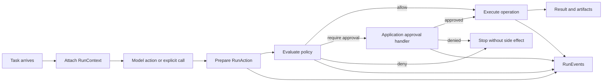
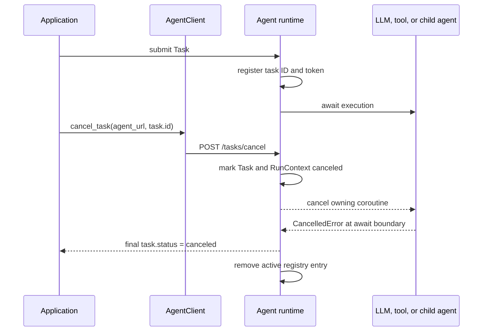

# Runtime

Protolink's runtime primitives provide a stable execution layer above the core A2A-style `Task`, `Message`, `Part`, and `Artifact` models. They are intentionally generic: the same contracts work for local CLIs, workflow engines, support assistants, research systems, browser agents, data tools, and any other agent application.

The runtime layer does not replace transports, telemetry, storage, or structured flows. It gives them shared execution metadata, concrete action intents, policy and approval boundaries, and a normalized event stream.

## Why A Runtime Layer Exists

The protocol models describe **what travels through the system**: a `Task` contains messages, parts, state, and artifacts that agents and clients can exchange. An application runtime must additionally decide **how that work executes**: which run it belongs to, what operation is about to happen, whether that operation is permitted, how approval is obtained, and what progress the user sees.

Without shared runtime primitives, each application tends to invent metadata keys, approval dictionaries, event names, and side-effect checks. Those private conventions work initially, but become difficult to propagate across agents, serialize through transports, test deterministically, or reuse in another interface. Protolink's runtime layer gives those concerns stable contracts while leaving application meaning and presentation outside the framework.

The central lifecycle is:



This lifecycle is not limited to LLM-selected tool calls. The same `RunAction` and policy contracts can protect deterministic flows and direct application calls.

### Runtime Primitives At A Glance

| Primitive | Question it answers |
|------|-------------|
| `Task` | What work and results are exchanged between participants? |
| `RunContext` | Which run is this, and what constraints travel with it? |
| `CancellationToken` | Has live cancellation been requested for active work? |
| `ContextManifest` | What estimated prompt context is about to enter a model? |
| `BudgetPolicy` / `BudgetEnforcer` | Is the run still under its configured execution limits? |
| `RunAction` | What concrete operation is about to execute? |
| `Artifact` | What output or pre-execution preview can be inspected? |
| `PolicyDecision` | Is this action allowed, denied, or approval-gated? |
| `ApprovalRequest` / `ApprovalDecision` | What must an application approve, and what did it decide? |
| `RunEvent` | What is happening now in a stable application-facing format? |
| `EventSink` | Where should normalized runtime events be delivered? |

### What Protolink Does Not Decide

Protolink does not define a universal permission taxonomy, approval screen, or domain-specific action type. Applications choose capability names, build meaningful preview artifacts, and decide whether approval appears in a terminal, desktop UI, web application, editor, or external service. The runtime only guarantees that the decision occurs before execution and that the result is represented consistently.

`RunBudget` is enforced by the default LLM inference loop through `BudgetEnforcer`. The built-in policy allows work under budget, emits warning events near limits, and raises before model or tool execution when a hard limit would be exceeded. Applications can still provide their own policy when they want compaction, truncation, approval, or domain-specific accounting.

## Runtime Context

`RunContext` is the typed execution envelope for a task run. It replaces ad hoc metadata keys such as `task.metadata["session_id"]`, `trace_id`, `workspace`, or `parent_agent` with one serializable object stored under `task.metadata["run_context"]`.

Think of the context as information that belongs to the execution but is not the task's business payload. A prompt or record ID belongs in a `Message`, `Part`, or action payload; correlation IDs, permissions, cancellation state, and limits belong in `RunContext`.

```python
from protolink import RunBudget, RunContext, Task

task = Task.create_infer(prompt="Summarize the latest report")

context = RunContext(
    run_id="run_123",
    session_id="session_abc",
    trace_id="trace_abc",
    workspace_uri="file:///workspace",
    agent_chain=["gateway"],
    permissions={"fs.read": {"paths": ["file:///workspace"]}},
    budget=RunBudget(max_steps=8, max_llm_calls=4),
)

context.attach_to_task(task)
```

The default `Agent` runtime calls `RunContext.ensure_task_context()` before normal execution, streaming execution, and outbound agent calls. Existing callers can keep setting `task.metadata["session_id"]`; Protolink upgrades that legacy metadata into a typed context and mirrors common keys back for compatibility.

Three IDs serve different purposes:

- `run_id` identifies one execution attempt and correlates its actions and events.
- `session_id` groups related runs, commonly for conversation or application continuity.
- `trace_id` correlates observability data and may span several runs or agents.

When work is delegated, `RunContext.child()` creates a new run identity while preserving the session, trace, workspace, permissions, budget, and application metadata. `parent_run_id` and `agent_chain` then describe how execution reached that child.

### Fields

| Field | Description |
|------|-------------|
| `run_id` | Stable identifier for one logical execution run. |
| `session_id` | Conversation or application session shared across runs. |
| `trace_id` | Observability trace identifier, also used by local telemetry. |
| `workspace_uri` | Generic run boundary such as a folder, dataset, browser profile, account, or ticket collection. |
| `parent_run_id` | Parent run for nested agent or tool execution. |
| `agent_chain` | Ordered list of agents that have handled the run. |
| `permissions` | Domain-neutral permission grants or policy metadata. |
| `budget` | Optional `RunBudget` limits such as max steps, model calls, tool calls, runtime seconds, and token budgets. |
| `canceled` | Whether the run has been canceled. |
| `metadata` | Application metadata that should travel with the run. |

`RunContext.permissions` accepts capability rules using `allow`, `deny`, or `require_approval`. Boolean values are also supported: `True` allows and `False` denies. Runtime-owned policy and context rules are combined using the most restrictive result, so task metadata can narrow but cannot weaken the agent's configured policy. `RunContext.budget` is enforced by the built-in LLM loop for steps, LLM calls, tool calls, runtime seconds, input tokens, and output tokens.

This most-restrictive rule is important at trust boundaries. An incoming task may request fewer privileges for a run, but it cannot grant itself more authority than the receiving agent's policy allows.

## Context Manifests And Budgets

Before every LLM call, Protolink prepares a `ContextManifest`. It is provider-neutral and estimates the context that is about to enter the model: compiled system instructions, runtime affordances such as tools and delegation targets, prior conversation history, and the current user query.

```python
from protolink import ContextManifest, LLMModelProfile, RunBudget, RunContext, create_llm

llm = create_llm("mock")
llm.configure_metrics(LLMModelProfile(context_window=8192))

context = RunContext(
    run_id="run_budgeted",
    budget=RunBudget(max_steps=4, max_llm_calls=2, max_input_tokens=6000),
)

events = []

async def capture(event):
    events.append(event)

await llm.infer(
    query="Summarize this context",
    tools={},
    run_context=context,
    event_callback=capture,
)

manifest = ContextManifest.from_dict(events[1]["manifest"])
```

`ContextManifest` includes:

| Field | Description |
|------|-------------|
| `run_id` / `session_id` / `agent_name` | Correlation fields copied from `RunContext`. |
| `provider` / `model` | Model identity supplied by the LLM wrapper. |
| `system_tokens` | Estimated non-tool system prompt budget. |
| `tool_prompt_tokens` | Estimated tool and delegation declarations included in the prompt. |
| `history_tokens` | Estimated prior conversation budget. |
| `user_tokens` | Estimated current query budget. |
| `total_estimated_tokens` | Additive estimate used for pre-call input-token budget checks. |
| `context_window` | Optional model context window from `LLMModelProfile`. |
| `context_items` | Per-section token records for UIs and tests. |

`BudgetEnforcer` applies `RunBudget` during inference:

| Limit | Enforcement point |
|------|-------------|
| `max_steps` | Before each inference step begins. |
| `max_llm_calls` | Before a model call starts. |
| `max_tool_calls` | Before a model-selected tool executes. |
| `max_input_tokens` | Before a model call, using the current `ContextManifest`. |
| `max_output_tokens` | After provider usage or local output estimates are available. |
| `max_runtime_seconds` | On every budget check. |

Warnings are emitted as `budget.warning`; hard denials are emitted as `budget.exceeded` and raise `BudgetExceededError` before the protected operation proceeds.

## Canceling Running Tasks

Protolink distinguishes **cancellation state** from **live cancellation control**:

- `Task.cancel()` changes the serializable protocol state to `canceled`.
- `RunContext.cancel()` creates a serializable canceled context snapshot.
- `CancellationToken` signals process-local code that active execution must stop.
- The Agent's active-task registry connects a task ID to its token and owning `asyncio.Task` while that task is running.

This separation keeps `Task` and `RunContext` safe to send through transports while allowing the runtime to interrupt an actual coroutine. A Python synchronization object is never placed in task metadata or sent to another agent.

### Cancellation Lifecycle



The task ID is available before submission because Protolink tasks are created by the caller. A CLI or UI can therefore keep the ID associated with a running operation and issue cancellation from another coroutine or control request.

### Direct Agent Cancellation

```python
import asyncio

from protolink import Agent, AgentCard, Task

agent = Agent(AgentCard(name="worker", description="Worker", url="runtime://worker"))
task = Task.create_infer(prompt="Perform long-running work")

running = asyncio.create_task(agent.run_task(task))
# Cancellation targets active execution, so wait until registration completes.
while task.id not in agent.active_task_ids:
    await asyncio.sleep(0)
canceled = await agent.cancel_task(task.id, reason="Stopped by user")
result = await running

assert canceled.state.value == "canceled"
assert result.state.value == "canceled"
```

The default `handle_task()` path also registers direct calls through `execute_task()`. `run_task()` is the server-facing wrapper and should be used by direct callers that override `handle_task()` completely, because it guarantees active-task registration around custom logic.

### Remote Cancellation

```python
task = Task.create_infer(prompt="Perform long-running work")
running = asyncio.create_task(client.send_task(agent_url, task))

# In a real application, enable the cancel control after the first status or
# progress event confirms that the remote agent accepted the task.
await task_started.wait()

canceled = await client.cancel_task(
    agent_url,
    task.id,
    reason="Stopped from the application",
)
result = await running
```

`AgentClient.cancel_task()` uses the A2A-style `POST /tasks/cancel` operation and returns the updated task. The same call works over HTTP, SSE JSON-RPC, WebSocket, and RuntimeTransport. WebSocket uses a separate control connection so cancellation cannot wait behind the request or stream it needs to stop.

The synchronous client exposes the same operation as `client.sync.cancel_task(...)`. A synchronous call can only cancel work running on another thread, process, or event loop; it cannot interrupt itself while blocked in the same call stack.

### Cooperative Checkpoints

The default runtime checks the token:

- before each task part;
- before inference starts and at every inference step;
- before and after model-selected tools and delegated agent calls;
- before authorization and after an awaited tool returns;
- before outputs are attached or the task is completed.

The registry also calls `asyncio.Task.cancel()`, so an async model request, async tool, retry sleep, or delegated call normally stops immediately at its current `await` point. Custom handlers can retrieve the live token with `agent.get_cancellation_token(task.id)` and call `token.raise_if_cancelled()` inside CPU loops or between application-defined stages.

Cancellation of a parent model-driven delegation schedules a best-effort cancellation request for the child task. The child receives its own `RunContext` with `parent_run_id`, preserving trace and run relationships.

### Final State And Events

Successful cancellation synchronizes all application-visible surfaces:

- `Task.state` becomes `canceled` and `task.metadata["cancel_reason"]` is set.
- `RunContext.canceled` becomes `True` and carries the same reason.
- Streaming finishes with one final `task.status` / `TaskStatusUpdateEvent` whose state is `canceled`.
- Cancellation is not emitted as `task.error` and is not converted to `failed`.
- The active registry entry is removed in `finally`, including after errors and cancellation.

Requests for unknown active IDs raise `TaskNotFoundError`. This includes a cancellation request that arrives before task registration or after cleanup, so applications should wait for task acceptance or the first streamed status before enabling a cancel control. A task still registered but already terminal raises `TaskNotCancelableError`. The registry contains active execution only; durable lookup of completed tasks belongs in application storage.

### Best-Effort Guarantees

Cancellation cannot safely promise that every external operation has stopped:

- Async Python work is interruptible when it reaches an `await` or explicit token checkpoint.
- A synchronous function running on the event-loop thread cannot process cancellation until it returns.
- Moving synchronous work to a thread keeps the event loop responsive, but Python cannot forcibly terminate that thread.
- A model provider, database, subprocess, or remote API may continue work after the local request is abandoned.
- Destructive operations should place their commit as late as possible, check cancellation beforehand, or use a subprocess/service that supports its own cancellation or rollback protocol.

For this reason, Protolink follows A2A's best-effort model: it attempts cancellation and reports the resulting task state, while tools and external systems remain responsible for stronger transactional guarantees.

## Runtime Actions And Artifacts

`RunAction` is the concrete operation that Protolink evaluates immediately before a side effect. It is separate from provider or LLM action formats, so deterministic flows and direct callers use the same contract.

An LLM action is a planning output: it says that a model wants to call a tool or delegate work. A `RunAction` is the runtime's prepared execution record after the target is known and arguments have been validated. Policy evaluates the latter because it is the closest reliable description of what will actually happen.

```python
from protolink import Artifact, Part, RunAction

preview = Artifact(
    kind="preview",
    name="record update",
    media_type="application/json",
    parts=[Part.json({"record_id": "42", "status": "published"})],
)

action = RunAction(
    kind="resource.update",
    name="publish_record",
    payload={"arguments": {"record_id": "42"}},
    capabilities=frozenset({"records.write"}),
).with_artifacts([preview])
```

Every action has a stable `action_id`, an extensible `kind`, structured `payload`, required `capabilities`, and optional preview or result artifacts. `Artifact` descriptors now include `kind`, `name`, `uri`, `media_type`, and `action_id` while retaining their existing `parts` and `metadata` fields.

Applications can use preview artifacts for any operation that benefits from inspection before execution: a resource update, outbound message, database mutation, browser action, generated file, or domain-specific command.

Artifacts attached before execution are descriptive; they do not perform the operation. This makes them safe to render in an approval interface. The actual side effect remains inside the tool or application executor and only runs after authorization succeeds.

## Capability Policy

Tools declare the capabilities they require. `CapabilityPolicy` supports exact rules and namespace wildcards such as `records.*`. The strongest result wins across all capabilities required by an action: `deny` outranks `require_approval`, which outranks `allow`.

Capabilities describe authority, not tool implementation. A tool named `publish_record` might require `records.write`; another application could use `messages.send`, `browser.navigate`, or `inventory.adjust`. Protolink treats these as opaque names and only applies the configured rules.

```python
from protolink import Agent, ApprovalDecision, CapabilityPolicy

policy = CapabilityPolicy(
    {
        "records.read": "allow",
        "records.write": "require_approval",
        "records.delete": "deny",
    }
)

async def approve(request, context):
    # Render request.action and request.action.artifacts in any UI.
    return ApprovalDecision(
        approved=True,
        request_id=request.request_id,
        decided_by="operator",
    )

agent = Agent(card, policy=policy, approval_handler=approve)
```

The built-in policy defaults to `allow` for backward compatibility. A protected capability is enforced when a tool declares it, a policy rule targets it, or `RunContext.permissions` restricts it. Applications that need resource-level checks can implement the asynchronous `Policy.evaluate(action, context)` protocol and inspect the complete action payload.

Use the built-in policy when capability names are sufficient. Implement a custom policy when authorization depends on values such as a resource URI, account, time window, tenant, data classification, or the contents of a preview artifact.

## Approval Checkpoints

When policy returns `require_approval`, `ActionAuthorizer` creates an `ApprovalRequest` and calls the application-owned approval handler. Protolink controls whether execution may continue; the application controls terminal, desktop, web, service, or editor presentation.

The handler returns an `ApprovalDecision` correlated by `request_id`. A denied decision raises `ActionDeniedError`. If no handler is configured, Protolink fails closed with `ApprovalRequiredError`, which carries the serializable request.

The handler receives the complete `RunAction`, including validated arguments, required capabilities, description, metadata, and preview artifacts. It can therefore present useful context without rediscovering the intended operation from raw model output or tool arguments. Returning a decision is the only way an approval-gated action proceeds.

Native tools can attach action previews through `action_builder`:

```python
from protolink import Artifact, Part, RunAction

def build_preview(arguments, context):
    return RunAction(
        kind="tool.call",
        name="publish_record",
        payload={"arguments": arguments},
        artifacts=(
            Artifact(
                kind="preview",
                name="publication preview",
                parts=[Part.json(arguments)],
            ),
        ),
    )

@agent.tool(
    name="publish_record",
    description="Publish a record",
    capabilities=["records.write"],
    action_builder=build_preview,
)
async def publish_record(record_id: str) -> dict:
    return {"record_id": record_id, "status": "published"}
```

Tool arguments are validated before the action is prepared and again before execution. Tool-declared capabilities are always merged into a custom action, so an `action_builder` cannot accidentally omit a required policy check.

For deterministic code that invokes a tool without a `Task`, use `agent.call_tool_in_context(tool_name, context, **arguments)`. It applies the same argument preparation, capability policy, and approval handler as model-driven execution.

## Run Events

Existing stream events such as `TaskStatusUpdateEvent`, `TaskArtifactUpdateEvent`, and `TaskLLMStreamEvent` remain the transport-compatible event objects. `RunEvent` is the normalized application-facing envelope for those events.

The distinction lets transports retain backward-compatible event objects while applications consume one versioned shape. A terminal renderer, web client, test recorder, and logging adapter can all switch on the same `RunEvent.type` values instead of interpreting provider-specific chunks or nested dictionaries.

```python
from protolink import InMemoryEventSink, RunContext

sink = InMemoryEventSink()

async for task_event in agent.handle_task_streaming(task):
    await sink.emit_task_event(task_event, context=RunContext.from_task(task))

events = sink.to_list()
```

Each `RunEvent` includes:

| Field | Description |
|------|-------------|
| `version` | Stable run-event envelope version. |
| `type` | Normalized event type such as `task.status`, `task.artifact`, `context.prepared`, `llm.call.started`, `action.requested`, `approval.required`, or `llm.stream`. |
| `run_id` | Logical run identifier from `RunContext`. |
| `task_id` | Task correlated with the event. |
| `agent_name` | Agent that emitted or handled the event. |
| `sequence` | Monotonic event sequence assigned by the sink. |
| `step` | Optional LLM or runtime step. |
| `span_id` / `parent_span_id` | Optional causal span IDs for UI trees and replay views. |
| `action_id` / `parent_action_id` | Optional runtime action IDs for tool, approval, and delegated-agent events. |
| `delegation_id` | Optional delegated-agent operation ID. |
| `severity` | `info`, `warning`, or `error` for renderers and logs. |
| `summary` | Short progress text for CLIs, UIs, and logs. |
| `payload` | Full original task-event payload. |
| `final` | Whether the source event marks a final boundary. |

`RunEvent.from_task_event(event)` can also recover context from the final task payload when the event includes a serialized task.

LLM context, budget, and call lifecycle activity is promoted out of raw LLM metadata into stable event types:

| Event type | Meaning |
|------|-------------|
| `context.prepared` | A `ContextManifest` was prepared before an LLM call. |
| `llm.call.started` | A model call is about to start. |
| `llm.call.completed` | A model call returned and usage/latency metadata is available. |
| `budget.warning` | Usage is near a configured `RunBudget` limit. |
| `budget.exceeded` | A configured budget limit denied further execution. |

Action lifecycle activity is also promoted into stable event types:

| Event type | Meaning |
|------|-------------|
| `action.requested` | A concrete `RunAction` is ready for policy evaluation. |
| `action.policy` | Policy returned allow, deny, or require approval. |
| `approval.required` | An `ApprovalRequest` checkpoint was created. |
| `approval.decided` | The application returned an `ApprovalDecision`. |
| `action.started` | An authorized tool or agent operation started. |
| `action.completed` | The operation completed successfully. |
| `action.denied` / `action.failed` | Policy denied the operation or execution failed. |

The promoted `manifest`, `action`, `request`, `decision`, `action_id`, `parent_action_id`, `span_id`, `parent_span_id`, and `delegation_id` values are available directly in `RunEvent.payload`; the original task stream payload remains intact for compatibility.

## Event Sinks

`EventSink` is the protocol for consumers of normalized `RunEvent` objects. `InMemoryEventSink` is the built-in implementation for tests, local apps, and replay tooling. Use `RunRecorder` when you also want a durable `RunReport` after the stream completes.

```python
from protolink import InMemoryEventSink, RunEvent

sink = InMemoryEventSink()
await sink.emit(RunEvent(type="task.progress", summary="Halfway done"))

assert sink.to_list()[0]["sequence"] == 1
```

Applications can implement their own sinks for terminal rendering, WebSocket fanout, database persistence, or custom observability systems without changing agent execution code.

An event sink observes execution; it does not authorize it. Approval decisions still flow through the configured approval handler, while sinks distribute the resulting lifecycle to interested consumers.

## Run Reports And Replay

`RunReport` is the durable app-facing summary built from normalized events. It collects context manifests, action records, approval checkpoints, artifacts, LLM metrics, and the final serialized task when the final stream event includes it.

```python
from protolink import (
    RedactionPolicy,
    RunContext,
    RunRecorder,
    RunReplay,
    assert_budget_under,
    assert_no_denied_actions,
    assert_run_events,
)

context = RunContext.from_task(task)
recorder = RunRecorder(context=context)

async for task_event in agent.handle_task_streaming(task):
    await recorder.record_task_event(task_event)

report = recorder.to_report(metadata={"source": "integration-test"})
safe_json = report.to_dict(redaction_policy=RedactionPolicy())

replay = RunReplay(safe_json)
assert_run_events(replay, ["context.prepared", "llm.call.started", "llm.call.completed"])
assert_no_denied_actions(replay)
assert_budget_under(replay, max_total_tokens=8_000)
```

`RunReplay` never re-executes tools or model calls. It is a read-only view over report events with helpers such as `event_types`, `iter_events()`, and `find_events("context.prepared")`.

The assertion helpers are intentionally small:

| Helper | Use |
|------|-----|
| `assert_run_events(...)` | Verify that stable event types appeared, either exactly or as an ordered subsequence. |
| `assert_no_denied_actions(...)` | Fail if policy, approval, or action events denied runtime work. |
| `assert_budget_under(...)` | Aggregate report metrics and context manifests, then fail if token or runtime limits are exceeded. |

Use `RedactionPolicy` whenever persisting reports, approval payloads, context manifests, or telemetry data. The default policy masks common fields such as API keys, tokens, passwords, secrets, authorization headers, and credentials.

## Persistent Run Store

`RunReport` is the durable summary for normalized events. `SQLiteRunStore` adds a small built-in persistence layer for task snapshots and run reports when an application wants a searchable local record without designing a database first.

```python
from protolink import Agent, AgentCard, RunContext, SQLiteRunStore, Task

store = SQLiteRunStore("runs.db")
agent = Agent(
    AgentCard(name="worker", description="Worker", url="runtime://worker"),
    llm=llm,
    run_store=store,
)

task = Task.create_infer(prompt="produce a summary")
RunContext(run_id="run_123", session_id="session_abc").attach_to_task(task)
result = await agent.execute_task(task)

record = store.get_task_record(result.id)
recent = store.list_task_records(session_id="session_abc")
```

`SQLiteRunStore` keeps two JSON payload tables:

| Record | Indexed fields |
|------|-------------|
| Task snapshots | `task_id`, `state`, `run_id`, `session_id`, `trace_id`, `agent_name`, timestamps |
| Run reports | `run_id`, `session_id`, `trace_id`, `agent_name`, timestamp |

The store is intentionally separate from the generic `Storage` key/value interface. `Storage` backs agent state such as conversations; `RunStore` records execution facts for lookup, replay, audit, and tests. Larger deployments can implement the same `RunStore` protocol against their own persistence layer.

## Complete Runnable Examples

`examples/runtime_policy_and_approvals.py` combines the runtime primitives in one provider-free script. It uses `MockLLM` to request a tool, creates a preview artifact, obtains application approval, captures normalized events, and then proves that a stricter per-run permission prevents a second side effect.

Run it from the repository root:

```bash
.venv/bin/python examples/runtime_policy_and_approvals.py
```

The example uses an in-memory record so it is deterministic and requires no API key, service, or network port. Its approval handler automatically approves the first action for demonstration; a real application would replace that callback with its own interactive or remote decision workflow.

`examples/task_cancellation.py` demonstrates live cancellation of a streamed async tool. It proves that the final side effect is not committed and prints the final normalized canceled event:

```bash
.venv/bin/python examples/task_cancellation.py
```

## Golden Run Tests

Golden-run tests use deterministic model/tool fixtures and assert the normalized runtime contract. They are useful for application integrations because they lock down the event and artifact sequence without depending on live model providers.

```python
from protolink import Agent, AgentCard, InMemoryEventSink, RunContext, Task, create_llm

llm = create_llm("mock", default_response="done")
agent = Agent(
    AgentCard(name="tester", description="Golden test agent", url="runtime://tester"),
    llm=llm,
    verbosity=0,
)

task = Task.create_infer(prompt="Produce a result")
RunContext(run_id="run_golden", session_id="session_golden").attach_to_task(task)

sink = InMemoryEventSink()
async for event in agent.handle_task_streaming(task):
    await sink.emit_task_event(event, context=RunContext.from_task(task))

snapshot = [
    {
        "sequence": item["sequence"],
        "type": item["type"],
        "summary": item["summary"],
        "final": item["final"],
    }
    for item in sink.to_list()
]
```

Use this style for runtime compatibility tests: assert the stable event envelope, policy and approval sequence, task state, final artifacts, and context propagation. Keep volatile fields such as timestamps, UUIDs, and artifact IDs out of the golden snapshot unless the test explicitly controls them.

## Relationship To Telemetry

Runtime events and telemetry serve different layers:

- `RunEvent` is for live application progress, terminal rendering, stream snapshots, and runtime assertions.
- `LocalTraceTelemetry` is for replayable traces, spans, metrics, redacted payloads, and observability backends.

Both share the same `run_id`, `trace_id`, `task_id`, and agent metadata through `RunContext`, so a local UI can show live progress while telemetry records the detailed trace behind it.

As a practical rule, use events to drive what the user sees now and telemetry to investigate what happened across the complete run later.
