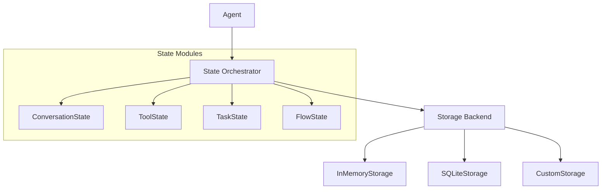

# State Management

Protolink's State system is a sophisticated, modular orchestration layer that manages the persistence of an agent's internal data. It bridges the gap between the high-level **Agent** logic and the low-level **Storage** backends, providing a unified API for session-based memory.

## Why use the State system?

In a distributed agentic system, maintaining context is critical. Without state management, every interaction is a "cold start." The State system allows agents to:

- **Resume conversations**: Remember what was said minutes or days ago.
- **Persist tool data**: Allow tools to keep track of their own history or configuration.
- **Track task progress**: Monitor long-running tasks across multiple execution cycles.
- **Coordinate flows**: Manage checkpoints and state transitions in complex workflows.

---

## Core Architecture

The `State` class acts as a central hub (orchestrator). When an agent is initialized, it creates a `State` instance which, in turn, initializes one or more **State Modules**. All these modules share the same `Storage` backend but manage different namespaces or data structures.



---

## State Modules

Protolink version **v0.5.5** introduces four primary state modules. You can enable them individually or in combination via the `state` parameter in the `Agent` constructor.

### 1. Conversation State (`conversation`)
This is the most common module. It manages the `ConversationHistory` object used by LLMs.
- **Data Saved**: All messages (user, assistant, system, tool) in a session.
- **Key Factor**: Uses the `session_id` provided in task metadata to partition history.
- **Automatic Sync**: The `Agent` automatically loads history *before* inference and saves it *after* the task completes.

### 2. Tool State (`tools`) - TBD
Allows individual tools to persist their own internal data.
- **Usage**: Useful for tools that need to "remember" previous results or maintain a cache across different tasks.
- **Consistency**: Ensures that tool-specific memory is tied to the same session as the conversation.

### 3. Task State (`task`) - TBD
Manages metadata and operational status for tasks.
- **Usage**: Used for tracking task lifecycles, especially in asynchronous or distributed environments where a task might be resumed by a different worker.

### 4. Flow State (`flow`) - TBD
Specifically designed for the **Structured Flows** architecture.
- **Usage**: Persists the progress of `Pipeline`, `Parallel`, or `Switch` flows. It manages checkpoints so a flow can be interrupted and resumed without losing its place.

---

## Activation and Configuration

Enabling state persistence requires two steps: providing a **Storage** instance and specifying the **Enabled Modules**.

### Basic Setup (Conversation Only)
```python
from protolink.agents import Agent
from protolink.storage import SQLiteStorage

# 1. Setup persistent storage
storage = SQLiteStorage(db_path="agent.db", namespace="support_bot")

# 2. Enable conversation module
agent = Agent(
    card=card,
    storage=storage,
    state=["conversation"]
)
```

### Advanced Setup (Multi-Module)
```python
# Enable everything
agent = Agent(
    card=card,
    storage=storage,
    state=["conversation", "tools", "flow"]
)
```

---

## Session Management

The State system relies on a `session_id` to know which data to load. Protolink handles this through **Task Metadata**.

### Providing a Session ID
When sending a task, include a `session_id` in the metadata:
```python
task = Task.create_infer("Hello, I'm Alice.")
task.metadata["session_id"] = "user_42_convo_A"

await agent.execute_task(task)
```

### Default Behavior
If no `session_id` is provided:

1.  **`invoke()` / `invoke_sync()`**: These methods use a default ID (`"invocation_session_id"`), ensuring that sequential calls to the same agent instance share history by default.
2.  **External Tasks**: The agent falls back to using the `task.id`. This effectively makes the task stateless across different task IDs, but persistent if the *same task* is updated and re-processed.

---

## The `State` Object API

The `State` object is accessible via the `agent.state` property. You can use it to interact with state modules directly.

| Property | Type | Description |
|----------|------|-------------|
| `conversation` | `ConversationState ⎪ None` | Access the conversation module. |
| `tools` | `ToolState ⎪ None` | Access the tool module. |
| `task` | `TaskState ⎪ None` | Access the task module. |
| `flow` | `FlowState ⎪ None` | Access the flow module. |
| `storage` | `Storage` | Access the underlying storage backend. |

### Manual State Interaction
```python
# Get history manually
history = agent.state.conversation.get_history("session_123")

# Clear a session
agent.state.conversation.clear_session("session_123")

# View everything as a dict
all_data = agent.state.to_dict()
```

---

## Comparison: Manual vs. Automated State

### Manual Persistence (Standard A2A)
You have to manually load and save data inside `handle_task`.
```python
async def handle_task(self, task):
    data = self.storage.load()
    # ... logic ...
    self.storage.save(data)
```

### Automated Persistence (Protolink State)
Protolink handles the lifecycle for you.
```python
# Just enable it in the constructor
agent = Agent(..., state=["conversation"])

# History is loaded and saved automatically in Agent.execute_task()
```

---

## Design Philosophy

The State system is built on three pillars:

1.  **Isolation**: Modules are decoupled. You can persist conversation history without persisting tool data.
2.  **Transparency**: All data is eventually serialized into the same storage backend, making it easy to backup or migrate.
3.  **Implicit Context**: By using `session_id` as a first-class citizen in metadata, Protolink creates a "sticky" context that follows the user or the workflow, regardless of which physical worker handles the request.
