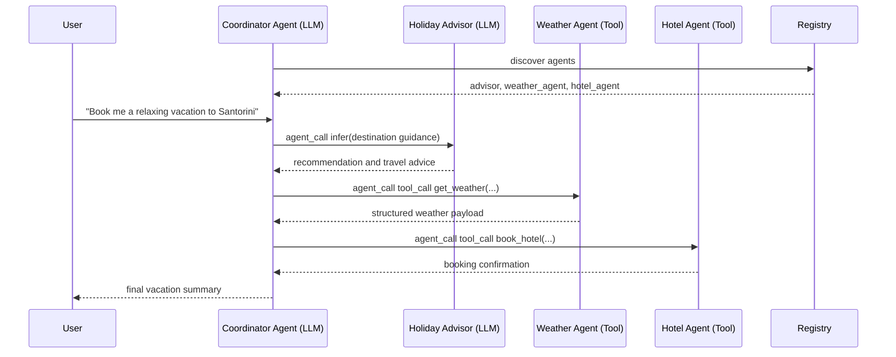

# Ticket Booking Example

!!! info "Article"
    The article on [Level Up Coding](https://levelup.gitconnected.com/your-first-autonomous-agent-mesh-easier-than-you-think-ce697b3dd87a) gives a hands-on overview of this example.

The source files live in [`examples/ticket_booking`](https://github.com/nMaroulis/protolink/tree/main/examples/ticket_booking).

This example demonstrates a practical multi-agent vacation planning workflow. A user asks for a relaxing Greek island trip, and a coordinator agent delegates to specialist agents for advice, weather validation, and hotel booking.

It highlights:

- How a coordinator agent uses an LLM to plan and route work
- How LLM-only and tool-only agents collaborate through `agent_call`
- How agents discover each other through the Registry
- How deterministic tools return structured booking and weather payloads
- How the same scenario can run as an all-in-one quickstart or modular example

## User Request

> Book me a relaxing vacation to Santorini for 5 nights in mid-July 2026.

From this single task, the system:

1. Asks the Holiday Advisor for destination guidance.
2. Checks weather through the Weather Agent.
3. Books a hotel through the Hotel Agent.
4. Returns a consolidated vacation summary to the user.

## Agent Overview

### Coordinator Agent

The coordinator is the primary entry point. It receives the user request, discovers available agents, and decides when to delegate.

- Has an LLM
- Uses `agent_call` with `infer` for advisory reasoning
- Uses `agent_call` with `tool_call` for deterministic weather and hotel tools

### Holiday Advisor Agent

The advisor is an LLM-only specialist for travel recommendations.

- Interprets vacation preferences
- Evaluates destinations, dates, budget, and suitability
- Returns concise structured advice to the coordinator

### Weather Agent

The weather agent is tool-only.

- Owns a `get_weather` tool
- Returns structured weather data for the selected destination and dates
- Keeps external-data behavior deterministic and testable

### Hotel Agent

The hotel agent is tool-only.

- Owns a `book_hotel` tool
- Calculates nights and total price
- Returns a structured booking confirmation

### Registry

The Registry stores each agent's `AgentCard`, including skills and capabilities, so the coordinator can discover peers dynamically.

## Sequence Diagram



## Agent Classification

| Agent | Uses LLM | Has Tools | Purpose |
| --- | --- | --- | --- |
| Coordinator | Yes | No | Plans, routes, and summarizes |
| Holiday Advisor | Yes | No | Travel reasoning and recommendations |
| Weather Agent | No | Yes | Weather lookup |
| Hotel Agent | No | Yes | Hotel booking |
| Registry | No | No | Discovery and registration |

## Files and Structure

```text
examples/ticket_booking/
├── quickstart.py             # All-in-one demo script
├── run.py                    # Modular demo entry point
├── coordinator_agent.py      # LLM-powered coordinator
├── holiday_advisor_agent.py  # LLM-only travel advisor
├── weather_agent.py          # Weather tool agent
├── hotel_booking_agent.py    # Hotel booking tool agent
├── .env.example              # Environment template
└── README.md                 # Example-specific README
```

## Running the Example

1. **Install Protolink with the required extras**

   ```bash
   pip install "protolink[http,llms]"
   ```

2. **Choose an LLM provider**

   === "Ollama"

       ```bash
       ollama pull gemma4:e4b
       ollama serve
       ```

   === "OpenAI"

       ```bash
       export OPENAI_API_KEY=sk-...
       ```

   === "Anthropic"

       ```bash
       export ANTHROPIC_API_KEY=sk-ant-...
       ```

3. **Run the all-in-one quickstart**

   ```bash
   cd examples/ticket_booking
   python quickstart.py
   ```

4. **Or run the modular demo**

   ```bash
   cd examples/ticket_booking

   # Ollama is the default provider
   python run.py

   # Use a hosted provider through environment variables
   LLM_PROVIDER=openai python run.py

   # Pass a custom request
   python run.py "Book a 5-night relaxing Santorini trip for two adults"
   ```

!!! note "Registry startup"
    The checked-in `quickstart.py` and `run.py` scripts start the Registry and all agents for you. You do not need a separate registry terminal for this example.

## Expected Result

The exact prose depends on the selected LLM, but the final response should include:

- Destination recommendation
- Weather suitability
- Hotel name and reservation details
- Total price and booking identifier
- A concise user-facing trip summary

## Failure Handling Ideas

The current checked-in demo focuses on the happy path. Protolink's architecture makes it straightforward to extend the workflow with explicit failure paths:

- If weather is poor, call the Holiday Advisor for alternate dates or destinations.
- If hotel booking fails, retry with lower constraints or ask for alternatives.
- If a tool returns an error part, let the coordinator mark the task as failed or request more input.
- If the LLM repeats the same action, the inference-loop deduplication guardrail injects corrective feedback.

## Extending the Example

- Add a flights or ferries agent with a `book_transport` tool.
- Add a calendar agent that writes confirmed bookings to a calendar API.
- Add a messaging agent that sends the final summary over WhatsApp, email, or Slack.
- Switch transports to SSE JSON-RPC for streamed progress updates.
- Add MCP tools for real hotel, travel, or messaging integrations.

## See Also

- [Getting Started](getting-started.md) - Core setup
- [Agents](agent.md) - Agent lifecycle and tools
- [Registry](registry.md) - Dynamic discovery
- [Transports](transport.md) - HTTP, SSE, WebSocket, and runtime transports
- [LLMs](llm.md) - LLM backends and inference behavior
