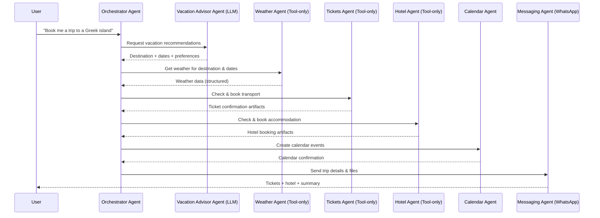
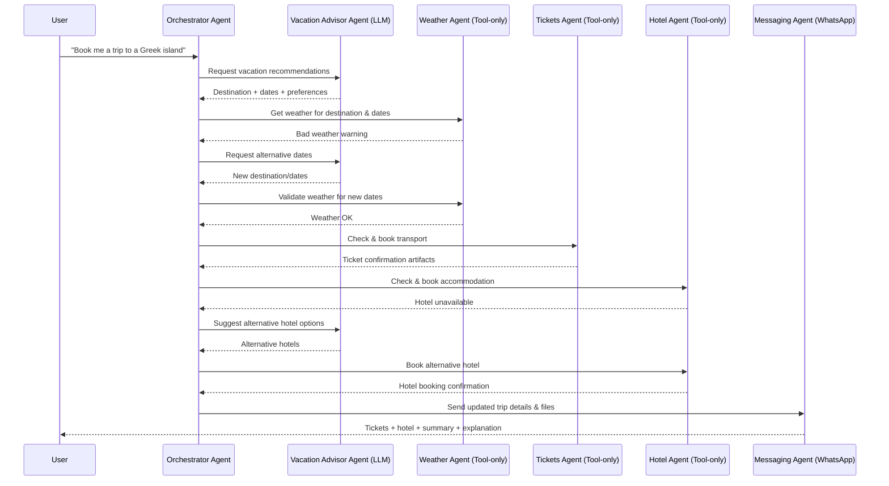

# Ticket Booking Example

!!! info "📝 Article on Medium"
    The following article on [level-up coding on medium](https://levelup.gitconnected.com/your-first-autonomous-agent-mesh-easier-than-you-think-ce697b3dd87a) also gives a hands-on guide and overview of this example.

The directory containing the example files can be found [here](https://github.com/nMaroulis/protolink/tree/main/examples/ticket_booking).

This example demonstrates a **real-world multi-agent workflow** using Protolink.  
The goal is to **plan and book a vacation to a Greek island** 🏖️ from a natural language request, coordinating multiple specialized agents that combine **LLM reasoning**, **tool usage**, and **external side effects**.

It highlights:

- How an **orchestrator agent** coordinates other agents
- How **LLMs are embedded inside agents**
- How **tool-based agents** and **LLM-based agents** coexist
- How agents exchange structured messages and artifacts (e.g., tickets, dates)
- How actions propagate across the system (calendar updates, notifications)

---

## 💬 High-Level User Request

<div style="background: linear-gradient(135deg, #667eea 0%, #764ba2 100%); color: white; padding: 0.8rem; border-radius: 6px; margin: 1rem 0; box-shadow: 0 2px 8px rgba(102, 126, 234, 0.15); position: relative;">
    <div style="font-size: 1.5rem; line-height: 1; margin-bottom: 0.2rem; opacity: 0.9;">"</div>
    <div style="font-size: 0.9rem; font-weight: 500; line-height: 1.4; margin-bottom: 0.6rem;">
        Book me a trip to a Greek island for 2 adults for a relaxing summer vacation on second half of July for about 5 days. Our maximum budget is 1200€.
    </div>
    <div style="text-align: right; font-size: 0.75rem; opacity: 0.8;">
        — User Request
    </div>
</div>

From this single input, the system:

- Decides **when** to travel
- Evaluates **weather conditions**
- Checks **availability**
- Makes **transport tickets** and **accommodation booking**
- Persists the plan to a calendar
- Sends confirmations to the user's WhatsApp

---

## 🧩 Agent Overview

### 1. Orchestrator Agent (Primary Entry Point)
**Role:** Central coordinator and decision-maker.  
- Receives the initial user input  
- Maintains the overall task state  
- Decides **which agent to call, when, and with what context**  
- Aggregates responses and resolves conflicts  
- Drives the workflow from intent → execution  
> Uses an **LLM for reasoning and planning**, but delegates domain-specific work to other agents.

### 2. Vacation Advisor Agent (LLM-Driven)
**Role:** High-level planning and recommendation.  
- Interprets the user’s intent (e.g., *relaxing*, *budget*)  
- Proposes: destination options, suggested travel dates, trip duration  
- Returns a **structured vacation plan**  

### 3. Weather Agent (Tool-Only)
**Role:** Weather validation and risk assessment.  
- Retrieves historical or forecast weather data for the proposed destination & dates  
- Returns a **structured weather summary**  
> No LLM is used — weather is deterministic data. The Orchestrator interprets suitability.

### 4. Tickets Agent (Tool-Driven)
**Role:** Transportation booking.  
- Checks availability for flights/ferries  
- Selects optimal options based on dates, price, duration  
- Books tickets and returns **ticket artifacts**  

### 5. Hotel Agent (Tool-Driven)
**Role:** Accommodation booking.  
- Searches for hotels based on destination, dates, preferences  
- Confirms availability and books  
- Returns **booking confirmations**  

### 6. Calendar Agent (Integration Agent)
**Role:** Persistence and scheduling.  
- Creates calendar events for departure, return, and hotel stay  
- Confirms persistence  

### 7. Messaging / WhatsApp Agent (Delivery Agent)
**Role:** User notification and artifact delivery.  
- Sends messages to the user (WhatsApp or similar)  
- Delivers tickets, hotel confirmations, and trip summary  

### 🌦️ Design Note: Tool-Only Weather Agent
The Weather Agent does not use an LLM because:
- Weather data is deterministic
- No reasoning is required at the agent level
- Keeps the system reliable, cheap, and testable
- The Orchestrator remains responsible for interpreting weather suitability and making final decisions.

LLMs reason. Tools execute. Agents specialize.

## 🔁 Sequence Diagram



### 🧠 Agent Classification Summary
| Agent	| Uses LLM	| Purpose |
| --- | --- | --- |
| Orchestrator Agent	| ✅	| Planning, routing, decision-making |
| Vacation Advisor Agent	| ✅	| High-level reasoning & recommendations |
| Weather Agent	| ❌	| Factual data retrieval |
| Tickets Agent	| ❌	| Booking & execution |
| Hotel Agent	| ❌	| Booking & execution |
| Calendar Agent	| ❌	| Persistence / state update |
| Messaging Agent	| ❌	| Delivery & user communication |

### 🎯 Why This Example Matters
- Clear separation of concerns between agents
- Flexible orchestration without hard-coded workflows
- Mixing LLM reasoning agents with tool-only agents
- Passing structured messages and artifacts across agents
- Demonstrates production-ready multi-step AI systems

---

## ⚠️ Failure Handling & Alternative Paths

!!! note  "TBD"
    This section is currently not implemented, but demontstrates the failure handling capabilities of Protolink.

In real-world scenarios, things don’t always go as planned. Protolink allows the Orchestrator Agent to **detect failures, query alternatives, and reroute tasks** seamlessly.  

This example handles three common failure scenarios:

1. **Tickets or Hotels Unavailable**

      - Orchestrator queries **alternative dates** from the Vacation Advisor Agent  
      - Weather is re-validated for new dates via the Weather Agent  
      - Tickets and hotel availability are re-checked  
      - If successful, the Orchestrator proceeds with booking  
      - If no options are available, the Orchestrator notifies the user via Messaging Agent  

2. **Bad Weather**

      - Weather Agent returns warnings for the chosen dates  
      - Orchestrator requests alternative travel windows from the Vacation Advisor Agent  
      - Booking agents are only called once a safe window is found  
      - User receives a summary of recommended changes via Messaging Agent  

3. **Partial Failures**

      - For example, ticket booking succeeds but hotel booking fails  
      - Orchestrator detects partial failure and can:
      - Retry with alternative hotels
      - Cancel the ticket (optional) if the trip cannot proceed  
      - User receives an **updated status and explanation**  

### 💡 Key Takeaways

- Resilient orchestration: Orchestrator can reroute tasks dynamically
- Structured retries: Agents respond to failure conditions with actionable alternatives
- User transparency: Messaging Agent ensures the user is always aware of changes
- Separation of concerns: Agents maintain their own responsibilities even in failure paths

This section highlights how Protolink enables robust multi-agent systems that handle real-world uncertainties while keeping reasoning, tool execution, and communication cleanly separated.

---

## 🔁 Alternative Path Sequence Diagram



---

## 📁 Files and Structure

```
examples/ticket_booking/
├── README.md                    # This overview
├── main.py                      # Simple entry point for manual testing
├── orchestrator_agent.py       # Orchestrator (LLM-driven)
├── vacation_advisor_agent.py    # Vacation planning (LLM-driven)
├── weather_agent.py             # Weather data (tool-only)
├── tickets_agent.py            # Transport booking (tool-only)
├── hotel_booking_agent.py     # Hotel booking (tool-only)
├── calendar_agent.py            # Calendar integration (tool-only)
├── whatsapp_agent.py           # Notifications (tool-only)
└── endpoints.env                # Agent URLs and API keys
```

---

## 🚀 Running the Example

1. **Install Protolink with the required extras**
   ```bash
   pip install protolink[http,llms]
   ```

2. **Configure endpoints and API keys**
   ```bash
   cp examples/ticket_booking/endpoints.env.example examples/ticket_booking/endpoints.env
   # Edit endpoints.env with your ports and API keys
   ```

3. **Start the Registry**
   ```bash
   python -m protolink.discovery.registry --port 9010
   ```

4. **Start each agent** (in separate terminals)
   ```bash
   python examples/ticket_booking/hotel_booking_agent.py
   python examples/ticket_booking/tickets_agent.py
   python examples/ticket_booking/weather_agent.py
   python examples/ticket_booking/calendar_agent.py
   python examples/ticket_booking/whatsapp_agent.py
   python examples/ticket_booking/vacation_advisor_agent.py
   python examples/ticket_booking/orchestrator_agent.py
   ```

5. **Send a request**
   ```bash
   cd examples/ticket_booking
   python run.py
   # Then enter: "Book me a trip to a Greek island"
   ```

---

## 🧩 Extending the Example

- Add new agents (e.g., car rental, restaurant reservations)
- Swap LLM backends (OpenAI, Anthropic, Ollama, etc.)
- Replace HTTP transport with WebSocket for streaming updates
- Add MCP tools to any agent
- Implement custom retry policies in the Orchestrator

---

## 📚 See Also

- [Getting Started](getting-started.md) – Core concepts and setup
- [Agents](agent.md) – Agent lifecycle and tools
- [Transports](transport.md) – Switching between HTTP, WebSocket, and runtime transports
- [Tools](tool.md) – Native and MCP tool integration
- [LLMs](llm.md) – LLM backends and usage