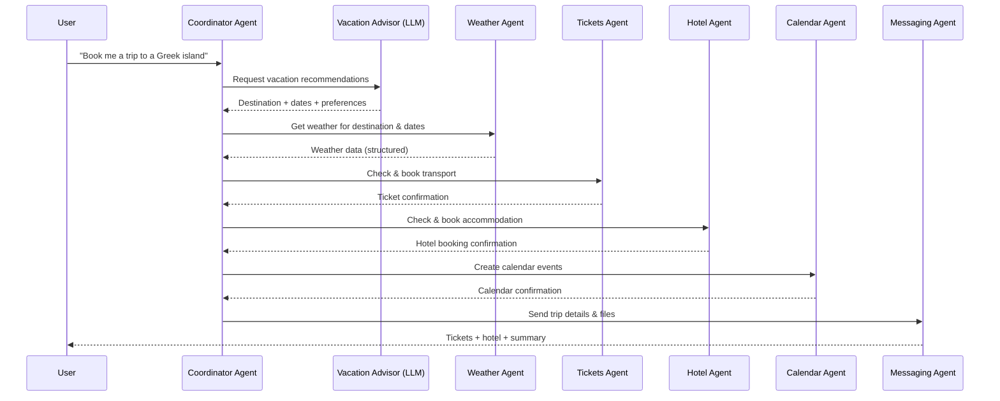

# 🏖️ Multi-Agent Vacation Booking Demo

A **real-world example** showcasing Protolink's multi-agent orchestration capabilities. This demo uses natural language to book a Greek island vacation, coordinating multiple specialized agents.


## ✨ What This Demonstrates

| Feature | Description |
|---------|-------------|
| **Agent Delegation** | Coordinator uses `agent_call` to delegate to specialists |
| **Tool Calling** | Weather and Hotel agents expose tools via Protolink |
| **Registry Discovery** | Agents register and discover each other automatically |
| **LLM Inference Loop** | Multi-step reasoning with tool/agent calls |
| **Provider Flexibility** | Works with Ollama (free) or OpenAI |

---

## 🏗️ Architecture

```
User Request
     │
     ▼
┌─────────────────────────────────────────────────────────────┐
│                    COORDINATOR AGENT                        │
│                    (Has LLM - Llama3/GPT-4)                │
│                                                             │
│  1. Receives: "Book me a vacation to Santorini"            │
│  2. Thinks: "I need to check weather first"                │
│  3. agent_call → weather_agent.get_weather()               │
│  4. Observes: "Weather is sunny, 28°C - perfect!"          │
│  5. Thinks: "Now I can book the hotel"                     │
│  6. agent_call → hotel_agent.book_hotel()                  │
│  7. Observes: "Booking confirmed: HTL-ABC123"              │
│  8. Returns: Complete vacation summary                     │
└─────────────────────────────────────────────────────────────┘
          │                           │
          ▼                           ▼
┌─────────────────────┐     ┌─────────────────────┐
│   WEATHER AGENT     │     │    HOTEL AGENT      │
│   (Tool-only)       │     │    (Tool-only)      │
│                     │     │                     │
│  get_weather()      │     │  book_hotel()       │
│  - Location         │     │  - Location         │
│  - Date             │     │  - Check-in/out     │
│                     │     │  - Guests, Budget   │
└─────────────────────┘     └─────────────────────┘
          │                           │
          └─────────────┬─────────────┘
                        ▼
              ┌─────────────────┐
              │    REGISTRY     │
              │  (Discovery)    │
              └─────────────────┘
```

---

## 🚀 Quick Start

### Prerequisites

- Python 3.10+
- [Ollama](https://ollama.ai) installed (free, local LLM) **OR** OpenAI API key

### 1. Install Protolink

```bash
pip install protolink
```

### 2. Start Ollama (if using local LLM)

```bash
# Install Ollama from https://ollama.ai
# Then pull the model:
ollama pull llama3:8b

# Start Ollama server (if not running)
ollama serve
```

### 3. Run the Demo

```bash
cd examples/ticket_booking

# Using Ollama (default, free)
python run.py

# Using OpenAI (requires API key)
OPENAI_API_KEY=sk-... LLM_PROVIDER=openai python run.py
```

### 4. Try It!

The demo will prompt you for a vacation request, or use the default:

```
💬 Enter your vacation request (or press Enter for demo):
   Default: "Book me a relaxing vacation to Santorini for 5 nights in mid-July 2026"

   > Book a budget trip to Mykonos for 3 nights in August
```

---

## 📋 Expected Output

```
============================================================
🏖️  VACATION BOOKING DEMO - Protolink Multi-Agent System
============================================================

📡 Starting Registry...
   Registry running at http://localhost:9000

🌤️  Starting Weather Agent...
   Weather Agent running at http://localhost:8030

🏨 Starting Hotel Agent...
   Hotel Agent running at http://localhost:8050

🧭 Starting Holiday Advisor (LLM: ollama)...
   Holiday Advisor running at http://localhost:8020

🧠 Starting Coordinator Agent (LLM: ollama)...
   Coordinator running at http://localhost:8010

🔍 Verifying agent discovery...
   Discovered 4 agents:
   - weather_agent: ['get_weather']
   - hotel_agent: ['book_hotel']
   - holiday_advisor: LLM
   - coordinator: LLM

======================================================================
💬 Enter your vacation request (or press Enter for demo):
   Default: "Book me a relaxing vacation to Santorini for 5 nights in mid-July 2026"

   > 

📝 Processing: "Book me a relaxing vacation to Santorini for 5 nights in mid-July 2026"
======================================================================

⏳ Coordinator is working...
   Step 1: Ask Holiday Advisor (infer) for recommendation
   Step 2: Check weather (tool_call)
   Step 3: Book hotel (tool_call)

✅ RESULT:
------------------------------------------------------------
Great news! I've successfully booked your relaxing vacation to Santorini!

🌤️ **Weather Report for Santorini (July 2025):**
- Temperature: 28°C (82°F)
- Conditions: Sunny
- Humidity: 45%
- Wind: Light breeze
- Verdict: Perfect weather for a beach vacation!

🏨 **Hotel Booking Confirmed:**
- Hotel: Oia Boutique Hotel ⭐⭐⭐⭐
- Location: Santorini
- Check-in: July 15, 2025 at 15:00
- Check-out: July 20, 2025 at 11:00
- Duration: 5 nights
- Room: Double Room for 2 guests
- Amenities: Pool, Breakfast, WiFi
- Total Price: €900 EUR
- Booking ID: HTL-A7B3C2D1
- Cancellation: Free until 24h before check-in

Have a wonderful trip! 🏖️
------------------------------------------------------------
```

---

## 🔧 Configuration

Copy `.env.example` to `.env` and customize:

```bash
cp .env.example .env
```

### Environment Variables

| Variable | Default | Description |
|----------|---------|-------------|
| `LLM_PROVIDER` | `ollama` | LLM provider: `ollama` or `openai` |
| `OLLAMA_URL` | `http://localhost:11434` | Ollama server URL |
| `OLLAMA_MODEL` | `llama3:8b` | Ollama model to use |
| `OPENAI_API_KEY` | - | OpenAI API key (if using OpenAI) |
| `REGISTRY_URL` | `http://localhost:9000` | Registry server URL |

---

## 📁 Project Structure

```
examples/ticket_booking/
├── run.py                  # Main entry point
├── coordinator_agent.py    # LLM-powered orchestrator
├── weather_agent.py        # Weather forecast tool
├── hotel_booking_agent.py  # Hotel booking tool
├── .env.example            # Environment template
└── README.md               # This file
```

---

## 🧠 How Agent Delegation Works

When the Coordinator's LLM needs weather data, it produces:

```json
{
  "type": "agent_call",
  "action": "tool_call",
  "agent": "weather_agent",
  "tool": "get_weather",
  "args": {"location": "Santorini", "travel_date": "2025-07-15"}
}
```

Protolink's inference loop:
1. **Detects** the `agent_call` action
2. **Resolves** `weather_agent` to its URL via the Registry
3. **Sends** a Task to the Weather Agent
4. **Receives** the result (weather data)
5. **Injects** the result back into the Coordinator's conversation
6. **Continues** - the LLM sees the weather and decides next step

This happens automatically - no manual orchestration code needed!

---

## 🎯 Key Takeaways

1. **Separation of Concerns**: Each agent has a single responsibility
2. **LLM Reasoning**: Only the Coordinator needs an LLM; specialists are pure tools
3. **Dynamic Discovery**: Agents find each other through the Registry
4. **Automatic Orchestration**: The inference loop handles multi-step workflows
5. **Provider Agnostic**: Switch between Ollama (free) and OpenAI with one env var

---

## 🔮 Extending This Example

Want to add more agents? The README below shows a full 7-agent architecture with:
- ✈️ **Tickets Agent** - Flight/ferry booking
- 📅 **Calendar Agent** - Event scheduling
- 📱 **Messaging Agent** - WhatsApp notifications

<details>
<summary>📘 Full Vision: 7-Agent Architecture</summary>

### Agent Overview

| Agent | Uses LLM | Purpose |
|-------|----------|---------|
| Coordinator | ✅ | Planning, routing, decision-making |
| Vacation Advisor | ✅ | High-level reasoning & recommendations |
| Weather Agent | ❌ | Factual data retrieval |
| Tickets Agent | ❌ | Booking & execution |
| Hotel Agent | ❌ | Booking & execution |
| Calendar Agent | ❌ | Persistence / state update |
| Messaging Agent | ❌ | Delivery & user communication |

### Full Sequence Diagram



</details>

---

## 📄 License

MIT License - See [LICENSE](../../LICENSE) for details.

---

**Built with 💙 using [Protolink](https://github.com/nMaroulis/protolink)**
